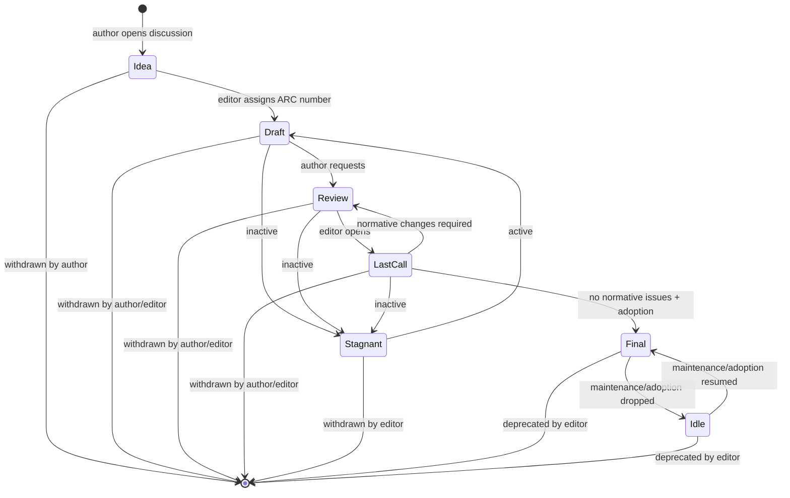

## Abstract

This document defines the _Algorand Request for Comments_ (ARC) canonical process,
style guidelines, and artifacts.

### What is an ARC?

An ARC is a specification or design document defining a standard for the Algorand
_application layer_ or a _procedure_ for the Algorand ecosystem.

ARCs are **NOT** currently used for changes to the Algorand protocol or networking
layers.

Concretely, an ARC consists of the following “artifacts”:

- A GitHub Discussion where the proposal is being discussed _before_ it becomes
an ARC or a GitHub Issue/Pull Request _during_ the ARC process.
- A numbered ARC formal document (linted and formatted according style guidelines).
- A numbered ARC machine-readable adoption summary.

ARC authors are responsible for building consensus within the Algorand ecosystem
about the problem or the opportunity to be addressed with an open discussion _before_
the formal ARC submission.

An ARC contains a single key proposal or new idea. The more focused the ARC, the
more successful it tends to be.

ARCs **MUST** include a clear and complete description of the proposed enhancement.
The enhancement **MUST** represent a net improvement for the _whole_ Algorand Ecosystem
(not just for a specific use-case): a change to one client does not require an ARC;
a change that affects multiple clients, or defines a standard for multiple applications
to use, does.

If applicable, the ARC reference implementation **MUST** be provided and maintained
by its authors (or maintainers if different from the authors).

An ARC **MUST** meet specific minimum criteria and pass through a gated process
(described in the following sections).

The ARCs history **SHALL** be maintained in this versioned repository.

## Specification

### ARC Types

There are two types of ARC:

- **Standards Track ARC**: application layer standards and conventions, including
(not limited to) contracts standards (App or Logic Signatures), Algorand ABI, URI
schemes, libraries/packages, wallets, explorers, etc.

- **Meta ARC**: processes and procedures surrounding Algorand ecosystem. Meta ARCs
apply to areas other than the Algorand application layer. Examples include procedures,
guidelines, decision-making process, etc.

### Shepherding an ARC

Parties involved in the ARC process are:

- the ARC author(s),
- the ARC sponsor(s),
- the ARC editor(s),
- the ARC implementation maintainer(s) if different from the author(s) (when applicable),
- the Algorand ecosystem stakeholders expected to adopt the ARC,
- the Algorand Foundation.

Before writing a formal ARC, the author **MUST** validate that a real ecosystem
need exists.

The author **MUST** open a GitHub Discussion in the `Pre-ARC` category of the ARC
repository. The `Pre-ARC` discussion is the canonical venue for deciding whether
the proposal should become an ARC at all.

A `Pre-ARC` discussion **MUST** include at least:

- the problem statement,
- the users or implementers affected,
- why the proposal requires an ARC instead of an SDK change, library convention,
application-specific feature, or amendment to an existing ARC,
- the existing ARCs and related work that were considered,
- the expected adopters,
- whether a reference implementation is required,
- the proposed sponsor classification (`Foundation` or `Ecosystem`).

The ARC editor **MAY** close a `Pre-ARC` discussion with one of the following outcomes:

- `accepted-for-draft`,
- `rejected-no-arc-needed`,
- `redirected-to-existing-arc`,
- `recast-as-meta`.

An ARC number **MUST NOT** be assigned before a `Pre-ARC` discussion has been accepted
for `Draft` status.

The author opens a _pull request_ containing the `Draft` ARC once the need has been
validated in the `Pre-ARC` discussion.

The ARC editor assigns the ARC number and creates a _tracking issue_ for that ARC
when the `Draft` pull request is open.

The tracking issue becomes the canonical location for gate decisions, transition
checklists, and references to the current adoption summary.

The ARC author is responsible for building consensus, documenting dissenting opinions,
keeping the tracking issue up to date, and ensuring that any material decision reached
in non-canonical channels is copied into the relevant GitHub Discussion or tracking
issue in this repository.

> Negative feedback will be considered and **MAY** prevent an ARC from moving to
> `Draft` stage.

Other channels (e.g., mailing lists, forums, calls, etc.) **MAY** be used for outreach
and community discussion, but they are not canonical.

Any decision or conclusion that affects the ARC **MUST** be summarized in the canonical
GitHub public record in this repository.

The ARC author is responsible for requesting ARC status changes.

ARC editors administer the process and verify that the gate conditions have been
met _before_ accepting a transition.

### ARC Process

The following is the standardization process for all ARCs in all tracks.


```mermaid
stateDiagram-v2
    [*] --> Idea: author opens discussion

    Idea --> Draft: editor assigns ARC number
    Draft --> Review: author requests
    Review --> LastCall: editor opens
    LastCall --> Review: normative changes required
    LastCall --> Final: no normative issues + adoption

    Draft --> Stagnant: inactive
    Review --> Stagnant: inactive
    LastCall --> Stagnant: inactive
    Stagnant --> Draft: active

    Final --> Idle: maintenance/adoption dropped
    Idle --> Final: maintenance/adoption resumed

    Idea --> [*]: withdrawn by author
    Draft --> [*]: withdrawn by author/editor
    Review --> [*]: withdrawn by author/editor
    LastCall --> [*]: withdrawn by author/editor
    Stagnant --> [*]: withdrawn by editor

    Final --> [*]: deprecated by editor
    Idle --> [*]: deprecated by editor
```

**Idea** – A proposal under discussion in a `Pre-ARC` GitHub Discussion. An `Idea`
is tracked in the repository discussion area but does not yet have an ARC number.

**Draft** – The first formally tracked stage of an ARC. A `Draft` ARC has passed
the need-validation gate, has been assigned an ARC number by an editor, and has
an associated tracking issue.

**Review** – An ARC author marks an ARC as ready for peer review.

To enter `Review`, the ARC **MUST**:

- define a clear specification or design as a Markdown file in the `./ARCs` directory
of this repository,
- include motivation and rationale for the design,
- include Security Considerations,
- declare whether implementation is required.

If `implementation-required` is `true`, the ARC **MUST** also include:

- a canonical reference implementation repository,
- a named implementation owner,
- a named implementation maintainer.

**Last Call** – The final review window before an ARC **MAY** become `Final`.

To enter `Last Call`, the ARC **MUST**:

- satisfy all `Review` requirements,
- have no unresolved normative design questions,
- have a current adoption summary as a YAML file in the `./adoption` directory of
this repository,
- when implementation is required, have a maintained reference implementation repository,
- show credible adoption intent from independent ecosystem stakeholders.

An ARC editor assigns `Last Call` status and sets `last-call-deadline`, typically
one month later.

If this period results in necessary normative change, the ARC reverts to `Review`.

**Final** – This ARC represents the final standard. An ARC **MUST NOT** move to
`Final` unless there is documented ecosystem adoption in the adoption summary.

When implementation is required, an ARC **MUST NOT** move to `Final` without both
a maintained reference implementation and public evidence of adoption recorded in
the adoption summary.

A `Final` ARC **SHOULD** only be updated with errata corrige and non-normative clarifications.

**Stagnant** – Any ARC in `Draft`, `Review`, or `Last Call`, if inactive for six
months or greater, is moved to `Stagnant`. An ARC **MAY** be resurrected from this
state by the authors or ARC editors by moving it back to `Draft`.

> An ARC with the status `Stagnant` which does not have any activity for one month
> will be closed and authors will be notified.

**Withdrawn** – The ARC Author(s) or Editor(s) has withdrawn the proposed ARC. This
state has finality and can no longer be resurrected using this ARC number. If the
idea is pursued later, it is considered a new proposal.

**Idle** – Any `Final` ARC if it has not been maintained or had its adoption dropped
by the Ecosystem according to its adoption summary, is moved to `Idle`. It **MAY**
return to `Final` if maintenance or adoption resumes.

**Deprecated** – Status for ARCs that are no longer aligned with the ecosystem,
no longer maintained, or have been superseded by another ARC. This state has finality
and can no longer be reverted using this ARC number.

**Living** – Special status for Meta ARCs which, by design, require updates. The
usage of this status is restricted to ARC editors and is not part of the ARC process.

### What belongs in a successful ARC?

Each ARC should have the following parts:

- Formal Header – <a href="https://www.rfc-editor.org/rfc/rfc822">RFC 822</a> style
headers containing machine-readable metadata about the ARC, including the ARC number,
title (up to 44 chars), description (up to 140 chars), author details, sponsor classification,
and implementation metadata where applicable. The title and the description **MUST
NOT** include ARC numbers.

- Abstract – This is a multi-sentence (short paragraph) technical summary. It **SHOULD**
be a very terse and human-readable version of the specification section. Readers
should be able to read only the abstract to get the gist of what this specification
does.

- Motivation – The problem being solved, who is affected, and why the problem warrants
standardization.

- Specification – The technical specification or design document describing the syntax
and semantics of the feature. The specification is detailed enough to allow competing,
independent, interoperable implementations for any clients.

- Rationale – The rationale fleshes out the specification by describing what motivated
the design, the trade-offs, and why particular design decisions were made. It should
describe alternate designs that were considered and related work. The rationale
**MAY** also provide evidence of consensus within the community and should discuss
significant objections or concerns raised during discussions.

- Backwards Compatibility – All ARCs that introduce backward incompatibilities **MUST**
include a section describing these incompatibilities and their severity. The ARC
**MUST** explain how the author proposes to deal with these incompatibilities. ARC
submissions without a sufficient backward compatibility treatise **MAY** be rejected
outright.

- Reference Implementation – Mandatory whenever `implementation-required` is `true`.
  - If the ARC is sponsored by the `Foundation` the reference implementation repository
  **MUST** be opened under the `algorandfoundation` GitHub organization,
  - If the ARC is sponsored by the `Ecosystem` the reference implementation repository
  **MUST** be opened under the `algorandecosystem` GitHub organization,
  - The reference implementation repository **MUST** be named `arc####` (no padding,
  e.g., `arc42` for ARC-42).

- Test Cases – Test cases for implementation are mandatory for ARCs whenever `implementation-required`
is `true`. Tests **MUST** be included in the reference implementation repository.

- Security Considerations – All ARCs **MUST** contain a section that discusses the
security implications/considerations relevant to the proposed change. Include information
that might be important for security discussions, surfaces risks, and can be used
throughout the life-cycle of the proposal. Those might include security-relevant
design decisions, concerns, essential discussions, implementation-specific guidance
and pitfalls, an outline of threats and risks, and how they are being addressed.
ARC submissions missing the Security Considerations section **SHALL** be rejected.
An ARC cannot proceed to status `Last Call` without a Security Considerations discussion
deemed enough by the reviewers.

- Copyright Waiver – All ARCs **MUST** be in the public domain.

### ARC Artifacts

Each ARC **MUST** have the following artifacts:

- A GitHub Discussion (in the `Pre-ARC` category) where the proposal is being discussed,

- The templated Markdown text, archived in the `./ARCs` directory of this repository,
with the filename `arc-####.md` (with 4 leading zero padding, e.g., `arc-0042.md`
for ARC-42).

- The templated YAML adoption file in the `./adoption` directory of this repository,
with the filename `arc-####.yaml` (with 4 leading zero padding, e.g., `arc-0042.yaml`
for ARC-42).

In addition to the above, each ARC **MUST** have a tracking issue in the Issues
section of this repository, which is the canonical location for gate decisions,
and transition checklists.

#### ARC Templates

New ARC **SHOULD** use:

- the [Markdown template](../templates/arc.template.md) for the specification,

- the [YAML template](../templates/arc.template.yaml) for the adoption summary.

#### ARC Header Preamble

Each ARC **MUST** begin with an <a href="https://www.ietf.org/rfc/rfc822.txt">RFC 822</a>
style header preamble, preceded and followed by three hyphens (`---`).

Header's fields marked with `*` are **OPTIONAL**, all other fields are **REQUIRED**.

The header's field **MUST** appear in the following order.

| FIELD                        | DESCRIPTION                                                                                            |
|:-----------------------------|:-------------------------------------------------------------------------------------------------------|
| `arc`                        | ARC number assigned by the ARC editor after discussion                                                 |
| `title`                      | ARC title (up to 44 characters)                                                                        |
| `description`                | One full short sentence (up to 140 characters)                                                         |
| `author`                     | Comma-separated list of author(s)' name(s) and/or username(s), email(s), and GitHub handle(s)          |
| `discussions-to`             | The URL pointing to the GitHub discussion                                                              |
| `status`                     | `Draft`, `Review`, `Last Call`, `Final`, `Stagnant`, `Withdrawn`, `Deprecated`, `Idle`, or `Living`    |
| `*last-call-deadline`        | Date when the review period ends                                                                       |
| `type`                       | `Standards Track` or `Meta`                                                                            |
| `*category`                  | `Interface`, `Data`, `Cryptography`, `Protocol`, or `Governance`                                       |
| `*sub-category`              | `General`, `ASA`, `Application`, `LSig`, `Event`, `Library`, `Identity`, `Explorer`, or `Wallet`       |
| `created`                    | Date of ARC number assignment (after preliminary discussion)                                           |
| `*updated`                   | Comma-separated list of update dates                                                                   |
| `*requires`                  | Comma-separated list of ARC numbers this ARC depends on                                                |
| `*supersedes`                | Comma-separated list of ARC numbers superseded by this ARC                                             |
| `*superseded-by`             | ARC number that superseded this ARC                                                                    |
| `*extends`                   | Comma-separated list of ARC numbers extended by this ARC                                               |
| `*extended-by`               | ARC number that extended this ARC                                                                      |
| `sponsor`                    | `Foundation` or `Ecosystem`                                                                            |
| `implementation-required`    | `true` or `false`                                                                                      |
| `*implementation-url`        | URL of the reference implementation repository                                                         |
| `*implementation-maintainer` | Comma-separated list of valid GitHub handles or orgs actively maintaining the reference implementation |
| `adoption-summary`           | Relative path to the ARC adoption summary YAML artifact                                                |
| `*idle-since`                | Date of ARC `Idle` status set                                                                          |

The format of the `author` field **MUST** be:

- Random J. User <address@dom.ain> (@github-handle); or
- Random J. User (@github-handle)

Author(s) **MUST** use a valid and active GitHub handle.

> Authors who prefer anonymity may use just a username.

The date format **MUST** be ISO 8601 (`yyyy-mm-dd`).

The `*supersedes` and `*superseded-by` fields **MUST** be used in consistently on
the respective ARCs.

The `*extends` and `*extended-by` fields **MUST** be used in consistently on the
respective ARCs.

The `*implementation-url` field **MUST**:

- be a valid URL,
- be hosted on GitHub,
- be a public repository,
- be named `arc####` (no leading padding, e.g., `arc42` for ARC-42),
- be in the `algorandfoundation` organization if `sponsor` is `Foundation`, or
- be in the `algorandecosystem` organization if `sponsor` is `Ecosystem`.

#### Style Guide

ARCs **MUST** be written in GitHub Flavored Markdown (GFM), i.e., <a href="https://commonmark.org/">CommonMark</a>
with GitHub extensions.

When referring to an ARC by number, it **SHOULD** be written in the hyphenated form
`ARC-X` where `X` is the ARC's assigned number.

References to other ARCs **SHOULD** follow the format `ARC-N`, where `N` is the
ARC number you are referring to.

Each ARC referenced in an ARC **MUST** be accompanied by a relative Markdown link
_only the first time it is referenced_, and **MAY** be accompanied by fragments.

Link to ARCs  **MUST** always be done via relative paths.

> Example, you would reference and link to this ARC with `[ARC-0](./arc-0000.md)`.

Unordered lists **SHOULD** be defined with `-` marker and **MUST NOT** mix different
bullet styles.

> ✅ Correct unordered list
>
> ```text
> - Item A
> - Item B
>   - Item B.1
>   - Item B.2
> ```
>
> ❌ Wrong unordered list
>
> ```text
> - Item A
> - Item B
>   * Item B.1
>   * Item B.2
> ```

Numbered lists **MUST** be defined with `1`-only style.

> ```text
> 1. First item
> 1. Second item
> 1. Third item
> ```
>
> Result:
>
> 1. First item
> 1. Second item
> 1. Third item

Table rows **MUST** use the same column widths.

> ✅ Correct table format
>
> ```text
> | Month    | Savings |
> |----------|---------|
> | January  | €250    |
> | February | €80     |
> | March    | €420    |
> ```
>
> ❌ Wrong table format
>
> ```text
> | Month | Savings |
> |----------|---------|
> | January | €250 |
> | February | €80 |
> | March | €420 |
> ```

Consider aligning text in the columns to the left, right, or center by adding a
colon `:` to the left, right, or on both sides of the dashes `---` within the header
row.

> ```text
> | Name   | Quantity | Size |
> |:-------|:--------:|-----:|
> | Item A |    1     |    S |
> | Item B |    5     |    M |
> | Item C |    10    |   XL |
> ```

Structured diagrams (e.g., flow charts, sequence diagrams, etc.) are defined with
<a href="https://mermaid.js.org/intro/">Mermaid</a> “text-to-diagram” tool.

Images and auxiliary files **MUST** be included in a subdirectory of the corresponding
`assets/arc-####` folder (where `####` is the ARC number zero-padded to four digits;
for example, `assets/arc-0000` for ARC-0000).

When linking to an image in the ARC, use relative links.

> Example: ``

The CI pipeline enforces:

- Generic Markdown, YAML, whitespace, and text-file hygiene through the repository-root <a href="https://pre-commit.com/">`pre-commit`</a> hooks.
- ARC-specific style and semantic rules with the `arckit` CLI, including optional repo-root `.arckit.jsonc` suppressions when present.

#### Application's Interface

ARC defining an `Interface` for the `Application` sub-category **MUST** namespace
the methods with the ARC number.

Example:

```json
{
  "name": "Standard Interface",
  "desc": "A standard interface for Algorand Applications",
  "methods": [
    {
      "name": "arc0_method1",
      "desc": "Method 1",
      "args": [
        { "type": "uint64", "name": "Number", "desc": "A number" }
      ],
      "returns": { "type": "void[]" }
    },
    {
      "name": "arc0_method2",
      "desc": "Method 2",
      "args": [
        { "type": "byte[]", "name": "user_data", "desc": "Some characters" }
      ],
      "returns": { "type": "void[]" }
    }
  ]
}
```

#### Application's Event

ARC defining an `Interface` for the `Event` sub-category **MUST** namespace the
events with the ARC number.

Example:

```json
{
  "name": "Standard Events",
  "desc": "Some standard events for Algorand Applications",
  "events": [
    {
      "name": "arc0_event1",
      "desc": "Event 1",
      "args": [
        { "type": "uint64", "name": "Number", "desc": "A number" }
      ]
    },
    {
      "name": "arc0_event2",
      "desc": "Event 2",
      "args": [
        { "type": "byte[]", "name": "user_data", "desc": "Some characters" }
      ]
    }
  ]
}
```

## Rationale

The original version of this document (created by Ben Guidarelli in October 2021
and maintained by Stéphane Barroso up to February 2026) was inspired by:

- <a href="https://github.com/ethereum/eips">Ethereum's EIP-1</a>,
- <a href="https://github.com/bitcoin/bips">Bitcoin's BIP-0001</a>,
- <a href="https://www.python.org/dev/peps/">Python's PEP-0001</a>.

A major update of the document (on March 2026) was made to reflect the new ARC process,
aiming to streamline the process, reduce fragmentation and avoid early finalization
of ARCs with no meaningful adoption.

Main changes include:

- Mandatory GitHub discussion in the `Idea` status, _before_ an ARC number is assigned,
- A mandatory per-ARC adoption summary companion YAML file has been introduced,
- The `Informational` ARC type has been removed,
- The `Final` status requires minimum adoption tracked in the ARC adoption summary,
- New `sponsor` and `implementation-required` header fields have been added,
- New ARC must be sponsored either by the `Foundation` or the `Ecosystem`,
- Reference implementation repository has been moved from the `./assets` folder to
per-ARC repositories either under the `algorandfoundation` or `algorandecosystem`
organization.

## Security Considerations

### ARC-related links

ARC-related links **MUST** be relative.

| OK  | `[ARC-0](./arc-0000.md)`                                                         |
|:----|:---------------------------------------------------------------------------------|
| NOK | `[ARC-0](https://github.com/algorandfoundation/ARCs/blob/main/ARCs/arc-0000.md)` |

### Non-ARC-related links

Non-ARC-related (external) links **MUST** use the `<a href="...">link</a>` HTML
tag format.

| OK  | `<a href="https://github.com/algorandfoundation/ARCs">ARCs</a>` |
|:----|:----------------------------------------------------------------|
| NOK | `[ARCS](https://github.com/algorandfoundation/ARCs)`            |

### Transferring ARC Ownership

Ownership of an ARC **MAY** be transferred when appropriate.

A transfer is generally appropriate when the original author(s) is no longer able
or willing to maintain the ARC, continue participating in the ARC process, or respond
within a reasonable time (at ARC editor discretion). This includes cases where the
author is effectively unreachable.

A transfer **MUST NOT** be based solely on disagreement with the technical direction
of the ARC. Disputes over directions are addressed through consensus-building where
possible. If consensus cannot be reached, a competing ARC **MAY** be submitted.

When ownership is transferred, the original author(s) **SHOULD** be retained as
co-author(s), at their discretion.

A party seeking to assume ownership of an ARC **MUST** send a request to both the
original author(s) and the ARC editor. If the original author(s) does not respond
within a reasonable period (at ARC editor discretion), the ARC editor **MAY** make
a unilateral decision regarding the transfer.

### ARC Editors

| NAME           | ORGANIZATION        | GITHUB     |
|:---------------|:--------------------|:-----------|
| Cosimo Bassi   | Algorand Foundation | `@cusma`   |
| Steve Ferrigno | Algorand Foundation | `@nullun`  |
| Giulio Pizzini | Algorand Foundation | `@giuliop` |

For each new proposal, an editor does the following:

- Review the `Pre-ARC` discussion to determine whether the proposal should become
an ARC.
- Check whether the problem is already covered by an existing ARC or should be handled
as an amendment instead of a new ARC.
- Verify that the proposal contains a clear scope and adoption rationale.

If the ARC is not ready, the editor sends it back to the author with specific instructions.

Once the ARC is ready for the repository, the ARC editor will:

- assign an ARC number,
- create or confirm the ARC tracking issue,
- verify that the ARC metadata matches the required fields,
- merge the corresponding pull request,
- enforce the gate conditions for `Review`, `Last Call`, `Stagnant`, `Final`, and
`Idle` status.

The editors do not act as sole arbiters of technical merit. They administer the
process, maintain the quality of the repository, and verify that the transition
criteria and canonical records are complete.

## Copyright

Copyright and related rights waived via <a href="https://creativecommons.org/publicdomain/zero/1.0/">CCO</a>.
