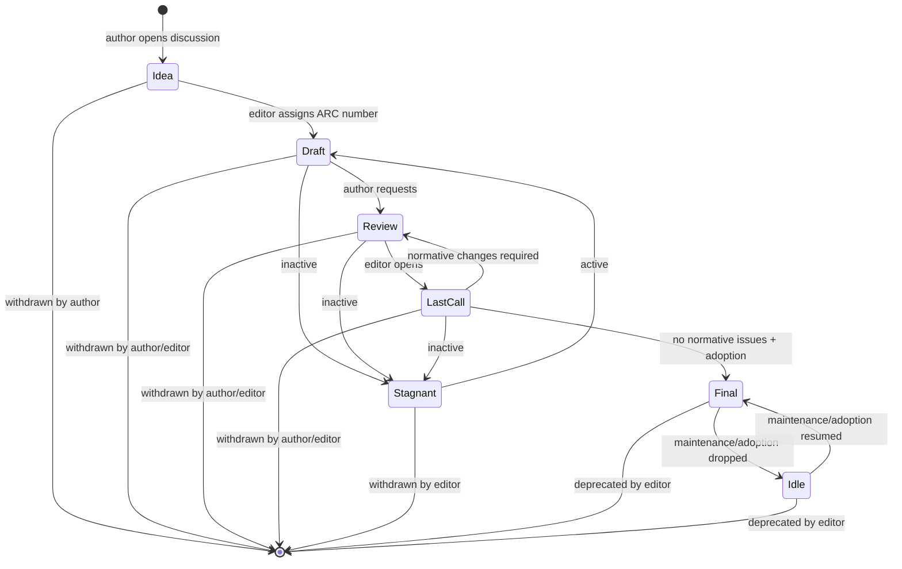

## Abstract

This document defines the _Algorand Request for Comments_ (ARC) canonical process,
style guidelines, and artifacts.

### What is an ARC?

An ARC is a specification or design document defining a standard for the Algorand
_application layer_ or a _procedure_ for the Algorand ecosystem.

ARCs are **NOT** currently used for changes to the Algorand protocol or networking
layers.

Concretely, an ARC consists of th following “artifacts”:

- A GitHub Discussion where the proposal is being discussed _before_ it becomes
an ARC or a GitHub Issue/Pull Request _during_ the ARC process.
- A numbered ARC formal document (linted and formatted according style guidelines).
- A numbered ARC machine-readable adoption summary.

ARC authors are responsible for building consensus within the Algorand ecosystem
about the problem or the opportunity to be addressed with an open discussion _before_
the formal ARC submission.

An ARC contains a single key proposal or new idea. The more focused the ARC, the
more successful it tends to be.

ARCs **MUST** include a clear and complete description of the proposed enhancement.
The enhancement **MUST** represent a net improvement for the _whole_ Algorand Ecosystem
(not just for a specific use-case): a change to one client does not require an ARC;
a change that affects multiple clients, or defines a standard for multiple applications
to use, does.

If applicable, the ARC reference implementation **MUST** be provided and maintained
by its authors (or maintainers if different from the authors).

An ARC **MUST** meet specific minimum criteria and pass through a gated process
(described in the following sections).

The ARCs history **SHALL** be maintained in this versioned repository.

## Specification

### ARC Types

There are two types of ARC:

- **Standards Track ARC**: application layer standards and conventions, including
(not limited to) contracts standards (App or Logic Signatures), Algorand ABI, URI
schemes, libraries/packages, wallets, explorers, etc.

- **Meta ARC**: processes and procedures surrounding Algorand ecosystem. Meta ARCs
apply to areas other than the Algorand application layer. Examples include procedures,
guidelines, decision-making process, etc.

### Shepherding an ARC

Parties involved in the ARC process are:

- the ARC author(s),
- the ARC sponsor(s),
- the ARC editor(s),
- the ARC implementation maintainer(s) if different from the author(s) (when applicable),
- the Algorand ecosystem stakeholders expected to adopt the ARC,
- the Algorand Foundation.

Before writing a formal ARC, the author **MUST** validate that a real ecosystem
need exists.

The author **MUST** open a GitHub Discussion in the `Pre-ARC` category of the ARC
repository. The `Pre-ARC` discussion is the canonical venue for deciding whether
the proposal should become an ARC at all.

A `Pre-ARC` discussion **MUST** include at least:

- the problem statement,
- the users or implementers affected,
- why the proposal requires an ARC instead of an SDK change, library convention,
application-specific feature, or amendment to an existing ARC,
- the existing ARCs and related work that were considered,
- the expected adopters,
- whether a reference implementation is required,
- the proposed sponsor classification (`Foundation` or `Ecosystem`).

The ARC editor **MAY** close a `Pre-ARC` discussion with one of the following outcomes:

- `accepted-for-draft`,
- `rejected-no-arc-needed`,
- `redirected-to-existing-arc`,
- `recast-as-meta`.

An ARC number **MUST NOT** be assigned before a `Pre-ARC` discussion has been accepted
for `Draft` status.

The author opens a _pull request_ containing the `Draft` ARC once the need has been
validated in the `Pre-ARC` discussion.

The ARC editor assigns the ARC number and creates a _tracking issue_ for that ARC
when the `Draft` pull request is open.

The tracking issue becomes the canonical location for gate decisions, transition
checklists, and references to the current adoption summary.

The ARC author is responsible for building consensus, documenting dissenting opinions,
keeping the tracking issue up to date, and ensuring that any material decision reached
in non-canonical channels is copied into the relevant GitHub Discussion or tracking
issue in this repository.

> Negative feedback will be considered and **MAY** prevent an ARC from moving to
> `Draft` stage.

Other channels (e.g., mailing lists, forums, calls, etc.) **MAY** be used for outreach
and community discussion, but they are not canonical.

Any decision or conclusion that affects the ARC **MUST** be summarized in the canonical
GitHub public record in this repository.

The ARC author is responsible for requesting ARC status changes.

ARC editors administer the process and verify that the gate conditions have been
met _before_ accepting a transition.

### ARC Process

The following is the standardization process for all ARCs in all tracks.


```mermaid
stateDiagram-v2
    [*] --> Idea: author opens discussion
    
    Idea --> Draft: editor assigns ARC number
    Draft --> Review: author requests
    Review --> LastCall: editor opens
    LastCall --> Review: normative changes required
    LastCall --> Final: no normative issues + adoption
    
    Draft --> Stagnant: inactive
    Review --> Stagnant: inactive
    LastCall --> Stagnant: inactive
    Stagnant --> Draft: active

    Final --> Idle: maintenance/adoption dropped
    Idle --> Final: maintenance/adoption resumed

    Idea --> [*]: withdrawn by author
    Draft --> [*]: withdrawn by author/editor
    Review --> [*]: withdrawn by author/editor
    LastCall --> [*]: withdrawn by author/editor
    Stagnant --> [*]: withdrawn by editor
    
    Final --> [*]: deprecated by editor
    Idle --> [*]: deprecated by editor
```

**Idea** – A proposal under discussion in a `Pre-ARC` GitHub Discussion. An `Idea`
is tracked in the repository discussion area but does not yet have an ARC number.

**Draft** – The first formally tracked stage of an ARC. A `Draft` ARC has passed
the need-validation gate, has been assigned an ARC number by an editor, and has
an associated tracking issue.

**Review** – An ARC author marks an ARC as ready for peer review.

To enter `Review`, the ARC **MUST**:

- define a clear specification or design as a Markdown file in the `./ARCs` directory
of this repository,
- include motivation and rationale for the design,
- include Security Considerations,
- declare whether implementation is required.

If `implementation-required` is `true`, the ARC **MUST** also include:

- a canonical reference implementation repository,
- a named implementation owner,
- a named implementation maintainer.

**Last Call** – The final review window before an ARC **MAY** become `Final`.

To enter `Last Call`, the ARC **MUST**:

- satisfy all `Review` requirements,
- have no unresolved normative design questions,
- have a current adoption summary as a YAML file in the `./adoption` directory of
this repository,
- when implementation is required, have a maintained reference implementation repository,
- show credible adoption intent from independent ecosystem stakeholders.

An ARC editor assigns `Last Call` status and sets `last-call-deadline`, typically
one month later.

If this period results in necessary normative change, the ARC reverts to `Review`.

**Final** – This ARC represents the final standard. An ARC **MUST NOT** move to
`Final` unless there is documented ecosystem adoption in the adoption summary.

When implementation is required, an ARC **MUST NOT** move to `Final` without both
a maintained reference implementation and public evidence of adoption recorded in
the adoption summary.

A `Final` ARC **SHOULD** only be updated with errata corrige and non-normative clarifications.

**Stagnant** – Any ARC in `Draft`, `Review`, or `Last Call`, if inactive for six
months or greater, is moved to `Stagnant`. An ARC **MAY** be resurrected from this
state by the authors or ARC editors by moving it back to `Draft`.

> An ARC with the status `Stagnant` which does not have any activity for one month
> will be closed and authors will be notified.

**Withdrawn** – The ARC Author(s) or Editor(s) has withdrawn the proposed ARC. This
state has finality and can no longer be resurrected using this ARC number. If the
idea is pursued later, it is considered a new proposal.

**Idle** – Any `Final` ARC if it has not been maintained or had its adoption dropped
by the Ecosystem according to its adoption summary, is moved to `Idle`. It **MAY**
return to `Final` if maintenance or adoption resumes.

**Deprecated** – Status for ARCs that are no longer aligned with the ecosystem,
no longer maintained, or have been superseded by another ARC. This state has finality
and can no longer be reverted using this ARC number.

**Living** – Special status for Meta ARCs which, by design, require updates. The
usage of this status is restricted to ARC editors and is not part of the ARC process.

### What belongs in a successful ARC?

Each ARC should have the following parts:

- Preamble - <a href="https://www.rfc-editor.org/rfc/rfc822">RFC 822</a> style headers containing metadata about the ARC, including the ARC number, a short descriptive title (limited to a maximum of 44 characters), a description (limited to a maximum of 140 characters), and the author details. Irrespective of the category, the title and description should not include ARC numbers. See [below](./arc-0000.md#arc-header-preamble) for details.
- Abstract - This is a multi-sentence (short paragraph) technical summary. It should be a very terse and human-readable version of the specification section. Someone should be able to read only the abstract to get the gist of what this specification does.
- Specification - The technical specification should describe the syntax and semantics of any new feature. The specification should be detailed enough to allow competing, interoperable implementations for any of the current Algorand clients.
- Rationale - The rationale fleshes out the specification by describing what motivated the design and why particular design decisions were made. It should describe alternate designs that were considered and related work, e.g., how the feature is supported in other languages. The rationale may also provide evidence of consensus within the community and should discuss significant objections or concerns raised during discussions.
- Backwards Compatibility - All ARCs that introduce backward incompatibilities must include a section describing these incompatibilities and their severity. The ARC must explain how the author proposes to deal with these incompatibilities. ARC submissions without a sufficient backward compatibility treatise may be rejected outright.
- Test Cases - Test cases for implementation are mandatory for ARCs that are affecting consensus changes. Tests should either be inlined in the ARC as data (such as input/expected output pairs, or included in `../assets/arc-###/<filename>`.
- Reference Implementation - An section that contains a reference/example implementation that people **MUST** use to assist in understanding or implementing this specification. If the reference implementation is too complex, the reference implementation **MUST** be included in `../assets/arc-###/<filename>`
- Security Considerations - All ARCs must contain a section that discusses the security implications/considerations relevant to the proposed change. Include information that might be important for security discussions, surfaces risks, and can be used throughout the life-cycle of the proposal. E.g., include security-relevant design decisions, concerns, essential discussions, implementation-specific guidance and pitfalls, an outline of threats and risks, and how they are being addressed. ARC submissions missing the "Security Considerations" section will be rejected. An ARC cannot proceed to status "Final" without a Security Considerations discussion deemed sufficient by the reviewers.
- Copyright Waiver - All ARCs must be in the public domain. See the bottom of this ARC for an example copyright waiver.

### ARC Formats and Templates

ARCs should be written in <a href="https://github.com/adam-p/markdown-here/wiki/Markdown-Cheatsheet">markdown</a> format. There is a <a href="https://github.com/algorandfoundation/ARCs/blob/main/ARC-template.md">template</a> to follow.

### ARC Header Preamble

Each ARC must begin with an <a href="https://www.ietf.org/rfc/rfc822.txt">RFC 822</a> style header preamble, preceded and followed by three hyphens (`---`). This header is also termed "front matter" by <a href="https://jekyllrb.com/docs/front-matter/">Jekyll</a>. The headers must appear in the following order. Headers marked with "*" are optional and are described below. All other headers are required.

` arc:` *ARC number* (It is determined by the ARC editor)

` title:` *The ARC title is a few words, not a complete sentence*

` description:` *Description is one full (short) sentence*

` author:` *A list of the author's or authors' name(s) and/or username(s), or name(s) and email(s). Details are below.*
>The `author` header lists the names, email addresses, or usernames of the authors/owners of the ARC. Those who prefer anonymity may use a username only or a first name and a username. The format of the `author` header value must be:
> Random J. User &lt;address@dom.ain&gt; or Random J. User (@username)
>At least one author must use a GitHub username in order to get notified of change requests and can approve or reject them.
` * discussions-to:` *A url pointing to the official discussion thread*
>While an ARC is in state `Idea`, a `discussions-to` header will indicate the URL where the ARC is being discussed. As mentioned above, an example of a place to discuss your ARC is the Algorand forum, but you can also use Algorand Discord #arcs chat room.
>When the ARC reach the state `Draft`, the `discussions-to` header will redirect to the discussion in <a href="https://github.com/algorandfoundation/ARCs/issues">the Issues section of this repository</a>.

` status:` *Draft, Review, Last Call, Final, Stagnant, Withdrawn, Living*

` * last-call-deadline:` *Date review period ends*

` type:` *Standards Track, Meta, or Informational*

` * category:` *Core, Networking, Interface, or ARC* (Only needed for Standards Track ARCs)

` * sub-category:` *General, Asa, Application, Explorer or Wallet* optional sub-category header, classifying the ARC into one of the following categories.

` created:` *Date created on*
>The `created` header records the date that the ARC was assigned a number. Both headers should be in yyyy-mm-dd format, e.g. 2001-08-14.
` * updated:` *Comma separated list of dates*
> The `updated` header records the date(s) when the ARC was updated with "substantial" changes. This header is only valid for ARCs of Draft and Active status.
` * requires:` *ARC number(s)*
>ARCs may have a `requires` header, indicating the ARC numbers that this ARC depends on.
` * replaces:` *ARC number(s)*
` * superseded-by:` *ARC number(s)*
>ARCs may also have a `superseded-by` header indicating that an ARC has been rendered obsolete by a later document; the value is the number of the ARC that replaces the current document.
>The newer ARC must have a `replaces` header containing the number of the ARC that it rendered obsolete.

>ARCs may also have an `extended-by` header indicating that functionalities have been added to the existing, still active ARC; the value is the number of the ARC that updates the current document.
>The newer ARC must have an `extends` header containing the number of the ARC that it extends.


` * resolution:` *A url pointing to the resolution of this ARC*

Headers that permit lists must separate elements with commas.

Headers requiring dates will always do so in the format of ISO 8601 (yyyy-mm-dd).

### Style Guide

When referring to an ARC by number, it should be written in the hyphenated form `ARC-X` where `X` is the ARC's assigned number.

### Linking to other ARCs

References to other ARCs should follow the format `ARC-N`, where `N` is the ARC number you are referring to.  Each ARC that is referenced in an ARC **MUST** be accompanied by a relative markdown link the first time it is referenced, and **MAY** be accompanied by a link on subsequent references.  The link **MUST** always be done via relative paths so that the links work in this GitHub repository, forks of this repository, the main ARCs site, mirrors of the main ARC site, etc.  For example, you would link to this ARC with `[ARC-0](./arc-0000.md)`.

### Auxiliary Files

Images, diagrams, and auxiliary files should be included in a subdirectory of the `assets` folder for that ARC as follows: `assets/arc-N` (where **N** is to be replaced with the ARC number). When linking to an image in the ARC, use relative links such as `../assets/arc-1/image.png`.

### Application's Methods name

To provide information about which ARCs has been implemented on a particular application, namespace with the ARC number should be used before every method name: `arc<ARC number>_methodName`.
> Where <ARC number> represents the specific ARC number associated to the standard.

eg:

```json
{
  "name": "Method naming convention",
  "desc": "Example",
  "methods": [
    {
      "name": "arc0_method1",
      "desc": "Method 1",
      "args": [
        { "type": "uint64", "name": "Number", "desc": "A number" },
      ],
      "returns": { "type": "void[]" }
    },
    {
      "name": "arc0_method2",
      "desc": "Method 2",
      "args": [
        { "type": "byte[]", "name": "user_data", "desc": "Some characters" }
      ],
      "returns": { "type": "void[]" }
    }
  ]
}
```

### Application's Event name

To provide information about which ARCs has been implemented on a particular application, namespace with the ARC number should be used before every [ARC-73](./arc-0073.md) event name: `arc<ARC number>_EventName`.
> Where <ARC number> represents the specific ARC number associated to the standard.

eg:

```json
{
  "name": "Event naming convention",
  "desc": "Example",
  "events": [
    {
      "name": "arc0_Event1",
      "desc": "Method 1",
      "args": [
        { "type": "uint64", "name": "Number", "desc": "A number" },
      ]
    },
    {
      "name": "arc0_Event2",
      "desc": "Method 2",
      "args": [
        { "type": "byte[]", "name": "user_data", "desc": "Some characters" }
      ]
    }
  ]
}
```

## Rationale

This document was derived heavily from <a href="https://github.com/ethereum/eips">Ethereum's EIP-1</a>, which was written by Martin Becze and Hudson Jameson, which in turn was derived from  <a href="https://github.com/bitcoin/bips">Bitcoin's BIP-0001</a> written by Amir Taaki, which in turn was derived from <a href="https://www.python.org/dev/peps/">Python's PEP-0001</a>. In many places, text was copied and modified. Although the PEP-0001 text was written by Barry Warsaw, Jeremy Hylton, and David Goodger, they are not responsible for its use in the Algorand Request for Comments. They should not be bothered with technical questions specific to Algorand or the ARC. Please direct all comments to the ARC editors.

## Security Considerations

### Usage of related link

Every link **SHOULD** be relative.

|OK|`[ARC-0](./arc-0000.md)`|
|:-|-:|
|NOK|`[ARC-0](https://github.com/algorandfoundation/ARCs/blob/main/ARCs/arc-0000.md)`|

If you are using many links you **SHOULD** use this format:

### Usage of non-related link

If for some reason (CCO, RFC ...), you need to refer on something outside of the repository, you *MUST* you the following syntax

|OK|`<a href="https://github.com/algorandfoundation/ARCs">ARCS</a>`|
|:-|-:|
|NOK|`[ARCS](https://github.com/algorandfoundation/ARCs)`|

### Transferring ARC Ownership

It occasionally becomes necessary to transfer ownership of ARCs to a new champion. In general, we would like to retain the original author as a co-author of the transferred ARC, but that is really up to the original author. A good reason to transfer ownership is that the original author no longer has the time or interest in updating it or following through with the ARC process or has fallen off the face of the 'net (i.e., is unreachable or is not responding to email). A wrong reason to transfer ownership is that you disagree with the direction of the ARC. We try to build consensus around an ARC, but if that is not possible, you can always submit a competing ARC.

If you are interested in assuming ownership of an ARC, send a message asking to take over, addressed to both the original author and the ARC editor. If the original author does not respond to the email on time, the ARC editor will make a unilateral decision (it's not like such decisions can't be reversed :)).

### ARC Editors

The current ARC editor is:

- Stéphane Barroso (@sudoweezy)

### ARC Editor Responsibilities

For each new ARC that comes in, an editor does the following:

- Read the ARC to check if it is ready: sound and complete. The ideas must make technical sense, even if they do not seem likely to get to final status.
- The title should accurately describe the content.
- Check the ARC for language (spelling, grammar, sentence structure, etc.), markup (GitHub flavored Markdown), code style

If the ARC is not ready, the editor will send it back to the author for revision with specific instructions.

Once the ARC is ready for the repository, the ARC editor will:

- Assign an ARC number

- Create a living discussion in the Issues section of this repository
  > The issue will be closed when the ARC reaches the status *Final* or *Withdrawn*

- Merge the corresponding pull request

- Send a message back to the ARC author with the next step.

The editors do not pass judgment on ARCs. We merely do the administrative & editorial part.

## Copyright

Copyright and related rights waived via <a href="https://creativecommons.org/publicdomain/zero/1.0/">CCO</a>.
