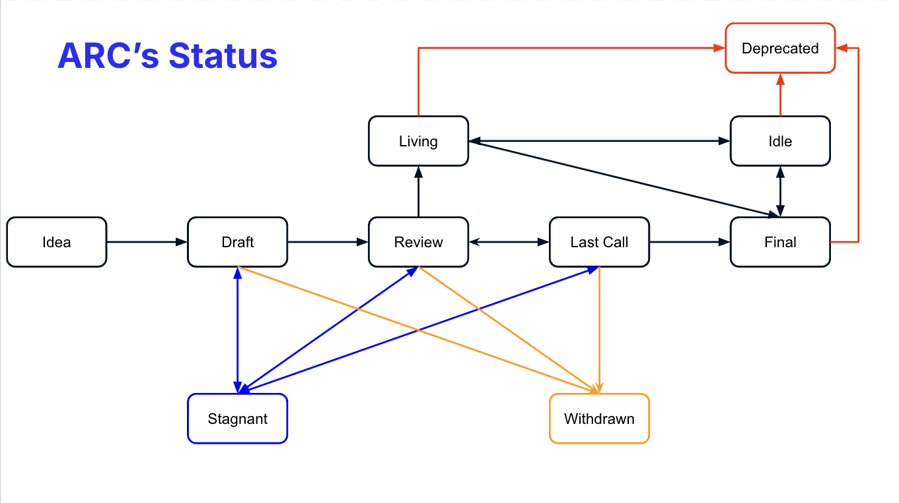

## Abstract

### What is an ARC?

ARC stands for Algorand Request for Comments. An ARC is a design document providing information to the Algorand community or describing a new feature for Algorand or its processes or environment.
The ARC should provide a concise technical specification and a rationale for the feature.
The ARC author is responsible for building consensus within the community and documenting dissenting opinions.

We intend ARCs to be the primary mechanisms for proposing new features and collecting community technical input on an issue.
We maintain ARCs as text files in a versioned repository. Their revision history is the historical record of the feature proposal.

## Specification

### ARC Types

There are  three types of ARC:

- A **Standards track ARC**: application-level standards and conventions, including contract standards such as NFT standards, Algorand ABI, URI schemes, library/package formats, and wallet formats.

- A **Meta ARC** describes a process surrounding Algorand or proposes a change to (or an event in) a process. Process ARCs are like Standards track ARCs but apply to areas other than the Algorand protocol. They may propose an implementation, but not to Algorand's codebase; they often require community consensus; unlike Informational ARCs, they are more than recommendations, and users are typically not free to ignore them. Examples include procedures, guidelines, changes to the decision-making process, and changes to the tools or environment used in Algorand development. Any meta-ARC is also considered a Process ARC.

- An **Informational ARC** describes an Algorand design issue or provides general guidelines or information to the Algorand community but does not propose a new feature. Informational ARCs do not necessarily represent Algorand community consensus or a recommendation, so users and implementers are free to ignore Informational ARCs or follow their advice.

We recommend that a single ARC contains a single key proposal or new idea. The more focused the ARC, the more successful it tends to be. A change to one client does not require an ARC; a change that affects multiple clients, or defines a standard for multiple apps to use, does.

An ARC must meet specific minimum criteria. It must be a clear and complete description of the proposed enhancement.
The enhancement must represent a net improvement. If applicable, the proposed implementation must be solid and not complicate the protocol unduly.

### Shepherding an ARC

Parties involved in the process are you, the champion or *ARC author*, the [*ARC editors*](#arc-editors), the <a href="https://github.com/orgs/algorand/people">*Algorand Core Developers*</a>, and the <a href="https://github.com/orgs/algorandfoundation/people">*Algorand Foundation Team*</a>.

Before writing a formal ARC, you should vet your idea. Ask the Algorand community first if an idea is original to avoid wasting time on something that will be rejected based on prior research. You **MUST** open a discussion thread on the <a href="https://forum.algorand.org/c/arc/19">Algorand forum</a> to do this. You **SHOULD** also share the idea on the <a href="https://discord.gg/algorand">Algorand Discord #arcs chat room</a>.

Once the idea has been vetted, your next responsibility will be to create a <a href="https://github.com/algorandfoundation/ARCs/pulls">pull request</a> to present (through an ARC) the idea to the reviewers and all interested parties and invite editors, developers, and the community to give feedback on the aforementioned issue.

The pull request with the **DRAFT** status **MUST**:

- Have been vetted on the forum.
- Be editable by ARC Editors; it will be closed otherwise.

You should try and gauge whether the interest in your ARC is commensurate with both the work involved in implementing it and how many parties will have to conform to it. Negative community feedback will be considered and may prevent your ARC from moving past the Draft stage.

To facilitate the discussion between each party involved in an ARC, you **SHOULD** use the specific <a href="https://discord.com/channels/491256308461207573/1011541977189326852">channel in the Algorand Discord</a>.

The ARC author is in charge of creating the PR and changing the status to **REVIEW**.

The pull request with the **REVIEW** status **MUST**:

- Contain a reference implementation.
- Have garnered the interest of multiple projects; it will be set to **STAGNANT** otherwise.

To update the status of an ARC from **REVIEW** to **LAST CALL**, a discussion will occur with all parties involved in the process. Any stakeholder **SHOULD** implement the ARC to point out any flaws that might occur.

*In short, the role of a champion is to write the ARC using the style and format described below, shepherd the discussions in the appropriate forums, build community consensus around the idea, and gather projects with similar needs who will implement it.*

### ARC Process

The following is the standardization process for all ARCs in all tracks:



**Idea** - An idea that is pre-draft. This is not tracked within the ARC Repository.

**Draft** - The first formally tracked stage of an ARC in development. An ARC is merged by an ARC Editor into the ARC repository when adequately formatted.

**Review** - An ARC Author marks an ARC as ready for and requests Peer Review.

**Last Call** - The final review window for an ARC before moving to `FINAL`. An ARC editor will assign `Last Call` status and set a review end date (last-call-deadline), typically 1 month later.

If this period results in necessary normative change, it will revert the ARC to `REVIEW`.

**Final** - This ARC represents the final standard. A Final ARC exists in a state of finality and should only be updated to correct errata and add non-normative clarifications.

**Stagnant** - Any ARC in `DRAFT`,`REVIEW` or `LAST CALL`, if inactive for 6 months or greater, is moved to `STAGNANT`. An ARC may be resurrected from this state by Authors or ARC Editors by moving it back to `DRAFT`.

> An ARC with the status **STAGNANT** which does not have any activity for 1 month will be closed.
> *ARC Authors are notified of any algorithmic change to the status of their ARC*

**Withdrawn** - The ARC Author(s)/Editor(s) has withdrawn the proposed ARC. This state has finality and can no longer be resurrected using this ARC number. If the idea is pursued later, it is considered a new proposal.

**Living** - A special status for ARCs which, by design, will be continually updated and **MIGHT** not reach a state of finality.

**Deprecated** - A status for ARCs that are no longer aligned with our ecosystem or have been superseded by another ARC.

### What belongs in a successful ARC?

Each ARC should have the following parts:

- Preamble - <a href="https://www.rfc-editor.org/rfc/rfc822">RFC 822</a> style headers containing metadata about the ARC, including the ARC number, a short descriptive title (limited to a maximum of 44 characters), a description (limited to a maximum of 140 characters), and the author details. Irrespective of the category, the title and description should not include ARC numbers. See [below](./arc-0000.md#arc-header-preamble) for details.
- Abstract - This is a multi-sentence (short paragraph) technical summary. It should be a very terse and human-readable version of the specification section. Someone should be able to read only the abstract to get the gist of what this specification does.
- Specification - The technical specification should describe the syntax and semantics of any new feature. The specification should be detailed enough to allow competing, interoperable implementations for any of the current Algorand clients.
- Rationale - The rationale fleshes out the specification by describing what motivated the design and why particular design decisions were made. It should describe alternate designs that were considered and related work, e.g., how the feature is supported in other languages. The rationale may also provide evidence of consensus within the community and should discuss significant objections or concerns raised during discussions.
- Backwards Compatibility - All ARCs that introduce backward incompatibilities must include a section describing these incompatibilities and their severity. The ARC must explain how the author proposes to deal with these incompatibilities. ARC submissions without a sufficient backward compatibility treatise may be rejected outright.
- Test Cases - Test cases for implementation are mandatory for ARCs that are affecting consensus changes. Tests should either be inlined in the ARC as data (such as input/expected output pairs, or included in `../assets/arc-###/<filename>`.
- Reference Implementation - An section that contains a reference/example implementation that people **MUST** use to assist in understanding or implementing this specification. If the reference implementation is too complex, the reference implementation **MUST** be included in `../assets/arc-###/<filename>`
- Security Considerations - All ARCs must contain a section that discusses the security implications/considerations relevant to the proposed change. Include information that might be important for security discussions, surfaces risks, and can be used throughout the life-cycle of the proposal. E.g., include security-relevant design decisions, concerns, essential discussions, implementation-specific guidance and pitfalls, an outline of threats and risks, and how they are being addressed. ARC submissions missing the "Security Considerations" section will be rejected. An ARC cannot proceed to status "Final" without a Security Considerations discussion deemed sufficient by the reviewers.
- Copyright Waiver - All ARCs must be in the public domain. See the bottom of this ARC for an example copyright waiver.

### ARC Formats and Templates

ARCs should be written in <a href="https://github.com/adam-p/markdown-here/wiki/Markdown-Cheatsheet">markdown</a> format. There is a <a href="https://github.com/algorandfoundation/ARCs/blob/main/ARC-template.md">template</a> to follow.

### ARC Header Preamble

Each ARC must begin with an <a href="https://www.ietf.org/rfc/rfc822.txt">RFC 822</a> style header preamble, preceded and followed by three hyphens (`---`). This header is also termed "front matter" by <a href="https://jekyllrb.com/docs/front-matter/">Jekyll<a>. The headers must appear in the following order. Headers marked with "*" are optional and are described below. All other headers are required.

` arc:` *ARC number* (It is determined by the ARC editor)

` title:` *The ARC title is a few words, not a complete sentence*

` description:` *Description is one full (short) sentence*

` author:` *A list of the author's or authors' name(s) and/or username(s), or name(s) and email(s). Details are below.*
>The `author` header lists the names, email addresses, or usernames of the authors/owners of the ARC. Those who prefer anonymity may use a username only or a first name and a username. The format of the `author` header value must be:
> Random J. User &lt;address@dom.ain&gt; or Random J. User (@username)
>At least one author must use a GitHub username in order to get notified of change requests and can approve or reject them.
` * discussions-to:` *A url pointing to the official discussion thread*
>While an ARC is in state `Idea`, a `discussions-to` header will indicate the URL where the ARC is being discussed. As mentioned above, an example of a place to discuss your ARC is the Algorand forum, but you can also use Algorand Discord #arcs chat room.
>When the ARC reach the state `Draft`, the `discussions-to` header will redirect to the discussion in <a href="https://github.com/algorandfoundation/ARCs/issues">the Issues section of this repository</a>.

` status:` *Draft, Review, Last Call, Final, Stagnant, Withdrawn, Living*

` * last-call-deadline:` *Date review period ends*

` type:` *Standards Track, Meta, or Informational*

` * category:` *Core, Networking, Interface, or ARC* (Only needed for Standards Track ARCs)

` created:` *Date created on*
>The `created` header records the date that the ARC was assigned a number. Both headers should be in yyyy-mm-dd format, e.g. 2001-08-14.
` * updated:` *Comma separated list of dates*
> The `updated` header records the date(s) when the ARC was updated with "substantial" changes. This header is only valid for ARCs of Draft and Active status.
` * requires:` *ARC number(s)*
>ARCs may have a `requires` header, indicating the ARC numbers that this ARC depends on.
` * replaces:` *ARC number(s)*
` * superseded-by:` *ARC number(s)*
>ARCs may also have a `superseded-by` header indicating that an ARC has been rendered obsolete by a later document; the value is the number of the ARC that replaces the current document.
>The newer ARC must have a `replaces` header containing the number of the ARC that it rendered obsolete.

>ARCs may also have an `extended-by` header indicating that functionalities have been added to the existing, still active ARC; the value is the number of the ARC that updates the current document.
>The newer ARC must have an `extends` header containing the number of the ARC that it extends.


` * resolution:` *A url pointing to the resolution of this ARC*

Headers that permit lists must separate elements with commas.

Headers requiring dates will always do so in the format of ISO 8601 (yyyy-mm-dd).

### Style Guide

When referring to an ARC by number, it should be written in the hyphenated form `ARC-X` where `X` is the ARC's assigned number.

### Linking to other ARCs

References to other ARCs should follow the format `ARC-N`, where `N` is the ARC number you are referring to.  Each ARC that is referenced in an ARC **MUST** be accompanied by a relative markdown link the first time it is referenced, and **MAY** be accompanied by a link on subsequent references.  The link **MUST** always be done via relative paths so that the links work in this GitHub repository, forks of this repository, the main ARCs site, mirrors of the main ARC site, etc.  For example, you would link to this ARC with `[ARC-0](./arc-0000.md)`.

### Auxiliary Files

Images, diagrams, and auxiliary files should be included in a subdirectory of the `assets` folder for that ARC as follows: `assets/arc-N` (where **N** is to be replaced with the ARC number). When linking to an image in the ARC, use relative links such as `../assets/arc-1/image.png`.

### Application's Methods name

To provide information about which ARCs has been implemented on a particular application, namespace with the ARC number should be used before every method name: `arc<ARC number>_methodName`.
> Where <ARC number> represents the specific ARC number associated to the standard.

eg:

```json
{
  "name": "Method naming convention",
  "desc": "Example",
  "methods": [
    {
      "name": "arc0_method1",
      "desc": "Method 1",
      "args": [
        { "type": "uint64", "name": "Number", "desc": "A number" },
      ],
      "returns": { "type": "void[]" }
    },
    {
      "name": "arc0_method2",
      "desc": "Method 2",
      "args": [
        { "type": "byte[]", "name": "user_data", "desc": "Some characters" }
      ],
      "returns": { "type": "void[]" }
    }
  ]
}
```

### Application's Event name

To provide information about which ARCs has been implemented on a particular application, namespace with the ARC number should be used before every [ARC-73](./arc-0073.md) event name: `arc<ARC number>_EventName`.
> Where <ARC number> represents the specific ARC number associated to the standard.

eg:

```json
{
  "name": "Event naming convention",
  "desc": "Example",
  "events": [
    {
      "name": "arc0_Event1",
      "desc": "Method 1",
      "args": [
        { "type": "uint64", "name": "Number", "desc": "A number" },
      ]
    },
    {
      "name": "arc0_Event2",
      "desc": "Method 2",
      "args": [
        { "type": "byte[]", "name": "user_data", "desc": "Some characters" }
      ]
    }
  ]
}
```

## Rationale

This document was derived heavily from <a href="https://github.com/ethereum/eips">Ethereum's EIP-1</a>, which was written by Martin Becze and Hudson Jameson, which in turn was derived from  <a href="https://github.com/bitcoin/bips">Bitcoin's BIP-0001</a> written by Amir Taaki, which in turn was derived from <a href="https://www.python.org/dev/peps/">Python's PEP-0001</a>. In many places, text was copied and modified. Although the PEP-0001 text was written by Barry Warsaw, Jeremy Hylton, and David Goodger, they are not responsible for its use in the Algorand Request for Comments. They should not be bothered with technical questions specific to Algorand or the ARC. Please direct all comments to the ARC editors.

## Security Considerations

### Usage of related link

Every link **SHOULD** be relative.

|OK|`[ARC-0](./arc-0000.md)`|
|:-|-:|
|NOK|`[ARC-0](https://github.com/algorandfoundation/ARCs/blob/main/ARCs/arc-0000.md)`|

If you are using many links you **SHOULD** use this format:

### Usage of non-related link

If for some reason (CCO, RFC ...), you need to refer on something outside of the repository, you *MUST* you the following syntax

|OK|`<a href="https://github.com/algorandfoundation/ARCs">ARCS</a>`|
|:-|-:|
|NOK|`[ARCS](https://github.com/algorandfoundation/ARCs)`|

### Transferring ARC Ownership

It occasionally becomes necessary to transfer ownership of ARCs to a new champion. In general, we would like to retain the original author as a co-author of the transferred ARC, but that is really up to the original author. A good reason to transfer ownership is that the original author no longer has the time or interest in updating it or following through with the ARC process or has fallen off the face of the 'net (i.e., is unreachable or is not responding to email). A wrong reason to transfer ownership is that you disagree with the direction of the ARC. We try to build consensus around an ARC, but if that is not possible, you can always submit a competing ARC.

If you are interested in assuming ownership of an ARC, send a message asking to take over, addressed to both the original author and the ARC editor. If the original author does not respond to the email on time, the ARC editor will make a unilateral decision (it's not like such decisions can't be reversed :)).

### ARC Editors

The current ARC editor is:

- Stéphane Barroso (@sudoweezy)

### ARC Editor Responsibilities

For each new ARC that comes in, an editor does the following:

- Read the ARC to check if it is ready: sound and complete. The ideas must make technical sense, even if they do not seem likely to get to final status.
- The title should accurately describe the content.
- Check the ARC for language (spelling, grammar, sentence structure, etc.), markup (GitHub flavored Markdown), code style

If the ARC is not ready, the editor will send it back to the author for revision with specific instructions.

Once the ARC is ready for the repository, the ARC editor will:

- Assign an ARC number

- Create a living discussion in the Issues section of this repository
  > The issue will be closed when the ARC reaches the status *Final* or *Withdrawn*

- Merge the corresponding pull request

- Send a message back to the ARC author with the next step.

The editors do not pass judgment on ARCs. We merely do the administrative & editorial part.

## Copyright

Copyright and related rights waived via <a href="https://creativecommons.org/publicdomain/zero/1.0/">CCO</a>.
