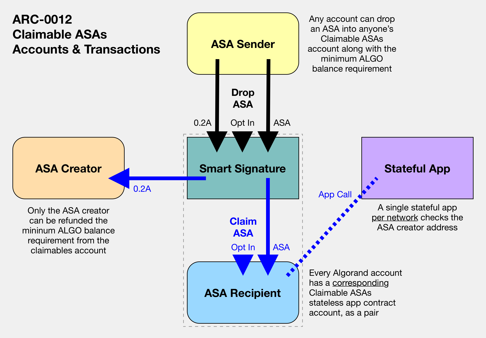

# Claimable Algorand Standard Assets (ASAs)

## Summary

A standard for TEAL contract accounts to serve as a pending claimable ASAs account for Algorand Standard Assets for an intended receiver that is not opted in to the ASA.

## Abstract

The goal of this standard is to establish a standard in the Algorand ecosytem by which ASAs can be sent to an intended receiver even if their account is not opted in to the ASA.  

TEAL stateless smart signature contract accounts corresponding to any Algorand account serve as a claimable ASAs account with logic that permits opting into incoming ASAs and subsequently for only the intended receiver to claim the ASA into their normal account.  A single associated stateful application on the network enables a cost--the minimum balance requirement to create an account and hold an ASA--to be refunded to the ASA creator when the asset is claimed by the receiver.

If integrated into ecosystem technologies including wallets, epxlorers, and dApps, this standard can provide enhanced capabilities around ASAs which are otherwise strictly bound at the protocol level to require opting in to be received.  This also enables the ability to "burn" ASAs by sending them to the claimable ASAs account associated with the global Zero Address.

## Motivation

Algorand requires users to opt in to receive any ASA, a fact which simultaneously:

1. Grants account holders fine-grained control over the contents of their account by allowing them to select what assets to allow and preventing any unwanted tokens from appearing in their balance.
2. Annoys users when transactions fail and must be resubmitted after completing an opt in transaction--or asking someone else to do so.  This routine is jarring to people who are new to Algorand or are accutomed other blockchains without this requirement.

This ARC lays out a new way to navigate the ASA opt in requirement.  

### Contemplated Use Cases

The following use cases help explain how this capability can enhance the possibilities within the Algorand ecosystem.

#### Airdrops

An ASA creator who wants to send their asset to a set of accounts faces the challenge of needing their intended receivers to opt in to the ASA ahead of time, which requires non-trivial communication efforts and precludes the possibility of completing the airdrop as a surprise.  This claimable ASA standard creates the ability to send an airdrop out to individual addresses so that the receivers can opt in and claim the asset at their convenience--or not, if they so choose.  

#### Reducing New User On-boarding Friction

An application operator who wants to on-board users to their game or business may want to reduce the friction of getting people started by decoupling their application on-boarding process from the process of funding a non-custodial Algorand wallet, if users are wholly new to the Algorand ecosystem.  As long as the receiver's address is known, an ASA can be sent to them ahead of them having ALGOs in their wallet to cover the minimum balance requirement and opt in to the asset.

#### Token Burning

Similarly to any regular account, the global Zero Address also has a corresponding claimable ASAs account to which one can send a quantity of any ASA to effectively "burn" it, rendering it lost forever.  No one controls the Zero Address, so while it cannot opt into any ASA to receive it directly, it also cannot make any claims from its corresponding claimable ASAs account, which thus functions as an UN-claimable ASAs purgatory account.  By utilizing this approach, anyone can verifiably and irreversibly take a quantity of any ASA out of circulation forever.

## Specification

The key words "**MUST**", "**MUST NOT**", "**REQUIRED**", "**SHALL**", "**SHALL NOT**", "**SHOULD**", "**SHOULD NOT**", "**RECOMMENDED**", "**MAY**", and "**OPTIONAL**" in this document are to be interpreted as described in [RFC-2119](https://www.ietf.org/rfc/rfc2119.txt).

> Comments like this are non-normative.

### Definitions

- **Claimable ASA**: An Algorand Standard Asset (ASA) which has been transferred to a claimable ASAs account following the standard set forth in this proposal such that only the intended receiver account can claim it at their convenience.  
- **Claimable ASAs Account**: An Algorand contract account derived deterministically from the account of an intended ASA receiver plus a stateless TEAL smart signature that approves transactions originating from it.  
- **dApp**: A decentralized application frontend, interpreted here to mean an off-chain frontend (a webapp, native app, etc.) that interacts with applications on the blockchain.
- **Explorer**: An off-chain application that allows browsing the blockchain, showing details of transactions.
- **Wallet**: An off-chain application that stores secret keys for on-chain accounts and can display and sign transactions for these accounts.
- **Mainnet ID**: The ID for the application that should be called upon claiming an asset on mainnet
- **Testnet ID**: The ID for the application that should be called upoin claiming an asset on testnet
- **Minimum Balance Requirement (MBR)**: The minimum amount of Algos which must be held by an account on the ledger, which is currently 0.1A + 0.1A per ASA opted into.

### TEAL Smart Contracts

There are two smart contracts being used for ARC-0012. A [smart signature](../assets/arc-0012/claimable_lsig.teal) and a [stateful application](../assets/arc-0012/claim_app.teal). In summary, the smart signature is the account used for holding the ASA and handling opt-in and claim logic. The stateful application is used atomically upon claim to ensure the creator of the ASA is paid 0.2 ALGO.

#### Smart Signature (Stateless App)

The smart signature contains the primary logic for controlling the claimable ASA. The address for the claimable ASAs account is derived from this smart signature. The smart signature is broken down into multiple sections.

##### handle_claim_payment

Logic for handling the payment of 0.2 ALGO that is sent back to the ASA creator upon claiming of the ASA by the intended receiver. This logic relies on an atomic app call to the stateful application to verify the receiver of the payment is the asset creator. A stateful application must be used here because stateless smart signatures cannot get the creator address of an ASA.

##### handle_optin

Logic for verifying an opt-in transaction for the claimable ASAs account. The receiver must be the sender (which is the smart signature address) and the transaction MUST NOT be closing out the asset.

##### handle_claim_axfer

Logic for transfering the claimable ASA to the intended receivers account. This transaction must be grouped with a transaction handled by `handle_claim_payment` and the stateful application.

##### handle_axfer

Logic for determining whether the logic should branch to `handle_claim_axfer` or `handle_optin`.

##### main

Logic that contains necessary assertions, such as verifying the account is not being closed or rekey. Ultimately routes to `handle_claim_payment`, `handle_axfer` or `err`.

#### Smart Contract (Stateful App)

The application is used to ensure the creator is payed upon ASA claiming. A stateful application must be used to get the creator of the ASA. The application logic is broken down into multiple sections.

##### init_scratch

Initializes scartch variables

##### main

Automatically approves app creation and rejects any OnComplete other than NoOp. Contains conditional logic to handle whether the claimable ASAs account should be closed or a regular payment should be made. Verifies the payment is being made to the ASA creator.

### Implementation

#### Calculating Claimable ASAs Address

To calculate the claimable address for any given account, one MUST take the TEAL source code shown in [claimable_lsig.teal](../assets/arc-0012/claimable_lsig.teal) and perform the following steps before compilation.

1. Replace every instance of `$RECEIVER_ADDRESS` with `byte addr` followed by the base32 address of the intended receiver.
2. Replace every instance of `$APP_ID` with the `APP_ID` for the respective network as defined above

The address for the compiled smart signature is the claimable address.

#### Sending a New ASA to a Claimable ASAs Account

To send an ASA to an account that may or may not be opted in, the client sending the asset MUST check if the intended receiver is already opted into the ASA. If it is, the ASA MUST be sent per usual. If not, the following transaction group MUST be sent to the network.

1. Payment
   1. From: ASA sender
   2. To: claimable ASAs account
   3. Amount: 2*MBR
2. Asset Opt-in
   1. From: claimable ASAs account
   2. To: claimable ASAs account
   3. Amount: 0
   4. Fee: 0
3. Asset Transfer
   1. From: ASA sender
   2. To: claimable ASAs account

#### Claiming an ASA

To claim an ASA the following trasnaction group MUST be sent.

1. Application Call
   1. From: claimer
   2. AppID: Mainnet ID or Testnet ID, depending on which network the trasnaction is taking place on
   3. Accounts: claimable ASAs account
   4. Assets: ASA being claimed
2. Asset Transfer
   1. From: claimable ASAs account
   2. To: claimer
   3. Amount: 0
   4. Close Asset To: claimer
   5. Fee: 0
3. Pay Transaction
   1. From: claimable ASAs account
   2. To: ASA creator
   3. Amount: 2*MBR
   4. Close Asset To: Creator, if claimable ASAs account balance is exactly 2*MBR. Else, the zero address
   5. Fee: 0

### Accounts and Transactions Diagram

## Rationale

This design was created to offer a standard mechanism by which wallets, explorers, and dapps could enable users to send, receive, and find claimable ASAs without requiring any changes to the core protocol.  

## Reference Implementation

### Source code
[https://github.com/joe-p/Claimable-ASA-PoC](https://github.com/joe-p/Claimable-ASA-PoC)

### Live demo on Testnet
[https://claimable-asa-demo.netlify.app/](https://claimable-asa-demo.netlify.app/).

### Overview

To demonstate how to interact with a claimable ASAs account, a simple application has been created with MyAlgo integration and the following capabilities:

1. Displaying a connected wallet account's current assets
2. Deriving the connected account's *corresponding claimable ASAs account* using the standard TEAL smart signature code
3. Displaying any ASAs in the claimable ASAs account with the ability to claim them into the connected wallet account
4. A smart sending tool to transfer ASAs from the connected wallet account to an intended receiver, dynamically diverting the transfer to the receiver's corresponding claimable ASAs account if the receiver is not opted in to the ASA.*

With this toolset it is possible to view one's own claimable ASAs account, claim ASAs from it, and automatically utilize other people's claimable ASAs account to send them any ASA.

### Burning Tokens

Additionally, the smart sending tool can be used to burn ASAs by entering the global Zero Address `AAAAAAAAAAAAAAAAAAAAAAAAAAAAAAAAAAAAAAAAAAAAAAAAAAAAY5HFKQ` as the intended recipient.  The app will automatically re-route the ASA to the unique "UN-claimable" ASAs account corresponding to the Zero Address.  An ASA sent here can never be claimed by anyone, rendering the transferred quantity permanently irretrievable and effectively "burned" in a verifiable way.

## Backwards Compatibility

This ARC makes no changes to the consensus protocol and creates no backwards compatibility issues.

## Security Considerations

[To do]

## Copyright

Copyright and related rights waived via [CC0](https://creativecommons.org/publicdomain/zero/1.0/).
