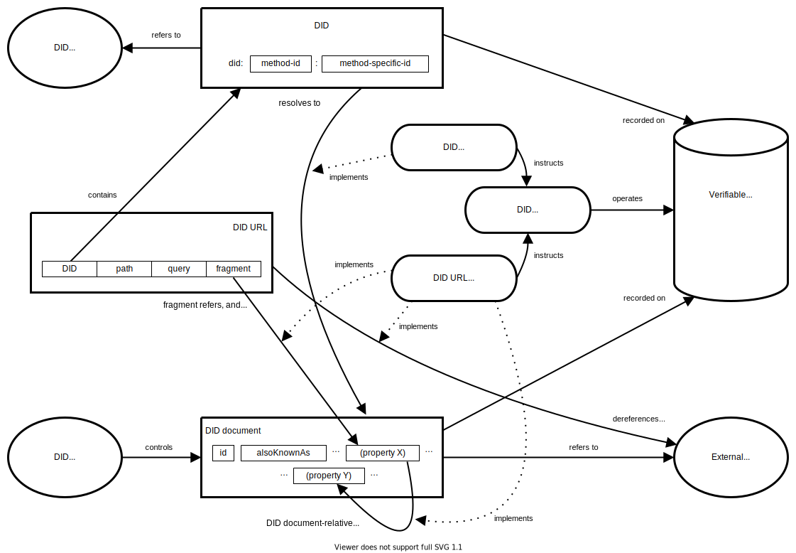
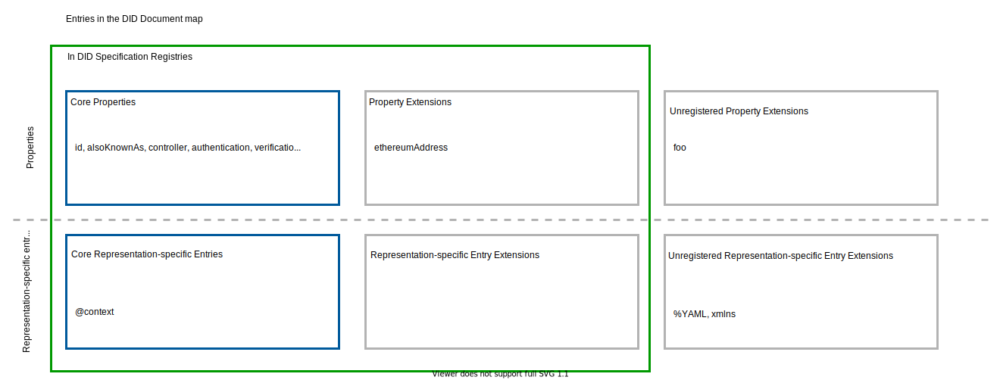
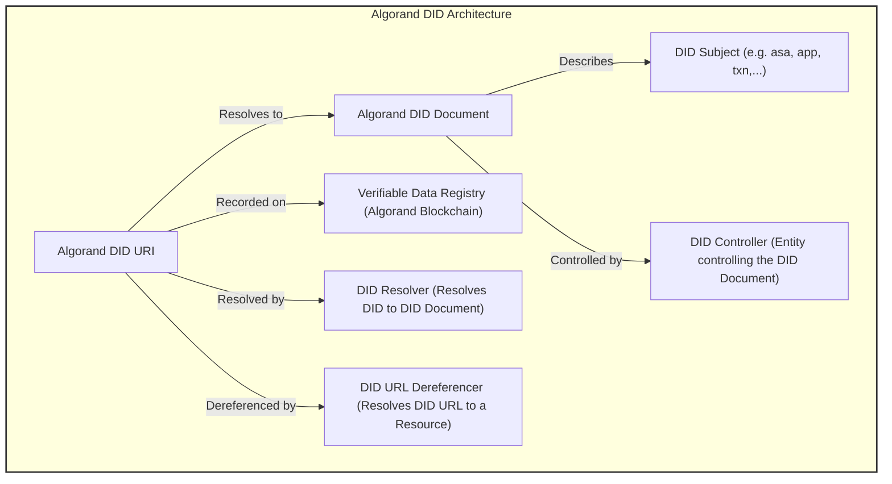

## Abstract

This standard represents [Decentralized Identifiers (DIDs) v1.0](https://www.w3.org/TR/did-core/) , [W3C Decentralized Identifiers Data Model Version 1.0 (19 July 2022)](https://w3c.github.io/did-core/#bib-vc-data-model), [DID Specification Registries](https://www.w3.org/TR/did-spec-registries/) and [Decentralized Identifier Resolution (DID Resolution) v0.3](https://w3c-ccg.github.io/did-resolution/) living standards requirements and conventions using Algorand blockchain elements, naming conventions and methods! 

ARC13 is best implementable as a group, together with [ARC113](https://github.com/GoPlausible/ARCs/blob/ARC-0113/ARCs/arc-0113.md) and [ARC110](https://github.com/GoPlausible/ARCs/blob/ARC-0110/ARCs/arc-0110.md)!

ASA ARCs can be extended by ARC13 and also can be passively subject to it, including:

-  [ARC3](https://arc.algorand.foundation/ARCs/arc-0003)
-  [ARC19](https://arc.algorand.foundation/ARCs/arc-0019)
-  [ARC69](https://arc.algorand.foundation/ARCs/arc-0069)
-  [ARC72](https://arc.algorand.foundation/ARCs/arc-0072)
-  [ARC200](https://arc.algorand.foundation/ARCs/arc-0200)

Algorand technology specific features are intended to reflect into this ARC in full:
- Composability
- Elements and namespace conventions
- Methods and operations
- Tech stack (available and in use)
- Requirements

NOTE: THIS IS DRAFT! WORK IN PROGRESS! ALL HELP WELCOME!

## Specification
All implementation guidelines, diagrams, examples, and notes in this specification are non-normative. Everything else in this specification is normative. The key words "MUST", "MUST NOT", "REQUIRED", "SHALL", "SHALL NOT", "SHOULD", "SHOULD NOT", "RECOMMENDED", "MAY","MAY NOT", "OPTIONAL," "RECOMMENDED," "REQUIRED" and "SHOULD NOT" in this document are to be interpreted as described in [BCP 14 RFC2119](https://www.rfc-editor.org/rfc/rfc2119) and [RFC8174](https://www.rfc-editor.org/rfc/rfc8174) when, and only when, they appear in all capitals, as shown here.

This ARC uses interchangeably the terms "Account", "Account Address",  "public key", and "PK" to indicate the on-chain address of a blockchain identity, and in particular of an Algorand account, while reserving the term "ADDR" as a method namespace for application addresses on AVM chains in general!

The ARC13 standard aims to seamlessly integrate the W3C Decentralized Identifiers (DIDs) standards with the Algorand blockchain, leveraging its unique features and existing ARCs in motion (not only finalized). 

This integration ensures that DIDs on Algorand maintain global uniqueness, immutability, and the ability to be resolved to DID documents, which are essential for verifiable digital identity and decentralized authentication.

ARC13 has taken insights and inspiration from precious foundamental work of [Algorand Foundation](https://github.com/algorandfoundation/did-algo) on algo-did, but took a slightly different and more generalized approach!

ARC13 can extend [ARC26](https://arc.algorand.foundation/ARCs/arc-0026) (TODO Work) for it to support and include DIDs both in URL scheme and resolution conventions!

ARC13 complies to [ARC4](https://github.com/algorandfoundation/ARCs/blob/main/ARCs/arc-0004.md) and [ARC22](https://github.com/algorandfoundation/ARCs/blob/main/ARCs/arc-0022.md) to make use of readonly interfaces added to ARC4!

ARC13 heavily relies on [ARC52](https://arc.algorand.foundation/ARCs/arc-0052) work and output in order to provide integrated identity proofs through both derived keys and signed certificates!

Conventions to conduct DID naming , namespace, ABNF grammar and DID registry/resolver specifications using Algorand decentralized ledger and storage space as well as construction and resolution methods in accordance to Algorand literature, syntax and vocabulary are included in ARC13's scope!

ARC13 proposes two category of identifiers:

- Elemental :AVM element identifiers like transaction IDs, ASA IDs, APP IDs and account addresses! Elemental DIDs do not need any registry and decentralized ledger!
- Composed : A composition of identifiers (in different structures DID, VC, VP, OC, OB) under a composite identifier registered as a DID! Composite DIDs MUST have registry, lifecycle management and universal resolver with decentralized implementations!

ARC13 also introduces higher level abstractions (composed identities and credentials) using ARC110 and also dismisses the need for using single root identities and identity static hierarchies.

### General Format

Algorand DID elements specified by this ARC follow the URI format in general as outlined in [RFC 3986](https://www.rfc-editor.org/rfc/rfc3986). The Public key part is (FOR NOW) implemented using [W3C Multibase format](https://w3c-ccg.github.io/multibase/) and account address! Given the extent of responsibility DID resolvers have in DID lifecycle , and given the fact that Algorand address is a deterministic representation of Public key, therefore using Multibase format with base32 notation "B" and uppercase SHOULD BE allowed by DID standard to be used with "Ed25519VerificationKey2020" type!

Elements of the query component may contain characters outside the valid range. These must first be encoded according to UTF-8, and then each octet of the corresponding UTF-8 sequence must be percent-encoded as described in [RFC 3986].


### Main elements

The main elements of the Algorand DID based on the DID data model are:

- DID Scheme: did:algo: The unique scheme for Algorand DIDs.
- Element: An AVM or complementary service element as a subject for DID
- Network Identifier: testnet_ or mainnet_ Specifies the Algorand network (testnet or mainnet).
- Namespace: Identifies the type of Algorand element the DID represents (e.g., asa, txn, app).
- Unique Identifier: A specific identifier unique to the namespace (e.g., ASA ID, transaction hash, application ID).
- Local elements: AVM Elements with locally Unique Identifiers like assets and applications!
- Global elements: AVM Elements with global Unique Identifiers like Transactions, account addresses, UUIDs, IPFS CIDs!
- Internal elements: Elements under direct verification authority and tooling of AVM chains (TXN, ASA, APP, ACC)
- Service elements: Elements out of verification authority and tooling of AMV chains (IPFS, URI, DOID,...)


DID General Architecture: Curtsey of W3C [Decentralized Identifiers (DIDs) v1.0](https://www.w3.org/TR/did-core/)

According to DID general architecture version 1.0, ARC13 needs to provide standard coverage, infrastructure and also refrence implementation for:
- DID URI (Spec, API and from client library)
- DID Document (Spec, API and from client library)
- DID Registry (Spec & ABI)
- DID Resolver (Spec, ABI, API, UI and from client library)

## Rationale

ARC13 is proposed to bring the benefits of decentralized identity to the Algorand ecosystem in a universally accessible, public and decentralized way. By adopting the W3C DID standard, Algorand users can leverage a globally recognized framework for digital identity, enhancing interoperability, security, and trust in digital interactions. This standard also paves the way for advanced use cases in decentralized finance, supply chain, and [Enterprise sector to be general](https://www.w3.org/TR/did-use-cases/#didEnterpriseChallenges).

The rationale on namespaces includes :
- Re-usability of currently locally (ASA, APP) or globally (ADDRESS, TXNID) identified elements by turning both classes directly into semantically identical DIDs which is human readable without further interpretations! 
For example resolve chain IDs to chain names has been omitted by not using chain Ids in namespaces , since Algorand does not Fork and AVM chains are on 100% good terms in case of standardization, therefore there is no need for lower level roots (e.g. UUID) for AVM elements e.g. accounts!


UUID Rationale: having UUID as first class citizen here to be used above or below any Algorand identifier give the ability of infinite possible scenarios to use and link offchain/onchain assets as composed entities !

As composability is one of Algorand technology mottos , this ARC by using UUIDs , aligns by-design with upstream and stays future-proof on usability and extendability!

NFD/ANS Rationale: nfd is a well-known namespace in Algorand and ans is the standard namespace naming for Algorand Naming Service, so instead of debating facts Algorand DIDs support and resolve both with no difference!

Note: Algorand account addresses have no namespace and are considered root namespace under :algo!

## Security Considerations

1. Key Management: Secure management of cryptographic keys used in DID creation and verification is crucial but is out of this ARC scope and goes under Wallet providers concerns!
2. DID Document Integrity: Ensuring the integrity of DID documents stored on or referenced by the Algorand blockchain.
3. Privacy: Considerations around the privacy of DID subjects, especially in relation to transaction histories and public keys.

Note: The UUID namespace MUST be isolated by network for security reasons!

## DID lifecycle

A DID has different life stages depicted here and this stage status is reflected in value of DID "status" field! The status different values:
- Non-Existing
- 0: OK
- 1: FLAG:SUSPEND
- 2: FLAG:REVOKE

Note: There is no deletion in real practice for DIDs on blockchain, however deleting from registry and non-existing box storage record for that DID is taken as deletion definition for DID lifecycle on Algorand blockchain!
  


### DID URI ABNF Grammar
The generic DID scheme is a URI scheme conformant with [RFC3986]. The ABNF definition can be found below, which uses the syntax in [RFC5234] and the corresponding definitions for ALPHA and DIGIT. All other rule names not defined in the ABNF below are defined in [RFC3986]. All DIDs MUST conform to the DID Syntax ABNF Rules.

The ABNF (Augmented Backus-Naur Form) grammar for Algorand DIDs is aligned with the general DID ABNF grammar, with specific adaptations for Algorand's unique elements:

```
DID Syntax ABNF:
did                = "did:" method-name ":" method-specific-id
method-name        = 1*method-char
method-char        = %x61-7A / DIGIT
method-specific-id = *( *idchar ":" ) 1*idchar
idchar             = ALPHA / DIGIT / "." / "-" / "_" / pct-encoded
pct-encoded        = "%" HEXDIG HEXDIG

```
--------------

```
The Algorand extended DID Syntax ABNF:
did                = "did:" method-name ":" method-specific-id
method-name        = "algo" ; Algorand method name
algorand-network   = "testnet" / "mainnet" / "devnet" / "betanet" ; Algorand network identifiers
algorand-namespace = "asa" / "txn" / "app" / "uuid" / "ans" / "nfd" / "ipfs" / "web" / "node" / "idx" / "addr" ; Algorand namespace identifiers
method-specific-id = algorand-network "_" algorand-namespace ":" algorand-identifier
algorand-identifier = 1*idchar ; Unique identifier within the Algorand ecosystem

```
Note : "addr" should be used with network element as it represents Algorand application address and not key based accounts! Algorand accounts are considered root Algorand DID subjects therefore they stand after "algo:" method!


DID URL Syntax ABNF:

A DID URL is a network location identifier useful for a specific resource used by an element which should be one of:
- IPFS
- NFD/ANS
- web
- UUID
- ADDR (in case of onchain dApp data)
- ASA (in case of composite or collection or generally speaking Element Hierarchy [ARC110](https://github.com/GoPlausible/ARCs/blob/ARC-0110/ARCs/arc-0110.md))


NOTE: Semicolon character MUST NOT be used as it is reserved for future according to [Decentralized Identifiers (DIDs) v1.0](https://www.w3.org/TR/did-core/) also ARC13 make use of another quote of that standard stating "DID methods can further restrict these rules" and use fragments to specify some fragment notations like NFT ARC favours (#ARC3, #ARC19,#ARC69...)!


The following is the exact ABNF definition using the syntax in [RFC5234] and taken from [Decentralized Identifiers (DIDs) v1.0](https://www.w3.org/TR/did-core/). The path-abempty, query, and fragment components are defined in [RFC3986]:

```
did-url = did path-abempty [ "?" query ] [ "#" fragment ]
```

ARC13 uses fragments to specify as many sub categories and sub flavors on AVM elements as possible, including but not limited to:
- NFT ARCs and Hierarchies
- APP ARCs
- URI Fragments
- Key fragments:
  - AUTH (Rekeyed)
- VerificationMethods
  - STATEPROOF


### DID Document

DID Document constituents: Curtsey of W3C [Decentralized Identifiers (DIDs) v1.0](https://www.w3.org/TR/did-core/)


### DID Resolver

### DID Registry
The ARC13 Algorand DID registry specification:
- For local elements:
  - An active registry agent to construct DIDs based on Algorand node and indexer data which guarantees 1:1 existing DID subject per Algorand onchain entity!
  - 
- An active registry service to register and manage Algorand sub-namespace elements lifecycles through both API and an ABI!


## New proposed specifications and methods:
One major goal of Algorand blockchain for proof and information verification is to be able to perform them both offline and online in a self-sovereign decentralized way without any third party! 

Including a `verificationMethod` like a stateproof in a DID document is a powerful way to leverage blockchain technology for enhancing the security and verifiability of digital identities. This approach is particularly suitable for blockchain-based DIDs, where the immutability and transparency of the ledger can be used to provide cryptographic proof of the DID/VC/VP document's validity.

1. **Stateproof as a Verification Method**:
   - In the case of Algorand, a stateproof can serve as a cryptographic proof that a particular state (including transactions and, potentially, DID documents) was indeed part of the blockchain at a given point in time.
   - By including a reference to a stateproof or a similar mechanism in the `verificationMethod` section of a DID document, it's possible to provide a way to independently verify that the DID document (or the transaction that created it) is valid and has been recorded on the blockchain.

2. **Enhancing Trust and Integrity**:
   - This approach enhances the trustworthiness of the DID document. Verifiers can use the provided stateproof to confirm the document's authenticity without relying solely on the infrastructure provided by the DID method.
   - It aligns with the decentralized and trustless nature of blockchain technology, where verification doesn't depend on a central authority.

3. **Implementation Considerations**:
   - The specific implementation of this verification method would depend on the capabilities of the blockchain platform and the design of the DID method.
   - The DID document would need to include enough information to allow a verifier to obtain and validate the stateproof against the blockchain.

Important considerations regarding transaction DIDs with offline and online self verification methods:

1. **Verification Methods for Transaction DIDs**:
   - A DID document can include public key verification methods that are specifically used to verify the authenticity and integrity of the transaction associated with the DID.
   - The controller of these verification methods can be the entity that initiated the transaction, such as the transaction sender.

2. **Scope of Verification Methods**:
   - The DID document can be tailored to include only those verification methods that are relevant to the transaction. This means it can carry verification methods solely for the purpose of verifying the transaction DID itself.
   - The controllers of these verification methods would typically be entities involved in the transaction, ensuring that the verification process is directly linked to the transaction's participants.

3. **Compliance with DID Standard**:
   - This approach is compliant with the DID standard, which is flexible and allows for various implementations and use cases. The standard does not restrict the types of verification methods that can be included in a DID document, as long as they adhere to the overall structure and principles of DIDs.

4. **Use Case Specificity**:
   - This kind of implementation is particularly useful in blockchain-based environments where transactions are key elements of the system. The DID document effectively becomes a tool for transaction verification.


## Future work and TODO:
As stateproofs are already integrated as an extension service to all Algorand DIDs verification methods in all reference implementations, hence there are some further steps to make it complete coverage regarding DID lifecycle:

- Client side stateproof verification using DID information to implement Algorand DID self verification
- Add goal CLI to verification method services (up for debate) 
- Add resolution conventions
- Add more detail DID formatting

IMPORTANT TODO: 
- Integrating resolver endpoints in Algod and Indexer endpoints on Algorand so that resolver goes global
- Integrating into AlgoKIT so that custom elements can be issued with DIDs (e.g users, physical assets, graphic elements,...)

## Implementations:
All specified living standards that ARC13 comply to are expected to be concisely implemented and complete compliance and consideration of all [W3C DID implementation guidelines](https://w3c.github.io/did-imp-guide/)!

### Algorand DID Registry
According to standard DID architecture The DID registry is a must have when it comes to implement a global scaled DID compliant system!
ARC13 working group also provides an Algorand decentralized DID registry and resolution which already provides did resolution for all AVM elements on TESTNET!



### Algorand DID Resolver UI
A fully working Resolver UI has been implemented by ARC13 and is available for MAINNET and TESTNET (Algorand Universal DID Resolver UI) under standard path (did-resolver)

Algorand DID Resolver TESTNET UI: [Algorand TESTNET DID Resolver](https://testnet.goplausible.xyz/did-resolver/)

Algorand DID Resolver MAINNET UI: [Algorand DID Resolver](https://goplausible.xyz/did-resolver/) (Coming soon)

Note: An example DID has been included as default in examples above! Feel free to change it with your desired Algorand DID!

### Algorand DID Resolver API


Algorand DID Resolver MAINNET API: [goplausible.xyz/api/1.0/identifiers//...](https://goplausible.xyz/api/1.0/identifiers//did:algo:nfd:emg110.algo) (Coming soon)

Algorand DID Resolver TESTNET API: 
A fully working Resolver API has been implemented and is available for MAINNET and TESTNET (Algorand Universal DID Resolver) under standard endpoint (api/1.0/identifiers/did:algo...)

- [ASA DID Resolver](https://test.goplausible.xyz/api/1.0/identifiers/did:algo:testnet_asa:541958085)
- [APP DID Resolver](https://test.goplausible.xyz/api/1.0/identifiers/did:algo:testnet_app:541957142)
- [TXN DID Resolver](https://test.goplausible.xyz/api/1.0/identifiers/did:algo:testnet_txn:224FVUWR46D6ZCYO5RS6RPJYCKEPNRWLVSNV2F7HXHHEPDAMGIIQ)
- [ACCOUNT DID Resolver](https://test.goplausible.xyz/api/1.0/identifiers/did:algo:LP6QRRBRDTDSP4HF7CSPWJV4AG4QWE437OYHGW7K5Y7DETKCSK5H3HCA7Q)
- [APPLICATION ACCOUNT DID Resolver](https://test.goplausible.xyz/api/1.0/identifiers/did:algo:testnet_addr:JXOHOM3HQZ6IQ3BY7PGXCKXZTA3RXTTK6SOE7DA4N42T2XYNJGPZNMJLOA)

Algorand DID Constructor TESTNET API: 
A fully working DID constructor API has been implemented and is available for MAINNET and TESTNET under standard endpoint (api/did/):

- [APP DID](https://test.goplausible.xyz/api/did/541958085)
- [ASSET DID](https://test.goplausible.xyz/api/did/541957142)
- [Transaction DID](https://test.goplausible.xyz/api/did/JXOHOM3HQZ6IQ3BY7PGXCKXZTA3RXTTK6SOE7DA4N42T2XYNJGPZNMJLOA)
- [Account DID](https://test.goplausible.xyz/api/did/LP6QRRBRDTDSP4HF7CSPWJV4AG4QWE437OYHGW7K5Y7DETKCSK5H3HCA7Q)


### Algorand DID Resolver Client library
A fully featured client reference implementation and library is available on Github under MIT license and an NPM package to be used publicly!

The codebase instantiates an Algorand DID Resolver standard instance with DID and NETWORK arguments! 

Then resolver instance has two methods: 

- resolve(did: did) : This retrieves the DID document for given
- did_uri(id: string): This method creates a DID URI from Algorand element ID (TXN, ASA, APP)

Algorand DID Resolver Client: [algo-did-resolver NPM Package](https://npm.org/algo-did-resolver)

### Algorand DID Registry and Resolver ABI
A fully working Resolver ABI has been implemented by ARC13 and is available for  MAINNET and TESTNET through GoPlausible main contracts to serve as Algorand Universal DID Registry:

DID registry MAINNET contract: [946441472](https://algoexplorer.io/application/946441472) (Coming soon)

DID registry TESTNET contract: [119642157](https://testnet.algoexplorer.io/application/119642157)

Through these two ABI methods:

```

        {
            "name": "register_algo_did",
            "args": [
                {
                    "type": "pay",
                    "name": "pay_box_mbr_fees"
                },
                {
                    "type": "bytes[]",
                    "name": "Algorand DID URI"
                },
                {
                    "type": "bytes[]",
                    "name": "Algorand DID doc",
                    "desc": "DID docs up to 4kb will be stored as box value and above 4kb would be uploaded to IPFS and CID will be sent as doc with 'ipfs/CID' format"
                }
                
            ],
            "returns": {
                "type": "string"
            },
            "desc": "Called publicly by an Algorand account to register a new DID! This creates a box with DID URI as key and DID document (JSON_LD) or IPFS CID bytes as value!"
     
        },
        {
            "name": "get_algo_did_status",
            "args": [
                 {
                    "type": "bytes[]",
                    "name": "Algorand DID URI"
                }
            ],
            "returns": {
                "type": "string"
            },
            "desc": "Called publicly to get the DID status in registry"
        },
        {
            "name": "set_algo_did_status",
            "args": [
                {
                    "type": "pay",
                    "name": "pay_box_mbr_fees"
                },
                {
                    "type": "bytes[]",
                    "name": "Algorand DID URI"
                },
                {
                    "type": "uint64",
                    "name": "Algorand DID status",
                    "desc": "Algorand DID status ['0:OK','1:FLAG:SUSPEND', '2: FLAG:REVOKE']"
                }
            ],
            "returns": {
                "type": "string",
                 "desc": "Updated DID URI"
            },
            "desc": "Called using registrar account or DID controller to set DID status! Default registered DID status is 0"
        },
        {
            "name": "resolve_algo_did",
            "args": [
               {
                    "type": "bytes[]",
                    "name": "Algorand DID URI"
                }
            ],
            "returns": {
                "type": "string",
                  "desc": "Algorand DID document for given DID URI"
            },
            "desc": "Called publicly to get DID document given a DID URI!"
        }
        
```


## Appendix A: DID examples for all namespaces

Examples of DIDs for each Algorand element type for both testnet and mainnet instance 
- No namespace:
```
did:algo:LP6QRRBRDTDSP4HF7CSPWJV4AG4QWE437OYHGW7K5Y7DETKCSK5H3HCA7Q

did:algo:LP6QRRBRDTDSP4HF7CSPWJV4AG4QWE437OYHGW7K5Y7DETKCSK5H3HCA7Q
```
- ASA: 
```
did:algo:testnet_asa:12400859

did:algo:mainnet_asa:31566704
```
- TXN:
```
did:algo:testnet_txn:L3OEIRCTGDXALCIDLOLGXOM3OECHVNPI2GXN6PTNOEJJQIJ4FIWA

did:algo:mainnet_txn:67HI3JHICQQB7KCWKCDYNANN57KL5LAUVQ3BJJFGRYEMAIEYBBVQ
```
- APP:
```
did:algo:testnet_app:110096026

did:algo:mainnet_app:350338509
```

- UUID:
```
did:algo:testnet_uuid:c6bc3d9f-3e2c-4170-99e7-b9809f229ecb

did:algo:mainnet_uuid:6ba7b814-9dad-11d1-80b4-00c04fd430c8
```
- NFD/ANS:
```
did:algo:nfd:emg110.algo
did:algo:ans:emg110.algo

did:algo:nfd:emg110.algo
did:algo:ans:emg110.algo
```
## Appendix B: DID document example with dummy data
```json
{
    "@context": [
        "https://w3id.org/did-resolution/v1"],
    "didDocument": {
        "id": "did:algo:mainnet_txn:6WKM4ALZ7GOPIJNQOVF4C65LKBVP6EWCXZWJ2ETRMI5OLI63YNEQ",
        "@context": [
            "https://www.w3.org/ns/did/v1",
            "https://w3id.org/security/suites/ed25519-2020/v1",
            "https://w3id.org/security/v1"
        ],
        "verificationMethod": [
            "did:algo:LP6QRRBRDTDSP4HF7CSPWJV4AG4QWE437OYHGW7K5Y7DETKCSK5H3HCA7Q#auth",
            {
                "controller": "did:algo:mainnet_txn:6WKM4ALZ7GOPIJNQOVF4C65LKBVP6EWCXZWJ2ETRMI5OLI63YNEQ",
                "id": "did:algo:mainnet_txn:6WKM4ALZ7GOPIJNQOVF4C65LKBVP6EWCXZWJ2ETRMI5OLI63YNEQ#stateproof",
            }
        ],
        "service": [
            {
                "id": "did:algo:web:mainnet_node/v2/blocks/34390581/transactions/6WKM4ALZ7GOPIJNQOVF4C65LKBVP6EWCXZWJ2ETRMI5OLI63YNEQ",
                "type": "did.algo.web.ExternalService",
                "serviceEndpoint": "https://mainnet_node/",
                "extensions": [
                    {
                        "id": "algorand-state-proof",
                        "version": "1.0.0",
                        "data": [
                            {
                               
                                "network": "mainnet",
                                "hashtype": "sha512_256",
                                "idx": 12,
                                "proof": "SGjVwQA4GGhBSfJ1uXJXWk0lNyyk6/Nq3tJI4fHAIWzGarYxDRBllj+gjjTKsPeFuMzuOkVqw58LDrmqucrYU+pbp9laI9DUE1UG7KcUj+QxXqmW/qsaQ+j74hVKMaHSWLxqjcMKUiSORivvBTp8XxFGWgUotwHtgBCQzkJ3MXHF41RA3zvDuluLMtS1diU6FLycYti0QRH9oBS57vcHn82PzPgD+k9rlPoJZY06lRxmz0Zlc1TKNThvqr+1Mu+C",
                                "stibhash": "ruGptxPK5UiqPM9MuOFk2t7MfOfXsvfGlDnatxDCHb0=",
                                "treedepth": 6,
                                "confirmed-round": 34390581,
                            },{
                               
                              }
                        ]
                    }
                ]
            },
            {
                "id": "did:algo:web:mainnet_idx/v2/transactions/6WKM4ALZ7GOPIJNQOVF4C65LKBVP6EWCXZWJ2ETRMI5OLI63YNEQ",
                "type": "did.algo.web.ExternalService",
                "serviceEndpoint": "https://mainnet_idx/",
                "extensions": [
                    {
                        "id": "algorand-signature",
                        "version": "1.0.0",
                        "data": [
                            {
                                "sig": "ug24mUImTRg8lzjAB8Y/FPzakKYoMwDUl+nVrQHlsUwnnLHipUdjtGV3NG3oVgxbJAgMGUK0exfUY27cePvMAQ==",
                                "network": "mainnet",
                                "confirmed-round": 34390581,
                            }
                        ]
                    }
                ]
            }
        ]
    },
    "didDocumentMetadata": {
        "created": "2023-03-23T19:15:10Z",
        "deactivated": false,
        "updated": "2023-03-23T20:11:30Z"
    },
    "didResolutionMetadata": {
        "contentType": "application/ld+json",
        "retrieved": "2023-05-15T17:39:30Z"
    }
}

```
## Terminology:

- decentralized identifier (DID)
A globally unique persistent identifier that does not require a centralized registration authority and is often generated and/or registered cryptographically. The generic format of a DID is defined in 3.1 DID Syntax. A specific DID scheme is defined in a DID method specification. Many—but not all—DID methods make use of distributed ledger technology (DLT) or some other form of decentralized network.

- decentralized identity management
Identity management that is based on the use of decentralized identifiers. Decentralized identity management extends authority for identifier generation, registration, and assignment beyond traditional roots of trust such as X.500 directory services, the Domain Name System, and most national ID systems.

- DID controller
An entity that has the capability to make changes to a DID document. A DID might have more than one DID controller. The DID controller(s) can be denoted by the optional controller property at the top level of the DID document. Note that a DID controller might be the DID subject.

- DID delegate
An entity to whom a DID controller has granted permission to use a verification method associated with a DID via a DID document. For example, a parent who controls a child's DID document might permit the child to use their personal device in order to authenticate. In this case, the child is the DID delegate. The child's personal device would contain the private cryptographic material enabling the child to authenticate using the DID. However, the child might not be permitted to add other personal devices without the parent's permission.

- DID document
A set of data describing the DID subject, including mechanisms, such as cryptographic public keys, that the DID subject or a DID delegate can use to authenticate itself and prove its association with the DID. A DID document might have one or more different representations as defined in 6. Representations or in the W3C DID Specification Registries [DID-SPEC-REGISTRIES].

- DID fragment
The portion of a DID URL that follows the first hash sign character (#). DID fragment syntax is identical to URI fragment syntax.

- DID method
A definition of how a specific DID method scheme is implemented. A DID method is defined by a DID method specification, which specifies the precise operations by which DIDs and DID documents are created, resolved, updated, and deactivated. See 8. Methods.

- DID path
The portion of a DID URL that begins with and includes the first forward slash (/) character and ends with either a question mark (?) character, a fragment hash sign (#) character, or the end of the DID URL. DID path syntax is identical to URI path syntax. See Path.

- DID query
The portion of a DID URL that follows and includes the first question mark character (?). DID query syntax is identical to URI query syntax. See Query.

- DID resolution
The process that takes as its input a DID and a set of resolution options and returns a DID document in a conforming representation plus additional metadata. This process relies on the "Read" operation of the applicable DID method. The inputs and outputs of this process are defined in 7.1 DID Resolution.

- DID resolver
A DID resolver is a software and/or hardware component that performs the DID resolution function by taking a DID as input and producing a conforming 
DID document as output.

- DID scheme
The formal syntax of a decentralized identifier. The generic DID scheme begins with the prefix did: as defined in 3.1 DID Syntax. Each DID method specification defines a specific DID method scheme that works with that specific DID method. In a specific DID method scheme, the DID method name follows the first colon and terminates with the second colon, e.g., did:example:

- DID subject
The entity identified by a DID and described by a DID document. Anything can be a DID subject: person, group, organization, physical thing, digital thing, logical thing, etc.

- DID URL
A DID plus any additional syntactic component that conforms to the definition in 3.2 DID URL Syntax. This includes an optional DID path (with its leading / character), optional DID query (with its leading ? character), and optional DID fragment (with its leading # character).

- DID URL dereferencing
The process that takes as its input a DID URL and a set of input metadata, and returns a resource. This resource might be a DID document plus additional metadata, a secondary resource contained within the DID document, or a resource entirely external to the DID document. The process uses DID resolution to fetch a DID document indicated by the DID contained within the DID URL. The dereferencing process can then perform additional processing on the DID document to return the dereferenced resource indicated by the DID URL. The inputs and outputs of this process are defined in 7.2 DID URL Dereferencing.

- DID URL dereferencer
A software and/or hardware system that performs the DID URL dereferencing function for a given DID URL or DID document.

- public key description
A data object contained inside a DID document that contains all the metadata necessary to use a public key or a verification key.
resource
As defined by [RFC3986]: "...the term 'resource' is used in a general sense for whatever might be identified by a URI." Similarly, any resource might serve as a DID subject identified by a DID.

- representation
As defined for HTTP by [RFC7231]: "information that is intended to reflect a past, current, or desired state of a given resource, in a format that can be readily communicated via the protocol, and that consists of a set of representation metadata and a potentially unbounded stream of representation data." A DID document is a representation of information describing a DID subject. See 6. Representations.

- representation-specific entries
Entries in a DID document whose meaning is particular to a specific representation. Defined in 4. Data Model and 6. Representations. For example, @context in the JSON-LD representation is a representation-specific entry.

- services
Means of communicating or interacting with the DID subject or associated entities via one or more service endpoints. Examples include discovery services, agent services, social networking services, file storage services, and verifiable credential repository services.

- service endpoint, node, idx
A network address, such as an HTTP URL, at which services operate on behalf of a DID subject.
Uniform Resource Identifier (URI)
The standard identifier format for all resources on the World Wide Web as defined by [RFC3986]. A DID is a type of URI scheme.

- verifiable credential
A standard data model and representation format for cryptographically-verifiable digital credentials as defined by the W3C Verifiable Credentials specification [VC-DATA-MODEL].

- verifiable data registry
A system that facilitates the creation, verification, updating, and/or deactivation of decentralized identifiers and DID documents. A verifiable data registry might also be used for other cryptographically-verifiable data structures such as verifiable credentials. For more information, see the W3C Verifiable Credentials specification [VC-DATA-MODEL].

- verifiable timestamp
A verifiable timestamp enables a third-party to verify that a data object existed at a specific moment in time and that it has not been modified or corrupted since that moment in time. If the data integrity could reasonably have been modified or corrupted since that moment in time, the timestamp is not verifiable.

- verification method
A set of parameters that can be used together with a process to independently verify a proof. For example, a cryptographic public key can be used as a verification method with respect to a digital signature; in such usage, it verifies that the signer possessed the associated cryptographic private key.
"Verification" and "proof" in this definition are intended to apply broadly. For example, a cryptographic public key might be used during Diffie-Hellman key exchange to negotiate a shared symmetric key for encryption. This guarantees the integrity of the key agreement process. It is thus another type of verification method, even though descriptions of the process might not use the words "verification" or "proof."

- verification relationship
An expression of the relationship between the DID subject and a verification method. An example of a verification relationship is 5.3.1 Authentication.

- Universally Unique Identifier (UUID)
A type of globally unique identifier defined by [RFC4122]. UUIDs are similar to DIDs in that they do not require a centralized registration authority. UUIDs differ from DIDs in that they are not resolvable or cryptographically-verifiable.

## Copyright

This document and its content are released under the Creative Commons Zero (CC0) license, allowing for maximum flexibility and adoption within the Algorand community and beyond.

Copyright and related rights waived via [CCO](https://creativecommons.org/publicdomain/zero/1.0/)!