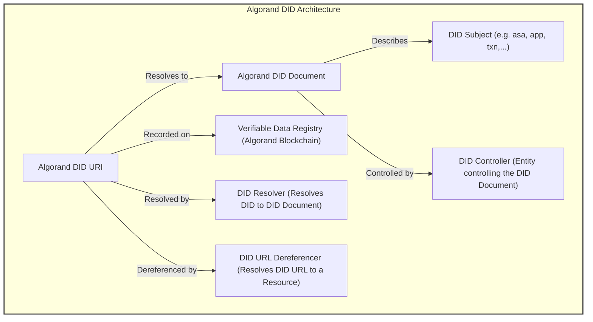

## Abstract

This ARC presents an implementation specification for <a href="https://www.w3.org/TR/did-core/">Decentralized Identifiers (DIDs) v1.0</a>, <a href="https://www.w3.org/TR/did-spec-registries/">DID Specification Registries</a> and <a href="https://w3c-ccg.github.io/did-resolution/">Decentralized Identifier Resolution (DID Resolution) v0.3</a> W3C standards, addressing requirements and conventions to implement and use Decentralized Identifiers on Algorand blockchain for internal elements, labeling and external resources & elements in need of on-chain identification! 

[ARC-113](./arc-0113.md) extends this ARC to implement W3C Verifiable Credentials!

ASA ARCs can be extended by [ARC-13](./arc-0013.md) and also can be passively subject to it, including:

-  [ARC-3](./arc-0003.md)
-  [ARC-19](./arc-0019.md)

Algorand technology elements specifications and requirements are intended to be specified in this ARC to be identified using DIDs and DID documents.

## Specification
All implementation guidelines, diagrams, examples, and notes in this specification are non-normative. Everything else in this specification is normative. The key words "MUST", "MUST NOT", "REQUIRED", "SHALL", "SHALL NOT", "SHOULD", "SHOULD NOT", "RECOMMENDED", "MAY","MAY NOT", "OPTIONAL," "RECOMMENDED," "REQUIRED" and "SHOULD NOT" in this document are to be interpreted as described in <a href="https://www.rfc-editor.org/rfc/rfc2119">BCP 14 RFC2119</a> and <a href="https://www.rfc-editor.org/rfc/rfc8174">RFC8174</a> when, and only when, they appear in all capitals, as shown here.

This ARC uses the term "account" to indicate a private key based unique externally owned account  as an Algorand blockchain identity, while reserving the term "addr" as a method namespace for smart contract application escrow addresses on Algorand!

The ARC-13 standard aims to seamlessly integrate the W3C Decentralized Identifiers (DIDs) standards with the Algorand blockchain, leveraging its specifications and existing ARCs. 

This integration ensures that DIDs on Algorand maintain global uniqueness, immutability, and the ability to be resolved to DID documents in a verifiable way, which is essential for verifiable digital identity.

ARC-13 complies to [ARC-4](./arc-0004.md) and [ARC-22](./arc-0022.md) for readonly DID interfaces.

Conventions to conduct DID naming , namespace, ABNF grammar and DID registry/resolver specifications using Algorand decentralized ledger and storage space as well as construction and resolution methods in accordance to Algorand literature, syntax and vocabulary are included in ARC-13's scope!

ARC-13 proposes two category of identifiers:

- Elemental :Algorand element identifiers like transaction IDs, ASA IDs, APP IDs and account addresses and public keys! Elemental DIDs do not need any registry and decentralized ledger and DID document information is realized from on-chain data.
- Composed : uses UUIDs to register a unique identifier for an Algorand DID used for an external entity! Composed DIDs MUST have registry, lifecycle management and universal resolver implementations or their own!

ARC-13 implements supports both on-chain (**MUST** use box storage) and off-chain (**MUST** use CID Version 1) based decentralized storage systems like IPFS, CrustNetwork, etc.

ARC-13 implementation **MUST**  used box storage to store either byte value of the DID document JSON, or CID Version 1 of DID document JSON as value, with DID identifier as key! Either is accepted under ARC13 but it is **RECOMMENDED** that DID documents under 4 Kb store as bytes onchain and for those above 4 Kb , a CID V1 compliant storage be used.

### General Format

- Algorand DID elements specified by this ARC follow the URI format in general as outlined in <a href="https://www.rfc-editor.org/rfc/rfc3986">RFC 3986</a>. The Public key part is implemented as "publicKeyMultibase" using <a href="https://w3c-ccg.github.io/multibase/">W3C Multibase format</a> and account address! Given the extent of responsibility DID resolvers have in DID lifecycle , and given the fact that Algorand address is a deterministic representation of Public key, therefore using Multibase format with base32 notation "B" character followed by uppercase address SHOULD BE allowed by DID standard to be used with "Ed25519VerificationKey2020" and even also "publicKeyJwk"!

- Elements of the query component may contain characters outside the valid range. These must first be encoded according to UTF-8, and then each octet of the corresponding UTF-8 sequence must be percent-encoded as described in [RFC 3986].
- Under DID services, Algorand API endpoints can be can OPTIONALLY use universal naming (Algod, Idx, Kmd) for ease of use and readability:

  ```
  did:algo:web:testnet:node/v2/blocks/34390581/transactions/6WKM4ALZ7GOPIJNQOVF4C65LKBVP6EWCXZWJ2ETRMI5OLI63YNEQ

  did:algo:web:testnet:idx/v2/transactions/6WKM4ALZ7GOPIJNQOVF4C65LKBVP6EWCXZWJ2ETRMI5OLI63YNEQ

  ```
  The service endpoint for this OPTIONAL setting should be specified like:

    ```
     "serviceEndpoint": "https://testnet:node/"
     "serviceEndpoint": "https://testnet:idx/"
    ```
  when endpoints are used in universal descriptor format, there will be no need to specify the full URL which may be subject to change from user to user!

    // This section is non-normative.

- Linked Data <a href="https://www.w3.org/DesignIssues/LinkedData.html">LINKED-DATA</a> is a way to create a network of standards-based machine interpretable data across different documents and Web sites. It allows an application to start at one piece of Linked Data, and follow embedded links to other pieces of Linked Data that are hosted on different sites across the Web.

- JSON-LD is a lightweight syntax to serialize Linked Data in JSON [RFC8259]. Its design allows existing JSON to be interpreted as Linked Data with minimal changes. JSON-LD is primarily intended to be a way to use Linked Data in Web-based programming environments, to build interoperable Web services, and to store Linked Data in JSON-based storage engines. Since JSON-LD is 100% compatible with JSON, the large number of JSON parsers and libraries available today can be reused. In addition to all the features JSON provides, JSON-LD introduces:
  - a universal identifier mechanism for JSON objects via the use of IRIs,
  - a way to disambiguate keys shared among different JSON documents by mapping them to IRIs via a context,
  - a mechanism in which a value in a JSON object may refer to a resource on a different site on the Web,
  the ability to annotate strings with their language,
  - a way to associate datatypes with values such as dates and times,
  and a facility to express one or more directed graphs, such as a social network, in a single document.

### Main elements

The main elements of the Algorand DID based on the DID data model are:

- DID Scheme: did:algo: The unique scheme for Algorand DIDs.
- Element: An Algorand unique element entity as a subject for DID
- Network Identifier: testnet or mainnet Specifies the Algorand network (testnet or mainnet).
- Namespace: Identifies the type of Algorand element the DID represents (e.g., asa, txn, app).
- Unique Identifier: A specific identifier unique to the namespace (e.g., ASA ID, transaction hash, application ID).
- Local elements: Algorand Elements with locally Unique Identifiers like assets and applications!
- Global elements: Algorand Elements with global Unique Identifiers like Transactions, UUIDs and accounts.
- Internal elements: Elements with direct verification and proofs on Algorand (TXN, ASA, APP, ACCOUNT and ADDR)
- Service elements: Elements out of Algorand chains (UUID)


DID General Architecture: Curtsey of W3C <a href="https://www.w3.org/TR/did-core/">Decentralized Identifiers (DIDs) v1.0</a>

According to DID general architecture version 1.0, ARC-13 provides standard coverage, specification and also reference implementation for:
- DID URI (Spec, API and from client library)
- DID Document (Spec, API and from client library)
- DID Registry (Spec & ABI)
- DID Resolver (Spec, ABI, API, UI and from client library)


### DID lifecycle

Different DID life stages depicted here. Stage status is stored in value of DID "status" field! The status different values:
- NA: Not Available
- 0: OK
- 1: FLAG:SUSPEND
- 2: FLAG:REVOKED

Note: There is no deletion in real practice for DIDs on blockchain, however deleting from registry and not available box storage record for that DID works like deletion for DID lifecycle on Algorand blockchain but the issuance and lifetime records and transactions and verifications will live forever on chain, and accessible if looked for!
  


#### DID URI ABNF Grammar
The generic DID scheme is a URI scheme conformant with [RFC3986]. The ABNF definition can be found below, which uses the syntax in [RFC5234] and the corresponding definitions for ALPHA and DIGIT. All other rule names not defined in the ABNF below are defined in [RFC3986]. All DIDs MUST conform to the DID Syntax ABNF Rules.

The ABNF (Augmented Backus-Naur Form) grammar for Algorand DIDs is aligned with the general DID ABNF grammar, with specific adaptations for Algorand's unique elements:

```
DID Syntax ABNF:
did                = "did:" method-name ":" method-specific-id
method-name        = 1*methodchar
methodchar         = %x61-7A / DIGIT ; 'a'-'z' and digits
method-specific-id = *( *idchar ":" ) 1*idchar
idchar             = ALPHA / DIGIT / "." / "-" / "_" / pct-encoded
pct-encoded        = "%" HEXDIG HEXDIG

```
--------------

```
The Algorand extended DID Syntax ABNF:
did                = "did:" method-name ":" method-specific-id
method-name        = "algo" ; Algorand method name
algorand-network   = "testnet" / "mainnet" / "devnet" / "betanet" ; Algorand network identifiers
algorand-namespace = "asa" / "txn" / "app" / "uuid" / "nfd" / "addr" ; Algorand namespace identifiers
method-specific-id = algorand-network ":" algorand-namespace ":" algorand-identifier
algorand-identifier = 1*idchar ; Unique identifier **MUST BE** unique in the Algorand ecosystem.

```
If either "addr", "asa", "app" or "txn" namespaces are used it **MUST BE** used with algorand-network since these are network dependant identifiers, hence **MUST** be used with network identifier!


DID URL Syntax ABNF:

A DID URL is a network location identifier useful for a specific resource used by an element which should be one of:
- NFD (NFDomains Algorand name service unique names)
- APP (Application Identifiers)
- UUID (V4)
- ACCOUNT (EOA)
- ADDR (Application escrow address)
- ASA (Asset Identifiers)


NOTE: Semicolon character MUST NOT be used!


The following is the exact ABNF definition using the syntax in [RFC5234] and taken from <a href="https://www.w3.org/TR/did-core/">Decentralized Identifiers (DIDs) v1.0</a>. The path-abempty, query, and fragment components are defined in [RFC3986]:

```
did-url = did path-abempty [ "?" query ] [ "#" fragment ]
```

ARC-13 fragments are used to extend DID URL by parametric or path routes. The following fragments are allowed under ARC-13:
- NFT ARCs and Hierarchies
- APP ARCs
- URI Fragments
- Key fragments:
  - AUTH (Rekeyed)
  - HD Wallets
- VerificationMethods
  - ZK (Zero Knowledge)


#### DID Document specifications

DID Document constituents: Curtsey of W3C <a href="Decentralized Identifiers (DIDs) v1.0">https://www.w3.org/TR/did-core/</a>

##### DID Document properties specifications:
- **id**: A string that conforms to the rules in DID Syntax.
- **alsoKnownAs**: A set of strings that conform to the rules of [RFC3986] for URIs.
- **controller**: A string or a set of strings that conform to the rules in DID Syntax.
- **verificationMethod**: A set of Verification Method maps that conform to the rules in Verification Method properties.
  - **id**: A string that conforms to the rules in 3.2 DID URL Syntax.
  - **controller**: A string that conforms to the rules in DID Syntax.
  - **type**:	A string
  - **publicKeyJwk**: A map representing a JSON Web Key that conforms to [RFC7517]. See definition of publicKeyJwk for - additional constraints.
  - **publicKeyMultibase**: A string that conforms to a [MULTIBASE] encoded public key.
- **service**: A set of Service Endpoint maps that conform to the rules in Service properties.
  - **id**: A string that conforms to the rules of [RFC3986] for URIs.
  - **type**: A string or a set of strings.
  - **serviceEndpoint**: A string that conforms to the rules of [RFC3986] for URIs, a map, or a set composed of a one or more strings that conform to the rules of [RFC3986] for URIs and/or maps.


##### Verification method relationships:
  - **authentication**: A set of either Verification Method maps that conform to the rules in Verification Method       properties or strings that conform to the rules in DID URL Syntax.
  - **assertionMethod**: The assertionMethod verification relationship is used to specify how the DID subject is expected to express claims, such as for the purposes of issuing a Verifiable Credential <a href="https://www.w3.org/TR/vc-data-model-2.0/">VC-DATA-MODEL</a>
  - **keyAgreement**: The keyAgreement verification relationship is used to specify how an entity can generate encryption material in order to transmit confidential information intended for the DID subject, such as for the purposes of establishing a secure communication channel with the recipient.
  - **capabilityInvocation**: The capabilityInvocation verification relationship is used to specify a verification method that might be used by the DID subject to invoke a cryptographic capability, such as the authorization to update the DID Document.
  - **capabilityDelegation**: The capabilityDelegation verification relationship is used to specify a mechanism that might be used by the DID subject to delegate a cryptographic capability to another party, such as delegating the authority to access a specific HTTP API to a subordinate.

ARC-13 subjects are RECOMMENDED to use "alsoKnownAs" in order to gather all representations of an identifier in one DID when applicable! E.g. Having name service DID as well as account DID of a known EOA!

ARC-13 Verification methods in relationships between subjects can be either single purpose so they would be described in full within verification method, or they have multi-purpose (E.g. Authentication and encryption) just referenced by DID:

```
{
  "@context": [
    "https://www.w3.org/ns/did/v1",
    "https://w3id.org/security/suites/ed25519-2020/v1"
  ],
  "id": "did:algo:LP6QRRBRDTDSP4HF7CSPWJV4AG4QWE437OYHGW7K5Y7DETKCSK5H3HCA7Q",
  
  "verificationMethod": [
    // A known DID for auth account of a rekeyed account
    "did:algo:LP6QRRBRDTDSP4HF7CSPWJV4AG4QWE437OYHGW7K5Y7DETKCSK5H3HCA7Q#auth",

    // A stand alone ARC52 DH derived symmetric key
    {
    "id": "did:algo:LP6QRRBRDTDSP4HF7CSPWJV4AG4QWE437OYHGW7K5Y7DETKCSK5H3HCA7Q",
    "type": "Ed25519VerificationKey2020", 
    "controller": "did:algo:LP6QRRBRDTDSP4HF7CSPWJV4AG4QWE437OYHGW7K5Y7DETKCSK5H3HCA7Q",
    "publicKeyMultibase": "BJKFVZMGE2J7FXEVVGHC7ESPBRNVEKGFAJEESPLCYYM5CZBZCHS7QWDZ34Y"
    }
  ],
  
}
```
##### Context model
ARC-13 makes use of 3 predefined contexts for DIDs:
- DID document context: "https://www.w3.org/ns/did/v1"
- DID Ed25519 security suite context: "https://w3id.org/security/suites/ed25519-2020/v1"
- DID security context: "https://w3id.org/security/v1"

##### Multisig DID modeling
Since DIDs support multi controller models in both independent and control group formations, multisigs SHOULD be modeled as control groups , controlling a single DID (multisig account):


##### Rekeyed account DID modeling
Rekeyed accounts MUST contain both the rekeyed and auth account verifiers in DID document used with "#auth" and "rekeyed" fragments in id property field of Verification Method:

```

{
        "id": "did:algo:LP6QRRBRDTDSP4HF7CSPWJV4AG4QWE437OYHGW7K5Y7DETKCSK5H3HCA7Q",
        "@context": [
            "https://www.w3.org/ns/did/v1",
            "https://w3id.org/security/suites/ed25519-2020/v1",
            "https://w3id.org/security/v1"
        ],
        "verificationMethod": [
            {
                "controller": "did:algo:LP6QRRBRDTDSP4HF7CSPWJV4AG4QWE437OYHGW7K5Y7DETKCSK5H3HCA7Q",
                "id": "did:algo:LP6QRRBRDTDSP4HF7CSPWJV4AG4QWE437OYHGW7K5Y7DETKCSK5H3HCA7Q#rekeyed",
                "publicKeyMultibase": "BLP6QRRBRDTDSP4HF7CSPWJV4AG4QWE437OYHGW7K5Y7DETKCSK5H3HCA7Q",
                "type": "Ed25519VerificationKey2020"
            },
            {
                "controller": "did:algo:JKFVZMGE2J7FXEVVGHC7ESPBRNVEKGFAJEESPLCYYM5CZBZCHS7QWDZ34Y",
                "id": "did:algo:LP6QRRBRDTDSP4HF7CSPWJV4AG4QWE437OYHGW7K5Y7DETKCSK5H3HCA7Q#auth",
                "publicKeyMultibase": "BJKFVZMGE2J7FXEVVGHC7ESPBRNVEKGFAJEESPLCYYM5CZBZCHS7QWDZ34Y",
                "type": "Ed25519VerificationKey2020"
            }

        ],
        "authentication": [
            "did:algo:LP6QRRBRDTDSP4HF7CSPWJV4AG4QWE437OYHGW7K5Y7DETKCSK5H3HCA7Q#auth"
        ],

    }

```

#### DID Resolver
Algorand universal DID resolver MUST strictly follow W3C <a href="DID resolution">https://w3c-ccg.github.io/did-resolution/</a>! 

The ARC-13 DID resolution implementations through ABI, API, Client library and Web UI SHOULD be accessible publicly!

#### DID Registry
ARC-13 DID registry implementation MUST strictly follow and show full compliance to <a href="https://w3c-ccg.github.io/did-resolution/">DID Specification Registries</a>!

The ARC-13 Algorand DID registry:
- For local elements:
  - An active registry method, API, UI and client to construct DIDs based on Algorand node and indexer data which guarantees 1:1 existing DID subject per Algorand onchain entity!
- An active registry service to register and manage Algorand sub-namespace elements DID lifecycle through ABI in a decentralized way!


#### DID Document
Important considerations regarding transaction DIDs with offline and online self verification methods:

1. **Verification Methods for Transaction DIDs**:
   - A DID document can include public key verification methods that are specifically used to verify the authenticity and integrity of the transaction associated with the DID.
   - The controller of these verification methods can be the entity that initiated the transaction, such as the transaction sender.

2. **Scope of Verification Methods**:
   - The DID document can be tailored to include only those verification methods that are relevant to the transaction. This means it can carry verification methods solely for the purpose of verifying the transaction DID itself.
   - The controllers of these verification methods would typically be entities involved in the transaction, ensuring that the verification process is directly linked to the transaction's participants.

3. **Compliance with DID Standard**:
   - This approach is compliant with the DID standard, which is flexible and allows for various implementations and use cases. The standard does not restrict the types of verification methods that can be included in a DID document, as long as they adhere to the overall structure and principles of DIDs.

4. **Use Case Specificity**:
   - This kind of implementation is particularly useful in blockchain-based environments where transactions are key elements of the system. The DID document effectively becomes a tool for transaction verification.

### Algorand DID Registry
According to standard DID architecture from W3C, The DID registry is a must have entity that can eb either centralized (e.g. using centralized APIs and Databases) or decentralized (e.g. using smart contracts and decentralized storage) !
ARC-13 working group also provides an Algorand decentralized DID registry and resolution infrastructure, which already provides did registration and resolution for all Algorand elements on both TESTNET and MAINNET!



### Terminology
 This ARC complys to and inherits W3C DID terminology and definitions, as specified in the <a href="https://www.w3.org/TR/did-core/">Decentralized Identifiers (DIDs) v1.0</a> specification.


## Rationale

ARC-13 is proposed to bring the benefits of decentralized identity to the Algorand ecosystem in a universally accessible, public and decentralized way. By adopting the W3C DID standard, Algorand users can leverage a globally recognized framework for digital identity, enhancing interoperability, security, and trust in digital interactions. This standard also paves the way for advanced use cases in decentralized finance, supply chain, and <a href="https://www.w3.org/TR/did-use-cases/#didEnterpriseChallenges">Enterprise sector to be general</a>.

The rationale on namespaces includes :
- Re-usability of currently locally (ASA, APP) or globally (ADDRESS, TXNID) identified elements by turning both classes directly into semantically identical DIDs which is human readable without further interpretations! 
For example resolve chain IDs to chain names has been omitted by not using chain Ids in namespaces , since Algorand does not Fork and Algorand chains are on 100% good terms in case of standardization, therefore there is no need for lower level roots (e.g. UUID) for Algorand elements e.g. accounts!


UUID Rationale: having UUID as first class citizen here to be used above or below any Algorand identifier give the ability of infinite possible scenarios to use and link offchain/onchain assets as composed entities !

As composability is one of Algorand technology mottos , this ARC by using UUIDs , aligns by-design with upstream and stays future-proof on usability and extendability!

NFD Rationale: nfd is a well-known namespace in Algorand and ans is the standard namespace naming for Algorand Naming Service!

Note: Algorand account addresses have no namespace and are considered root namespace under :algo!

## Reference Implementation
All specified living standards that ARC-13 comply to are expected to be concisely implemented and complete compliance and consideration of all <a href="https://w3c.github.io/did-imp-guide/">W3C DID implementation guidelines</a>!

### Algorand DID Resolver UI
A fully working Resolver UI has been implemented by ARC-13 and is available for MAINNET and TESTNET (Algorand Universal DID Resolver UI) under standard path (did-resolver)

Algorand DID Resolver TESTNET UI: <a href="https://testnet.goplausible.xyz/did-resolver/">Algorand TESTNET DID Resolver</a>>

Algorand DID Resolver MAINNET UI: <a href="https://goplausible.xyz/did-resolver/">Algorand DID Resolver</a> (Coming soon)

Note: An example DID has been included as default in examples above! Feel free to change it with your desired Algorand DID!

### Universal DID Resolver with Algorand resolver

Universal DID Resolver API: <a href="https://goplausible.xyz/api/1.0/identifiers/">goplausible.xyz/api/1.0/identifiers/...</a>

Universal DID Resolver: <a href="https://ThisDID.com">ThisDID</a>

These universal Resolver API and UI have been implemented, under standard endpoints, and both support Algorand MAINNET and TESTNET DIDs.

- <a href="https://test.goplausible.xyz/api/1.0/identifiers/did:algo:testnet:asa:541958085">ASA DID Resolver</a>
- <a href="https://test.goplausible.xyz/api/1.0/identifiers/did:algo:testnet:app:541957142">APP DID Resolver</a>
- <a href="https://test.goplausible.xyz/api/1.0/identifiers/did:algo:testnet:txn:224FVUWR46D6ZCYO5RS6RPJYCKEPNRWLVSNV2F7HXHHEPDAMGIIQ">TXN DID Resolver</a>
- <a href="https://test.goplausible.xyz/api/1.0/identifiers/did:algo:LP6QRRBRDTDSP4HF7CSPWJV4AG4QWE437OYHGW7K5Y7DETKCSK5H3HCA7Q">ACCOUNT DID Resolver</a>
- <a href="https://test.goplausible.xyz/api/1.0/identifiers/did:algo:testnet:addr:JXOHOM3HQZ6IQ3BY7PGXCKXZTA3RXTTK6SOE7DA4N42T2XYNJGPZNMJLOA">APPLICATION ACCOUNT DID Resolver</a>
  
Algorand DID Constructor API: 
A fully working DID constructor API has been implemented and is available for MAINNET and TESTNET under standard endpoint (api/did/). Examples:

- <a href="https://test.goplausible.xyz/api/did/541958085">APP DID</a>
- <a href="https://test.goplausible.xyz/api/did/541957142">ASSET DID</a>
- <a href="https://test.goplausible.xyz/api/did/JXOHOM3HQZ6IQ3BY7PGXCKXZTA3RXTTK6SOE7DA4N42T2XYNJGPZNMJLOA">Transaction DID</a>
- <a href="https://test.goplausible.xyz/api/did/LP6QRRBRDTDSP4HF7CSPWJV4AG4QWE437OYHGW7K5Y7DETKCSK5H3HCA7Q">Account DID</a>

### Algorand DID Resolver Client library
A fully featured client reference implementation and library is available on Github under MIT license and an NPM package to be used publicly!

The codebase instantiates an Algorand DID Resolver standard instance with DID and NETWORK arguments! 

Then resolver instance has two methods: 

- resolve(did: did) : This retrieves the DID document for given
- did_uri(id: string): This method creates a DID URI from Algorand element ID (TXN, ASA, APP)

Algorand DID Resolver Client: <a href="https://npm.org/algo-did-resolver">algo-did-resolver NPM Package</a>

### Algorand DID Registry and Resolver ABI
A fully working Resolver ABI has been implemented by ARC-13 and is available for  MAINNET and TESTNET through GoPlausible main contracts to serve as Algorand Universal DID Registry:

DID registry MAINNET contract: <a href="https://algoexplorer.io/application/946441472">946441472</a> (Coming soon)

DID registry TESTNET contract: <a href="https://testnet.algoexplorer.io/application/119642157">119642157</a>

Through these two ABI methods:

```

        {
            "name": "register_algo_did",
            "args": [
                {
                    "type": "pay",
                    "name": "pay_box_mbr_fees"
                },
                {
                    "type": "bytes[]",
                    "name": "Algorand DID URI"
                },
                {
                    "type": "bytes[]",
                    "name": "Algorand DID doc",
                    "desc": "DID docs up to 4kb will be stored as box value and above 4kb would be uploaded to IPFS and CID will be sent as doc with 'ipfs/CID' format"
                }
                
            ],
            "returns": {
                "type": "string"
            },
            "desc": "Called using registrar account on request + payment reception from an Algorand account to register a new DID! This creates a box with DID URI as key and DID document (JSON_LD) or IPFS CID bytes as value!"
     
        },
        {
            "name": "get_algo_did_status",
            "args": [
                 {
                    "type": "bytes[]",
                    "name": "Algorand DID URI"
                }
            ],
            "returns": {
                "type": "string"
            },
            "desc": "Called publicly to get the DID status in registry"
        },
        {
            "name": "set_algo_did_status",
            "args": [
                {
                    "type": "pay",
                    "name": "pay_box_mbr_fees"
                },
                {
                    "type": "bytes[]",
                    "name": "Algorand DID URI"
                },
                {
                    "type": "uint64",
                    "name": "Algorand DID status",
                    "desc": "Algorand DID status ['0:OK','1:FLAG:SUSPEND', '2: FLAG:REVOKE']"
                }
            ],
            "returns": {
                "type": "string",
                 "desc": "Updated DID URI"
            },
            "desc": "Called using registrar account or DID controller to set DID status! Default registered DID status is 0"
        },
        {
            "name": "resolve_algo_did",
            "args": [
               {
                    "type": "bytes[]",
                    "name": "Algorand DID URI"
                }
            ],
            "returns": {
                "type": "string",
                  "desc": "Algorand DID document for given DID URI"
            },
            "desc": "Called publicly to get DID document given a DID URI!"
        }
        
```

### Appendix A: DID examples for all namespaces

Examples of DIDs for each Algorand element type for both testnet and mainnet instance 
- No namespace:
```
did:algo:LP6QRRBRDTDSP4HF7CSPWJV4AG4QWE437OYHGW7K5Y7DETKCSK5H3HCA7Q

did:algo:LP6QRRBRDTDSP4HF7CSPWJV4AG4QWE437OYHGW7K5Y7DETKCSK5H3HCA7Q
```
- ASA: 
```
did:algo:testnet:asa:12400859

did:algo:mainnet:asa:31566704
```
- TXN:
```
did:algo:testnet:txn:L3OEIRCTGDXALCIDLOLGXOM3OECHVNPI2GXN6PTNOEJJQIJ4FIWA

did:algo:mainnet:txn:67HI3JHICQQB7KCWKCDYNANN57KL5LAUVQ3BJJFGRYEMAIEYBBVQ
```
- APP:
```
did:algo:testnet:app:110096026

did:algo:mainnet:app:350338509
```

- UUID:
```
did:algo:testnet:uuid:c6bc3d9f-3e2c-4170-99e7-b9809f229ecb

did:algo:mainnet:uuid:6ba7b814-9dad-11d1-80b4-00c04fd430c8
```
- NFD:
```
did:algo:nfd:emg110.algo

```
### Appendix B: DID document example (example data)
```json
{
    "@context": [
        "https://w3id.org/did-resolution/v1"],
    "didDocument": {
        "id": "did:algo:mainnet:txn:6WKM4ALZ7GOPIJNQOVF4C65LKBVP6EWCXZWJ2ETRMI5OLI63YNEQ",
        "@context": [
            "https://www.w3.org/ns/did/v1",
            "https://w3id.org/security/suites/ed25519-2020/v1",
            "https://w3id.org/security/v1"
        ],
        "verificationMethod": [
            "did:algo:LP6QRRBRDTDSP4HF7CSPWJV4AG4QWE437OYHGW7K5Y7DETKCSK5H3HCA7Q#auth",
            {
                "controller": "did:algo:mainnet:txn:6WKM4ALZ7GOPIJNQOVF4C65LKBVP6EWCXZWJ2ETRMI5OLI63YNEQ",
                "id": "did:algo:mainnet:txn:6WKM4ALZ7GOPIJNQOVF4C65LKBVP6EWCXZWJ2ETRMI5OLI63YNEQ#stateproof",
            }
        ],
        "service": [
            {
                "id": "did:algo:web:mainnet:node/v2/blocks/34390581/transactions/6WKM4ALZ7GOPIJNQOVF4C65LKBVP6EWCXZWJ2ETRMI5OLI63YNEQ",
                "type": "did.algo.web.ExternalService",
                "serviceEndpoint": "https://mainnet:node/",
                "extensions": [
                    {
                        "id": "algorand-state-proof",
                        "version": "1.0.0",
                        "data": [
                            {
                               
                                "network": "mainnet",
                                "hashtype": "sha512_256",
                                "idx": 12,
                                "proof": "SGjVwQA4GGhBSfJ1uXJXWk0lNyyk6/Nq3tJI4fHAIWzGarYxDRBllj+gjjTKsPeFuMzuOkVqw58LDrmqucrYU+pbp9laI9DUE1UG7KcUj+QxXqmW/qsaQ+j74hVKMaHSWLxqjcMKUiSORivvBTp8XxFGWgUotwHtgBCQzkJ3MXHF41RA3zvDuluLMtS1diU6FLycYti0QRH9oBS57vcHn82PzPgD+k9rlPoJZY06lRxmz0Zlc1TKNThvqr+1Mu+C",
                                "stibhash": "ruGptxPK5UiqPM9MuOFk2t7MfOfXsvfGlDnatxDCHb0=",
                                "treedepth": 6,
                                "confirmed-round": 34390581,
                            },{
                               
                              }
                        ]
                    }
                ]
            },
            {
                "id": "did:algo:web:mainnet:idx/v2/transactions/6WKM4ALZ7GOPIJNQOVF4C65LKBVP6EWCXZWJ2ETRMI5OLI63YNEQ",
                "type": "did.algo.web.ExternalService",
                "serviceEndpoint": "https://mainnet:idx/",
                "extensions": [
                    {
                        "id": "algorand-signature",
                        "version": "1.0.0",
                        "data": [
                            {
                                "sig": "ug24mUImTRg8lzjAB8Y/FPzakKYoMwDUl+nVrQHlsUwnnLHipUdjtGV3NG3oVgxbJAgMGUK0exfUY27cePvMAQ==",
                                "network": "mainnet",
                                "confirmed-round": 34390581,
                            }
                        ]
                    }
                ]
            }
        ]
    },
    "didDocumentMetadata": {
        "created": "2023-03-23T19:15:10Z",
        "deactivated": false,
        "updated": "2023-03-23T20:11:30Z"
    },
    "didResolutionMetadata": {
        "contentType": "application/ld+json",
        "retrieved": "2023-05-15T17:39:30Z"
    }
}
```

## Security Considerations

1. Key Management: Secure management of cryptographic keys used in DID creation and verification is crucial but is out of this ARC scope and goes under Wallet providers concerns!
2. DID Document Integrity: Ensuring the integrity of DID documents stored on or referenced by the Algorand blockchain.
3. Privacy: Considerations around the privacy of DID subjects, especially in relation to transaction histories and public keys.

Note: The UUID namespace MUST be isolated by network for security reasons!

## Copyright

This document and its content are released under the Creative Commons Zero (CC0) license, allowing for maximum flexibility and adoption within the Algorand community and beyond.

Copyright and related rights waived via <a href="https://creativecommons.org/publicdomain/zero/1.0/">CCO</a>.
