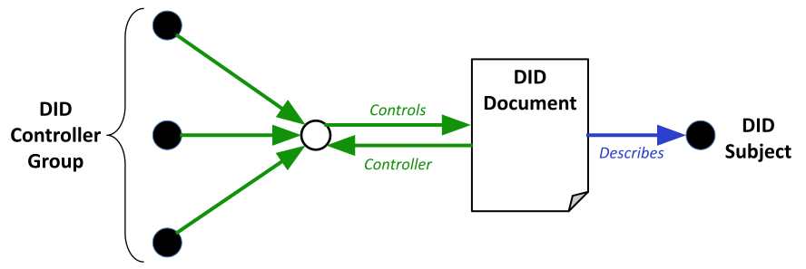

## Abstract

This ARC specifies the implementation of [Decentralized Identifiers (DIDs) v1.0](https://www.w3.org/TR/did-core/), [DID Specification Registries](https://www.w3.org/TR/did-spec-registries/), and [Decentralized Identifier Resolution (DID Resolution) v0.3](https://w3c-ccg.github.io/did-resolution/) W3C standards on the Algorand blockchain. It addresses the requirements and conventions to implement and use DIDs for internal elements, labeling, and external resources requiring on-chain identification.

[ARC-113](./arc-0113.md) extends this ARC to implement W3C Verifiable Credentials.

ASA ARCs that can be extended by [ARC-13](./arc-0013.md) and can also be passively subject to it include:

- [ARC-3](./arc-0003.md)
- [ARC-19](./arc-0019.md)

This ARC specifies the use of DIDs and DID documents for identifying Algorand technology elements.

## Specification

All implementation guidelines, diagrams, examples, and notes in this specification are non-normative. All other parts are normative. The key words "MUST", "MUST NOT", "REQUIRED", "SHALL", "SHALL NOT", "SHOULD", "SHOULD NOT", "RECOMMENDED", "MAY", "MAY NOT", "OPTIONAL" in this document are to be interpreted as described in [BCP 14 RFC2119](https://www.rfc-editor.org/rfc/rfc2119) and [RFC8174](https://www.rfc-editor.org/rfc/rfc8174) when they appear in all capitals.

This ARC uses the term "account" to indicate a private key-based unique externally owned account as an Algorand blockchain identity, while reserving the term "addr" as a method namespace for smart contract application escrow addresses on Algorand.

ARC-13 aims to seamlessly integrate the W3C Decentralized Identifiers (DIDs) standards with the Algorand blockchain, leveraging its specifications and existing ARCs. This integration ensures that DIDs on Algorand maintain global uniqueness, immutability, and the ability to be resolved to DID documents in a verifiable way, which is essential for digital identity.

ARC-13 complies with [ARC-4](./arc-0004.md) for DID ABI methods and [ARC-22](./arc-0022.md) for read-only DID interfaces.

Conventions for DID naming, namespace, ABNF grammar, and DID registry/resolver specifications using Algorand's decentralized ledger and storage are included in ARC-13's scope.

ARC-13 proposes two categories of identifiers:

- **Elemental**: Algorand element identifiers like transaction IDs, ASA IDs, APP IDs, and account addresses. Elemental DIDs do not need any registry; the decentralized ledger and DID document information are derived from on-chain data.
- **Composed**: Uses UUIDs to register a unique identifier for an Algorand DID used for an external entity. Composed DIDs **MUST** have registry, lifecycle management, and universal resolver implementations or their own.

ARC-13 supports both on-chain (**MUST** use box storage) and off-chain (**MUST** use CID Version 1) decentralized storage systems like IPFS, CrustNetwork, etc.

ARC-13 implementations **MUST** use box storage to store either the byte value of the DID document JSON or the CID Version 1 of the DID document JSON as value, with the DID identifier as key. Either is accepted under ARC-13, but it is **RECOMMENDED** that DID documents under 4 KB be stored as bytes on-chain, and for those above 4 KB, a CID V1 compliant storage be used.

### General Format

- Algorand DIDs follow the URI format as outlined in [RFC 3986](https://www.rfc-editor.org/rfc/rfc3986). The public key is implemented as "publicKeyMultibase" using [W3C Multibase format](https://w3c-ccg.github.io/multibase/) and the account address. Given that the Algorand address is a deterministic representation of the public key, using Multibase format with base32 notation ("B" character followed by the uppercase address) SHOULD be allowed by the DID standard for use with "Ed25519VerificationKey2020" and "publicKeyJwk".

- Elements of the query component may contain characters outside the valid range. These must first be encoded according to UTF-8, and then each octet of the corresponding UTF-8 sequence must be percent-encoded as described in [RFC 3986](https://www.rfc-editor.org/rfc/rfc3986).

- Under DID services, Algorand API endpoints can OPTIONALLY use universal naming (Algod, Idx, Kmd) for ease of use and readability:

  ```
  did:algo:web:testnet:node/v2/blocks/34390581/transactions/6WKM4ALZ7GOPIJNQOVF4C65LKBVP6EWCXZWJ2ETRMI5OLI63YNEQ

  did:algo:web:testnet:idx/v2/transactions/6WKM4ALZ7GOPIJNQOVF4C65LKBVP6EWCXZWJ2ETRMI5OLI63YNEQ
  ```

  The service endpoint for this OPTIONAL setting should be specified like:

  ```
  "serviceEndpoint": "https://testnet:node/"
  "serviceEndpoint": "https://testnet:idx/"
  ```

  When endpoints are used in universal descriptor format, there will be no need to specify the full URL, which may be subject to change from user to user.

- **Linked Data** is a way to create a network of standards-based machine-interpretable data across different documents and websites. It allows an application to start at one piece of Linked Data and follow embedded links to other pieces of Linked Data hosted on different sites across the Web.

- **JSON-LD** is a lightweight syntax to serialize Linked Data in JSON [RFC8259](https://www.rfc-editor.org/rfc/rfc8259). Its design allows existing JSON to be interpreted as Linked Data with minimal changes. JSON-LD introduces:

  - A universal identifier mechanism for JSON objects via the use of IRIs.
  - A way to disambiguate keys shared among different JSON documents by mapping them to IRIs via a context.
  - A mechanism in which a value in a JSON object may refer to a resource on a different site on the Web.
  - The ability to annotate strings with their language.
  - A way to associate datatypes with values such as dates and times.
  - A facility to express one or more directed graphs, such as a social network, in a single document.

### Main Elements

The main elements of the Algorand DID based on the DID data model are:

- **DID Scheme**: `did:algo:` The unique scheme for Algorand DIDs.
- **Element**: An Algorand unique element entity as a subject for DID.
- **Network Identifier**: `testnet` or `mainnet`. Specifies the Algorand network.
- **Namespace**: Identifies the type of Algorand element the DID represents (e.g., `asa`, `txn`, `app`).
- **Unique Identifier**: A specific identifier unique to the namespace (e.g., ASA ID, transaction hash, application ID).
- **Local Elements**: Algorand elements with locally unique identifiers like assets and applications.
- **Global Elements**: Algorand elements with globally unique identifiers like transactions, UUIDs, and accounts.
- **Internal Elements**: Elements with direct verification and proofs on Algorand (`txn`, `asa`, `app`, `account`, and `addr`).
- **Service Elements**: Elements outside of Algorand chains (e.g., UUID).


**DID General Architecture**: Courtesy of W3C [Decentralized Identifiers (DIDs) v1.0](https://www.w3.org/TR/did-core/)

According to DID general architecture version 1.0, ARC-13 provides standard coverage, specification, and reference implementation for:

- **DID URI** (Spec, API, and client library)
- **DID Document** (Spec, API, and client library)
- **DID Registry** (Spec & ABI)
- **DID Resolver** (Spec, ABI, API, UI, and client library)

### DID Lifecycle

Different DID life stages are depicted here. The stage status is stored in the "status" field of the DID. The status values:

- **NA**: Not Available
- **0**: OK
- **1**: FLAG:SUSPEND
- **2**: FLAG:REVOKED

Note: There is no deletion in practice for DIDs on blockchain. Deleting from the registry and removing the box storage record for that DID acts like deletion in the DID lifecycle on the Algorand blockchain, but the issuance and lifetime records and transactions and verifications will remain forever on-chain and accessible if looked for.


#### DID URI ABNF Grammar

The generic DID scheme is a URI scheme conformant with [RFC3986](https://www.rfc-editor.org/rfc/rfc3986). The ABNF definition uses the syntax in [RFC5234](https://www.rfc-editor.org/rfc/rfc5234). All DIDs **MUST** conform to the DID Syntax ABNF Rules.

```
DID Syntax ABNF:
did                = "did:" method-name ":" method-specific-id
method-name        = 1*methodchar
methodchar         = %x61-7A / DIGIT ; 'a'-'z' and digits
method-specific-id = *( *idchar ":" ) 1*idchar
idchar             = ALPHA / DIGIT / "." / "-" / "_" / pct-encoded
pct-encoded        = "%" HEXDIG HEXDIG
```

---

```
Algorand Extended DID Syntax ABNF:
did                = "did:" method-name ":" method-specific-id
method-name        = "algo" ; Algorand method name
algorand-network   = "testnet" / "mainnet" / "devnet" / "betanet" ; Algorand network identifiers
algorand-namespace = "asa" / "txn" / "app" / "uuid" / "nfd" / "addr" ; Algorand namespace identifiers
method-specific-id = algorand-network ":" algorand-namespace ":" algorand-identifier
algorand-identifier = 1*idchar ; Unique identifier in the Algorand.
```

If "addr", "asa", "app", or "txn" namespaces are used, they **MUST** be used with `algorand-network` since these are network-dependent identifiers.

**DID URL Syntax ABNF:**

A DID URL is a network location identifier useful for a specific resource used by an element, which should be one of:

- **NFD** (NFDomains Algorand name service unique names)
- **APP** (Application Identifiers)
- **UUID** (V4)
- **ACCOUNT** (EOA)
- **ADDR** (Application escrow address)
- **ASA** (Asset Identifiers)

**NOTE**: Semicolon character **MUST NOT**  be used.

The following is the exact ABNF definition using the syntax in [RFC5234] and taken from [Decentralized Identifiers (DIDs) v1.0](https://www.w3.org/TR/did-core/). The `path-abempty`, `query`, and `fragment` components are defined in [RFC3986]:

```
did-url = did path-abempty [ "?" query ] [ "#" fragment ]
```

ARC-13 fragments are used to extend DID URL by parametric or path routes. The following fragments are allowed under ARC-13:

- **NFT ARCs and Hierarchies**
- **APP ARCs**
- **URI Fragments**
- **Key Fragments**:
  - **AUTH** (Rekeyed)
  - **HD Wallets**
- **VerificationMethods**
  - **ZK** (Zero Knowledge)

#### DID Document Specifications


**DID Document Constituents**: Courtesy of W3C [Decentralized Identifiers (DIDs) v1.0](https://www.w3.org/TR/did-core/)

##### DID Document Properties Specifications:

- **id**: A string that conforms to the rules in DID Syntax.
- **alsoKnownAs**: A set of strings that conform to the rules of [RFC3986](https://www.rfc-editor.org/rfc/rfc3986) for URIs.
- **controller**: A string or a set of strings that conform to the rules in DID Syntax.
- **verificationMethod**: A set of Verification Method maps that conform to the rules in Verification Method properties.
  - **id**: A string that conforms to the rules in 3.2 DID URL Syntax.
  - **controller**: A string that conforms to the rules in DID Syntax.
  - **type**: A string.
  - **publicKeyJwk**: A map representing a JSON Web Key that conforms to [RFC7517](https://www.rfc-editor.org/rfc/rfc7517).
  - **publicKeyMultibase**: A string that conforms to a [MULTIBASE](https://datatracker.ietf.org/doc/html/draft-multiformats-multibase) encoded public key.
- **service**: A set of Service Endpoint maps that conform to the rules in Service properties.
  - **id**: A string that conforms to the rules of [RFC3986](https://www.rfc-editor.org/rfc/rfc3986) for URIs.
  - **type**: A string or a set of strings.
  - **serviceEndpoint**: A string that conforms to the rules of [RFC3986](https://www.rfc-editor.org/rfc/rfc3986) for URIs, a map, or a set composed of one or more strings that conform to the rules of [RFC3986](https://www.rfc-editor.org/rfc/rfc3986) for URIs and/or maps.

##### Verification Method Relationships:

- **authentication**: A set of either Verification Method maps or strings that conform to the rules in DID URL Syntax.
- **assertionMethod**: Specifies how the DID subject is expected to express claims, such as for issuing a Verifiable Credential ([VC-DATA-MODEL](https://www.w3.org/TR/vc-data-model-2.0/)).
- **keyAgreement**: Specifies how an entity can generate encryption material to transmit confidential information intended for the DID subject.
- **capabilityInvocation**: Specifies a verification method that might be used by the DID subject to invoke a cryptographic capability.
- **capabilityDelegation**: Specifies a mechanism that might be used by the DID subject to delegate a cryptographic capability to another party.

ARC-13 subjects are **RECOMMENDED** to use `alsoKnownAs` to gather all representations of an identifier in one DID when applicable (e.g., having name service DID as well as WEB DID of a known account).

ARC-13 Verification methods in relationships between subjects can be either single-purpose (described in full within verification method) or multi-purpose (e.g., authentication and encryption), just referenced by DID:

```json
{
  "@context": [
    "https://www.w3.org/ns/did/v1",
    "https://w3id.org/security/suites/ed25519-2020/v1"
  ],
  "id": "did:algo:LP6QRRBRDTDSP4HF7CSPWJV4AG4QWE437OYHGW7K5Y7DETKCSK5H3HCA7Q",
  "verificationMethod": [
    "did:exaalgomple:LP6QRRBRDTDSP4HF7CSPWJV4AG4QWE437OYHGW7K5Y7DETKCSK5H3HCA7Q#auth",
    {
      "id": "did:algo:LP6QRRBRDTDSP4HF7CSPWJV4AG4QWE437OYHGW7K5Y7DETKCSK5H3HCA7Q#arc52",
      "type": "RsaVerificationKey2018",
      "controller": "did:algo:LP6QRRBRDTDSP4HF7CSPWJV4AG4QWE437OYHGW7K5Y7DETKCSK5H3HCA7Q",
      "publicKeyMultibase": "zH3C2AVvLMv6gmMNam3uVAjZpfkcJCwDwnZn6z3wXmqPV"
    }
  ]
}
```

##### Context Model

ARC-13 uses three predefined contexts for DIDs:

- **DID Document Context**: `"https://www.w3.org/ns/did/v1"`
- **DID Ed25519 Security Suite Context**: `"https://w3id.org/security/suites/ed25519-2020/v1"`
- **DID Security Context**: `"https://w3id.org/security/v1"`

##### Multisig DID Modeling

Since DIDs support multi-controller models, multisigs SHOULD be modeled as control groups controlling a single DID (multisig account):



##### Rekeyed Account DID Modeling

Rekeyed accounts **MUST** contain both the rekeyed and auth account verifiers in the DID document, using `#auth` and `#rekeyed` fragments in the `id` property field of the Verification Method:

```json
{
  "id": "did:algo:LP6QRRBRDTDSP4HF7CSPWJV4AG4QWE437OYHGW7K5Y7DETKCSK5H3HCA7Q",
  "@context": [
    "https://www.w3.org/ns/did/v1",
    "https://w3id.org/security/suites/ed25519-2020/v1",
    "https://w3id.org/security/v1"
  ],
  "verificationMethod": [
    {
      "controller": "did:algo:LP6QRRBRDTDSP4HF7CSPWJV4AG4QWE437OYHGW7K5Y7DETKCSK5H3HCA7Q",
      "id": "did:algo:LP6QRRBRDTDSP4HF7CSPWJV4AG4QWE437OYHGW7K5Y7DETKCSK5H3HCA7Q#rekeyed",
      "publicKeyMultibase": "BLP6QRRBRDTDSP4HF7CSPWJV4AG4QWE437OYHGW7K5Y7DETKCSK5H3HCA7Q",
      "type": "Ed25519VerificationKey2020"
    },
    {
      "controller": "did:algo:JKFVZMGE2J7FXEVVGHC7ESPBRNVEKGFAJEESPLCYYM5CZBZCHS7QWDZ34Y",
      "id": "did:algo:LP6QRRBRDTDSP4HF7CSPWJV4AG4QWE437OYHGW7K5Y7DETKCSK5H3HCA7Q#auth",
      "publicKeyMultibase": "BJKFVZMGE2J7FXEVVGHC7ESPBRNVEKGFAJEESPLCYYM5CZBZCHS7QWDZ34Y",
      "type": "Ed25519VerificationKey2020"
    }
  ],
  "authentication": [
    "did:algo:LP6QRRBRDTDSP4HF7CSPWJV4AG4QWE437OYHGW7K5Y7DETKCSK5H3HCA7Q#auth"
  ]
}
```

#### DID Resolver

Algorand universal DID resolver **MUST** strictly follow W3C [DID Resolution](https://w3c-ccg.github.io/did-resolution/).

The ARC-13 DID resolution implementations through ABI, API, client library, and Web UI **SHOULD** be publicly accessible.

#### DID Registry

ARC-13 DID registry implementation **MUST** strictly follow and show full compliance to [DID Specification Registries](https://w3c-ccg.github.io/did-spec-registries/).

The ARC-13 Algorand DID registry:

- For local elements:
  - An active registry method, API, UI, and client to construct DIDs based on Algorand node and indexer data, guaranteeing a 1:1 existing DID subject per Algorand on-chain entity.
- An active registry service to register and manage Algorand sub-namespace elements DID lifecycle through ABI in a decentralized way.

#### DID Document

Important considerations regarding transaction DIDs with offline and online self-verification methods:

1. **Verification Methods for Transaction DIDs**:

   - A DID document can include public key verification methods specifically used to verify the authenticity and integrity of the transaction associated with the DID.
   - The controller of these verification methods can be the entity that initiated the transaction, such as the transaction sender.

2. **Scope of Verification Methods**:

   - The DID document can be tailored to include only those verification methods relevant to the transaction.
   - The controllers of these verification methods would typically be entities involved in the transaction, linking the verification process directly to the transaction's participants.

3. **Compliance with DID Standard**:

   - This approach is compliant with the DID standard, which allows for various implementations and use cases.

4. **Use Case Specificity**:

   - Particularly useful in blockchain environments where transactions are key elements. The DID document becomes a tool for transaction verification.

### Algorand DID Registry

According to standard DID architecture from W3C, the DID registry is an essential entity that can be either centralized (e.g., using centralized APIs and databases) or decentralized (e.g., using smart contracts and decentralized storage).

The ARC-13 working group provides an Algorand decentralized DID registry and resolution infrastructure, offering DID registration and resolution for all Algorand elements on both TESTNET and MAINNET.


### Terminology

This ARC complies with and inherits W3C DID terminology and definitions, as specified in the [Decentralized Identifiers (DIDs) v1.0](https://www.w3.org/TR/did-core/) specification.

## Rationale

ARC-13 brings the benefits of decentralized identity to the Algorand ecosystem in a universally accessible, public, and decentralized manner. By adopting the W3C DID standard, Algorand users can leverage a globally recognized framework for digital identity, enhancing interoperability, security, and trust in digital interactions. This standard also paves the way for advanced use cases in decentralized finance, supply chain, and enterprise sectors.

The rationale for namespaces includes:

- **Reusability**: Turning locally (ASA, APP) or globally (ADDRESS, TXNID) identified elements into semantically identical DIDs, which are human-readable without further interpretation.

For example, resolving chain IDs to chain names has been omitted by not using chain IDs in namespaces, since Algorand does not fork and Algorand chains are standardized. Therefore, there is no need for lower-level roots (e.g., UUID) for Algorand elements like accounts.

**UUID Rationale**: Having UUID as a first-class citizen provides infinite possible scenarios to use and link off-chain/on-chain assets as composed entities. This aligns with Algorand's focus on composability.

**NFD Rationale**: `nfd` is a well-known namespace in Algorand, and `ans` is the standard namespace naming for Algorand Naming Service.

**Note**: Algorand account addresses have no namespace and are considered root namespace under `algo`.

## Reference Implementation

All specified living standards that ARC-13 complies with are expected to be concisely implemented, with complete compliance and consideration of all [W3C DID implementation guidelines](https://w3c.github.io/did-imp-guide/).

### Algorand DID Resolver UI

A fully working Resolver UI has been implemented and is available for MAINNET and TESTNET under the standard path (`did-resolver`):

- **Algorand DID Resolver TESTNET UI**: [Algorand TESTNET DID Resolver](https://testnet.goplausible.xyz/did-resolver/)
- **Algorand DID Resolver MAINNET UI**: [Algorand DID Resolver](https://goplausible.xyz/did-resolver/) (Coming soon)

### Universal DID Resolver with Algorand Resolver

- **Universal DID Resolver API**: [goplausible.xyz/api/1.0/identifiers/](https://goplausible.xyz/api/1.0/identifiers/)
- **Universal DID Resolver**: [ThisDID](https://ThisDID.com)

These universal Resolver API and UI support Algorand MAINNET and TESTNET DIDs.

Examples:

- [ASA DID Resolver](https://test.goplausible.xyz/api/1.0/identifiers/did:algo:testnet:asa:541958085)
- [APP DID Resolver](https://test.goplausible.xyz/api/1.0/identifiers/did:algo:testnet:app:541957142)
- [TXN DID Resolver](https://test.goplausible.xyz/api/1.0/identifiers/did:algo:testnet:txn:224FVUWR46D6ZCYO5RS6RPJYCKEPNRWLVSNV2F7HXHHEPDAMGIIQ)
- [ACCOUNT DID Resolver](https://test.goplausible.xyz/api/1.0/identifiers/did:algo:LP6QRRBRDTDSP4HF7CSPWJV4AG4QWE437OYHGW7K5Y7DETKCSK5H3HCA7Q)
- [APPLICATION ACCOUNT DID Resolver](https://test.goplausible.xyz/api/1.0/identifiers/did:algo:testnet:addr:JXOHOM3HQZ6IQ3BY7PGXCKXZTA3RXTTK6SOE7DA4N42T2XYNJGPZNMJLOA)

**Algorand DID Constructor API**:

A fully working DID constructor API is available under the standard endpoint (`api/did/`). Examples:

- [APP DID](https://test.goplausible.xyz/api/did/541958085)
- [ASSET DID](https://test.goplausible.xyz/api/did/541957142)
- [Transaction DID](https://test.goplausible.xyz/api/did/JXOHOM3HQZ6IQ3BY7PGXCKXZTA3RXTTK6SOE7DA4N42T2XYNJGPZNMJLOA)
- [Account DID](https://test.goplausible.xyz/api/did/LP6QRRBRDTDSP4HF7CSPWJV4AG4QWE437OYHGW7K5Y7DETKCSK5H3HCA7Q)

### Algorand DID Resolver Client Library

A fully featured client reference implementation and library is available on GitHub under MIT license and as an NPM package:

- **Algorand DID Resolver Client**: [algo-did-resolver NPM Package](https://npm.org/algo-did-resolver)

The codebase instantiates an Algorand DID Resolver standard instance with DID and NETWORK arguments. The resolver instance has two methods:

- `resolve(did)`: Retrieves the DID document for a given DID.
- `did_uri(id)`: Creates a DID URI from an Algorand element ID (`txn`, `asa`, `app`).

### Algorand DID Registry and Resolver ABI

A fully working Resolver ABI is available through GoPlausible main contracts:

- **DID Registry MAINNET Contract**: [946441472](https://algoexplorer.io/application/946441472) (Coming soon)
- **DID Registry TESTNET Contract**: [119642157](https://testnet.algoexplorer.io/application/119642157)

Key ABI methods include:

```json
{
  "name": "register_algo_did",
  "args": [
    {
      "type": "pay",
      "name": "pay_box_mbr_fees"
    },
    {
      "type": "bytes[]",
      "name": "Algorand DID URI"
    },
    {
      "type": "bytes[]",
      "name": "Algorand DID doc",
      "desc": "DID docs up to 4KB will be stored as box value; above 4KB will be uploaded to IPFS with 'ipfs/CID' format"
    }
  ],
  "returns": {
    "type": "string"
  },
  "desc": "Registers a new DID by creating a box with DID URI as key and DID document or IPFS CID as value."
},
{
  "name": "get_algo_did_status",
  "args": [
    {
      "type": "bytes[]",
      "name": "Algorand DID URI"
    }
  ],
  "returns": {
    "type": "string"
  },
  "desc": "Retrieves the DID status in the registry."
},
{
  "name": "set_algo_did_status",
  "args": [
    {
      "type": "pay",
      "name": "pay_box_mbr_fees"
    },
    {
      "type": "bytes[]",
      "name": "Algorand DID URI"
    },
    {
      "type": "uint64",
      "name": "Algorand DID status",
      "desc": "Algorand DID status ['0:OK','1:FLAG:SUSPEND', '2:FLAG:REVOKE']"
    }
  ],
  "returns": {
    "type": "string",
    "desc": "Updated DID URI"
  },
  "desc": "Sets the DID status; default registered DID status is 0."
},
{
  "name": "resolve_algo_did",
  "args": [
    {
      "type": "bytes[]",
      "name": "Algorand DID URI"
    }
  ],
  "returns": {
    "type": "string",
    "desc": "Algorand DID document for the given DID URI"
  },
  "desc": "Retrieves the DID document given a DID URI."
}
```

### Appendix A: DID Examples for All Namespaces

Examples of DIDs for each Algorand element type for both testnet and mainnet instances:

- **No Namespace**:

  ```
  did:algo:LP6QRRBRDTDSP4HF7CSPWJV4AG4QWE437OYHGW7K5Y7DETKCSK5H3HCA7Q
  ```

- **ASA**:

  ```
  did:algo:testnet:asa:12400859
  did:algo:mainnet:asa:31566704
  ```

- **TXN**:

  ```
  did:algo:testnet:txn:L3OEIRCTGDXALCIDLOLGXOM3OECHVNPI2GXN6PTNOEJJQIJ4FIWA
  did:algo:mainnet:txn:67HI3JHICQQB7KCWKCDYNANN57KL5LAUVQ3BJJFGRYEMAIEYBBVQ
  ```

- **APP**:

  ```
  did:algo:testnet:app:110096026
  did:algo:mainnet:app:350338509
  ```

- **UUID**:

  ```
  did:algo:testnet:uuid:c6bc3d9f-3e2c-4170-99e7-b9809f229ecb
  did:algo:mainnet:uuid:6ba7b814-9dad-11d1-80b4-00c04fd430c8
  ```

- **NFD**:

  ```
  did:algo:nfd:emg110.algo
  ```

### Appendix B: DID Document Example (Example Data)

```json
{
  "@context": ["https://w3id.org/did-resolution/v1"],
  "didDocument": {
    "id": "did:algo:mainnet:txn:6WKM4ALZ7GOPIJNQOVF4C65LKBVP6EWCXZWJ2ETRMI5OLI63YNEQ",
    "@context": [
      "https://www.w3.org/ns/did/v1",
      "https://w3id.org/security/suites/ed25519-2020/v1",
      "https://w3id.org/security/v1"
    ],
    "verificationMethod": [
      "did:algo:LP6QRRBRDTDSP4HF7CSPWJV4AG4QWE437OYHGW7K5Y7DETKCSK5H3HCA7Q#auth",
      {
        "controller": "did:algo:mainnet:txn:6WKM4ALZ7GOPIJNQOVF4C65LKBVP6EWCXZWJ2ETRMI5OLI63YNEQ",
        "id": "did:algo:mainnet:txn:6WKM4ALZ7GOPIJNQOVF4C65LKBVP6EWCXZWJ2ETRMI5OLI63YNEQ#stateproof"
      }
    ],
    "service": [
      {
        "id": "did:algo:web:mainnet:node/v2/blocks/34390581/transactions/6WKM4ALZ7GOPIJNQOVF4C65LKBVP6EWCXZWJ2ETRMI5OLI63YNEQ",
        "type": "did.algo.web.ExternalService",
        "serviceEndpoint": "https://mainnet:node/",
        "extensions": [
          {
            "id": "algorand-state-proof",
            "version": "1.0.0",
            "data": [
              {
                "network": "mainnet",
                "hashtype": "sha512_256",
                "idx": 12,
                "proof": "SGjVwQA4GGhBSfJ1uXJXWk0lNyyk6/Nq3tJI4fHAIWzGarYxDRBllj+gjjTKsPeFuMzuOkVqw58LDrmqucrYU+pbp9laI9DUE1UG7KcUj+QxXqmW/qsaQ+j74hVKMaHSWLxqjcMKUiSORivvBTp8XxFGWgUotwHtgBCQzkJ3MXHF41RA3zvDuluLMtS1diU6FLycYti0QRH9oBS57vcHn82PzPgD+k9rlPoJZY06lRxmz0Zlc1TKNThvqr+1Mu+C",
                "stibhash": "ruGptxPK5UiqPM9MuOFk2t7MfOfXsvfGlDnatxDCHb0=",
                "treedepth": 6,
                "confirmed-round": 34390581
              }
            ]
          }
        ]
      },
      {
        "id": "did:algo:web:mainnet:idx/v2/transactions/6WKM4ALZ7GOPIJNQOVF4C65LKBVP6EWCXZWJ2ETRMI5OLI63YNEQ",
        "type": "did.algo.web.ExternalService",
        "serviceEndpoint": "https://mainnet:idx/",
        "extensions": [
          {
            "id": "algorand-signature",
            "version": "1.0.0",
            "data": [
              {
                "sig": "ug24mUImTRg8lzjAB8Y/FPzakKYoMwDUl+nVrQHlsUwnnLHipUdjtGV3NG3oVgxbJAgMGUK0exfUY27cePvMAQ==",
                "network": "mainnet",
                "confirmed-round": 34390581
              }
            ]
          }
        ]
      }
    ]
  },
  "didDocumentMetadata": {
    "created": "2023-03-23T19:15:10Z",
    "deactivated": false,
    "updated": "2023-03-23T20:11:30Z"
  },
  "didResolutionMetadata": {
    "contentType": "application/ld+json",
    "retrieved": "2023-05-15T17:39:30Z"
  }
}
```

## Security Considerations

1. **Key Management**: Secure management of cryptographic keys used in DID creation and verification is crucial but is outside the scope of this ARC and falls under wallet providers' concerns.
2. **DID Document Integrity**: Ensuring the integrity of DID documents stored on or referenced by the Algorand blockchain.
3. **Privacy**: Considerations around the privacy of DID subjects, especially regarding transaction histories and public keys.

**Note**: The UUID namespace **MUST** be isolated by network for security reasons.

## Copyright

This document and its content are released under the Creative Commons Zero (CC0) license, allowing for maximum flexibility and adoption within the Algorand community and beyond.

Copyright and related rights waived via [CC0](https://creativecommons.org/publicdomain/zero/1.0/).