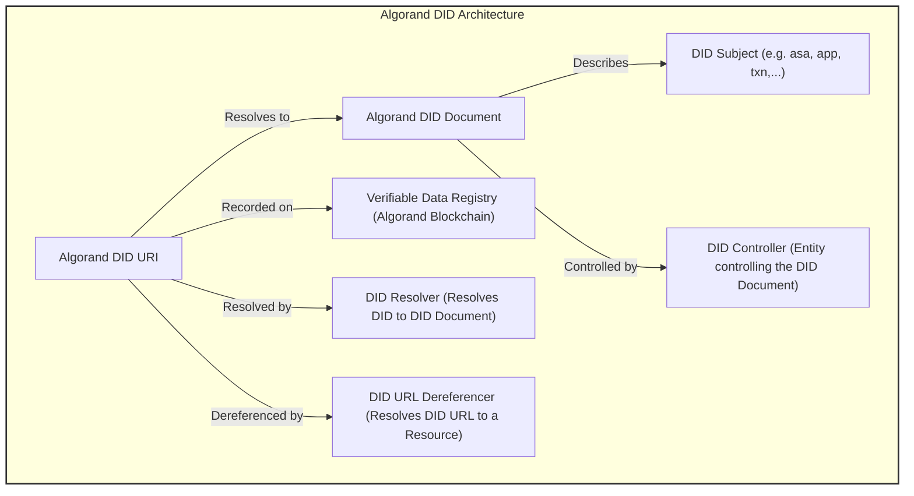

## Abstract

This standard represents [W3C Decentralized Identifiers Data Model Version 1.0 (19 July 2022)](https://w3c.github.io/did-core/#bib-vc-data-model) living standard's requirements and conventions using Algorand blockchain elements, naming conventions and methods! ARCs that ARC13 comply to and also extend are:
-  [ARC3](https://arc.algorand.foundation/ARCs/arc-0003)
-  [ARC19](https://arc.algorand.foundation/ARCs/arc-0019)
-  [ARC69](https://arc.algorand.foundation/ARCs/arc-0069)
-  [ARC52](https://arc.algorand.foundation/ARCs/arc-0052)
-  [ARC110](https://arc.algorand.foundation/ARCs/arc-0110)
-  [ARC26](https://arc.algorand.foundation/ARCs/arc-0026)

To implement DID naming , namespace, ABNF grammar and DID registry specifications using Algorand decentralized ledger and storage space as well as construction and resolution methods in accordance to Algorand literature, syntax and vocabulary are included in this ARC's scope!

Algorand specific features have been reflected into this ARC in full extent:
- Composability
- Elements and namespace conventions
- Methods and operations
- Tech stack (available and in use)
- Requirements

## Specification
The ARC13 standard aims to seamlessly integrate the W3C Decentralized Identifiers (DIDs) Data Model with the Algorand blockchain, leveraging its unique features and existing ARCs. This integration ensures that DIDs on Algorand maintain global uniqueness, immutability, and the ability to be resolved to DID documents, which are essential for verifiable digital identity and decentralized authentication.

### General Format
All authoring guidelines, diagrams, examples, and notes in this specification are non-normative. Everything else in this specification is normative. The key words "MAY," "MUST," "MUST NOT," "OPTIONAL," "RECOMMENDED," "REQUIRED," "SHOULD," and "SHOULD NOT" in this document are to be interpreted as described in [BCP 14 RFC2119](https://www.rfc-editor.org/rfc/rfc2119) and [RFC8174](https://www.rfc-editor.org/rfc/rfc8174) when, and only when, they appear in all capitals, as shown here.

Algorand DID elements specified by this ARC follow the URI format in general as outlined in [RFC 3986](https://www.rfc-editor.org/rfc/rfc3986). This ARC aims to be as future-proof as possible; therefore, some generalized architectural elements and conventions (e.g., fragments and paths) may be set forth that may not find immediate use in the current ecosystem tooling.

Elements of the query component may contain characters outside the valid range. These must first be encoded according to UTF-8, and then each octet of the corresponding UTF-8 sequence must be percent-encoded as described in RFC 3986.

### ABNF Grammar
The generic DID scheme is a URI scheme conformant with [RFC3986]. The ABNF definition can be found below, which uses the syntax in [RFC5234] and the corresponding definitions for ALPHA and DIGIT. All other rule names not defined in the ABNF below are defined in [RFC3986]. All DIDs MUST conform to the DID Syntax ABNF Rules.

The ABNF (Augmented Backus-Naur Form) grammar for Algorand DIDs is aligned with the general DID ABNF grammar, with specific adaptations for Algorand's unique elements:

```
DID Syntax ABNF:
did                = "did:" method-name ":" method-specific-id
method-name        = 1*method-char
method-char        = %x61-7A / DIGIT
method-specific-id = *( *idchar ":" ) 1*idchar
idchar             = ALPHA / DIGIT / "." / "-" / "_" / pct-encoded
pct-encoded        = "%" HEXDIG HEXDIG

```
--------------

```
The Algorand extended DID Syntax ABNF:
did                = "did:" method-name ":" method-specific-id
method-name        = "algo" ; Algorand method name
algorand-network   = "testnet" / "mainnet" / "devnet" / "betanet" ; Algorand network identifiers
algorand-namespace = "asa" / "txn" / "app" / "uuid" / "ans" / "nfd" / "ipfs" / "web" / "node" / "idx" ; Algorand namespace identifiers
method-specific-id = algorand-network "_" algorand-namespace ":" algorand-identifier
algorand-identifier = 1*idchar ; Unique identifier within the Algorand ecosystem

```

### Main elements

The main elements of the Algorand DID based on the DID data model are:

- DID Scheme: did:algo: The unique scheme for Algorand DIDs.
- Network Identifier: testnet_ or mainnet_ Specifies the Algorand network (testnet or mainnet).
- Namespace: Identifies the type of Algorand element the DID represents (e.g., asa, txn, app).
- Unique Identifier: A specific identifier unique to the namespace (e.g., ASA ID, transaction hash, application ID).

## Rationale
ARC13 is proposed to bring the benefits of decentralized identity to the Algorand ecosystem. By adopting the W3C DID standard, Algorand users can leverage a globally recognized framework for digital identity, enhancing interoperability, security, and trust in digital interactions. This standard also paves the way for advanced use cases in decentralized finance, supply chain, and beyond.

Note: Algorand account addresses have no namespace and are considered root namespace under :algo!

UUID Rationale: having UUID as first class citizen here to be used above or below any Algorand identifier give the ability of infinite possible scenarios to use and link offchain/onchain assets as composed entities! As comparability is one of Algorand product mottos , this ARC by using UUIDs , aligns by-design with upstream and stays future-proof!

NFD/ANS Rationale: nfd is a well-known namespace in Algorand and ans is the standard namespace naming for Algorand Naming Service, so instead of debating facts Algorand DIDs support and resolve both with no difference!

## Security Considerations

1. Key Management: Secure management of cryptographic keys used in DID creation and verification is crucial.
2. DID Document Integrity: Ensuring the integrity of DID documents stored on or referenced by the Algorand blockchain.
3. Privacy: Considerations around the privacy of DID subjects, especially in relation to transaction histories and public keys.

Note: The UUID namespace MUST be isolated by network for security reasons!
## DID lifecycle

A DID has different life stages depicted here and this stage status is reflected in value of DID "status" field! The status different values:
- Non-Existing
- 0: OK
- 1: FLAG:SUSPEND
- 2: FLAG:REVOKE

Note: There is no deletion in real practice for DIDs on blockchain, however deleting from registry and non-existing box storage record for that DID is taken as deletion definition for DID lifecycle on Algorand blockchain!

```mermaid

flowchart LR
    creation[Creation]
    registration[Registration]
    resolution[Resolution]
    use[Use]
    suspension[Suspension -Optional]
    revocation[Revocation -Optional]
    deletion[Deletion]
    creation -->|DID is generated| registration
    registration -->|DID is registered| resolution
    resolution -->|DID is resolved to DID Document| use
    use -->|DID is actively used| suspension
    suspension -->|DID is temporarily inactive| revocation
    revocation -->|DID is permanently deactivated| deletion

```
  

## State of art:
One major goal of Algorand blockchain for proof and information verification is to be able to perform them both offline and online in a self-sovereign decentralized way without any third party! 

The ARC13 Algorand DID registry specification includes:

- An active registry agent to construct DIDs based on Algorand node and indexer data which guarantees 1:1 existing DID subject per Algorand onchain entity!
- An active registry service to register and manage Algorand sub-namespace elements lifecycles through both API and an ABI!

Including a `verificationMethod` like a stateproof in a DID document is a powerful way to leverage blockchain technology for enhancing the security and verifiability of digital identities. This approach is particularly suitable for blockchain-based DIDs, where the immutability and transparency of the ledger can be used to provide cryptographic proof of the DID document's validity.

1. **Stateproof as a Verification Method**:
   - In the case of Algorand, a stateproof can serve as a cryptographic proof that a particular state (including transactions and, potentially, DID documents) was indeed part of the blockchain at a given point in time.
   - By including a reference to a stateproof or a similar mechanism in the `verificationMethod` section of a DID document, it's possible to provide a way to independently verify that the DID document (or the transaction that created it) is valid and has been recorded on the blockchain.

2. **Enhancing Trust and Integrity**:
   - This approach enhances the trustworthiness of the DID document. Verifiers can use the provided stateproof to confirm the document's authenticity without relying solely on the infrastructure provided by the DID method.
   - It aligns with the decentralized and trustless nature of blockchain technology, where verification doesn't depend on a central authority.

3. **Implementation Considerations**:
   - The specific implementation of this verification method would depend on the capabilities of the blockchain platform and the design of the DID method.
   - The DID document would need to include enough information to allow a verifier to obtain and validate the stateproof against the blockchain.

Important considerations regarding transaction DIDs with offline and online self verification methods:

1. **Verification Methods for Transaction DIDs**:
   - A DID document can include public key verification methods that are specifically used to verify the authenticity and integrity of the transaction associated with the DID.
   - The controller of these verification methods can be the entity that initiated the transaction, such as the transaction sender.

2. **Scope of Verification Methods**:
   - The DID document can be tailored to include only those verification methods that are relevant to the transaction. This means it can carry verification methods solely for the purpose of verifying the transaction DID itself.
   - The controllers of these verification methods would typically be entities involved in the transaction, ensuring that the verification process is directly linked to the transaction's participants.

3. **Compliance with DID Standard**:
   - This approach is compliant with the DID standard, which is flexible and allows for various implementations and use cases. The standard does not restrict the types of verification methods that can be included in a DID document, as long as they adhere to the overall structure and principles of DIDs.

4. **Use Case Specificity**:
   - This kind of implementation is particularly useful in blockchain-based environments where transactions are key elements of the system. The DID document effectively becomes a tool for transaction verification.


## Future work and TODO:
As stateproofs are already integrated as an extension service to all Algorand DIDs verification methods, hence there are some further steps to make it complete coverage regarding DID lifecycle:
- Client side stateproof verification using DID information to implement Algorand DID self verification
- Add goal CLI to verification method services (up for debate) 

## Implementations:
### Algorand DID Registry
The DID registry is a must have when it comes to implement a global scaled DID compliant system!
GoPlausible has implemented the Algorand DID registry and resolution which already contains did resolution for all Algorand elements on TESTNET and MAINNET!



### Algorand DID Resolver UI
A fully working Resolver UI has been implemented and is available under GoPlausible MAINNET and TESTNET dApps (Algorand Universal DID Resolver) under standard endpoint (did-resolver/did:algo...)

Algorand DID Resolver MAINNET UI: [goplausible.xyz/did-resolver/...](https://goplausible.xyz/did-resolver/did:algo:nfd:emg110.algo)

Algorand DID Resolver TESTNET UI: [testnet.goplausible.xyz/did-resolver/...](https://testnet.goplausible.xyz/did-resolver/did:algo:nfd:emg110.algo)

Note: An example DID has been included as default in examples above! Feel free to change it with your desired Algorand DID!

### Algorand DID Resolver API
A fully working Resolver API has been implemented and is available under GoPlausible MAINNET and TESTNET APIs (Algorand Universal DID Resolver) under standard endpoint (/identifiers/1.0.0/did:algo...)

Algorand DID Resolver MAINNET API: [goplausible.xyz/api/identifiers/1.0.0/...](https://goplausible.xyz/api/identifiers/1.0.0/did:algo:nfd:emg110.algo)

Algorand DID Resolver TESTNET API: [testnet.goplausible.xyz/api/identifiers/1.0.0/...](https://testnet.goplausible.xyz/api/identifiers/1.0.0/did:algo:nfd:emg110.algo)

### Algorand DID Resolver Client library
A fully featured client reference implementation and library is available on Github under MIT license and an NPM package to be used publicly!

The codebase instantiates an Algorand DID Resolver standard instance with DID and NETWORK arguments! 

Then resolver instance has two methods: 

- resolve(did: did) : This retrieves the DID document for given
- did_uri(id: string): This method creates a DID URI from Algorand element ID (TXN, ASA, APP)

Algorand DID Resolver Client: [algo-did-resolver NPM Package](https://npm.org/algo-did-resolver)

### Algorand DID Resolver ABI
A fully working Resolver ABI has been implemented and is available under GoPlausible MAINNET and TESTNET main contracts and serve as Algorand Universal DID Registry:

GoPlausible MAINNET contract: [946441472](https://algoexplorer.io/application/946441472)

GoPlausible TESTNET contract: [119642157](https://testnet.algoexplorer.io/application/119642157)

Through these two ABI methods:

```
        {
            "name": "algo_did_register",
            "args": [
                {
                    "type": "pay",
                    "name": "pay_box_mbr_fees"
                },
                {
                    "type": "bytes[]",
                    "name": "Algorand DID URI"
                },
                {
                    "type": "bytes[]",
                    "name": "Algorand DID doc",
                    "desc":"DID docs up to 8kb will be stored as box value and above 8kb would be uploaded to IPFS and CID will be sent as doc with 'ipfs/CID' format""
                }
                
            ],
            "returns": {
                "type": "string"
            },
            "desc": "Called publicly by an Algorand account to register a new DID! This creates a box with DID URI as key and DID document (JSON_LD) or IPFS CID bytes as value! 
     
        },
        {
            "name": "algo_did_status",
            "args": [
                 {
                    "type": "bytes[]",
                    "name": "Algorand DID URI"
                },
            ],
            "returns": {
                "type": "string"
            },
            "desc": "Called publicly to get the DID status in registry"
        },
        {
            "name": "algo_did_status_set",
            "args": [
                {
                    "type": "bytes[]",
                    "name": "Algorand DID URI"
                },
                {
                    "type": "uint64",
                    "name": "Algorand DID status"
                    "desc": "Algorand DID status ['0:FLAG','1:OK']"
                }
            ],
            "returns": {
                "type": "string",
                 "desc": "Updated DID URI"
            },
            "desc": "Called using registrar account to set DID status! Default registered DID status is 1"
        },
        {
            "name": "algo_did_resolve",
            "args": [
               {
                    "type": "bytes[]",
                    "name": "Algorand DID URI"
                },
            ],
            "returns": {
                "type": "string",
                  "desc": "Algorand DID document for given DID URI"
            },
            "desc": "Called publicly to get DID document given a DID URI!"
        },
        
```


## Appendix A: DID examples for all namespaces

Examples of DIDs for each Algorand element type for both testnet and mainnet instance 
- No namespace:
```
did:algo:LP6QRRBRDTDSP4HF7CSPWJV4AG4QWE437OYHGW7K5Y7DETKCSK5H3HCA7Q

did:algo:LP6QRRBRDTDSP4HF7CSPWJV4AG4QWE437OYHGW7K5Y7DETKCSK5H3HCA7Q
```
- ASA: 
```
did:algo:testnet_asa:12400859

did:algo:mainnet_asa:31566704
```
- TXN:
```
did:algo:testnet_txn:L3OEIRCTGDXALCIDLOLGXOM3OECHVNPI2GXN6PTNOEJJQIJ4FIWA

did:algo:mainnet_txn:67HI3JHICQQB7KCWKCDYNANN57KL5LAUVQ3BJJFGRYEMAIEYBBVQ
```
- APP:
```
did:algo:testnet_app:110096026

did:algo:mainnet_app:350338509
```

- UUID:
```
did:algo:testnet_uuid:c6bc3d9f-3e2c-4170-99e7-b9809f229ecb

did:algo:mainnet_uuid:6ba7b814-9dad-11d1-80b4-00c04fd430c8
```
- NFD/ANS:
```
did:algo:nfd:emg110.algo
did:algo:ans:emg110.algo

did:algo:nfd:emg110.algo
did:algo:ans:emg110.algo
```
## Appendix B: DID document example TXN DID from a rekeyed account
```json
{
    "@context": [
        "https://w3id.org/did-resolution/v1"],
    "didDocument": {
        "id": "did:algo:mainnet_txn:6WKM4ALZ7GOPIJNQOVF4C65LKBVP6EWCXZWJ2ETRMI5OLI63YNEQ",
        "@context": [
            "https://www.w3.org/ns/did/v1",
            "https://w3id.org/security/suites/ed25519-2020/v1",
            "https://w3id.org/security/v1"
        ],
        "verificationMethod": [
            {
                "controller": "did:algo:LP6QRRBRDTDSP4HF7CSPWJV4AG4QWE437OYHGW7K5Y7DETKCSK5H3HCA7Q",
                "id": "did:algo:mainnet_txn:6WKM4ALZ7GOPIJNQOVF4C65LKBVP6EWCXZWJ2ETRMI5OLI63YNEQ#sender",
                "publicKeyMultibase": "zCh9PDTZzeWxk2WdH4M1e8k2951D5D11jz7Uti9HRBGiK",
                "type": "Ed25519VerificationKey2020"
            },
            {
                "controller": "did:algo:JKFVZMGE2J7FXEVVGHC7ESPBRNVEKGFAJEESPLCYYM5CZBZCHS7QWDZ34Y",
                "id": "did:algo:mainnet_txn:6WKM4ALZ7GOPIJNQOVF4C65LKBVP6EWCXZWJ2ETRMI5OLI63YNEQ#auth",
                "publicKeyMultibase": "zGrjYfS1jotUQPyNqib75XNpGsS4ZL1MoPaEVF19a4W5h",
                "type": "Ed25519VerificationKey2020"
            },
            {
                "controller": "did:algo:mainnet_txn:6WKM4ALZ7GOPIJNQOVF4C65LKBVP6EWCXZWJ2ETRMI5OLI63YNEQ",
                "id": "did:algo:mainnet_txn:6WKM4ALZ7GOPIJNQOVF4C65LKBVP6EWCXZWJ2ETRMI5OLI63YNEQ#stateproof",
                "publicKeyMultibase": "zGrjYfS1jotUQPyNqib75XNpGsS4ZL1MoPaEVF19a4W5h",
                "type": "Ed25519VerificationKey2020"
            }
        ],
        "service": [
            {
                "id": "did:algo:web:mainnet_node/v2/blocks/34390581/transactions/6WKM4ALZ7GOPIJNQOVF4C65LKBVP6EWCXZWJ2ETRMI5OLI63YNEQ",
                "type": "did.algo.web.ExternalService",
                "serviceEndpoint": "https://mainnet_node/",
                "extensions": [
                    {
                        "id": "algorand-state-proof",
                        "version": "1.0.0",
                        "data": [
                            {
                               
                                "network": "mainnet",
                                "hashtype": "sha512_256",
                                "idx": 12,
                                "proof": "SGjVwQA4GGhBSfJ1uXJXWk0lNyyk6/Nq3tJI4fHAIWzGarYxDRBllj+gjjTKsPeFuMzuOkVqw58LDrmqucrYU+pbp9laI9DUE1UG7KcUj+QxXqmW/qsaQ+j74hVKMaHSWLxqjcMKUiSORivvBTp8XxFGWgUotwHtgBCQzkJ3MXHF41RA3zvDuluLMtS1diU6FLycYti0QRH9oBS57vcHn82PzPgD+k9rlPoJZY06lRxmz0Zlc1TKNThvqr+1Mu+C",
                                "stibhash": "ruGptxPK5UiqPM9MuOFk2t7MfOfXsvfGlDnatxDCHb0=",
                                "treedepth": 6,
                                "confirmed-round": 34390581,
                            },{
                               
                              }
                        ]
                    }
                ]
            },
            {
                "id": "did:algo:web:mainnet_idx/v2/transactions/6WKM4ALZ7GOPIJNQOVF4C65LKBVP6EWCXZWJ2ETRMI5OLI63YNEQ",
                "type": "did.algo.web.ExternalService",
                "serviceEndpoint": "https://mainnet_idx/",
                "extensions": [
                    {
                        "id": "algorand-signature",
                        "version": "1.0.0",
                        "data": [
                            {
                                "sig": "ug24mUImTRg8lzjAB8Y/FPzakKYoMwDUl+nVrQHlsUwnnLHipUdjtGV3NG3oVgxbJAgMGUK0exfUY27cePvMAQ==",
                                "network": "mainnet",
                                "confirmed-round": 34390581,
                            }
                        ]
                    }
                ]
            }
        ]
    },
    "didDocumentMetadata": {
        "created": "2023-03-23T19:15:10Z",
        "deactivated": false,
        "updated": "2023-03-23T20:11:30Z"
    },
    "didResolutionMetadata": {
        "contentType": "application/ld+json",
        "retrieved": "2023-05-15T17:39:30Z"
    }
}

```

## Copyright

This document and its content are released under the Creative Commons Zero (CC0) license, allowing for maximum flexibility and adoption within the Algorand community and beyond.

Copyright and related rights waived via [CCO](https://creativecommons.org/publicdomain/zero/1.0/)!