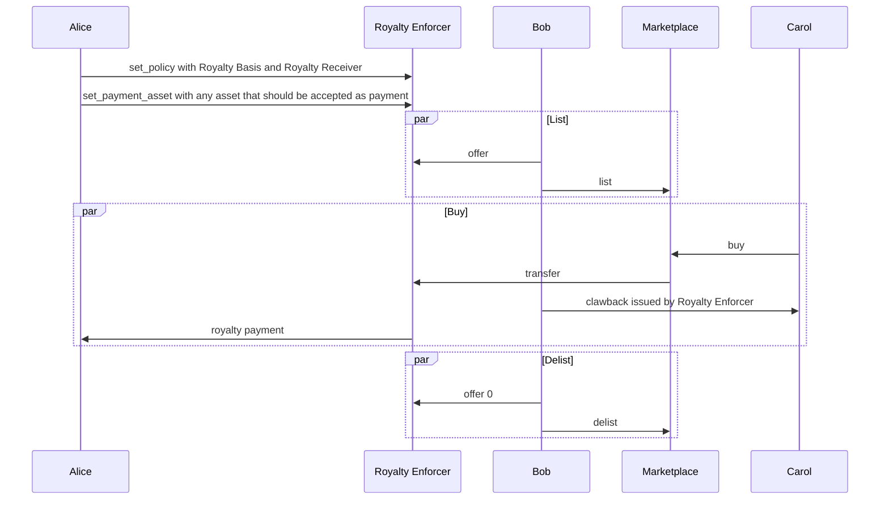

## Abstract

A specification to describe a set of methods that offer an API to enforce Royalty Payments https://en.wikipedia.org/wiki/Royalty_payment to a Royalty Receiver given a policy describing the royalty shares, both on primary and secondary sales.

This is an implementation of an [ARC-20](./arc-0020.md) specification and other methods may be implemented in the same contract according to that specification.

## Motivation

This ARC is defined to provide a consistent set of asset configurations and ABI methods that, together, enable a royalty payment to a Royalty Receiver.
An example may include some music rights where the label, the artist, and any investors have some assigned royalty percentage that should be enforced on transfer. During the sale transaction, the appropriate royalty payments should be included or the transaction must be rejected.

## Specification

The key words “MUST”, “MUST NOT”, “REQUIRED”, “SHALL”, “SHALL NOT”, “SHOULD”, “SHOULD NOT”, “RECOMMENDED”, “MAY”, and “OPTIONAL” in this document are to be interpreted as described in <a href="https://www.ietf.org/rfc/rfc822.txt">RFC 822</a>..
[Royalty Policy](#royalty-policy) - The name for the settings that define how royalty payments are collected.
[Royalty Enforcer](#royalty-enforcer) - The application that enforces the royalty payments given the Royalty Policy and performs transfers of the assets.
[Royalty Enforcer Administrator](#royalty-enforcer-administrator) - The account that may call administrative level methods against the Royalty Enforcer.
[Royalty Receiver](#royalty-receiver) - The account that receives the royalty payment. It can be any valid Algorand account.
[Royalty Basis](#royalty-basis) - The share of a payment that is due to the Royalty Receiver
[Royalty Asset](#royalty-asset) - The ASA that should have royalties enforced during a transfer.
[Asset Offer](#asset-offer) - A data structure stored in local state for the current owner representing the number of units of the asset being offered and the authorizing account for any transfer requests.
[Third Party Marketplace](#third-party-marketplace) - A third party marketplace may be any marketplace that implements the appropriate methods to initiate transfers.

### Royalty Policy

```ts
interface RoyaltyPolicy {
      royalty_basis:     number   // The percentage of the payment due, specified in basis points (0-10,000)
    royalty_recipient: string   // The address that should collect the payment
}
```
A Royalty Share consists of a `royalty_receiver` that should receive a Royalty payment and a `royalty_basis` representing some share of the total payment amount.

### Royalty Enforcer

The Royalty Enforcer is an instance of the contract, an Application, that controls the transfer of ASAs subject to the Royalty Policy.
This is accomplished by exposing an interface defined as a set of [ABI Methods](#abi-methods) allowing a grouped transaction call containing a payment and a [Transfer](#transfer) request.

### Royalty Enforcer Administrator

The Royalty Enforcer Administrator is the account that has privileges to call administrative actions against the Royalty Enforcer. If one is not set the account that created the application MUST be used.
To update the Royalty Enforcer Administrator the [Set Administrator](#set-administrator) method is called by the current administrator and passed the address of the new administrator.
An implementation of this spec may choose how they wish to enforce a that method is called by the administrator.

### Royalty Receiver

The Royalty Receiver is a generic account that could be set to a Single Signature, a Multi Signature, a Smart Signature or even to another Smart Contract.
The Royalty Receiver is then responsible for any further royalty distribution logic, making the Royalty Enforcement Specification more general and composable.

### Royalty Basis

The Royalty Basis is value representing the percentage of the payment made during a transfer that is due to the Royalty Receiver.
The Royalty Basis **MUST** be specified in terms of basis points https://en.wikipedia.org/wiki/Basis_point of the payment amount.

### Royalty Asset

The Royalty Asset is an ASA subject to royalty payment collection and **MUST** be created with the [appropriate parameters](#royalty-asset-parameters).
> Because the protocol does not allow updating an address parameter after it's been deleted,
> if the asset creator thinks they may want to modify them later, they must be set to some non-zero address.

#### Asset Offer

The Asset Offer is the a data structure stored in the owner's local state. It is keyed in local storage by the byte string representing the ASA Id.
```ts
interface AssetOffer {
      auth_address:   string // The address of a marketplace or account that may issue a transfer request
    offered_amount: number // The number of units being offered
}
```
This concept is important to this specification because we use the clawback feature to transfer the assets. Without some signal that the current owner is willing to have their assets transferred, it may be possible to transfer the asset without their permission.
In order for a transfer to occur, this field **MUST** be set and the parameters of the transfer request **MUST** match the value set.
> A transfer matching the offer would require the transfer amount <= offered amount and that the transfer is sent by auth_address.
After the transfer is completed this value **MUST** be wiped from the local state of the owner's account.

#### Royalty Asset Parameters

The Clawback parameter **MUST** be set to the Application Address of the Royalty Enforcer.
> Since the Royalty Enforcer relies on using the Clawback mechanism to perform the transfer the Clawback should NEVER be set to the zero address.
The Freeze parameter **MUST** be set to the Application Address of the Royalty Enforcer if `FreezeAddr != ZeroAddress`, else set to `ZeroAddress`.
> If the asset creator wants to allow an ASA to be Royalty Free after some conditions are met, it should be set to the Application Address
The Manager parameter **MUST** be set to the Application Address of the Royalty Enforcer if `ManagerAddr != ZeroAddress`, else set to `ZeroAddress`.
> If the asset creator wants to update the Freeze parameter, this should be set to the application address
The Reserve parameter **MAY** be set to anything.
The `DefaultFrozen` **MUST** be set to true.
### Third Party Marketplace
In order to support secondary sales on external markets this spec was designed such that the Royalty Asset may be listed without transferring it from the current owner's account.
A Marketplace may call the transfer request as long as the address initiating the transfer has been set as the `auth_address` through the [offer](#offer) method in some previous transaction by the current owner.

### ABI Methods

The following is a set of methods that conform to the [ABI](./arc-0004.md) specification meant to enable the configuration of a Royalty Policy and perform transfers.
Any Inner Transactions that may be performed as part of the execution of the Royalty Enforcer application **SHOULD** set the fee to 0 and enforce fee payment through fee pooling by the caller.

#### Set Administrator:

*OPTIONAL*
```
set_administrator(
      administrator: address,
)
```
Sets the administrator for the Royalty Enforcer contract. If this method is never called the creator of the application **MUST** be considered the administrator. This method **SHOULD** have checks to ensure it is being called by the current administrator.
The `administrator` parameter is the address of the account that should be set as the new administrator for this Royalty Enforcer application.

#### Set Policy:

*REQUIRED*

```
set_policy(
      royalty_basis: uint64,
    royalty_recipient: account,
)
```
Sets the policy for any assets using this application as a Royalty Enforcer.
The `royalty_basis` is the percentage for royalty payment collection, specified in basis points (e.g., 1% is 100).
A Royalty Basis **SHOULD** be immutable, if an application call is made that would overwrite an existing value it **SHOULD** fail.  See [Security Considerations](#security-considerations) for more details on how to handle this parameters mutability.
The `royalty_receiver` is the address of the account that should receive a partial share of the payment for any [transfer](#transfer) of an asset subject to royalty collection.

#### Set Payment Asset:

*REQUIRED*
```
set_payment_asset(
      payment_asset: asset,
    allowed: boolean,
)
```
The `payment_asset` argument represents the ASA id that is acceptable for payment. The contract logic **MUST** opt into the asset specified in order to accept them as payment as part of a transfer. This method **SHOULD** have checks to ensure it is being called by the current administrator.
The `allowed` argument is a boolean representing whether or not this asset is allowed.
The Royalty Receiver **MUST** be opted into the full set of assets contained in this list of payment_assets.
> In the case that an account is not opted into an asset, any transfers where payment is specified for that asset will fail until the account opts into the asset. or the policy is updated.

#### Transfer:

*REQUIRED*
```
transfer_algo_payment(
      royalty_asset: asset,
    royalty_asset_amount: uint64,
    from: account,
    to: account,
    royalty_receiver: account,
    payment: pay,
    current_offer_amount: uint64,
)
```
And
```
transfer_asset_payment(
      royalty_asset: asset,
    royalty_asset_amount: uint64,
    from: account,
    to: account,
    royalty_receiver: account,
    payment: axfer,
    payment_asset: asset,
    current_offer_amount: uint64,
)
```
Transfers the Asset after checking that the royalty policy is adhered to. This call must be sent by the `auth_address` specified by the current offer.
There **MUST** be a royalty policy defined prior to attempting a transfer.
There are two different method signatures specified, one for simple Algo payments and one for Asset as payment. The appropriate method should be called depending
on the circumstance.
The `royalty_asset` is the ASA ID to be transferred.
The `from` parameter is the account the ASA is transferred from.
The `to` parameter is the account the ASA is transferred to.
The `royalty_receiver` parameter is the account that collects the royalty payment.
The `royalty_asset_amount` parameter is the number of units of this ASA ID to transfer. The amount **MUST** be less than or equal to the amount [offered](#offer) by the `from` account.
The `payment` parameter is a reference to the transaction that is transferring some asset (ASA or Algos) from the buyer to the Application Address of the Royalty Enforcer.
The `payment_asset` parameter is specified in the case that the payment is being made with some ASA rather than with Algos. It **MUST** match the Asset ID of the AssetTransfer payment transaction.
The `current_offer_amount` parameter is the current amount of the Royalty Asset [offered](#offer) by the `from` account.
The transfer call **SHOULD** be part of a group with a size of 2 (payment/asset transfer + app call)
> See [Security Considerations](#security-considerations) for details on how this check may be circumvented.
Prior to each transfer the Royalty Enforcer **SHOULD** assert that the Seller (the `from` parameter) and the Buyer (the `to` parameter) have blank or unset `AuthAddr`.
> This reasoning for this check is described in [Security Considerations](#security-considerations). It is purposely left to the implementor to decide if it should be checked.

#### Offer:

*REQUIRED*
```
offer(
      royalty_asset: asset,
    royalty_asset_amount: uint64,
    auth_address: account,
    offered_amount: uint64,
    offered_auth_addr: account,
)
```
Flags the asset as transferrable and sets the address that may initiate the transfer request.
The `royalty_asset` is the ASA ID that is being offered.
The `royalty_asset_amount` is the number of units of the ASA ID that are offered. The account making this call **MUST** have at least this amount.
The `auth_address` is the address that may initiate a [transfer](#transfer).
> This address may be any valid address in the Algorand network including an Application Account's address.
The `offered_amount` is the number of units of the ASA ID that are currently offered.
> In the case that this is an update, it should be the amount being replaced. In the case that this is a new offer it should be 0.
The `offered_auth_address` is the address that may currently initiate a [transfer](#transfer).
> In the case that this is an update, it should be the address being replaced. In the case that this is a new offer it should be the zero address.
If any transfer is initiated by an address that is _not_ listed as the `auth_address` for this asset ID from this account, the transfer **MUST** be rejected.
If this method is called when there is an existing entry for the same `royalty_asset`, the call is treated as an update.  In the case of an update case the contract **MUST** compare the `offered_amount` and `offered_auth_addr` with what is currently set.  If the values differ, the call **MUST** be rejected.
> This requirement is meant to prevent a sort of race condition where the `auth_address` has a `transfer` accepted before the `offer`-ing account sees the update. In that case the offering account might try to offer more than they would otherwise want to. An example is offered in [security considerations](#security-considerations)
To rescind an offer, this method is called with 0 as the new offered amount.
If a [transfer](#transfer) or [royalty_free_move](#royalty-free-move) is called successfully, the `offer` **SHOULD** be updated or deleted from local state.
> Exactly how to update the offer is left to the implementer. In the case of a partially filled offer, the amount may be updated to reflect some new amount that represents `offered_amount - amount transferred` or the offer may be deleted completely.

#### Royalty Free Move:

*OPTIONAL*
```
royalty_free_move(
      royalty_asset: asset,
    royalty_asset_amount: uint64,
    from: account,
    to: account,
    offered_amount: uint64,
)
```
Moves an asset to the new address without collecting any royalty payment.
Prior to this method being called the current owner **MUST** offer their asset to be moved. The `auth_address` of the offer **SHOULD** be set to the address of the Royalty Enforcer Administrator and calling this method **SHOULD** have checks to ensure it is being called by the current administrator.
> This May be useful in the case of a marketplace where the NFT must be placed in some escrow account. Any logic may be used to validate this is an authorized transfer.
The `royalty_asset` is the asset being transferred without applying the Royalty Enforcement logic.
The `royalty_asset_amount` is the number of units of this ASA ID that should be moved.
The `from` parameter is the current owner of the asset.
The `to` parameter is the intended receiver of the asset.
The `offered_amount` is the number of units of this asset currently offered. This value **MUST** be greater than or equal to the amount being transferred.
> The `offered_amount` value for is passed to prevent the race or attack described in [Security Considerations](#security-considerations).
### Read Only Methods
Three methods are specified here as `read-only` as defined in [ARC-22](./arc-0022.md).

#### Get Policy:

*REQUIRED*
```
get_policy()(address,uint64)
```
Gets the current [Royalty Policy](#royalty-policy) setting for this Royalty Enforcer.
The return value is a tuple of type `(address,uint64)`, where the `address` is the [Royalty Receiver](#royalty-receiver) and the `uint64` is the [Royalty Basis](#royalty-basis).

#### Get Offer:

*REQUIRED*
```
get_offer(
      royalty_asset: asset,
    from: account,
)(address,uint64)
```
Gets the current [Asset Offer](#asset-offer) for a given asset as set by its owner.
The `royalty_asset` parameter is the asset id of the [Royalty Asset](#royalty-asset) that has been offered
The `from` parameter is the account that placed the offer
The return value is a tuple of type `(address,uint64)`, where `address` is the authorizing address that may make a transfer request and the `uint64` it the amount offered.

#### Get Administrator:

*OPTIONAL* unless set_administrator is implemented then *REQUIRED*
```
get_administrator()address
```
Gets the [Royalty Enforcer Administrator](#royalty-enforcer-administrator) set for this Royalty Enforcer.
The return value is of type `address` and represents the address of the account that may call administrative methods for this Royalty Enforcer application

### Storage

While the details of storage are described here, `readonly` methods are specified to provide callers with a method to retrieve the information without having to write parsing logic. The exact location and encoding of these fields are left to the implementer.

#### Global Storage

The parameters that describe a policy are stored in Global State.
The relevant keys are:
`royalty_basis` - The percentage specified in basis points of the payment
`royalty_receiver` - The account that should be paid the royalty
Another key is used to store the current administrator account:
`administrator` - The account that is allowed to make administrative calls to this Royalty Enforcer application

#### Local Storage

For an offered Asset, the authorizing address and amount offered should be stored in a Local State field for the account offering the Asset.

### Full ABI Spec

```json
{
    "name": "ARC18",
  "methods": [
      {
        "name": "set_policy",
      "args": [
          {
            "type": "uint64",
          "name": "royalty_basis"
        },
        {
            "type": "address",
          "name": "royalty_receiver"
        }
      ],
      "returns": {
          "type": "void"
      },
      "desc": "Sets the royalty basis and royalty receiver for this royalty enforcer"
    },
    {
        "name": "set_administrator",
      "args": [
          {
            "type": "address",
          "name": "new_admin"
        }
      ],
      "returns": {
          "type": "void"
      },
      "desc": "Sets the administrator for this royalty enforcer"
    },
    {
        "name": "set_payment_asset",
      "args": [
          {
            "type": "asset",
          "name": "payment_asset"
        },
        {
            "type": "bool",
          "name": "is_allowed"
        }
      ],
      "returns": {
          "type": "void"
      },
      "desc": "Triggers the contract account to opt in or out of an asset that may be used for payment of royalties"
    },
    {
        "name": "set_offer",
      "args": [
          {
            "type": "asset",
          "name": "royalty_asset"
        },
        {
            "type": "uint64",
          "name": "royalty_asset_amount"
        },
        {
            "type": "address",
          "name": "auth_address"
        },
        {
            "type": "uint64",
          "name": "prev_offer_amt"
        },
        {
            "type": "address",
          "name": "prev_offer_auth"
        }
      ],
      "returns": {
          "type": "void"
      },
      "desc": "Flags that an asset is offered for sale and sets address authorized to submit the transfer"
    },
    {
        "name": "transfer_asset_payment",
      "args": [
          {
            "type": "asset",
          "name": "royalty_asset"
        },
        {
            "type": "uint64",
          "name": "royalty_asset_amount"
        },
        {
            "type": "account",
          "name": "owner"
        },
        {
            "type": "account",
          "name": "buyer"
        },
        {
            "type": "account",
          "name": "royalty_receiver"
        },
        {
            "type": "axfer",
          "name": "payment_txn"
        },
        {
            "type": "asset",
          "name": "payment_asset"
        },
        {
            "type": "uint64",
          "name": "offered_amt"
        }
      ],
      "returns": {
          "type": "void"
      },
      "desc": "Transfers an Asset from one account to another and enforces royalty payments. This instance of the `transfer` method requires an AssetTransfer transaction and an Asset to be passed corresponding to the Asset id of the transfer transaction."
    },
    {
        "name": "transfer_algo_payment",
      "args": [
          {
            "type": "asset",
          "name": "royalty_asset"
        },
        {
            "type": "uint64",
          "name": "royalty_asset_amount"
        },
        {
            "type": "account",
          "name": "owner"
        },
        {
            "type": "account",
          "name": "buyer"
        },
        {
            "type": "account",
          "name": "royalty_receiver"
        },
        {
            "type": "pay",
          "name": "payment_txn"
        },
        {
            "type": "uint64",
          "name": "offered_amt"
        }
      ],
      "returns": {
          "type": "void"
      },
      "desc": "Transfers an Asset from one account to another and enforces royalty payments. This instance of the `transfer` method requires a PaymentTransaction for payment in algos"
    },
    {
        "name": "royalty_free_move",
      "args": [
          {
            "type": "asset",
          "name": "royalty_asset"
        },
        {
            "type": "uint64",
          "name": "royalty_asset_amount"
        },
        {
            "type": "account",
          "name": "owner"
        },
        {
            "type": "account",
          "name": "receiver"
        },
        {
            "type": "uint64",
          "name": "offered_amt"
        }
      ],
      "returns": {
          "type": "void"
      },
      "desc": "Moves the asset passed from one account to another"
    },
    {
        "name": "get_offer",
      "args": [
          {
            "type": "uint64",
          "name": "royalty_asset"
        },
        {
            "type": "account",
          "name": "owner"
        }
      ],
      "returns": {
          "type": "(address,uint64)"
      },
      "read-only":true
    },
    {
        "name": "get_policy",
      "args": [],
      "returns": {
          "type": "(address,uint64)"
      },
      "read-only":true
    },
    {
        "name": "get_administrator",
      "args": [],
      "returns": {
          "type": "address"
      },
      "read-only":true
    }
  ],
  "desc": "ARC18 Contract providing an interface to create and enforce a royalty policy over a given ASA.  See https://github.com/algorandfoundation/ARCs/blob/main/ARCs/arc-0018.md for details.",
  "networks": {}
}
```

#### Example Flow for a Marketplace

```
Let Alice be the creator of the Royalty Enforcer and Royalty Asset
Let Alice also be the Royalty Receiver
Let Bob be the Royalty Asset holder
Let Carol be a buyer of a Royalty Asset
```


### Metadata

The metadata associated to an asset **SHOULD** conform to any ARC that supports an additional field in the `properties` section specifying the specific information relevant for off-chain applications like wallets or Marketplace dApps. The metadata **MUST** be immutable.
The fields that should be specified are the `application-id` as described in [ARC-20](./arc-0020.md) and `rekey-checked` which describes whether or not this application implements the rekey checks during transfers.
Example:
```js
//...
"properties":{
      //...
    "arc-20":{
          "application-id":123
    },
    "arc-18":{
          "rekey-checked":true // Defaults to false if not set, see *Rekey to swap* below for reasoning
    }
}
//...
```

## Rationale

The motivation behind defining a Royalty Enforcement specification is the need to guarantee a portion of a payment is received by select royalty collector on sale of an asset. Current royalty implementations are either platform specific or are only adhered to when an honest seller complies with it, allowing for the exchange of an asset without necessarily paying the royalties.
The use of a smart contract as a clawback address is a guaranteed way to know an asset transfer is only ever made when certain conditions are met, or made in conjunction with additional transactions. The Royalty Enforcer is responsible for the calculations required in dividing up and dispensing the payments to the respective parties. The present specification does not impose any restriction on the Royalty Receiver distribution logic (if any), which could be achieved through a Multi Signature account, a Smart Signature or even through another Smart Contract.
On Ethereum the EIP-2981 standard allows for ERC-721 and ERC-1155 interfaces to signal a royalty amount to be paid, however this is not enforced and requires marketplaces to implement and adhere to it.

## Backwards Compatibility

Existing ASAs with unset clawback address or unset manager address (in case the clawback address is not the application account of a smart contract that is updatable - which is most likely the case) will be incompatible with this specification.

## Reference Implementation

https://github.com/algorand-devrel/royalty

## Security Considerations

There are a number of security considerations that implementers and users should be aware of.
*Royalty policy mutability*
The immutability of a royalty basis is important to consider since mutability introduces the possibility for a situation where, after an initial sale, the royalty policy is updated from 1% to 100% for example. This would make any further sales have the full payment amount sent to the royalty recipient and the seller would receive nothing.  This specification is written with the recommendation that the royalty policy **SHOULD** be immutable. This is not a **MUST** so that an implementation may decrease the royalty basis may decrease over time.
Caution should be taken by users and implementers when evaluating how to implement the exact logic.
*Spoofed payment*
While its possible to enforce the group size limit, it is possible to circumvent the royalty enforcement logic by simply making an Inner Transaction application call with the appropriate parameters and a small payment, then in the same outer group the "real" payment. The counter-party risk remains the same since the inner transaction is atomic with the outers.
In addition, it is always possible to circumvent the royalty enforcement logic by using an escrow account in the middle:
   - Alice wants to sell asset A to Bob for 1M USDC.
   - Alice and Bob creates an escrow ESCROW (smart signature).
   - Alice sends A for 1 μAlgo to the ESCROW
   - Bob sends 1M USDC to ESCROW.
   - Then ESCROW sends 1M USDC to Alice and sends A to Bob for 1 microAlgo.
Some ways to prevent a small royalty payment and larger payment in a later transaction of the same group might be by using an `allow` list that is checked against the `auth_addr` of the offer call. The `allow` list would be comprised of known and trusted marketplaces that do not attempt to circumvent the royalty policy. The `allow` list may be implicit as well by transferring a specific asset to the `auth_addr` as frozen and on `offer` a the balance must be > 0 to allow the `auth_addr` to be persisted.
The exact logic that should determine _if_ a transfer should be allowed is left to the implementer.
*Rekey to swap*
Rekeying an account can also be seen as circumventing this logic since there is no counter-party risk given that a rekey can be grouped with a payment. We address this by suggesting the `auth_addr` on the buyer and seller accounts are both set to the zero address.
*Offer for unintended clawback*
Because we use the clawback mechanism to move the asset, we need to be sure that the current owner is actually interested in making the sale. We address this by requiring the [offer](#offer) method is called to set an authorized address OR that the AssetSender is the one making the application call.
*Offer double spend*
If the [offer](#offer) method did not require the current value be passed, a possible attack or race condition may be taken advantage of.
- There's an open offer for N.
- The owner decides to lower it to N < M < 0
- I see that; decide to "frontrun" the second tx and first get N, [here the ledger should apply the change of offer, which overwrites the previous value — now 0 — with M], then I can get another M of the asset.
*Mutable asset parameters*
If the ASA has it's manager parameter set, it is possible to change the other address parameters. Namely the clawback and freeze roles could be changed to allow an address that is _not_ the Royalty Enforcer's application address.  For that reason the manager **MUST** be set to the zero address or to the Royalty Enforcer's address.
*Compatibility of existing ASAs*
In the case of [ARC-69](./arc-0069.md) and [ARC-19](./arc-0019.md) ASA's the manager is the account that may issue `acfg` transactions to update metadata or to change the reserve address. For the purposes of this spec the manager **MUST** be the application address, so the logic to issue appropriate `acfg` transactions should be included in the application logic if there is a need to update them.
> When evaluating whether or not an existing ASA may be compatible with this spec, note that the `clawback` address needs to be set to the application address of the Royalty Enforcer. The `freeze` address and `manager` address may be empty or, if set, must be the application address. If these addresses aren't set correctly, the royalty enforcer will not be able to issue the transactions required and there may be security considerations.
> The `reserve` address has no requirements in this spec so [ARC-19](./arc-0019.md) ASAs should have no issue assuming the rest of the addresses are set correctly.

## Copyright

Copyright and related rights waived via <a href="https://creativecommons.org/publicdomain/zero/1.0/">CCO</a>.
