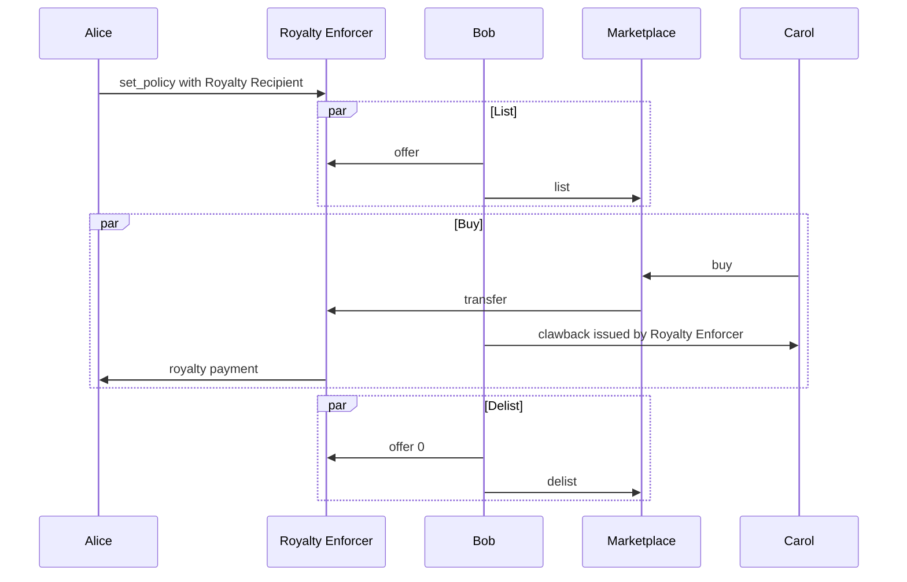

## Abstract

A specification to describe a mechanism to enforce [Royalty Payments](https://en.wikipedia.org/wiki/Royalty_payment) to a Royalty Collector given a policy describing the royalty shares, both on primary and secondary sales.

## Motivation

This ARC is defined to provide a consistent set of asset configurations and ABI methods that, together, enable a royalty payment to a Royalty Collector.

An example may include some music rights where the label, the artist, and any investors have some assigned royalty percentage that should be enforced on transfer. During the sale transaction, the appropriate royalty payments should be included or the transaction must be rejected.

## Specification
The key words “MUST”, “MUST NOT”, “REQUIRED”, “SHALL”, “SHALL NOT”, “SHOULD”, “SHOULD NOT”, “RECOMMENDED”, “MAY”, and “OPTIONAL” in this document are to be interpreted as described in RFC 2119.


[Royalty Policy](#royalty-policy) - The data structure that defines how royalties are dispersed

[Royalty Enforcer](#royalty-enforcer) - The contract that enforces the royalty payments given the Royalty Policy and performs transfers of the assets.

[Royalty Collector](#royalty-collector) - The account that collect the royalty and provides the royalty distribution logic. It can be any valid Algorand account. For example, it can be set to a Single Signature, a Multi Signature, a Smart Signature or even the Application Account of another Smart Contract.

[Asset Subject to Royalties](#royalty-asset) - The asset that is subject to royalty payments on transfer

[Asset Offer](#asset-offer) - A data structure stored in local state for the current owner representing the number of units of the asset being offered and the authorizing account for any transfer requests.

[Third Party Marketplace](#third-party-marketplace) - A third party marketplace may be any marketplace that implements the appropriate methods to initiate transfers.

### Royalty Policy 

A Royalty Share consists of an `address` that should receive a Royalty payment and a `share` representing some share of the total payment amount. The Royalty Share **MUST** be specified in terms of [basis points](https://en.wikipedia.org/wiki/Basis_point) of the payment amount.

A Royalty Policy is specified as a Royalty Collector and associated Royalty Share. Additionally, if any assets besides Algos are acceptable, 


```ts
interface RoyaltyPolicy {
    share:              number,  // The share of the payment due, specified in basis points (0-10,000)
    royalty_collector:  string,  // The address that should collect this share of the payment
    allowed_assets:     number[] // The list of asset ids that are acceptable for payment
}
```
A given asset has at most one associated policy.

> In case royalty needs to be distributed to multiple different shareholders, the Royalty Collector address may be set to an appropriate Smart Signature or Application Account of a Smart Contract that would ensure this distribution.

### Royalty Enforcer

The Royalty Enforcer is an application that controls the transfer of ASAs subject to the Royalty Policy. 

This is accomplished by exposing an interface defined as a set of [ABI Methods](#abi-methods) allowing a grouped transaction call.

### Royalty Collector

The Royalty Collector is a generic account that could be set to a Single Signature, a Multi Signature, a Smart Signature or even to another Smart Contract. The Royalty Collector is then responsible for the royalty distribution logic, making the Royalty Enforcement Specification more general and composable.


### Royalty Asset 

The Royalty Asset is an ASA subject to royalty collection and **MUST** be created with the the appropriate mutable and immutable parameters. 

> Because the protocol does not allow updating an address parameter after it's been deleted, if the creator thinks they may want to modify them later, they must be set to some non-zero address.

#### Asset Offer

The Asset Offer is the a data structure stored in the owners local state. It is keyed in local storage by the byte string representing the ASA Id. 

```ts
interface AssetOffer {
    auth_address: string // The address of a marketplace or account that may issue a transfer request
    offered_amount: number // The number of units being offered
}
```

This concept is important to this specification because we use the clawback feature to transfer the assets. Without some signal that the current owner is willing to have their assets transferred it may be possible to transfer the asset without their permission. In order for a transfer to occur this field **MUST** be set and match the transfer request (asset id, >= offered amount, transfer sent by auth_address) or the transfer **MUST** fail.


#### Asset Address Parameters 

The Clawback parameter **MUST** be set to the Application Address of the Royalty Enforcer.

> Since the Royalty Enforcer relies on using the Clawback mechanism to perform the transfer the Clawback should NEVER be set to the zero address. 

The Freeze parameter **MUST** be set to the Application Address of the Royalty Enforcer if `FreezeAddr != ZeroAddress`, else set to `ZeroAddress`.

> If the creator wants to allow an ASA to be Royalty Free after some conditions are met, it should be set to the Application Address 

The Manager parameter **MUST** be set to the Application Address of the Royalty Enforcer if `ManagerAddr != ZeroAddress`, else set to `ZeroAddress`.

> If the creator wants to update the Freeze parameter, this should be set to the application address

The Reserve parameter **MAY** be set to anything.

#### Immutable Asset Parameters

The `DefaultFrozen` **MUST** be set to true.

### Third Party Marketplace

In order to support secondary sales on external markets this spec was designed such that the Royalty Asset may be listed without transferring it from the current owners account.  A Marketplace may call the transfer request as long as the address initiating the transfer has been set as the `authorized_address` through the [offer](#offer) method in some previous transaction by the current owner.


### ABI Methods

#### Required


##### Set Policy
    
```
set_policy(royalty_asset: asset, royalty_receiver: address, royalty_share: uint64, allowed_asset_1: asset, allowed_asset_2: asset, allowed_asset_3: asset, allowed_asset_4: asset)
```

Sets the Royalty Policy for a given asset. 

The `royalty_asset` is the ASA id of the asset the policy is set for.  If the `royalty_asset` is 0, the policy is defined for _any_ asset that has its clawback set to the application address. 

The `royalty_receiver` is the address of the account that should receive a partial share of the payment or asset transfer for any [transfer](#transfer) of the `royalty_asset` 

The `royalty_share` is the share of the payment that should be sent to the `royalty_receiver`.  It is specified in basis points (e.g., 1% is 100).  

The `allowed_assets_n` arguments represents the ASA ids that are acceptable for payment. The contract logic **MUST** opt into the set of assets specified in order to accept the payments as part of a transfer.

The Royalty Collector **MUST** be opted into the full set of assets contained in this list. 

> In the case that an account is not opted into an asset, any transfers where payment is specified for that asset will fail until the account opts into the asset. or the policy is updated.

A Royalty Policy **MUST** be immutable, if an application call is made that would overwrite an existing value it **MUST** fail. 

> The immutability of a policy is important since mutability introduces the possibility for a situation where after an initial sale, the royalty policy may be updated from 1% to 100% for example. This would make any further sales have the full payment amount sent to the royalty recipient and the seller would receive nothing.

#### Get Policy

```
get_policy(royalty_asset: uint64)(address,uint64,uint64,uint64,uint64,uint64)
```

Gets the royalty for a given asset id.

> This method is *READ ONLY* as defined in [arc22](./arc-0022.md)

The `royalty_asset` parameter is the ASA Id of the royalty asset to get the policy for.

The default policy is returned unless a policy is defined for the passed ASA Id. If no default policy is returned all return values are set to the zero value for their type.


> TODO: since assets cant be in dynamic arrays, this bit is annoying. We could define N selectors (up to 8 for assets) and dispatch them all to the same set of logic? for now just hardcoded to 4 and caller expected to pass 0s if they don't need all 4.  As of https://github.com/algorandfoundation/ARCs/pull/77, this limitation has been changed. Update spec accordingly once SDK support is available.


##### Transfer: 

```
transfer(royalty_asset: asset, from: account, to: account, royalty_collector: account, royalty_asset_amount: uint64, payment: transaction, payment_asset: asset, curr_offer_amount: uint64)
```

Transfers the Asset after checking that the royalty policy is adhered to. This call must be sent by the current owner (the `from` parameter)

The `royalty_asset` is the ASA ID to be transferred. It **MUST** have a policy defined prior to attempting a transfer.

The `from` parameter is the address for the account the ASA is transferred from.

The `to` parameter is the address for the account the ASA is transferred to.

The `royalty_receiver` parameter is the address for the account that collects the royalty and takes care of any redistribution logic (if any). 

The `royalty_asset_amount` parameter is the number of units of this ASA ID to transfer. The amount **MUST** be less than or equal to the amount `offered` by the `from` account.

The `payment` parameter is a reference to the transaction that is transferring some asset (ASA or Algos) from the buyer to the Application Address of the Royalty Enforcer. 

The `payment_asset` parameter is used in the case that the payment is being made with some asset rather than with Algos. It **MUST** match the Asset ID of the AssetTransfer payment transaction. 

The `curr_offer_amount` parameter is the current amount of the Royalty Asset offered by the `from` account. 

The transfer call **SHOULD** be part of a group with a size of 2 (payment/asset transfer + app call)

See [Security Considerations](#security-considerations) for details on how this method may be gamed.

Upon each transfer the the Royalty Enforcer **SHOULD** assert that `AuthAddr == AssetSender` for the Seller (`from` parameter) and `AuthAddr == AssetReceiver` for the Buyer (`to` parameter). In other words Seller and Buyer accounts not have been Rekeyed. Exceptions can be handled with `Move` method.


#### Offer:

```
offer(royalty_asset: asset, royalty_asset_amount: uint64, authorized_address: account, curr_royalty_asset_amount: uint64, curr_authorized_address: account)
```

Flags the asset as transferrable and sets the address that may initiate the transfer request.

The `royalty_asset` is the ASA ID that is offered. It **MUST** have a policy defined prior to attempting to offer, but it **MAY** be the default policy.

The `royalty_asset_amount` is the number of units of the ASA ID that are offered. The account making this call **MUST** have at least this amount. 

The `authorized_address` is the address that may initiate the transfer. This address may be any valid address in the Algorand network including an Application Account's address.

The `curr_royalty_asset_amount` is the number of units of the ASA ID that are currently offered in the case that this is an update.

The `curr_authorized_address` is the address that may currently initiate the transfer in the case of an update.

If any transfer is initiated by an address that is _not_ listed as the `authorized_address` for this asset ID from this account, the transfer is rejected.

If this method is called when there is an existing entry for the same `royalty_asset`, the call is treated as an update and the current value is overwritten with the new value. 

In the case of an update case the contract **MUST** compare the `curr_royalty_asset_amount` and `curr_authorized_address` with what is currently set.  If the values differ, the call **MUST** be rejected. 

> This requirement is meant to prevent a sort of race condition where the `authorized_address` has a `transfer` accepted before the `offer`-ing account sees the update. In that case the offering account might try to offer more than they would otherwise want to. An example is offered in [security considerations](#security-considerations)

To rescind an offer, this method is called with 0 as the new offered amount.

If a `transfer` or `royalty_free_move` is called successfully, the `offer` **SHOULD** be updated or deleted from local state. 

> Exactly how to update the offer is left to the implementer. In the case of a partially filled offer, the amount may be updated to reflect some new amount that represents `offer_amount - amount transferred` or deleting the offer completely. 


#### Get Offer:

```
get_offer(royalty_asset: uint64, from: account)(address,uint64)
```

> This method is *READ ONLY* as defined in [arc22](./arc-0022.md)

The `royalty_asset` parameter is the ASA Id that has been offered.

The `from` parameter is the account to inspect for a local state key matching the `royalty_asset` passed


#### Optional

The following methods **MAY** be implemented but are not required by this specification.

##### Royalty Free Move 

```
royalty_free_move(royalty_asset: asset, royalty_asset_amount: uint64, to: account, curr_offered_amount: uint64, curr_auth_address: address)
```

Moves an asset to the new address without enforcing any royalty payment. May be useful in the case of a marketplace where the NFT must be placed in some escrow account. Any logic may be used to validate this is an authorized transfer.

The `royalty_asset` is the asset being transferred without applying the Royalty Enforcement logic.

The `royalty_asset_amount` is the number of units of this ASA ID that should be moved.

The `to` parameter is the intended receiver of the asset. This account **MUST** be opted into the asset prior to calling this method or it will fail at the protocol level.

The `curr_offered_amount` is the number of units of this asset currently offered, the value of 0 is passed if no offer is outstanding.

The `curr_auth_address` is the authorized address for the current offer, the zero address is passed if no offer is outstanding.

> The `curr_*` values for the offer are passed to prevent the race or attack described in [Security Considerations](#security-considerations).

### Storage

While the details of storage are described here, `readonly` methods are specified to provide callers with a method to retrieve the information without having to write parsing logic.

#### Global Storage

For Policies, each policy is stored in a Global State field, keyed by the 8 byte string representing the uint64 Asset id. 

A Special value of 0x0000000000000000 may be used as a key for the default policy. 

When determining which policy may apply to the Royalty Asset

    - First check for a key present that matches the Royalty Asset Id 
    - Then use the default policy if set
    - If neither are present, the transaction **MUST** fail

#### Local Storage

For an offered Asset, the authorizing address and amount offered should be stored in a Local State field keyed by the 8 byte string representing the uint64 asset id of the asset being offered.


### Full ABI Spec

```json
{
    "name":"demo-arc-18",
    "methods": [
        {
            "name": "set_policy",
            "desc": "Sets the royalty policy for a given app id",
            "args": [
                {
                    "name": "royalty_asset",
                    "type": "asset"
                },
                {
                    "name": "royalty_receiver",
                    "type": "address"
                },
                {
                    "name": "royalty_share",
                    "type": "uint64"
                },
                {
                    "name": "allowed_asset_1",
                    "type": "asset"
                },
                {
                    "name": "allowed_asset_2",
                    "type": "asset"
                },
                {
                    "name": "allowed_asset_3",
                    "type": "asset"
                },
                {
                    "name": "allowed_asset_4",
                    "type": "asset"
                }
            ],
            "returns": {
                "type": "void"
            }
        },
        {
            "name": "offer",
            "desc": "Flags that an asset is offered for sale and sets address authorized to submit the transfer",
            "args": [
                {
                    "name": "royalty_asset",
                    "type": "asset"
                },
                {
                    "name": "royalty_asset_amount",
                    "type": "uint64"
                },
                {
                    "name": "authorized_address",
                    "type": "account"
                },
                {
                    "name": "curr_offered_amount",
                    "type": "uint64"
                },
                {
                    "name": "curr_offered_auth",
                    "type": "address"
                }
            ],
            "returns": {
                "type": "void"
            }
        },
        {
            "name": "transfer",
            "desc": "Transfers an Asset from one account to another and enforces royalty payments",
            "args": [
                {
                    "name": "royalty_asset",
                    "type": "asset"
                },
                {
                    "name": "owner_acct",
                    "type": "account"
                },
                {
                    "name": "buyer_acct",
                    "type": "account"
                },
                {
                    "name": "royalty_receiver",
                    "type": "account"
                },
                {
                    "name": "royalty_asset_amount",
                    "type": "uint64"
                },
                {
                    "name": "payment",
                    "type": "txn"
                },
                {
                    "name": "payment_asset",
                    "type": "asset"
                },
                {
                    "name": "curr_offered_amount",
                    "type": "uint64"
                }
            ],
            "returns": {
                "type": "void"
            }
        },
        {
            "name": "royalty_free_move",
            "desc": "Moves the asset passed from one account to another",
            "args": [
                {
                    "name": "royalty_asset",
                    "type": "asset"
                },
                {
                    "name": "royalty_asset_amount",
                    "type": "uint64"
                },
                {
                    "name": "from",
                    "type": "account"
                },
                {
                    "name": "to",
                    "type": "account"
                },
                {
                    "name": "curr_offered_amount",
                    "type": "uint64"
                },
                {
                    "name": "curr_offered_auth",
                    "type": "address"
                }
            ],
            "returns": {
                "type": "void"
            }
        },
        {
            "name": "get_policy",
            "desc": "Gets the royalty policy for a given asset id",
            "readonly": true,
            "args": [
                {
                    "name": "royalty_asset",
                    "type": "uint64"
                }
            ],
            "returns": {
                "type": "(address,uint64,uint64,uint64,uint64,uint64)"
            }
        },
        {
            "name": "get_offer",
            "desc": "Gets the details offered asset",
            "readonly": true,
            "args": [
                {
                    "name": "royalty_asset",
                    "type": "uint64"
                },
                {
                    "name": "from",
                    "type": "uint64"
                }
            ],
            "returns": {
                "type": "(address,uint64)"
            }
        }
    ],
    "locals": [ 
        {
            "name": "{uint64 asset id as big endian bytes}",
            "desc": "The ID of the asset that has been offered as key, authorizing address as value",
            "type": "(address,uint64)"
        }  
    ],
    "globals": [ 
        {
            "name": "0000000000000000",
            "desc": "The default royalty policy for any ASA unless its ASA ID is specified",
            "type": "(address,uint64,uint64,uint64,uint64)"
        },
        {
            "name": "{uint64 asset id as big endian bytes}",
            "desc": "Royalty policy for asset ID in key ",
            "type": "(address,uint64,uint64,uint64,uint64)"
        }  
    ]
}
```


#### Flow for a Marketplace

```
Let Alice be anyone with authority to update the Royalty Policies, shes specified herself as Royalty Recipient
Let Bob be the Royalty Asset holder
Let Carol be a buyer of a Royalty Asset
```




### Metadata

The metadata associated to an asset MAY conform to [ARC-3](./arc-0003.md) or [ARC-69](./arc-0069.md) with an additional field in the `properties` section specifying the Application ID for the Royalty Enforcer Contract. 

```js
//...
"properties":{
    "arc18":{
        "application-id":123,
    }
    //...
}
//...
```

## Rationale

The motivation behind defining a Royalty Enforcement specification is the need to guarantee a portion of a payment is received by select royalty collector on sale of an asset. Current royalty implementations are either platform specific or are only adhered to when an honest seller complies with it, allowing for the exchange of an asset without necessarily paying the royalties.

The use of a smart contract as a clawback address is a guaranteed way to know an asset transfer is only ever made when certain conditions are met, or made in conjunction with additional transactions. The Royalty Enforcer is responsible for the calculations required in dividing up and dispensing the payments to the respective parties. The present specification does not impose any restriction on the Royalty Collector distribution logic (if any), which could be achieved through a Multi Signature account, a Smart Signature or even through another Smart Contract.

On Ethereum the EIP-2981 standard allows for ERC-721 and ERC-1155 interfaces to signal a royalty amount to be paid, however this is not enforced and requires marketplaces to implement and adhere to it.

## Backwards Compatibility

Existing ASAs with unset clawback address or unset manager address (in case the clawback address is not the application account of a smart contract that is updatable - which is most likely the case) will be incompatible with this specification.

## Reference Implementation

https://github.com/algorand-devrel/royalty

## Security Considerations

There are a number of ways to circumvent the enforcement of the Royalty Policy.

While its possible to enforce the group size limit, it is possible to circumvent the royalty enforcement logic by simply making an Inner Transaction application call with the appropriate parameters and a small payment, then in the same outer group the "real" payment. The counter-party risk remains the same since the inner transaction is atomic with the outers. 

In addition, it is always possible to circumvent the royalty enforcement logic by using an escrow account in the middle: 
   - Alice wants to sell asset A to Bob for 1M USDC.  
   - Alice and Bob creates an escrow ESCROW (smart signature).
   - Alice sends A for 1 μAlgo to the ESCROW
   - Bob sends 1M USDC to ESCROW.
   - Then ESCROW sends 1M USDC to Alice and sends A to Bob for 1 microAlgo.

Some ways to prevent a small royalty payment and larger payment in a later transaction of the same group might be by using an `allow` list that is checked against the `auth_addr` of the offer call. The `allow` list would be comprised of known and trusted marketplaces that do not attempt to circumvent the royalty policy. The `allow` list may be implicit as well by transferring a specific asset to the `auth_addr` as frozen and on `offer` a the balance must be > 0 to allow the `auth_addr` to be persisted.

The exact logic that should determine _if_ a transfer should be allowed is left to the implementer.

Rekeying an account can also be seen as circumventing this logic since there is no counter-party risk given that a rekey can be grouped with a payment. We address this by suggesting the `authorizing address` on the buyer and seller accounts are both set to the zero address.

Because we use the clawback mechanism to move the asset, we need to be sure that the current owner is actually interested in making the sale. We address this by requiring the `offer` method is called to set an authorized address OR that the AssetSender is the one making the application call. 

If the `offer` method did not require the current value be passed, a possible attack or race condition may be taken advantage of.

- There's an open offer for N.
- The owner decides to lower it to N < M < 0
- I see that; decide to "frontrun" the second tx and first get N, [here the ledger should apply the change of offer, which overwrites the previous value — now 0 — with M], then I can get another M of the asset.

## Copyright
Copyright and related rights waived via [CC0](https://creativecommons.org/publicdomain/zero/1.0/).