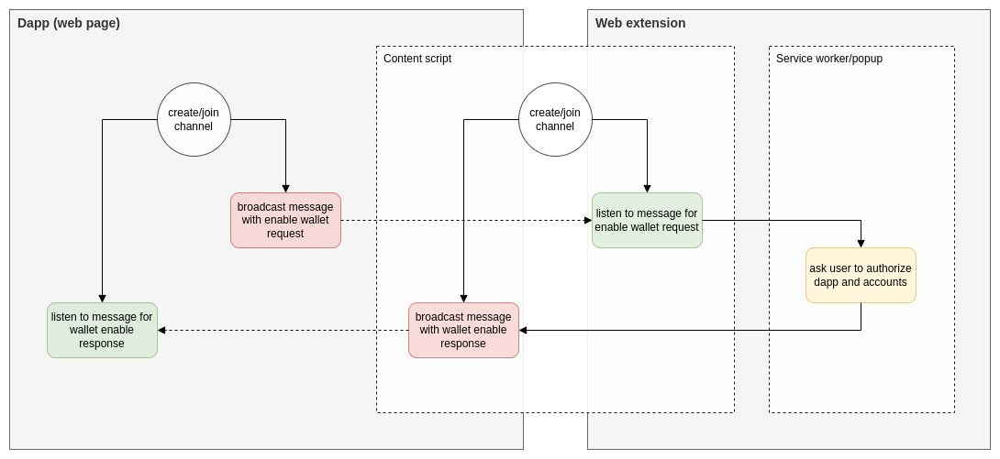

# Web Extension Provider Interface

## Abstract

Building off of the previous ARCs relating to; wallet transaction signing ([ARC-0005](./arc-0005.md#specification)), wallet address discovery ([ARC-0006](./arc-0006.md#specification)), wallet transaction network posting ([ARC-0007](./arc-0007.md#specification)) and wallet transaction signing & posting ([ARC-0008](./arc-0008.md#specification)), this proposal aims to extend and comprehensively outline a common interface between multiple web extension wallets and dapps by utilizing the pub/sub semantics of the [BroadcastChannel API](https://developer.mozilla.org/en-US/docs/Web/API/Broadcast_Channel_API).

## Motivation

Two common patterns that have emerged amongst web extension wallets:

| Description                                                                                                                                                                                                                                                                                                                                                                                                                          | Benefits                                                                                                                                                                                                                                                                                                                    | Drawbacks                                                                                                                                                                                                                        |
|:-------------------------------------------------------------------------------------------------------------------------------------------------------------------------------------------------------------------------------------------------------------------------------------------------------------------------------------------------------------------------------------------------------------------------------------|:----------------------------------------------------------------------------------------------------------------------------------------------------------------------------------------------------------------------------------------------------------------------------------------------------------------------------|:---------------------------------------------------------------------------------------------------------------------------------------------------------------------------------------------------------------------------------|
| The global `window.algorand` object is overwritten by an injected script from a web extension's content script. This overwritten object will provide features that allows the dapp to interact with the wallet which may or may not conform to previous ARCs ([ARC-0005](./arc-0005.md#specification), [ARC-0006](./arc-0005.md#specification), [ARC-0007](./arc-0007.md#specification) or [ARC-0008](./arc-0008.md#specification)). | - Dapps will not have to install any external SDKs<br/>- Dapps do not need to know which wallet the user is using (if the injected wallet conforms to [ARC-0005](./arc-0005.md#specification), [ARC-0006](./arc-0005.md#specification), [ARC-0007](./arc-0007.md#specification) or [ARC-0008](./arc-0008.md#specification)) | - In the instance of multiple web extension wallets, another wallet extension may overwrite this object.<br/>- Once overwritten, the `window.algorand` object will only service the last web extension wallet that overwrote it. |
| A wallet provides a separate SDK that is installed by a dapp to interact with the wallet.                                                                                                                                                                                                                                                                                                                                            | - Allows wallets full control over how dapps interact with wallets, ie. provide a bespoke UX.                                                                                                                                                                                                                               | - Dapps need to install each SDK separately, thereby increasing the amount of development time, and complexity, needed to implement each wallet separately.                                                                      |

While both patterns have merits, they can stumble when it comes to allowing dapps to be un-opinionated about what wallet the user intends to use. 

This proposal intends to outline a common interface that, at it's core, will subscribe to some fundamental goals:

1. Creating a common interface between dapps and wallets.
2. Allowing wallets to work in unison.
3. Full authority of wallet choice is in the hands the user.

## Specification

The key words "**MUST**", "**MUST NOT**", "**REQUIRED**", "**SHALL**", "**SHALL NOT**", "**SHOULD**", "**SHOULD NOT**", "**RECOMMENDED**", "**MAY**", and "**OPTIONAL**" in this document are to be interpreted as described in <a href="https://www.ietf.org/rfc/rfc2119.txt">RFC-2119</a>.

> Comments like this are non-normative.

### Definitions

This section is non-normative.

* Dapp
  - The end-user application that interacts with the web extension wallet; the provider.
* Provider
  - A web extension wallet, that manages private keys and performs signing operations.

### Overview

The essence of the provider interface will lie in using the simple messaging bus mechanism of the [BroadcastChannel API](https://developer.mozilla.org/en-US/docs/Web/API/Broadcast_Channel_API).

A dapp will broadcast a message and the provider's [content scripts](https://developer.mozilla.org/en-US/docs/Mozilla/Add-ons/WebExtensions/Content_scripts) will listen for these broadcasted messages and act upon them, responding with another broadcast message that references the original request broadcast.

The dapp will, itself, listen to broadcasted responses from any providers. Below is a simple diagram for the flow of data for an enable request:



### Channel Creation/Join

Both the dapp and the provider **MUST** create/join a broadcast channel with a common channel name:

```typescript
const channel: BroadcastChannel = new BroadcastChannel('arc0027:channel');
```

> ⚠️ **NOTE:** As providers are web extensions, they **MUST** create/join the `BroadcastChannel` in a content script. As content scripts share the same origin as the dapp, they are able to subscribe to the same channel and listen/broadcast messages.

### Message Reference Naming

In order for each message to be identifiable, each message **MUST** contain a `reference` property. Furthermore, this `reference` property **MUST** conform to the following naming convention:

```
[namespace]:[method]:[type]
```
where:
* `namespace`:
    - **MUST** be `arc0027`
* `method`:
    - **MUST** be in snake case
    - **MUST** be the name of the method being undertaken
* `type`:
    - **MUST** be one of `request` or `response`

This convention ensures that each message can be identified and handled.

### Message Schema

The below schemas define the required structure of each of the types of messages.

#### Request Message Schema

```json
{
  "title": "Request Message",
  "type": "object",
  "properties": {
    "id": {
      "type": "string",
      "description": "A globally unique identifier for the message"
    },
    "params": {
      "type": "object",
      "description": "Parameters that contain information specific to the request message"
    },
    "reference": {
      "type": "string",
      "description": "Identifies the purpose of the message"
    }
  },
  "required": ["id", "reference"]
}
```
where:
* `id`:
  - **MUST** be a [UUIDv4](https://www.rfc-editor.org/rfc/rfc4122) compliant string
* `reference`:
  - **MUST** be a string that conforms to the [message reference naming](#message-reference-naming) convention

#### Response Message Schema

```json
{
  "title": "Response Message",
  "type": "object",
  "properties": {
    "error": {
      "type": "object",
      "description": "Error payload associated with the response"
    },
    "id": {
      "type": "string",
      "description": "A globally unique identifier for the message"
    },
    "reference": {
      "type": "string",
      "description": "Identifies the purpose of the message"
    },
    "requestId": {
      "type": "string",
      "description": "The ID of the request message"
    },
    "result": {
      "type": "object",
      "description": "Payload associated with the response"
    }
  },
  "required": [
    "id",
    "reference",
    "requestId"
  ]
}
```
where:
* `error`:
  - **REQUIRED** if there was an error in the request
  - **MUST** conform to the [error message payload](#error-message-payload)
  - **MUST NOT** exist if there is a successful result
* `id`:
  - **MUST** be a [UUIDv4](https://www.rfc-editor.org/rfc/rfc4122) compliant string
* `reference`:
  - **MUST** be a string that conforms to the [message reference naming](#message-reference-naming) convention
* `requestId`:
  - **MUST** be the ID of the origin request message
* `result`:
  - **REQUIRED** if the request was successful
  - **MUST** exist if there was an error in the request

#### Error Message Payload

```json
{
  "title": "Error Message Payload",
  "type": "object",
  "properties": {
    "code": {
      "type": "number",
      "description": "An integer that defines the type of error"
    },
    "data": {
      "type": "object",
      "description": "Additional information about the error"
    },
    "message": {
      "type": "string",
      "description": "A human-readable message about the error"
    },
    "providerId": {
      "type": "number",
      "description": "A unique identifier for the provider"
    }
  },
  "required": [
    "code",
    "message"
  ]
}
```
where:
* `code`:
  - **MUST** be a code of one of the [errors](#errors)
* `message`:
  - **SHOULD** be human-readable to allow for display to a user
* `providerId`:
  - **MUST** be a [UUIDv4](https://www.rfc-editor.org/rfc/rfc4122) compliant string
  - **MUST** be present if the error originates from the provider

### Supported Methods

#### Get Providers

Sent by a dapp to get responses of any available providers. If the `params.providerId` property is supplied, only the provider with the matching ID **SHOULD** respond.

This method is usually called before other methods as it allows the dapp to get the identity of providers, the networks the provider supports and the methods the provider supports on each network.

For example, see [here](#get-providers-example).

**Request Payload**

```json
{
  "title": "Get Providers Request Payload",
  "type": "object",
  "properties": {
    "id": {
      "type": "string",
      "description": "A globally unique identifier for the message"
    },
    "params": {
      "type": "object",
      "properties": {
        "providerId": {
          "type": "string",
          "description": "A unique identifier for the provider"
        }
      }
    },
    "reference": {
      "type": "string",
      "description": "Identifies the purpose of the message"
    }
  },
  "required": ["id", "reference"]
}
```
where:
* `params`:
  - **OPTIONAL** if omitted, all providers **MAY** respond
* `params.providerId`:
  - **MUST** be a [UUIDv4](https://www.rfc-editor.org/rfc/rfc4122) compliant string
* `reference`:
  - **MUST** be `arc0027:get_providers:request`

**Response Payload**

```json
{
  "title": "Get Providers Response Payload",
  "type": "object",
  "properties": {
    "id": {
      "type": "string",
      "description": "A globally unique identifier for the message"
    },
    "reference": {
      "type": "string",
      "description": "Identifies the purpose of the message"
    },
    "requestId": {
      "type": "string",
      "description": "The ID of the request message"
    },
    "result": {
      "type": "object",
      "properties": {
        "host": {
          "type": "string",
          "description": "A domain name of the provider"
        },
        "icon": {
          "type": "string",
          "description": "A URI pointing to an image"
        },
        "name": {
          "type": "string",
          "description": "A human-readable canonical name of the provider"
        },
        "networks": {
          "type": "array",
          "description": "A list of networks available for the provider",
          "items": {
            "type": "object",
            "properties": {
              "genesisHash": {
                "type": "string",
                "description": "The unique identifier for the network that is the hash of the genesis block"
              },
              "genesisId": {
                "type": "string",
                "description": "A human-readable identifier for the network"
              },
              "methods": {
                "type": "array",
                "description": "A list of methods available on the provider for the chain",
                "items": {
                  "type": "string"
                }
              }
            },
            "required": ["id", "methods"]
          }
        },
        "providerId": {
          "type": "string",
          "description": "A globally unique identifier for the provider"
        }
      },
      "required": [
        "name",
        "networks",
        "providerId"
      ]
    }
  },
  "required": [
    "id",
    "reference",
    "requestId"
  ]
}
```
where:
* `error.code`:
  - **MAY** be [4002 `MethodTimedOutError`](#4002-methodtimedouterror) if the request timed out
* `reference`:
  - **MUST** be `arc0027:get_providers:response`
* `result.networks`:
  - **MAY** be empty
* `result.networks.genesisHash`:
  - **MUST** be a base64 encoded hash of the genesis block of the network
* `result.networks.methods`:
  - **SHOULD** be one or all of `enable`, `postTxns`, `signAndPostTxns`, `signBytes` or `signTxns`
  - **MAY** be empty
* `result.host`:
  - **RECOMMENDED** a URL that points to a live website
* `result.icon`:
  - **RECOMMENDED** be a URI that conforms to [RFC-2397](https://www.rfc-editor.org/rfc/rfc2397)
  - **SHOULD** be a URI that points to a square image with a 96x96px minimum resolution
  - **RECOMMENDED** image format to be either lossless or vector based such as PNG, WebP or SVG
* `result.providerId`:
  - **MUST** be a [UUIDv4](https://www.rfc-editor.org/rfc/rfc4122) compliant string
  - **MUST** uniquely identify the provider
* `result.name`:
  - **SHOULD** be human-readable to allow for display to a user

#### Enable

Asks providers to enable the requesting dapp. The response **MUST** return a user-curated list of available addresses.

Providers **SHOULD** create a "session" for the dapp, what this should look like is the prerogative of the provider and is beyond the scope of this proposal.

For example, see [here](#enable-example).

**Request Payload**

```json
{
  "title": "Enable Request Payload",
  "type": "object",
  "properties": {
    "id": {
      "type": "string",
      "description": "A globally unique identifier for the message"
    },
    "params": {
      "type": "object",
      "properties": {
        "genesisHash": {
          "type": "string",
          "description": "The unique identifier for the network that is the hash of the genesis block"
        },
        "providerId": {
          "type": "string",
          "description": "A unique identifier for the provider"
        }
      }
    },
    "reference": {
      "type": "string",
      "description": "Identifies the purpose of the message"
    }
  },
  "required": ["id", "reference"]
}
```
where:
* `params`:
  - **OPTIONAL** if omitted, all providers **MAY** respond
* `params.genesisHash`:
  - **MUST** be a base64 encoded hash of the genesis block of the network
  - **OPTIONAL** if omitted, the provider **SHOULD** assume a "default" network
* `params.providerId`:
  - **MUST** be a [UUIDv4](https://www.rfc-editor.org/rfc/rfc4122) compliant string
  - **OPTIONAL** if omitted, all providers **MAY** respond
* `reference`:
  - **MUST** be `arc0027:enable:request`

**Response Payload**

```json
{
  "title": "Enable Response Payload",
  "type": "object",
  "properties": {
    "error": {
      "type": "object",
      "description": "Error payload associated with the response"
    },
    "id": {
      "type": "string",
      "description": "A globally unique identifier for the message"
    },
    "result": {
      "type": "object",
      "properties": {
        "accounts": {
          "type": "array",
          "description": "A list of accounts available for the provider",
          "items": {
            "type": "object",
            "properties": {
              "address": {
                "type": "string",
                "description": "The address of the account"
              },
              "name": {
                "type": "string",
                "description": "A human-readable name for this account"
              }
            },
            "required": ["address"]
          }
        },
        "genesisHash": {
          "type": "string",
          "description": "The unique identifier for the network that is the hash of the genesis block"
        },
        "genesisId": {
          "type": "string",
          "description": "A human-readable identifier for the network"
        },
        "providerId": {
          "type": "string",
          "description": "A unique identifier for the provider"
        },
        "sessionId": {
          "type": "string",
          "description": "A globally unique identifier for the session as defined by the provider"
        }
      },
      "required": [
        "accounts",
        "genesisHash",
        "genesisId",
        "providerId"
      ]
    },
    "reference": {
      "type": "string",
      "description": "Identifies the purpose of the message"
    },
    "requestId": {
      "type": "string",
      "description": "The ID of the request message"
    }
  },
  "required": [
    "id",
    "reference",
    "requestId"
  ]
}
```
where:
* `error.code`:
  - **MAY** be [4001 `MethodCanceledError`](#4001-methodcancelederror) if the request was canceled by the user
  - **MAY** be [4002 `MethodTimedOutError`](#4002-methodtimedouterror) if the request timed out
  - **MAY** be [4003 `MethodNotSupportedError`](#4003-methodnotsupportederror) if the method is not supported by the provider
  - **MAY** be [4004 `NetworkNotSupportedError`](#4004-networknotsupportederror) if the `genesisHash` provided in the request is not supported by the provider
* `reference`:
  - **MUST** be `arc0027:enable:response`
* `result.accounts`:
  - **MAY** be empty
* `result.accounts.address`:
  - **MUST** be a base32 encoded public key with a 4 byte checksum appended as defined in [keys and addresses](https://developer.algorand.org/docs/get-details/accounts/#keys-and-addresses)
* `result.genesisHash`:
  - **MUST** be a base64 encoded hash of the genesis block of the network
* `result.providerId`:
  - **MUST** be a [UUIDv4](https://www.rfc-editor.org/rfc/rfc4122) compliant string
  - **MUST** uniquely identify the provider
* `result.sessionId`:
  - **RECOMMENDED** to be a [UUIDv4](https://www.rfc-editor.org/rfc/rfc4122) compliant string

#### Post Transactions

Sends a list of signed transactions to be posted to the network by the provider(s).

For example, see [here](#post-transactions-example).

**Request Payload**

```json
{
  "title": "Post Transactions Request Payload",
  "type": "object",
  "properties": {
    "id": {
      "type": "string",
      "description": "A globally unique identifier for the message"
    },
    "params": {
      "type": "object",
      "properties": {
        "providerId": {
          "type": "string",
          "description": "A unique identifier for the provider"
        },
        "stxns": {
          "type": "array",
          "description": "A list of signed transactions to be posted to the network by the provider(s)",
          "items": {
            "type": "string"
          }
        }
      },
      "required": [
        "stxns"
      ]
    },
    "reference": {
      "type": "string",
      "description": "Identifies the purpose of the message"
    }
  },
  "required": [
    "id",
    "params",
    "reference"
  ]
}
```
where:
* `params.providerId`:
  - **MUST** be a [UUIDv4](https://www.rfc-editor.org/rfc/rfc4122) compliant string
  - **OPTIONAL** if omitted, all providers **MAY** respond
* `params.stxns`:
  - **MUST** be the base64 encoding of the canonical msgpack encoding of a signed transaction as defined in [ARC-0001](https://arc.algorand.foundation/ARCs/arc-0001#interface-signedtxnstr).
  - **MAY** be empty
* `reference`:
  - **MUST** be `arc0027:post_txns:request`

**Response Payload**

```json
{
  "title": "Post Transactions Response Payload",
  "type": "object",
  "properties": {
    "error": {
      "type": "object",
      "description": "Error payload associated with the response"
    },
    "id": {
      "type": "string",
      "description": "A globally unique identifier for the message"
    },
    "reference": {
      "type": "string",
      "description": "Identifies the purpose of the message"
    },
    "requestId": {
      "type": "string",
      "description": "The ID of the request message"
    },
    "result": {
      "type": "object",
      "properties": {
        "providerId": {
          "type": "string",
          "description": "A unique identifier for the provider"
        },
        "txnIDs": {
          "type": "array",
          "description": "A list of the IDs for the transactions that were posted to the network",
          "items": {
            "type": "string"
          }
        }
      },
      "required": [
        "providerId",
        "txnIDs"
      ]
    }
  },
  "required": [
    "id",
    "reference",
    "requestId"
  ]
}
```
where:
* `error.code`:
  - **MAY** be [4001 `MethodCanceledError`](#4001-methodcancelederror) if the request was canceled by the user
  - **MAY** be [4002 `MethodTimedOutError`](#4002-methodtimedouterror) if the request timed out
  - **MAY** be [4003 `MethodNotSupportedError`](#4003-methodnotsupportederror) if the method is not supported by the provider
  - **MAY** be [4004 `NetworkNotSupportedError`](#4004-networknotsupportederror) if the `genesisHash` provided in the transactions to be signed is not supported by the provider
  - **MAY** be [4300 `FailedToPostSomeTransactionsError`](#4300-failedtopostsometransactionserror) if some or all of the transactions failed to be posted to the network
* `result.providerId`:
  - **MUST** be a [UUIDv4](https://www.rfc-editor.org/rfc/rfc4122) compliant string
  - **MUST** uniquely identify the provider
* `result.txnIDs`:
  - **MUST** contain items that are a 52-character base32 string (without padding) corresponding to a 32-byte string transaction ID
  - **MAY** be empty
* `reference`:
  - **MUST** be `arc0027:post_txns:response`

#### Sign And Post Transactions

Sends a list of transactions to be signed and posted by the provider(s).

For example, see [here](#sign-and-post-transactions-example).

**Request Payload**

```json
{
  "title": "Sign And Post Transactions Request Payload",
  "type": "object",
  "properties": {
    "id": {
      "type": "string",
      "description": "A globally unique identifier for the message"
    },
    "params": {
      "type": "object",
      "properties": {
        "providerId": {
          "type": "string",
          "description": "A unique identifier for the provider"
        },
        "txns": {
          "type": "array",
          "description": "A list of transactions to be signed by the provider",
          "items": {
            "type": "object",
            "properties": {
              "authAddr": {
                "type": "string",
                "description": "The auth address if the sender has rekeyed"
              },
              "msig": {
                "type": "object",
                "description": "Extra metadata needed when sending multisig transactions",
                "properties": {
                  "addrs": {
                    "type": "array",
                    "description": "A list of Algorand addresses representing possible signers for the multisig",
                    "items": {
                      "type": "string"
                    }
                  },
                  "threshold": {
                    "type": "integer",
                    "description": "Multisig threshold value"
                  },
                  "version": {
                    "type": "integer",
                    "description": "Multisig version"
                  }
                }
              },
              "signers": {
                "type": "array",
                "description": "A list of addresses to sign with",
                "items": {
                  "type": "string"
                }
              },
              "stxn": {
                "type": "string",
                "description": "The base64 encoded signed transaction"
              },
              "txn": {
                "type": "string",
                "description": "The base64 encoded unsigned transaction"
              }
            },
            "required": ["txn"]
          }
        }
      },
      "required": [
        "txns"
      ]
    },
    "reference": {
      "type": "string",
      "description": "Identifies the purpose of the message"
    }
  },
  "required": [
    "id",
    "params",
    "reference"
  ]
}
```
where:
* `params.providerId`:
  - **MUST** be a [UUIDv4](https://www.rfc-editor.org/rfc/rfc4122) compliant string
  - **OPTIONAL** if omitted, all providers **MAY** respond
* `params.txns`:
  - **MUST** have each item conform to the semantic of a transaction in [ARC0001](https://github.com/algorandfoundation/ARCs/blob/main/ARCs/arc-0001.md#semantic-of-wallettransaction)
  - **MAY** be empty
  - **MUST** have a maximum length of 16 as this is the maximum amount of grouped (atomic) transactions that are allowed by the Algorand protocol
* `reference`:
  - **MUST** be `arc0027:sign_and_post_txns:request`

**Response Payload**

```json
{
  "title": "Sign And Post Transactions Response Payload",
  "type": "object",
  "properties": {
    "error": {
      "type": "object",
      "description": "Error payload associated with the response"
    },
    "id": {
      "type": "string",
      "description": "A globally unique identifier for the message"
    },
    "reference": {
      "type": "string",
      "description": "Identifies the purpose of the message"
    },
    "requestId": {
      "type": "string",
      "description": "The ID of the request message"
    },
    "result": {
      "type": "object",
      "properties": {
        "providerId": {
          "type": "string",
          "description": "A unique identifier for the provider"
        },
        "txnIDs": {
          "type": "array",
          "description": "A list of the IDs for the transactions that were signed and posted to the network",
          "items": {
            "type": "string"
          }
        }
      },
      "required": [
        "providerId",
        "txnIDs"
      ]
    }
  },
  "required": [
    "id",
    "reference",
    "requestId"
  ]
}
```
where:
* `error.code`:
  - **MAY** be [4001 `MethodCanceledError`](#4001-methodcancelederror) if the request was canceled by the user
  - **MAY** be [4002 `MethodTimedOutError`](#4002-methodtimedouterror) if the request timed out
  - **MAY** be [4003 `MethodNotSupportedError`](#4003-methodnotsupportederror) if the method is not supported by the provider
  - **MAY** be [4004 `NetworkNotSupportedError`](#4004-networknotsupportederror) if the `genesisHash` provided in the transactions to be signed is not supported by the provider
  - **MAY** be [4100 `UnauthorizedSignerError`](#4100-unauthorizedsignererror) if a signer in the request is not authorized by the provider
  - **MAY** be [4200 `InvalidInputError`](#4200-invalidinputerror) if computed group ID for the `txns` in the request does not match the assigned group ID
  - **MAY** be [4201 `InvalidGroupIdError`](#4201-invalidgroupiderror) if the `txns` in the request is malformed
  - **MAY** be [4300 `FailedToPostSomeTransactionsError`](#4300-failedtopostsometransactionserror) if some or all of the transactions failed to be posted to the network
* `result.providerId`:
  - **MUST** be a [UUIDv4](https://www.rfc-editor.org/rfc/rfc4122) compliant string
  - **MUST** uniquely identify the provider
* `result.txnIDs`:
  - **MUST** contain items that are a 52-character base32 string (without padding) corresponding to a 32-byte string of the signed transaction hash 
  - **MAY** be empty
* `reference`:
  - **MUST** be `arc0027:sign_and_post_txns:response`

#### Sign Transactions

Sends a list of transactions to be signed by the provider(s).

For example, see [here](#sign-transactions-example).

**Request Payload**

```json
{
  "title": "Sign Transactions Request Payload",
  "type": "object",
  "properties": {
    "id": {
      "type": "string",
      "description": "A globally unique identifier for the message"
    },
    "params": {
      "type": "object",
      "properties": {
        "providerId": {
          "type": "string",
          "description": "A unique identifier for the provider"
        },
        "txns": {
          "type": "array",
          "description": "A list of transactions to be signed by the provider",
          "items": {
            "type": "object",
            "properties": {
              "authAddr": {
                "type": "string",
                "description": "The auth address if the sender has rekeyed"
              },
              "msig": {
                "type": "object",
                "description": "Extra metadata needed when sending multisig transactions",
                "properties": {
                  "addrs": {
                    "type": "array",
                    "description": "A list of Algorand addresses representing possible signers for the multisig",
                    "items": {
                      "type": "string"
                    }
                  },
                  "threshold": {
                    "type": "integer",
                    "description": "Multisig threshold value"
                  },
                  "version": {
                    "type": "integer",
                    "description": "Multisig version"
                  }
                }
              },
              "signers": {
                "type": "array",
                "description": "A list of addresses to sign with",
                "items": {
                  "type": "string"
                }
              },
              "stxn": {
                "type": "string",
                "description": "The base64 encoded signed transaction"
              },
              "txn": {
                "type": "string",
                "description": "The base64 encoded unsigned transaction"
              }
            },
            "required": ["txn"]
          }
        }
      },
      "required": [
        "txns"
      ]
    },
    "reference": {
      "type": "string",
      "description": "Identifies the purpose of the message"
    }
  },
  "required": [
    "id",
    "params",
    "reference"
  ]
}
```
where:
* `params.providerId`:
  - **MUST** be a [UUIDv4](https://www.rfc-editor.org/rfc/rfc4122) compliant string
  - **OPTIONAL** if omitted, all providers **MAY** respond
* `params.txns`:
  - **MUST** have each item conform to the semantic of a transaction in [ARC0001](https://github.com/algorandfoundation/ARCs/blob/main/ARCs/arc-0001.md#semantic-of-wallettransaction)
  - **MAY** be empty
  - **MUST** have a maximum length of 16 as this is the maximum amount of grouped (atomic) transactions that are allowed by the Algorand protocol
* `reference`:
  - **MUST** be `arc0027:sign_txns:request`

**Response Payload**

```json
{
  "title": "Sign Transactions Response Payload",
  "type": "object",
  "properties": {
    "error": {
      "type": "object",
      "description": "Error payload associated with the response"
    },
    "id": {
      "type": "string",
      "description": "A globally unique identifier for the message"
    },
    "reference": {
      "type": "string",
      "description": "Identifies the purpose of the message"
    },
    "requestId": {
      "type": "string",
      "description": "The ID of the request message"
    },
    "result": {
      "type": "object",
      "properties": {
        "providerId": {
          "type": "string",
          "description": "A unique identifier for the provider"
        },
        "stxns": {
          "type": "array",
          "description": "A list of base64 encoded signed transactions that is ready to be posted to the network",
          "items": {
            "anyOf": [
              {
                "type": "string"
              },
              {
                "type": "null"
              }
            ]
          }
        }
      },
      "required": [
        "providerId",
        "stxns"
      ]
    }
  },
  "required": [
    "id",
    "reference",
    "requestId"
  ]
}
```
where:
* `error.code`:
  - **MAY** be [4001 `MethodCanceledError`](#4001-methodcancelederror) if the request was canceled by the user
  - **MAY** be [4002 `MethodTimedOutError`](#4002-methodtimedouterror) if the request timed out
  - **MAY** be [4003 `MethodNotSupportedError`](#4003-methodnotsupportederror) if the method is not supported by the provider
  - **MAY** be [4004 `NetworkNotSupportedError`](#4004-networknotsupportederror) if the `genesisHash` provided in the transactions to be signed is not supported by the provider
  - **MAY** be [4100 `UnauthorizedSignerError`](#4100-unauthorizedsignererror) if a signer in the request is not authorized by the provider
  - **MAY** be [4200 `InvalidInputError`](#4200-invalidinputerror) if computed group ID for the `txns` in the request does not match the assigned group ID
  - **MAY** be [4201 `InvalidGroupIdError`](#4201-invalidgroupiderror) if the `txns` in the request is malformed
* `result.providerId`:
  - **MUST** be a [UUIDv4](https://www.rfc-editor.org/rfc/rfc4122) compliant string
  - **MUST** uniquely identify the provider
* `result.stxns`:
  - **MAY** have an item that is a base64 encoding of a signed transaction
  - **MAY** have an item that is null if the transaction at the same index in the request's `txns` list was not signed by the provider
  - **MAY** be empty
* `reference`:
  - **MUST** be `arc0027:sign_txns:response`

#### Sign Bytes

Sends an arbitrary piece of data to be signed to the provider(s). 

The returned signature can be verified using [algosdk.verifyBytes](https://algorand.github.io/js-algorand-sdk/functions/verifyBytes.html).

For example, see [here](#sign-bytes-example).

**Request Payload**

```json
{
  "title": "Sign Bytes Request Payload",
  "type": "object",
  "properties": {
    "id": {
      "type": "string",
      "description": "A globally unique identifier for the message"
    },
    "params": {
      "type": "object",
      "properties": {
        "data": {
          "type": "string",
          "description": "The base64 encoded data to be signed"
        },
        "providerId": {
          "type": "string",
          "description": "A unique identifier for the provider"
        },
        "signer": {
          "type": "string",
          "description": "The account to sign the data"
        }
      },
      "required": [
        "data"
      ]
    },
    "reference": {
      "type": "string",
      "description": "Identifies the purpose of the message"
    }
  },
  "required": [
    "id",
    "params",
    "reference"
  ]
}
```
where:
* `params.data`:
  - **MUST** be a base64 encoding of the data
* `params.providerId`:
  - **MUST** be a [UUIDv4](https://www.rfc-editor.org/rfc/rfc4122) compliant string
  - **OPTIONAL** if omitted, all providers **MAY** respond
* `params.signer`:
  - **MUST** be a base32 encoded public key with a 4 byte checksum appended as defined in [keys and addresses](https://developer.algorand.org/docs/get-details/accounts/#keys-and-addresses)
  - **OPTIONAL** if omitted, the provider **SHOULD** assume a "default" signer. 
* `reference`:
  - **MUST** be `arc0027:sign_bytes:request`

**Response Payload**

```json
{
  "title": "Sign Bytes Response Payload",
  "type": "object",
  "properties": {
    "error": {
      "type": "object",
      "description": "Error payload associated with the response"
    },
    "id": {
      "type": "string",
      "description": "A globally unique identifier for the message"
    },
    "reference": {
      "type": "string",
      "description": "Identifies the purpose of the message"
    },
    "requestId": {
      "type": "string",
      "description": "The ID of the request message"
    },
    "result": {
      "type": "object",
      "properties": {
        "providerId": {
          "type": "string",
          "description": "A unique identifier for the provider"
        },
        "signature": {
          "type": "string",
          "description": "The base64 encoding of the signature of the signed data"
        },
        "signer": {
          "type": "string",
          "description": "The account that was used to sign the data"
        }
      },
      "required": [
        "providerId",
        "signature",
        "signer"
      ]
    }
  },
  "required": [
    "id",
    "reference",
    "requestId"
  ]
}
```
where:
* `error.code`:
  - **MAY** be [4001 `MethodCanceledError`](#4001-methodcancelederror) if the request was canceled by the user
  - **MAY** be [4002 `MethodTimedOutError`](#4002-methodtimedouterror) if the request timed out
  - **MAY** be [4003 `MethodNotSupportedError`](#4003-methodnotsupportederror) if the method is not supported by the provider
  - **MAY** be [4100 `UnauthorizedSignerError`](#4100-unauthorizedsignererror) if a signer in the request is not authorized by the provider
* `reference`:
  - **MUST** be `arc0027:sign_bytes:response`
* `result.providerId`:
  - **MUST** be a [UUIDv4](https://www.rfc-editor.org/rfc/rfc4122) compliant string
  - **MUST** uniquely identify the provider
* `result.signature`:
  - **MUST** be a base64 encoding of the signature that is returned from [algosdk.signBytes](https://algorand.github.io/js-algorand-sdk/functions/signBytes.html)
* `result.signer`:
  - **MUST** be a base32 encoded public key with a 4 byte checksum appended as defined in [keys and addresses](https://developer.algorand.org/docs/get-details/accounts/#keys-and-addresses)
  - **MUST** match the signer that was sent in the request

### Errors

#### Summary

| Code | Name                                                                           | Summary                                                                                   |
|------|--------------------------------------------------------------------------------|-------------------------------------------------------------------------------------------|
| 4000 | [`UnknownError`](#4000-unknownerror)                                           | The default error response, usually indicates something is not quite right.               |
| 4001 | [`MethodCanceledError`](#4001-methodcancelederror)                             | When a user has rejected the method.                                                      |
| 4002 | [`MethodTimedOutError`](#4002-methodtimedouterror)                             | The requested method has timed out.                                                       |
| 4003 | [`MethodNotSupportedError`](#4003-methodnotsupportederror)                     | The provider does not support this method.                                                |
| 4004 | [`NetworkNotSupportedError`](#4004-networknotsupportederror)                   | Network is not supported.                                                                 |
| 4100 | [`UnauthorizedSignerError`](#4100-unauthorizedsignererror)                     | The provider has not given permission to use a specified signer.                          |
| 4200 | [`InvalidInputError`](#4200-invalidinputerror)                                 | The input for signing transactions is malformed.                                          |
| 4201 | [`InvalidGroupIdError`](#4201-invalidgroupiderror)                             | The computed group ID of the atomic transactions is different from the assigned group ID. |
| 4300 | [`FailedToPostSomeTransactionsError`](#4300-failedtopostsometransactionserror) | When some transactions were not sent properly.                                            |

#### 4000 `UnknownError`

This error is the default error and serves as the "catch all" error. This usually occurs when something has happened that is outside the bounds of graceful handling. You can check the `UnknownError.message` string for more information.

The code **MUST** be 4000.

#### 4001 `MethodCanceledError`

This error is thrown when a user has rejected or canceled the requested method on the provider. For example, the user decides to cancel the signing of a transaction.

**Additional Data**

| Name       | Type     | Value | Description                               |
|------------|----------|-------|-------------------------------------------|
| method     | `string` | -     | The name of the method that was canceled. |

The code **MUST** be 4001.

#### 4002 `MethodTimedOutError`

This can be thrown by most methods and indicates that the method has timed out.

**Additional Data**

| Name       | Type     | Value | Description                            |
|------------|----------|-------|----------------------------------------|
| method     | `string` | -     | The name of the method that timed out. |

The code **MUST** be 4002.

#### 4003 `MethodNotSupportedError`

This can be thrown by most methods and indicates that the provider does not support the method you are trying to perform.

The code **MUST** be 4003.

**Additional Data**

| Name       | Type     | Value | Description                                   |
|------------|----------|-------|-----------------------------------------------|
| method     | `string` | -     | The name of the method that is not supported. |

#### 4004 `NetworkNotSupportedError`

This error is thrown when the requested genesis hash is not supported by the provider.

The code **MUST** be 4004.

**Additional Data**

| Name        | Type     | Value | Description                                            |
|-------------|----------|-------|--------------------------------------------------------|
| genesisHash | `string` | -     | The genesis hash of the network that is not supported. |

#### 4100 `UnauthorizedSignerError`

This error is thrown when a provided account has been specified, but the provider has not given permission to use that account as a signer.

The code **MUST** be 4100.

**Additional Data**

| Name    | Type     | Value | Description                                                   |
|---------|----------|-------|---------------------------------------------------------------|
| signer  | `string` | -     | The address of the signer that is not authorized.             |

#### 4200 `InvalidInputError`

This error is thrown when the provider attempts to sign transaction(s), but the input is malformed.

The code **MUST** be 4200.

#### 4201 `InvalidGroupIdError`

This error is thrown when the provider attempts to sign atomic transactions in which the computed group ID is different from the assigned group ID.

The code **MUST** be 4301.

**Additional Data**

| Name            | Type     | Value | Description                                          |
|-----------------|----------|-------|------------------------------------------------------|
| computedGroupId | `string` | -     | The computed ID of the supplied atomic transactions. |

#### 4300 `FailedToPostSomeTransactionsError`

This error is thrown when some transactions failed to be posted to the network.

The code **MUST** be 4300.

**Additional Data**

| Name          | Type                                 | Value | Description                                                                                                                                                                                               |
|---------------|--------------------------------------|-------|-----------------------------------------------------------------------------------------------------------------------------------------------------------------------------------------------------------|
| successTxnIDs | <code>(string  &#124; null)[]</code> | -     | This will correspond to the `stxns` list sent in `postTxns` & `signAndPostTxns` and will contain the ID of those transactions that were successfully committed to the blockchain, or null if they failed. |

## Rationale

Traditionally, web extension providers inject script into a web page's document and "hijack" a property on the global object. This can be problematic for a user that may use multiple providers and could lead to provider B overwriting this global property that was already initialized by provider A.

It is also common for web extension providers to use the injected code to use the [`window.postMessage`](https://developer.mozilla.org/en-US/docs/Web/API/Window/postMessage) for  communication to the extension's content scripts. This opens up a dapp to cross-origin communication; any messages sent to via [`window.postMessage`](https://developer.mozilla.org/en-US/docs/Web/API/Window/postMessage) can be received by a page, and a pop-up that it spawned, or between a page and an iframe embedded within it.

As of March 2022, the [`BroadcastChannel`](https://developer.mozilla.org/en-US/docs/Web/API/BroadcastChannel) API is fully supported by all major browsers and is a clean and efficient way to broadcast/listen for messages. It provides several advantages over [`window.postMessage`](https://developer.mozilla.org/en-US/docs/Web/API/Window/postMessage):
* It provides a higher-level abstraction for communication. It is simpler to use compared to manually injecting scripts and handling [`window.postMessage`](https://developer.mozilla.org/en-US/docs/Web/API/Window/postMessage) events.
* It is limited to a named channel and the same origin, meaning only the origin page, the dapp, and the browsing context (for instance, a web extension's content script) can broadcast/listen to messages.

This standard attempts to consolidate previous ARCs by leveraging the [`BroadcastChannel`](https://developer.mozilla.org/en-US/docs/Web/API/BroadcastChannel) to deliver the blueprint that allows dapps and web extension providers to securely communicate without interfering with other providers.

## Reference Implementation

### Get Providers Example

```typescript
// dapp - main.ts
const channel: BroadcastChannel = new BroadcastChannel('arc0027:channel');

channel.onmessage = (message) => {
  switch (message.data.reference) {
    case 'arc0027:get_providers:response':
      // handle response from provider
      console.log(message.data.result.name); // "Awesome Wallet"
      break;
    default:
      break;
  }
};

channel.postMessage({
  id: '5d5186fc-2091-4e88-8ef9-05a5d4da24ed',
  reference: 'arc0027:get_providers:request',
});
```
```typescript
// provider - content-script.ts
const channel: BroadcastChannel = new BroadcastChannel('arc0027:channel');

channel.onmessage = (message) => {
  switch (message.data.reference) {
    case 'arc0027:get_providers:request':
      channel.postMessage({
        id: '6695f990-e3d7-41c4-bb26-64ab8da0653b',
        reference: 'arc0027:get_providers:response',
        requestId: message.data.id, // use the request id
        result: {
          host: 'https://awesome-wallet.com',
          icon: 'data:image/png;base64,iVBORw0KGgoAAAANSUh...',
          name: 'Awesome Wallet',
          networks: [
            {
              genesisHash: 'wGHE2Pwdvd7S12BL5FaOP20EGYesN73ktiC1qzkkit8=',
              genesisId: 'mainnet-v1.0',
              methods: ['enable', 'postTxns', 'signAndPostTxns', 'signBytes', 'signTxns'],
            },
            {
              genesisHash: 'SGO1GKSzyE7IEPItTxCByw9x8FmnrCDexi9/cOUJOiI=',
              genesisId: 'testnet-v1.0',
              methods: ['enable', 'postTxns', 'signAndPostTxns', 'signBytes', 'signTxns'],
            },
          ],
          providerId: '85533948-4d0b-4727-904e-dd35305d49aa',
        },
      });
      break;
    default:
      break;
  }
};
```

### Enable Example

```typescript
// dapp - main.ts
const channel: BroadcastChannel = new BroadcastChannel('arc0027:channel');

channel.onmessage = (message) => {
  switch (message.data.reference) {
    case 'arc0027:enable:response':
      // handle response from provider
      console.log(message.data.result.accounts[0].address); // "ARCI3GVTJO27GGSWHZR2S3E7UY46KXFLBC6CLEMF7GY3UYF7YWGWC6NPTA"
      break;
    default:
      break;
  }
};

channel.postMessage({
  id: '7fdbea43-5b7d-40af-ae6c-feff84e775fb',
  params: {
    genesisHash: 'SGO1GKSzyE7IEPItTxCByw9x8FmnrCDexi9/cOUJOiI=',
    providerId: '85533948-4d0b-4727-904e-dd35305d49aa',
  },
  reference: 'arc0027:enable:request',
});
```
```typescript
// provider - content-script.ts
const channel: BroadcastChannel = new BroadcastChannel('arc0027:channel');

channel.onmessage = (message) => {
  switch (message.data.reference) {
    case 'arc0027:enable:request':
      channel.postMessage({
        id: '6695f990-e3d7-41c4-bb26-64ab8da0653b',
        reference: 'arc0027:enable:response',
        requestId: message.data.id, // use the request id
        result: {
          accounts: [{
            address: 'ARCI3GVTJO27GGSWHZR2S3E7UY46KXFLBC6CLEMF7GY3UYF7YWGWC6NPTA',
            name: 'Main Account',
          }],
          genesisHash: 'SGO1GKSzyE7IEPItTxCByw9x8FmnrCDexi9/cOUJOiI=',
          genesisId: 'testnet-v1.0',
          providerId: '85533948-4d0b-4727-904e-dd35305d49aa',
          sessionId: '6eb74cf1-93e8-400c-94b5-4928807a3ab1',
        },
      });
      break;
    default:
      break;
  }
};
```

### Post Transactions Example

```typescript
// dapp - main.ts
const channel: BroadcastChannel = new BroadcastChannel('arc0027:channel');

channel.onmessage = (message) => {
  switch (message.data.reference) {
    case 'arc0027:post_txns:response':
      // handle response from provider
      console.log(message.data.result.txnIDs[0]); // "H2KKVI..."
      break;
    default:
      break;
  }
};

channel.postMessage({
  id: 'e7cfbcf2-2019-4b70-b98c-a4e2c58a3bb3',
  params: {
    providerId: '85533948-4d0b-4727-904e-dd35305d49aa',
    stxns: [
      'iaNhbXT...',
      'iaNhbXT...',
    ],
  },
  reference: 'arc0027:post_txns:request',
});
```
```typescript
// provider - content-script.ts
const channel: BroadcastChannel = new BroadcastChannel('arc0027:channel');

channel.onmessage = (message) => {
  switch (message.data.reference) {
    case 'arc0027:post_txns:request':
      channel.postMessage({
        id: 'b58ab2f3-b11d-456c-a780-fe805cbd2b8d',
        reference: 'arc0027:post_txns:response',
        requestId: message.data.id, // use the request id
        result: {
          providerId: '85533948-4d0b-4727-904e-dd35305d49aa',
          txnIDs: [
            'H2KKVI...',
          ],
        },
      });
      break;
    default:
      break;
  }
};
```

### Sign Transactions Example

```typescript
// dapp - main.ts
const channel: BroadcastChannel = new BroadcastChannel('arc0027:channel');

channel.onmessage = (message) => {
  switch (message.data.reference) {
    case 'arc0027:sign_txns:response':
      // handle response from provider
      console.log(message.data.result.stxns[0]); // "iaNhbXT..."
      console.log(message.data.result.stxns[1]); // null
      break;
    default:
      break;
  }
};

channel.postMessage({
  id: '7fdbea43-5b7d-40af-ae6c-feff84e775fb',
  params: {
    providerId: '85533948-4d0b-4727-904e-dd35305d49aa',
    txns: [
      {
        txn: 'iaNhbXT...', // transaction to be signed
      },
      {
        txn: 'iaNhbXT...', // signers is empty, will not be signed
        signers: []
      },
    ],
  },
  reference: 'arc0027:sign_txns:request',
});
```
```typescript
// provider - content-script.ts
const channel: BroadcastChannel = new BroadcastChannel('arc0027:channel');

channel.onmessage = (message) => {
  switch (message.data.reference) {
    case 'arc0027:sign_txns:request':
      channel.postMessage({
        id: '6695f990-e3d7-41c4-bb26-64ab8da0653b',
        reference: 'arc0027:sign_txns:response',
        requestId: message.data.id, // use the request id
        result: {
          providerId: '85533948-4d0b-4727-904e-dd35305d49aa',
          stxns: [
            'iaNhbXT...',
            null,
          ],
        },
      });
      break;
    default:
      break;
  }
};
```

### Sign And Post Transactions Example

```typescript
// dapp - main.ts
const channel: BroadcastChannel = new BroadcastChannel('arc0027:channel');

channel.onmessage = (message) => {
  switch (message.data.reference) {
    case 'arc0027:sign_and_post_txns:response':
      // handle response from provider
      console.log(message.data.result.txnIDs[0]); // "H2KKVI..."
      break;
    default:
      break;
  }
};

channel.postMessage({
  id: '52757247-402c-4557-b66a-a0c372d138df',
  params: {
    providerId: '85533948-4d0b-4727-904e-dd35305d49aa',
    txns: [
      {
        txn: 'iaNhbXT...', // transaction to be signed
      },
      {
        txn: 'iaNhbXT...', // signers is empty, will not be signed
        signers: []
      },
    ],
  },
  reference: 'arc0027:sign_and_post_txns:request',
});
```
```typescript
// provider - content-script.ts
const channel: BroadcastChannel = new BroadcastChannel('arc0027:channel');

channel.onmessage = (message) => {
  switch (message.data.reference) {
    case 'arc0027:sign_and_post_txns:request':
      channel.postMessage({
        id: '13702ce4-00d3-45dd-94ad-3e8f598b3d0e',
        reference: 'arc0027:sign_and_post_txns:response',
        requestId: message.data.id, // use the request id
        result: {
          providerId: '85533948-4d0b-4727-904e-dd35305d49aa',
          txnIDs: [
            'H2KKVI...',
          ],
        },
      });
      break;
    default:
      break;
  }
};
```

### Sign Bytes Example

```typescript
// dapp - main.ts
import { verifyBytes } from 'algosdk';

const channel: BroadcastChannel = new BroadcastChannel('arc0027:channel');
const data: string = 'hello world!';
const signer: string = 'ARCI3GVTJO27GGSWHZR2S3E7UY46KXFLBC6CLEMF7GY3UYF7YWGWC6NPTA';

channel.onmessage = (message) => {
  switch (message.data.reference) {
    case 'arc0027:sign_bytes:response':
      const encoder: TextEncoder = new TextEncoder();
      const isVerified: boolean = verifyBytes(
        encoder.encode(data), // get the raw bytes of the original data
        decoder.decode(
          atob(message.data.result.signature)
        ), // get the raw bytes of the siganture
        signer
      );
      
      if (isVerified) {
        console.log('data has been signed successfully!');
      }
      break;
    default:
      break;
  }
};

channel.postMessage({
  id: '0b5ecdff-7516-4c9c-9a2b-f320e9af2935',
  params: {
    data: btoa(data), // encode to base64
    providerId: '85533948-4d0b-4727-904e-dd35305d49aa',
    signer,
  },
  reference: 'arc0027:sign_bytes:request',
});
```
```typescript
// provider - content-script.ts
import { Account, mnemonicToSecretKey, signBytes } from 'algosdk';
import { getPrivateKeyForAccount } from 'my/wallet/functions'

const channel: BroadcastChannel = new BroadcastChannel('arc0027:channel');

channel.onmessage = (message) => {
  switch (message.data.reference) {
    case 'arc0027:sign_bytes:request':
      const decoder: TextDecoder = new TextDecoder();
      const encoder: TextEncoder = new TextEncoder();
      const bytes: Uint8Array = encoder.encode(atob(message.data.params.data));
      const privateKey: Uint8Array = getPrivateKeyForAccount(message.data.params.signer); // this will be defined by the wallet to get the private keys
      
      channel.postMessage({
        id: 'e0a2fc2a-26df-4ec3-befe-3d1203b43936',
        reference: 'arc0027:sign_bytes:response',
        requestId: message.data.id, // use the request id
        result: {
          providerId: '85533948-4d0b-4727-904e-dd35305d49aa',
          signature: btoa(
            decoder.decode(
              signBytes(bytes, privateKey)
            )
          ), // encode the signature to base64
          signer: message.data?.params.signer,
        },
      });
      break;
    default:
      break;
  }
};
```

## Security Considerations

None.

## Copyright
Copyright and related rights waived via <a href="https://creativecommons.org/publicdomain/zero/1.0/">CCO</a>.
