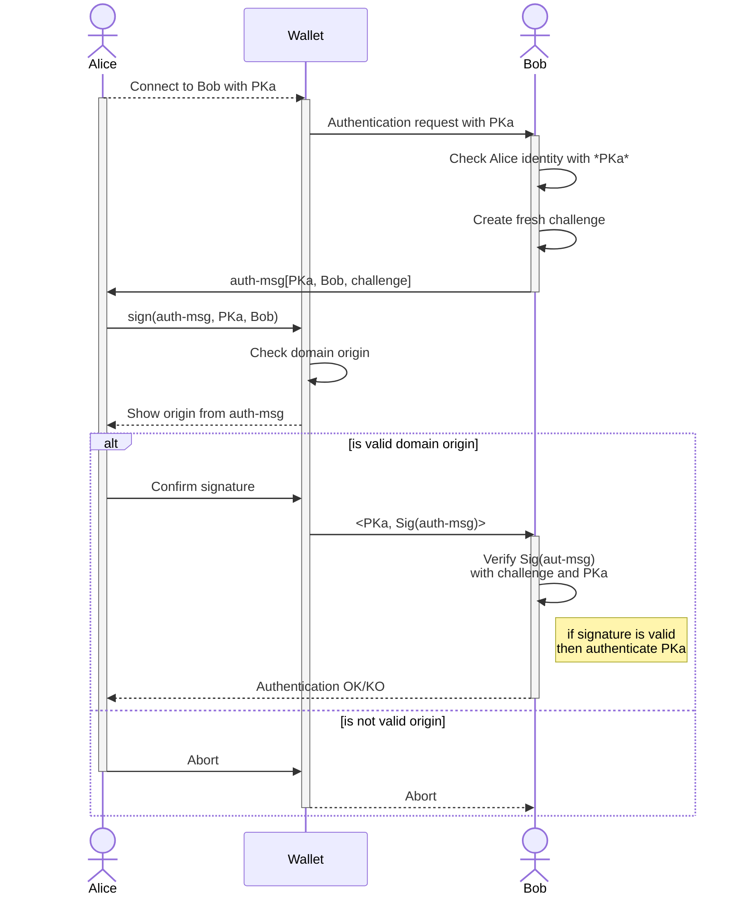
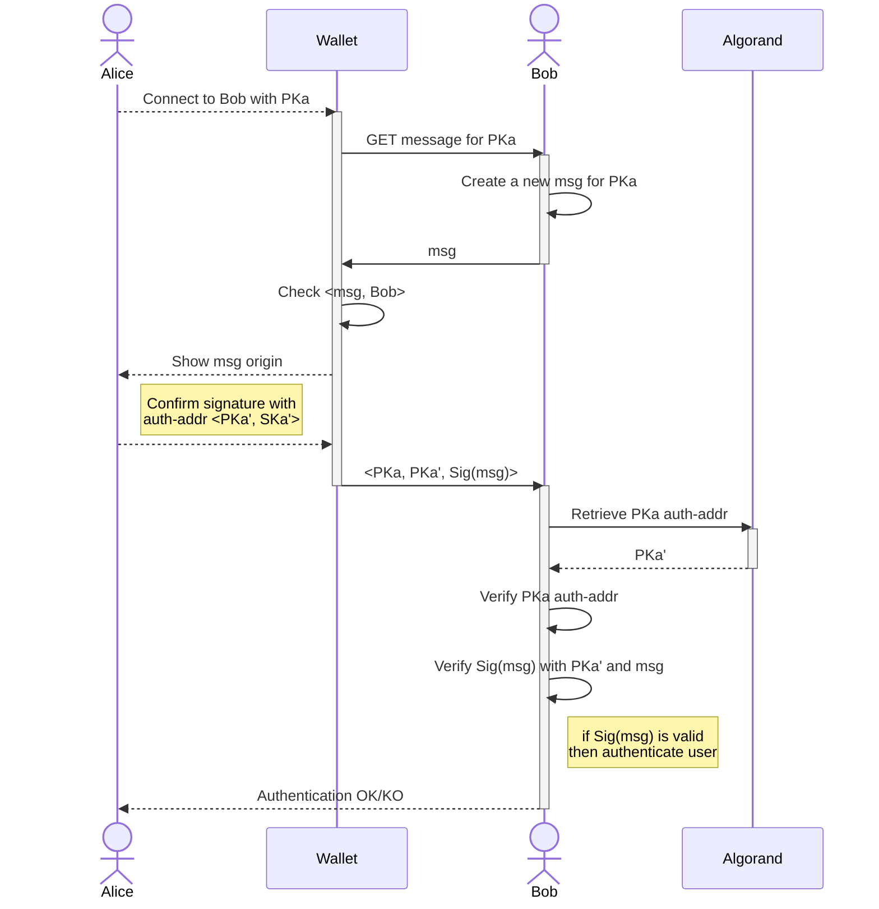
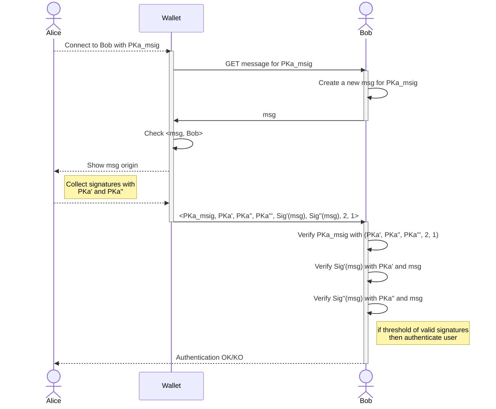

# Authentication with Algorand accounts

A standard for authentication with Algorand accounts.

## Abstract

This ARC provides an authentication standard for Algorand accounts. It allows users to login with third party services by proving the ownership of their Algorand account. This approach fosters a novel passwordless authentication method for both web2 and web3 applications.

### Definitions

- **Blockchain account**: a public/secret key pair <*PK, SK*> that identify an on-chain entity;
- **Algorand account**: a blockchain account on Algorand; it can be a <a href="https://developer.algorand.org/docs/get-details/transactions/signatures/#single-signatures">Single Signature</a> account or a <a href="https://developer.algorand.org/docs/get-details/transactions/signatures/#multisignatures">Multi Signature</a> account;
- **Algorand address**: is the identifier of an Algorand account derived from the account's public key;
- **User**: the owner of the Algorand account;
- **Verifier**: a *system* that needs to verify the identity of a User; it can be a traditional Web2 application, service provider, or in general an off-chain component;
- **dApp**: a decentralized Algorand application that natively runs on the Algorand blockchain, aka "*smart contract*";
- **Wallet**: an off-chain application that stores the secret key of an Algorand account; it provides transactions visualization and signature functionalities;
- **message**: a generic string of bytes;
- **proof of ownership**: a message signed with the secret key of a blockchain identity.

## Motivation

Algorand account owners need seamless authentication to interact with both Algorand dApps and traditional off-chain services and applications. A single source of authentication is crucial to prevent fragmentation between user credentials (e.g. username/password, PIN, public/secret key pair, etc.) and blockchain accounts.

Many Algorand applications already support Algorand account login mechanisms by requesting the signing of dummy transactions. Although this approach fosters rapid adoption and does not require additional Wallet functions, it also poses security risk to User accounts and assets. Familiarizing users with signing dummy transactions may expose them to potential threats such as phishing attacks and account theft.

This ARC established a standard for authenticating Algorand accounts in traditional off-chain services by signing a well structured authentication message. The standard also provides the specifications for authenticating Rekeyed and MultiSignature Algorand accounts, and for Wallets to verify authentication requests.

## Specification

The key words "**MUST**", "**MUST NOT**", "**REQUIRED**", "**SHALL**", "**SHALL NOT**", "**SHOULD**", "**SHOULD NOT**", "**RECOMMENDED**", "**MAY**", and "**OPTIONAL**" in this document are to be interpreted as described in <a href="https://www.ietf.org/rfc/rfc2119.txt">RFC-2119</a>

> Comments like this are non-normative.

Interfaces are defined in TypeScript. All the objects that are defined are valid JSON objects, and all JSON string types are UTF-8 encoded.

This ARC uses interchangeably the terms "*address*", "*public key*", and "*PK*" to indicate the on-chain identifier of a blockchain account, and in particular an Algorand address.

### Overview

This document describes a standard approach for authenticating to an off-chain Verifier with Algorand accounts. The Verifier requires a proof of ownership of the Algorand account to User by requesting the signature of a standard authentication message.

Summarizing, given an Algorand account <*PKa, SKa*>, this ARC defines a standard for:

- Users to create a [ARC-31](./arc-0031.md) compliant Algorand account proof of ownership with *SKa*;
- Verifiers to check [ARC-31](./arc-0031.md) compliant Algorand account proof of ownership with *PKa*.

> It is worth noting that Algorand accounts are user-friendly objects derived from traditional 32-bytes cryptographic public keys. A detailed description of this transformation can be found on the <a href="https://developer.algorand.org/docs/get-details/accounts/#keys-and-addresses">developer portal</a>.

### Assumptions

Given an Algorand account <*PKa, SKa*>, the standard works under the following assumptions:

- User and Verifier communicate over SSL/TLS encrypted channels;
- The User authenticates with *PKa*;
- The Verifier keeps the mapping between the User and *PKa*;
- For each *PKa* the Verifier generates a fresh message with a unique challenge;
- The challenge is arbitrarily and unique per authentication request (this challenge ensures protection against <a href="https://en.wikipedia.org/wiki/Replay_attack">replay attacks</a>);
- The account secret key *SKa* is kept in a Wallet;
- Users do not authenticate with Algorand <a href="https://developer.algorand.org/docs/get-details/dapps/smart-contracts/smartsigs/modes/#logic-signatures">LogicSigs</a> or <a href="https://developer.algorand.org/docs/get-details/dapps/smart-contracts/apps/#application-account">Application accounts</a>.

### Authentication Mechanism

The ARC-31 authentication works as follows: the User sends an authentication request to the Verifier with the Algorand account <*PKa, SKa*> stored in a Wallet. The Verifier checks *PKa* and generates an authentication message `auth-msg`.

> In a reference implementation, the Verifier **SHOULD** maintain the mapping between the User and the *PKa*.

 The Verifier sends the `auth-msg` back to the User which signs it with the Algorand account secret key *SKa*, as proof of ownership. The signature MUST be processed using the `signData` method of the Wallet.

 Wallets **MUST** check that the `auth-msg` origin domain matches with the expected Verifier domain declared by the User (this check protects Users from <a href="https://en.wikipedia.org/wiki/Man-in-the-middle_attack">man-in-the-middle attacks</a>).
 
 The signed `auth-msg` is then trasmitted to the Verifier, who validates it and eventually authenticates the User.

>ARC-0031 does not handle authentication session. To establish authentiucated sessions, the implementation **MAY** define a session token exchanged between Verifier and User.



The diagram shows a User, **Alice**, owner of an Algorand account <*PKa, SKa*>, that authenticates to a Verifier, **Bob**. The secret key, *SKa*, of Alice's account is securely stored by the **Wallet**.

The ARC-31 authentication mechanism **MUST** follow these steps:

1. The User connects *PKa* with the Waller and sends an authentication request the Verifier;
2. The Verifier first checks that *PKa* is registred with the User, then generates a unique `challenge` to trasmit an `auth-msg`;
3. The User **MUST** sign the `auth-msg` calling the `signData` method of the Wallet;
4. The Wallet **MUST** check if message is genuine;
5. If success, the User approves the signature and returns the result to the Verifier;
6. The Verifier checks the signature validity against the User's *PKa* and `challenge`;
7. If the signature is valid, the User is authenticated.

### Authentication Message

The *Authentication Message*, `auth-msg`, represents the request that a Verifier send to the User to proof the ownership of an Algorand account. The request is encoded in JSON and consists of the following parameters:

- `domain name`: the Verifier's domain;
- `Algorand address`: User's *PKa* to be authenticated;
- `challenge`: unique/random bytes generated by the Verifier;
- `chainId`: Identifier of the Algorand network in which the Algorand account resides;
- `description`: (optional) general description of the Verifier;
- `metadata`: (optional) arbitrary data.

The domain name **MUST** be encoded as `protocol`://`domain`. `protocol` **MUST** be equal to `https`; `domain` **MUST** indicate the exact domain, for example `www.mydomain.com`.

The `challenge` **MUST** be unique for each authentication and **MUST NOT** be used more than once to avoid replay attacks.

The structure of an `auth-msg` JSON object is:

```typescript
interface AuthMessage {
 /** The domain name of the Verifier */
 domain: string;
 /** Algorand account to authenticate with, encoded as a 32-bytes Algorand address*/
 authAcc: string;
 /** Unique random challenge generated by the Verifier */
 challenge: string;
 /** Algorand network identifier, encoded as a 32-bytes genesis hash of the network */
 chainId: string;
 /** Optional description of the Verifier */
 desc?: string;
 /** Optional metadata */
 meta?: string;
}
```

For example:

```json
{
  "domain": "https://www.verifierdomain.com",
  "authAcc": "KTGP47G64KCXWJS64W7SGJNKTHE37TYDCI64USXI3XOYE6ZSH4LCI7NIDA",
  "challenge": "1234abcde!%",
  "chainID": "wGHE2Pwdvd7S12BL5FaOP20EGYesN73ktiC1qzkkit8",
  "desc": "The Verifier",
  "meta": "arbitrary attached data",
}
```

#### Signing the Authentication Message

The `auth-msg` **SHOULD** be prepended with the prefix `"arc0031"`, like `msg =("arc0031" + auth-msg)`. This enables domain separation and avoids collision with other signed messages.

### Authenticate Rekeyed Accounts

Algorand accounts can be rekeyed. Rekeying means that the signing key of a static public address *PKa* is dynamically rotated to another secret key. In this case, the original address controlled by *SKa'* is called *authorization address`, of *PKa*. This address can sign on behalf of *PKa*. 

> To learn more about Algorand Rekeying feature visit the <a href="https://developer.algorand.org/docs/get-details/accounts/rekey/?from_query=rekey#create-publication-overlay">Rekey section</a> on the developer portal.

The `auth-add` can be fetched directly from the Algorand blockchain with the <a href="https://developer.algorand.org/docs/rest-apis/algod/v2/#get-v2accountsaddress">account API</a>. The API returns the details for a given address *PKa*. The `auth-addr` param, if not empty, indicates the authorization address.

To authenticate with a rekeyed account:

- the authentication message MUST be signed with the secret key of the `auth-addr`
- the User MUST communicate the `auth-addr` used for signging the `auth-msg` to the Verifier
- the Verifier MUST check the validity of the `auth-addr` by querying the Algorand blockchain on the respective `chainId` specified in the `auth-msg`. This is crucial to ensure that the Algorand address used for authentication is rekeyed on the network referenced in the authentication message.

The diagram below shows the protocol workflow with the authentication address *<PKa', SKa'>*.



### Authenticate Multisignature Accounts

Algorand accounts can be Multisignature (or MultiSig). A MultiSig account is a logical representation of an ordered set of addresses with a threshold and version.

> To learn more about Algorand MultiSig feature visit the [Multisignature section](https://developer.algorand.org/docs/get-details/accounts/create/#multisignature) of the developer portal.

The ARC-31 allows MultiSig accounts to be used for authentication. Assuming a MultiSig address *PKa_msig* composed by three Algorand accounts identified with the addresses *PKa', PKa'', PKa'''*, `threshold=2`, and `version=1`, the authentication should work as follows:

1. An authentication request with *PKa_msig* is sent from the User to the Verifier;
2. The Verifier responds with a new authentication message `msg`;
3. The User collects the threshold signatures of `msg` and responds with *<PKa_msig, PKa', PKa'', PKa''', Sig'(msg), Sig''(msg), 2, 1>*, where *PKa*s are the ordered set of addresses of *PKa_msig*, *Sig*s are the collected signatures, `2` is the threshold and `1` is the MultiSig version;
4. The Verifier firstly checks the *PKa_msig* against the list of addresses, the threshold and the version received, then verifies the signatures; if a threshold of valid signatures is received, the User can be authenticated.

The diagram below details the protocol handling MultiSig accounts.



### How to verify a digital signature?

A digital signature generated with the secret key *SKa* of an Algorand account can be verified with its respective 32-byte public key *PKa*. The Verifier needs to decode the public key *PK* from the Algorand address, and it must know the original `auth-msg`. For example, assuming the digital signature `Sig(msg)` the Verifier can validate it using the Algorand SDK as follows:

1. decode the Algorand address into a traditional 32-bytes public key *PK*;
2. Compute `msg =("AX" + msgpack_encode(auth-msg))`;
3. use an open-source cryptographic library (e.g. Python lib PyNaCl) to verify the signature `Sig(msg)` with *PK*.

## Security Considerations

An attacker **MAY** attempt to cheat with the system by impersonating another User or Verifier. This is possible if the attacker can intercept the digital signature and use the same signature in a replay-attack or man-in-the-middle attack. To mitigate this scenario, the Verifier **MUST** generate a new message for each authentication request, and Wallets must always check the `auth-msg` domain field.

## Reference Implementation

The ARC-31 reference implementation is available in the `assets` directory of this repo `assets/arc-0031`. It provides an example of client-server authentication with ARC-31. The reference implementation uses [MyAlgoWallet](https://wallet.myalgo.com/) as the unique wallet (at the time of writing) providing the possibility of signing random bytes.

Reference implementation credits: [mrcointreau](https://github.com/mrcointreau)

## Copyright

Copyright and related rights waived via <a href="https://creativecommons.org/publicdomain/zero/1.0/">CCO</a>.
