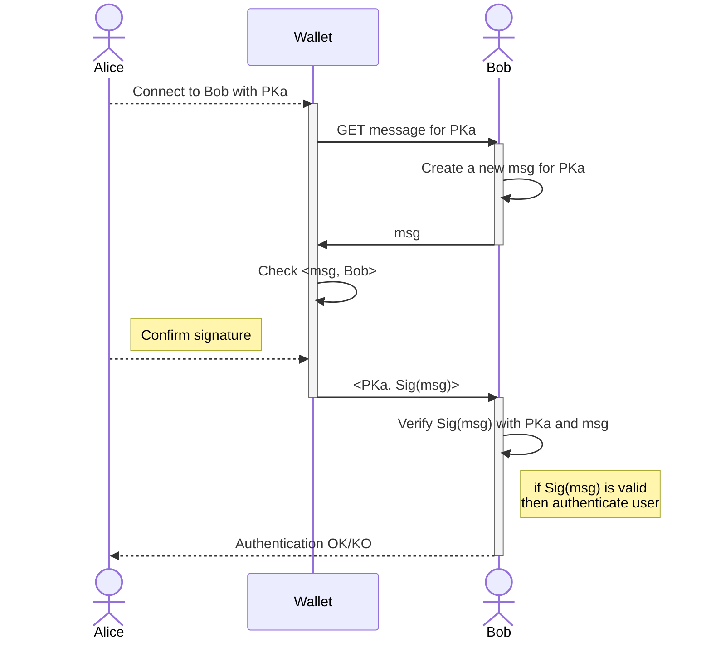
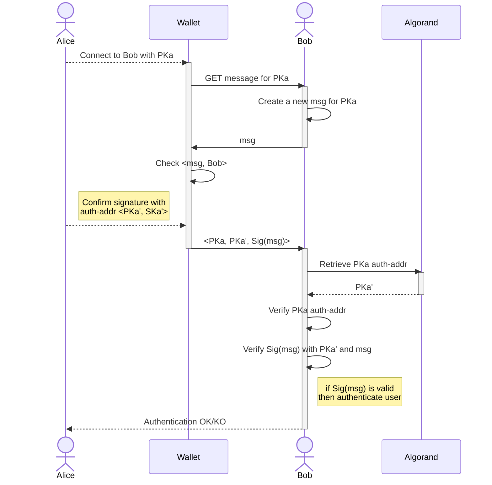

# Authentication with Algorand accounts

A standard for authentication with Algorand accounts.

## Abstract

This ARC introduces a standard for authenticating users with their Algorand accounts. It leverages the public-secret key <*PK, SK*> encryption schema to verify the identity of a user, owner of an Algorand account. This approach fosters the adoption of novel identity management systems for both Web3 and Web2 applications.

### Definitions

- **System**: any frontend/backend application, service provider, or in general an entity not based on blockchain;
- **Credentials**: any kind of unique authentication mean used by users to access their online accounts, e.g. username/password, PIN, public/secret key pair;
- **Blockchain identity**: a public/secret key pair <*PK, SK*> representing a blockchain account;
- **Algorand account**: a blockchain identity on Algorand identified with the key pair <*PKa, SKa*>;
- **Algorand address**: the public key *PKa* of an Algorand account;
- **User**: an Algorand account holder;
- **Verifier**: a *system* that needs to verify the identity of a User;
- **dApp**: a decentralized Algorand application that natively runs on the Algorand blockchain, aka "*smart contract*",
- **Wallet**: an off-chain application that stores the secret keys *SKa*s of Algorand accounts and can display and sign transactions for these accounts;
- **message**: a generic string of bytes;
- **digital signature**: a message signed with the private key of a blockchain identity, and specifically in this ARC with the *SKa*;

## Motivation

In Web3 users interacting with dApps must be authenticated with a blockchain identity (account for Algorand). Having dApps and traditional Web2 systems increasingly more interconnected, it is not difficult to imagine users consuming services both from a dApp and a Web2 application simultaneously. In this case, a single source of authentication should be used to avoid separation between credentials used for dApps and traditional Web2 services.

This ARC provides a standard for users' authentication in Web2 services leveraging Algorand accounts.

## Specification

The key words "**MUST**", "**MUST NOT**", "**REQUIRED**", "**SHALL**", "**SHALL NOT**", "**SHOULD**", "**SHOULD NOT**", "**RECOMMENDED**", "**MAY**", and "**OPTIONAL**" in this document are to be interpreted as described in <a href="https://www.ietf.org/rfc/rfc2119.txt">RFC-2119</a>
> Comments like this are non-normative.

Interfaces are defined in TypeScript. All the objects that are defined are valid JSON objects, and all JSON string types are UTF-8 encoded.

This ARC uses interchangeably the terms "*blockchain address*", "*public key*", and "*PK*" to indicate the on-chain address of a blockchain identity, and in particular of an Algorand account.

### Overview

This document describes a standard approach to authenticate a User with a blockchain identity. In particular, an Algorand address is used as a *unique identifier*, and the secret key of that address is used to digitally sign a *message* as a proof of identity checked by a Verifier.

To sum up, given an Algorand account <*PKa, SKa*>, this ARC defines a standards for:

- create an [ARC-31](./arc-0031.md) compliant digital signature with *SKa*;
- verify an [ARC-31](./arc-0031.md) compliant digital signature with *PKa*.

### Assumptions

The standard proposed in this document works under the following assumptions:

- User and Verifier communicate over secure SSL/TLS encrypted channels;
- The Verifier knows the Users’ *PKa*;
- For each *PKa* the Verifier generates a unique message to be signed;
- The message MUST change arbitrarily for each authentication request to avoid [replay attacks](https://en.wikipedia.org/wiki/Replay_attack);
- User's secret key is safely kept into a Wallet;
- Users do not change their public address *PKa* for authentication;
- Users **MUST** use Algorand compliant keys to sign the messages;
- LogicSigs and Applications are not supported;

### Authentication Mechanism

The authentication mechanism defined in this ARC works as follows: a Users sends an authentication request to the Verifier specifying the Algorand account <*PKa, SKa*>.

> Note that Algorand transforms traditional 32-bytes cryptographic keys into more readable and user-friendly objects. A detailed description of such a transformation can be found in the <a href="https://developer.algorand.org/docs/get-details/accounts/#keys-and-addresses">developer portal</a>.

The Verifier requests the User to sign a random message with the secret key *SKa* controlling the User's Algorand account. The User generates the digital signature with *SKa* stored into the Wallet, and sends it back to the Verifier. At that stage, the Wallet **MUST** check the message origin with the expected Verifier (to protect Users from [man-in-the-middle attacks](https://en.wikipedia.org/wiki/Man-in-the-middle_attack)). Finally, the Verifier verifies the signature and, if is all good, authenticates the User.



The diagram above summarizes the proposed mechanism. We consider the User, **Alice**, owner of an Algorand account <*PKa, SKa*> of which the secret key *SKa* is stored into a **Wallet**.

> A wallet is any type of Algorand wallet, such as hot wallets like <a href="https://www.purestake.com/technology/algosigner/">AlgoSigner</a>, <a href="https://wallet.myalgo.com/">MyAlgo Wallet</a> for browser and mobile wallets used through <a href="https://developer.algorand.org/docs/get-details/walletconnect/">WalletConnect</a>, and cold wallets like the <a href="https://www.ledger.com">Ledger Nano</a>.

Alice authenticates herself to the Verifier **Bob** sending back the digital signature `Sig(msg)` of message `msg` provided by Bob. The mechanism proceeds as follows:

1. Alice sends an authentication request with *PKa* to Bob;
2. Bob generates a message `msg` to be signed by Alice's *PKa*;
3. Alice signs `msg` using her wallet; the Wallet inspects `msg` checking that it is an authentication for Bob;
4. Alice sends back the tuple `<PKa, Sig(msg)>` to Bob;
5. Bob verifies `Sig(msg)` with Alice's *PKa* and the `msg`;
6. Bob authenticates Alice if the signature is valid.

The ARC-31 defines a standardized message for authentication, called *Authentication Message*.

### Authentication Message

An Authentication Message is a sequence of bytes representing a message to be signed. The Verifier asks Users to sign an *Authentication Message* with their secret keys. Such a message **MUST** include the following information:

- `domain name`: name of the Verifier domain;
- `Algorand address`: User's *PKa* to be authenticated;
- `nonce`: a unique/random value generated by the Verifier;
- `description`: Verifier details or general description;
- `metadata`: arbitrary message data.

The *Authentication Message* is represented with the following interface:

```typescript
interface AuthMessage {
 /** The domain name of the Verifier */
 domain: string;
 /** Algorand account to authenticate with*/
 authAcc: string;
 /** Unique random nonce generated by the Verifier */
 nonce: string;
 /** Optional, description of the Verifier */
 desc?: string;
 /** Optional, metadata */
 meta?: string;
}
```

The message **SHOULD** be compliant with [ARC-2](https://github.com/algorandfoundation/ARCs/blob/main/ARCs/arc-0002.md), having the parameter `\<dapp-name\>`=`arc31`, for example:

```json
arc31:j{
 "domain": "www.verifierdomain.com",
 "authAcc": "KTGP47G64KCXWJS64W7SGJNKTHE37TYDCI64USXI3XOYE6ZSH4LCI7NIDA",
 "nonce": "1234abcde!%",
 "desc": "The Verifier",
 "meta": "arbitrary attached data",
}
```

The `nonce` field **MUST** be unique for each authentication and **MUST NOT** be used more than once to avoid replay attacks.

#### Signing the Authentication Message

The message exchanged between Verifier and Wallet **MUST** be formatted as a base64 encoded [msgpacked](https://msgpack.org/index.html) *authentication message* `msg`, prefixed with the `"AX"` domain separator. Wallets must allow users to sign arbitrary bytes of the form `(AX + msgpack_encode(msg))`.

### Authenticate Rekeyed Accounts

Algorand accounts can be rekeyed, meaning that the signing key of a static public address *PKa* is dynamically rotated to another secret key *SKa'*. In this case, the original address controlled by *SKa'* is called *authorization address* *PKa'* and it **MUST** be used to check the signature of *PKa*.

> To learn more about Algorand Rekeying feature visit the [Rekey section](https://developer.algorand.org/docs/get-details/accounts/rekey/?from_query=rekey#create-publication-overlay) of the developer portal.

The *authorization address* can be checked by retrieving the account information from the Algorand blockchain. Using the [account API](https://developer.algorand.org/docs/rest-apis/algod/v2/#get-v2accountsaddress), a Verifier can inspect the Accounts details and retrieve the `auth-addr` parameter. This parameter, if not empty, indicates the *authorization address* *PKa'*.

The ARC-31 allows rekeyed accounts to be used for authentication. In this case, the Verifier must check the signature of a *PKa* with the *authorization address*, *PKa'*. This address must be provided by the User along with the original address *PKa* and the digital signature. The Verifier, on his side, can check the validity of *PKa'* by looking at the Algorand blockchain. The diagram below details the protocol handling rekeyed accounts.



### Authenticate MultiSignature Accounts


<!-- TODO: 
  1. Use msgpack to exchange the message; 

  txn = encoding.msgpack_encode(self)
        to_sign = constants.txid_prefix + base64.b64decode(txn)


  2. How to handle rekeyed accounts: The Verifier can query the blockchain to check whether the PK has been rekeyed to a new auth-addr; if that's the case it can verify the signature against the auth-addr PK;
  3. How to handle multisig accounts? The server knows the msig PKs, the Threshold, and the Version; msig is authenticated upon receiving threshold signatures;
  >

<!-- #### Simple Authentication Message

The *Simple Authentication Message* is a sequence of bytes representing an ARC-14 *Authentication Message*. It **SHOULD** be used in contexts that support signatures of random bytes. A *Simple Authentication Message* is an *Authentication Message* prepended with the prefix `arc14` for domain separation. It **MUST** be used by wallets to check the Verifier domain to prevent man-in-the-middle attacks. -->

### How to verify a digital signature generated with Algorand keys?

A digital signature generated with the secret key *SKa* of an Algorand account can be verified with its respective 32-byte public key *PKa*. The Verifier needs to decode the public key *PK* from the Algorand address, and it must know the original *Authentication Message*. For example, assuming the digital signature `Sig(msg)` of the *Authentication Message* `msg`, the Verifier can validate it using the Algorand SDK as follows:

1. decode the Algorand address into a traditional 32-bytes public key *PK*;
2. use an open-source cryptographic library to verify the signature `Sig(msg)` (e.g. Python lib PyNaCl); usually those libraries work with raw bytes and some encoding/decoding magic is needed:
    - the message msg **MUST** be bytes encoded with msgpack. For example, with the Algorand SDK for Python this can achieved with `encoding.msgpack_encode(msg)`;
    - if the message is a *Simple Message Transaction*, then it **MUST** be prefixed with the string `“arc14”`, otherwise it is a `Transaction` object and **MUST** be prefixed with the string `“TX”`;
    - the digital signature `Sig(msg)` **MUST** be decoded from base64 with the base64 library of the SDK. For example with the Python SDK this can be achieved with `base64.b64decode(Sig(msg))`.

## Security Considerations

An attacker **MAY** attempt to cheat with the system by impersonating another User. This is possible if the attacker can intercept the digital signature and use the same signature in a replay-attack. To mitigate this scenario, the Verifier **MUST** generate a new message for each authentication request. In this way, the digital signature results valid for one session and cannot be spent in further authentication requests.

## Copyright

Copyright and related rights waived via <a href="https://creativecommons.org/publicdomain/zero/1.0/">CCO</a>.
