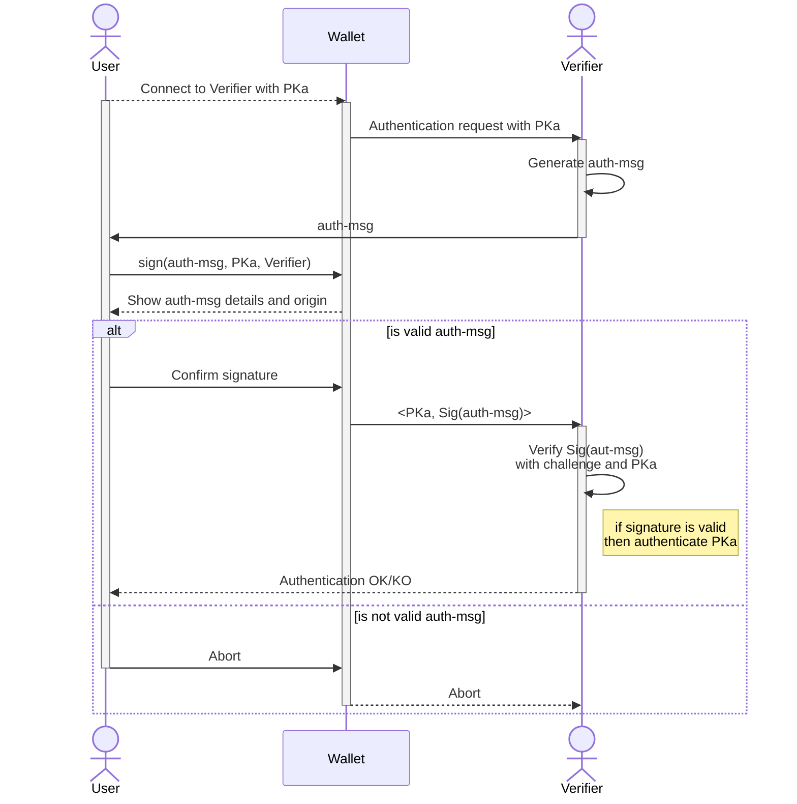
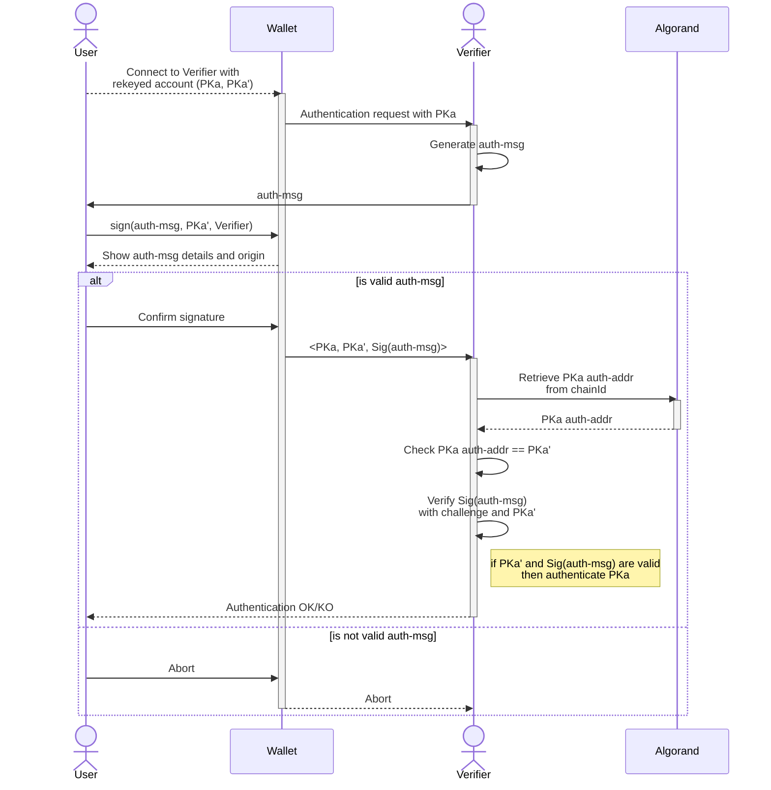
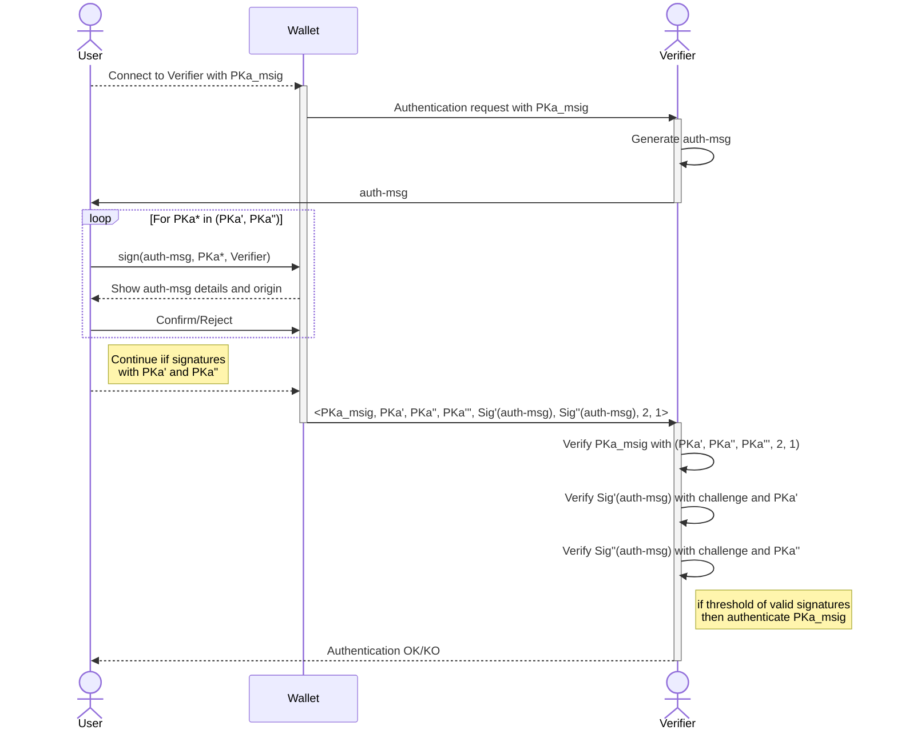

# Authentication with Algorand accounts

A standard for authentication with Algorand accounts.

## Abstract

This ARC provides an authentication standard for Algorand accounts. It allows users to login with third party services by proving the ownership of their Algorand account. This approach fosters a novel passwordless authentication method bridging self-custodial identities with traditional off-chain applications.

## Definitions

- **Blockchain account**: a public/secret key pair <*PK, SK*> that identifies an on-chain entity;
- **Algorand account**: a blockchain account on Algorand; this ARC only supports <a href="https://developer.algorand.org/docs/get-details/transactions/signatures/#single-signatures">Single Signature</a> account and <a href="https://developer.algorand.org/docs/get-details/transactions/signatures/#multisignatures">Multi Signature</a> accounts;
- **Algorand address**: is the identifier of an Algorand account derived from the account's public key;
- **User**: the owner of the Algorand account;
- **Verifier**: a *system* that needs to verify the identity of a User; it can be a traditional Web2 application, service provider, or in general an off-chain component;
- **Wallet**: an off-chain application that stores the secret key of an Algorand account; it provides transactions visualization and signature functionalities;
- **Message**: a generic string of bytes;
- **Proof of ownership**: a message signed with the secret key of a blockchain identity.

## Motivation

Algorand account owners need seamless authentication to interact with both Algorand applications and traditional off-chain services. A single source of authentication is crucial to prevent fragmentation between user credentials (e.g. username/password, PIN, public/secret key pair, etc.) and blockchain accounts.

Many applications in the ecosystem already provide custom login mechanisms by leveraging the signing of dummy transactions. Although this approach fosters rapid adoption and does not require additional Wallet functions, it also exposes security risk to User accounts and assets. Getting users used to signing dummy transactions may expose them to potential threats such as phishing attacks and account theft.

This ARC establishes a standard for authenticating Algorand accounts in traditional off-chain services by signing a well structured authentication message. The standard also provides a specifications for Rekeyed and Multi Signature accounts, and for Wallets to verify authentication requests.

## Specification

The key words "**MUST**", "**MUST NOT**", "**REQUIRED**", "**SHALL**", "**SHALL NOT**", "**SHOULD**", "**SHOULD NOT**", "**RECOMMENDED**", "**MAY**", and "**OPTIONAL**" in this document are to be interpreted as described in <a href="https://www.ietf.org/rfc/rfc2119.txt">RFC-2119</a>

> Comments like this are non-normative.

Interfaces are defined in TypeScript. All the objects that are defined are valid JSON objects, and all JSON string types are UTF-8 encoded.

This ARC uses interchangeably the terms "*address*", "*public key*", and "*PK*" to indicate the on-chain identifier of a blockchain account, and in particular an Algorand address.

## Overview

This document describes a standard approach for authenticating to an off-chain Verifier with an Algorand account. The User proves the ownership of the Algorand account to the Verifier by signing a standard authentication message.

Summarizing, this ARC defines a standard for:

- Users to create a [ARC-31](./arc-0031.md) compliant Algorand account proof of ownership;
- Verifiers to check [ARC-31](./arc-0031.md) compliant Algorand account proof of ownership.

> Algorand accounts are user-friendly objects derived from traditional 32-bytes cryptographic public keys. A detailed description of this transformation can be found on the <a href="https://developer.algorand.org/docs/get-details/accounts/#keys-and-addresses">developer portal</a>.

### Assumptions

Given an Algorand account <*PKa, SKa*>, the standard works under the following assumptions:

- User and Verifier communicate over SSL/TLS encrypted channels;
- The User authenticates with *PKa*;
- For each *PKa* the Verifier generates a fresh authentication message;
- The account secret key *SKa* is stored in a Wallet;
- Users cannot authenticate with Algorand <a href="https://developer.algorand.org/docs/get-details/dapps/smart-contracts/smartsigs/modes/#logic-signatures">LogicSigs</a> or <a href="https://developer.algorand.org/docs/get-details/dapps/smart-contracts/apps/#application-account">Application accounts</a>.

### Authentication Mechanism

The ARC-31 authentication works as follows:

- the User sends an authentication request to the Verifier specifying the Algorand account to use for login;
- the Verifier generates a standard authentication message (`auth-msg`) and send it back to the User;
- the User attempts signs the received message with the `signData` function of the Wallet (WIP: passing those args...);
- the signed `auth-msg` is sent back to the Verifier prefixed with `arc0031`, which checks that the message is genuine and the signature is valid.

> The Verifier is **RECOMMENDED** to implement a registration mechanism to onboard users and maintain the mapping between a User identity and the *PKa*.

> ARC-0031 does not provide specification for authentication session. To establish an authenticated sessions, the implementation **MAY** define a session token exchanged between Verifier and User.

The authentication workflow is summarized in the diagram below.



## Authentication Message

The Authentication Message, `auth-msg`, represents the request that a Verifier send to the User to proof the ownership of an Algorand account. The request is encoded in JSON and consists of the following parameters:

- `domain name`: the Verifier's domain;
- `Algorand address`: User's *PKa* to be authenticated;
- `challenge`: unique/random bytes generated by the Verifier;
- `chainId`: Identifier of the Algorand network in which the Algorand account resides;
- `description`: (optional) general description of the Verifier;
- `metadata`: (optional) arbitrary data.

The domain name **MUST** be encoded as `protocol`://`domain`. `protocol` **MUST** be equal to `https`; `domain` **MUST** indicate the exact domain, for example `www.mydomain.com`.

The `challenge` **MUST** be unique for each authentication and **MUST NOT** be used more than once to avoid <a href="https://en.wikipedia.org/wiki/Replay_attack">replay attacks</a>).

The structure of an `auth-msg` JSON object is:

```typescript
interface AuthMessage {
 /** The domain name of the Verifier */
 domain: string;
 /** Algorand account to authenticate with, encoded as a 32-bytes Algorand address*/
 authAcc: string;
 /** Unique random challenge generated by the Verifier */
 challenge: string;
 /** Algorand network identifier, encoded as a 32-bytes genesis hash of the network */
 chainId: string;
 /** Optional description of the Verifier */
 desc?: string;
 /** Optional metadata */
 meta?: string;
}
```

For example:

```json
{
  "domain": "https://www.verifierdomain.com",
  "authAcc": "KTGP47G64KCXWJS64W7SGJNKTHE37TYDCI64USXI3XOYE6ZSH4LCI7NIDA",
  "challenge": "1234abcde!%",
  "chainID": "wGHE2Pwdvd7S12BL5FaOP20EGYesN73ktiC1qzkkit8",
  "desc": "The Verifier",
  "meta": "arbitrary attached data",
}
```

### Sign the Authentication Message

The `auth-msg` **MUST** be prepended with the prefix `"arc0031"`, like `msg =("arc0031" + auth-msg)` and signed with the `signData` method provided by the Wallet (WIP ref new ARC). This enables domain separation and avoids collision with other signed messages.

### Verify the Authentication Message

The signed message **MUST** be verified with the respective 32-byte public key of the Algorand account *PKa*:

- The Verifier **MUST** decoded the Algorand address into a traditional 32-bytes public key *PK*;
- The received message **MUST** be checked against the expected values (i.e. `domain`, `authAcc`, `challenge`)
- The signature **MUST** be checked with the decoded PK and the `auth-msg` prepended with the prefix `arc-0031`

Wallets **MUST** check that the `auth-msg` origin domain matches with the expected Verifier domain declared by the User (this check protects Users from <a href="https://en.wikipedia.org/wiki/Man-in-the-middle_attack">man-in-the-middle attacks</a>).

> A reference implementation can use an open-source cryptographic library (like Python lib PyNaCl) to verify the signature with *PK*.

## Authenticate Rekeyed Accounts

Algorand accounts can be rekeyed. Rekeying means that the signing key of a static public address *PKa* is dynamically rotated to another secret key. In this case, the original address controlled by *SKa'* is called *authorization address`, of *PKa*. This address can sign on behalf of *PKa*.

> The Algorand Rekeying feature is explained in the <a href="https://developer.algorand.org/docs/get-details/accounts/rekey/?from_query=rekey#create-publication-overlay">Rekey section</a> of the developer portal.

To authenticate with a rekeyed account:

- the authentication message **MUST** be signed with the secret key of the `auth-addr`
- the Wallet **SHOULD** warn the User that the `auth-msg` will be signed with the account PKa'
- the User **MUST** communicate the `auth-addr` used for signging the `auth-msg` to the Verifier
- the Verifier **MUST** check the validity of the `auth-addr` by querying the Algorand blockchain on the respective `chainId` specified in the `auth-msg`. This is crucial to ensure that the Algorand address used for authentication is rekeyed on the network referenced in the authentication message.

> A reference implementation can getch the `auth-add` using the Algorand <a href="https://developer.algorand.org/docs/rest-apis/algod/v2/#get-v2accountsaddress">account API</a>. The API returns the details for a given address *PKa*, including the `auth-addr` param, if exists.

The diagram below shows the protocol workflow with the authentication address *<PKa', SKa'>*.



## Authenticate Multi Signature Accounts

Algorand accounts can be Multi Signature (or MultiSig). A MultiSig account is a logical representation of an ordered set of Algorand addresses, bound by a threshold and version.

> The Algorand MultiSig feature is explained in the <a href="https://developer.algorand.org/docs/get-details/accounts/create/#multisignature">Multi Signature section</a> of the developer portal.

To authenticate with a MultiSig account:

- the User **MUST** sign the `auth-msg` with a `threshold` of Algorand accounts in the MultiSig
- the User **MUST** communicate to the Verifier the details of the MultiSig used to sign the `auth-msg` and the respective signatures
- the Veifier **MUST** check the validity of the MultiSig with the given details, then verifies the signatures; if there is a `threshold` of valid signatures, then it authenticates the MultiSig.

For example, assuming a MultiSig address *PKa_msig* composed by three Algorand accounts *PKa', PKa'', PKa'''*, and with `threshold=2`, `version=1`:

1. the User initiates the authentication with *PKa_msig*
2. The User generates the signatures of received `auth-msg` and responds to the Verifier with *<PKa_msig, PKa', PKa'', PKa''', Sig'(auth-msg), Sig''(auth-msg), 2, 1>*, where *PKa*s are the ordered set of addresses, *Sig*s are the collected signatures, `2` is the threshold and `1` is the MultiSig version;
3. The Verifier firstly asserts that the MultiSig is genuine by computing *PKa_msig* with the received data, and then checks the signatures. If a threshold of valid signatures has been delivered, the MultiSig can be authenticated.

The diagram below details the protocol workflow with a MultiSig *PKa_msig* with three Algorand accounts.



> In a reference implementation, the User **SHOULD** communicate to the Verifier which *PKa*s of the MultiSig have been used to generate the signatures. For each address it **MAY** be a tuple `<address, bool>` where `bool` is `1` if the PKa has been used, `0` otherwise.
>
>In the diagram example: `<PKa_msig, (PKa', 1), (PKa'', 1), (PKa''', 0), Sig(auth-msg), Sig(auth-msg), 2, 1>`

## Security Considerations

An attacker **MAY** attempt to cheat with the system by impersonating another User or Verifier. This is possible if the attacker can intercept the digital signature and use the same signature in a replay-attack or man-in-the-middle attack. To mitigate this scenario, the Verifier **MUST** generate a new message for each authentication request, and Wallets must always check the `auth-msg` domain field.

## Reference Implementation

The ARC-31 reference implementation is available [here](../assets/arc-0031/).

## Copyright

Copyright and related rights waived via <a href="https://creativecommons.org/publicdomain/zero/1.0/">CCO</a>.
