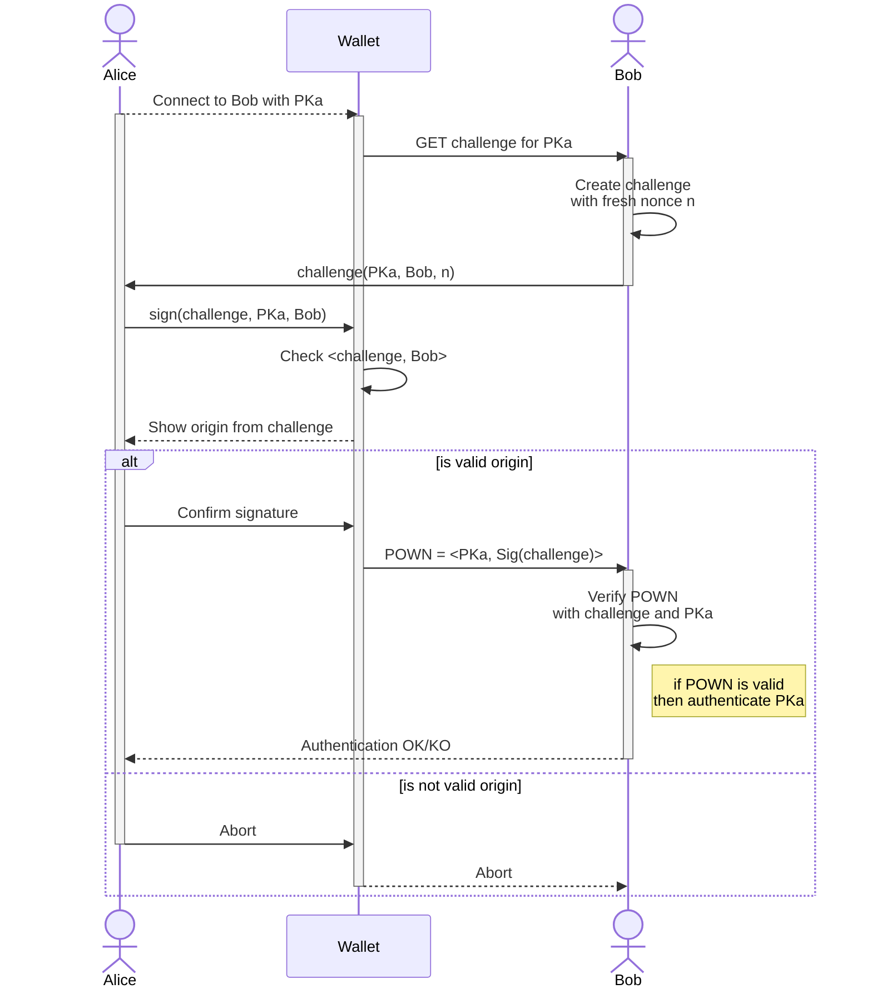
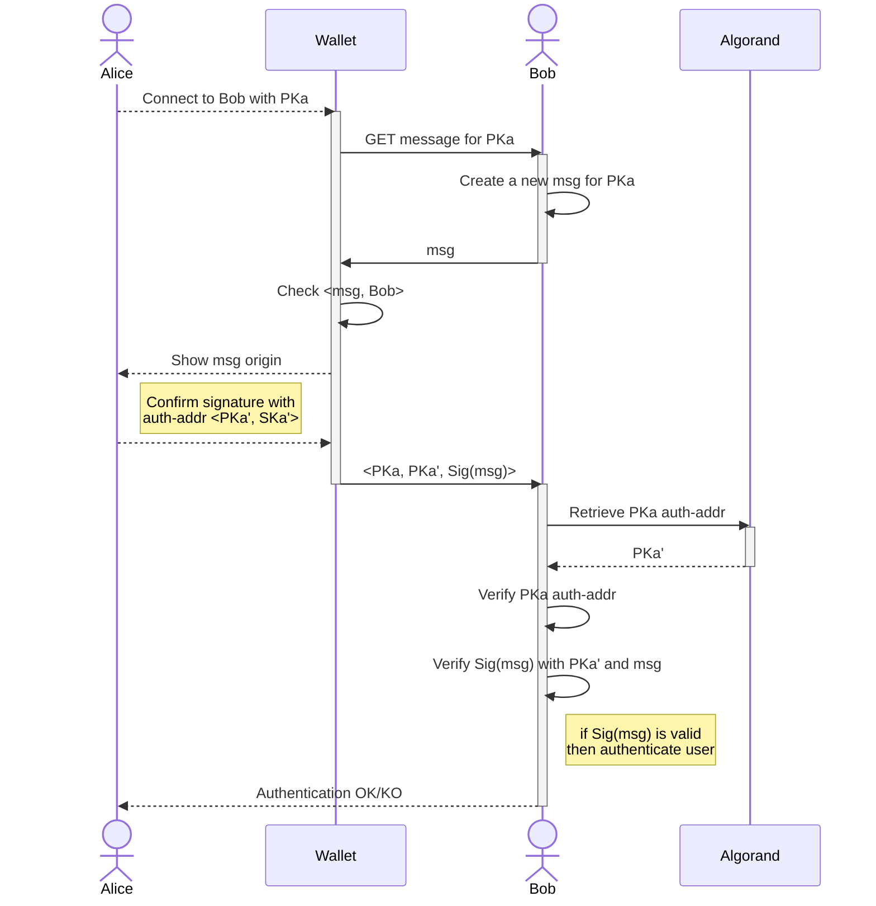
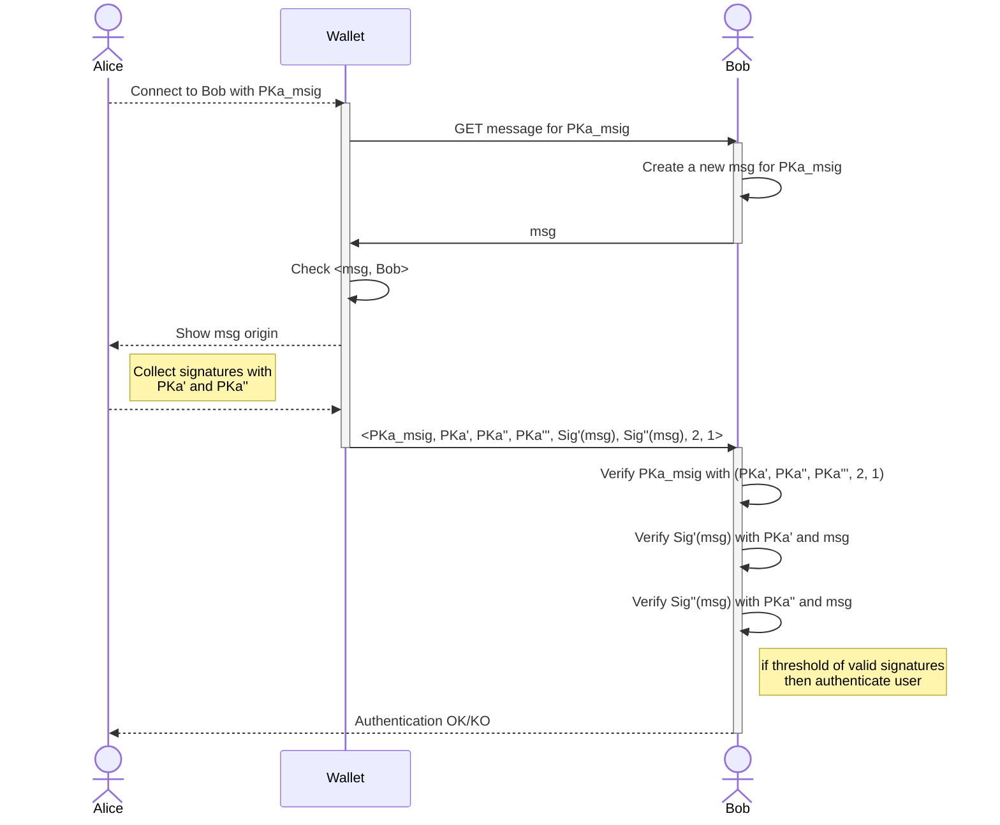

# Authentication with Algorand accounts

A standard for authentication with Algorand accounts.

## Abstract

This ARC provides an authentication standard that uses Algorand accounts. It allows users to login into third party services by proving the ownership of an Algorand account. This approach fosters a novel passwordless authentication for both web2 and web3 applications.

### Definitions

- **System**: any frontend/backend application, service provider, or in general an off-chain component;
- **Credentials**: any authentication identifier a user can use to access an online account (username/password, PIN, public/secret key pair);
- **Blockchain account**: a public/secret key pair <*PK, SK*> that identify an on-chain entity;
- **Algorand account**: a blockchain account on Algorand; it can be a <a href="https://developer.algorand.org/docs/get-details/transactions/signatures/#single-signatures">Single Signature</a> account or a <a href="https://developer.algorand.org/docs/get-details/transactions/signatures/#multisignatures">Multi Signature</a> account;
- **Algorand address**: is the identifier of an Algorand account derived from the account's public key *PK*, and it is identified as *PKa*;
- **User**: the owner of the Algorand account;
- **Verifier**: a *system* that needs to verify the identity of a User;
- **dApp**: a decentralized Algorand application that natively runs on the Algorand blockchain, aka "*smart contract*";
- **Wallet**: an off-chain application that stores the secret key *SKa* of an Algorand account; it provides transactions visualization and signature functionalities;
- **challenge**: a generic string of bytes;
- **proof of ownership**: a challenge signed with the secret key of a blockchain identity.

> Algorand transforms traditional 32-bytes cryptographic keys into more readable and user-friendly objects. A detailed description of such a transformation can be found on the <a href="https://developer.algorand.org/docs/get-details/accounts/#keys-and-addresses">developer portal</a>.

## Motivation

Algorand account owners require seamless authentication to interact with both Algorand dApps and traditional Web2 applications. A single source of authentication is crucial to prevent fragmentation between user credentials on the Web2 and blockchain accounts.

This ARC established a standard for authenticating users in traditional Web2 services by leveraging their Algorand accounts.

## Specification

The key words "**MUST**", "**MUST NOT**", "**REQUIRED**", "**SHALL**", "**SHALL NOT**", "**SHOULD**", "**SHOULD NOT**", "**RECOMMENDED**", "**MAY**", and "**OPTIONAL**" in this document are to be interpreted as described in <a href="https://www.ietf.org/rfc/rfc2119.txt">RFC-2119</a>
> Comments like this are non-normative.

Interfaces are defined in TypeScript. All the objects that are defined are valid JSON objects, and all JSON string types are UTF-8 encoded.

This ARC uses interchangeably the terms "*address*", "*public key*", and "*PK*" to indicate the on-chain identifier of a blockchain account, and in particular of an Algorand account.

### Overview

This document describes a standard approach for a Verifier to authenticate Users with their Algorand accounts. The Verifier identify Users with Algorand addresses. Users generate proof of ownership of their address by digital signing a challenge provided by the Verifier with the account's secret key.

To sum up, given an Algorand account <*PKa, SKa*>, this ARC defines a standards for:

- Users to create a [ARC-31](./arc-0031.md) compliant account proof of ownership with *SKa*;
- verifying a [ARC-31](./arc-0031.md) compliant proof of ownership with *PKa*.

### Assumptions

Given an Algorand account <*PKa, SKa*>, the standard works under the following assumptions:

- User and Verifier communicate over secure SSL/TLS encrypted channels;
- The User authenticates with *PKa*;
- The Verifier knows the Users’ *PKa*;
- For each *PKa* the Verifier generates a unique challenge;
- The challenge **MUST** be arbitrarily and unique per authentication request (avoid <a href="https://en.wikipedia.org/wiki/Replay_attack">replay attacks</a>);
- The account secret key *SKa* is safely stored in a Wallet;
- Algorand <a href="https://developer.algorand.org/docs/get-details/dapps/smart-contracts/smartsigs/modes/#logic-signatures">LogicSigs</a> and <a href="https://developer.algorand.org/docs/get-details/dapps/smart-contracts/apps/#application-account">Application accounts</a> cannot be used for authentication;

### Authentication Mechanism

The ARC-0031 works as follows: a Users connect to its Wallet and sends an authentication request to the Verifier with the Algorand account <*PKa, SKa*>. The Verifier responds with a challenge to be signed as proof of ownership. The User verifies the challenge origin and eventually requests the Wallet to sign the challenge, and generate the proof of ownership (*POWN*).

Wallets **MUST** check that the challenge Verifier (called *origin*) matches with the Verifier expected by the User (this check protects Users from <a href="https://en.wikipedia.org/wiki/Man-in-the-middle_attack">man-in-the-middle attacks</a>).

It the User confirms the signature, the Wallet generates a POWN. The result is sent back to the Verifier which checks the validity of the POWN and eventually authenticates the User. If the User reject the signature, the authentication process aborts.



The diagram considers a User, **Alice**, owner of an Algorand account <*PKa, SKa*>, that authenticates to a Verifier, **Bob**. The secret key, *SKa*, of Alice's account is securely stored by the **Wallet**. 

The happy path ot the authentication mechanism proceeds as follows:

1. Alice connect with *PKa* to the Waller and initiates an authentication to Bob;
2. Bob generates a challenge `challenge` to be signed by Alice;
3. Alice initiates the `challenge` signature with the Wallet;
4. The `challenge` is verified on the Wallet side with the expected origin to be sure it came from Bob;
5. Alice sends back the tuple `<PKa, Sig(msg)>` to Bob;
6. Bob verifies `Sig(msg)` with Alice's *PKa* and `msg`;
7. If the signature is valid, Bob authenticates Alice.

The ARC-31 defines a standardized message for authentication, called *Authentication Message*.

### Authentication Message

An *Authentication Message* `auth-msg` is a sequence of bytes representing a message to be signed. The Verifier requests Users to sign an `auth-msg` with their secret keys. Such a message **MUST** include the following information:

- `domain name`: name of the Verifier domain;
- `Algorand address`: User's *PKa* to be authenticated;
- `nonce`: a unique/random value generated by the Verifier;
- `description`: Verifier details or general description;
- `metadata`: arbitrary message data.

The *Authentication Message* is represented with the following interface:

```typescript
interface AuthMessage {
 /** The domain name of the Verifier */
 domain: string;
 /** Algorand account to authenticate with*/
 authAcc: string;
 /** Unique random nonce generated by the Verifier */
 nonce: string;
 /** Optional, description of the Verifier */
 desc?: string;
 /** Optional, metadata */
 meta?: string;
}
```

The `auth-msg` **SHOULD** be compliant with [ARC-2](https://github.com/algorandfoundation/ARCs/blob/main/ARCs/arc-0002.md), having the parameter `\<dapp-name\>`=`arc31`, for example:

```json
arc31:j{
 "domain": "www.verifierdomain.com",
 "authAcc": "KTGP47G64KCXWJS64W7SGJNKTHE37TYDCI64USXI3XOYE6ZSH4LCI7NIDA",
 "nonce": "1234abcde!%",
 "desc": "The Verifier",
 "meta": "arbitrary attached data",
}
```

The `nonce` field **MUST** be unique for each authentication and **MUST NOT** be used more than once to avoid replay attacks.

#### Signing the Authentication Message

The `auth-msg` **MUST** be exchanged as a base64 encoded [msgpacked](https://msgpack.org/index.html) message, prefixed with the `"AX"` domain separator, such that: 

`msg =("AX" + msgpack_encode(auth-msg))`.

### Authenticate Rekeyed Accounts

Algorand accounts can be rekeyed. Rekeying means that the signing key of a static public address *PKa* is dynamically rotated to another secret key. In this case, the original address controlled by *SKa'* is called *authorization address* of *PKa*, and it **MUST** be used to check the signature of *PKa*. In this ARC we indicate the *authorization address* with the account *<PKa', SKa'>*.

> To learn more about Algorand Rekeying feature visit the [Rekey section](https://developer.algorand.org/docs/get-details/accounts/rekey/?from_query=rekey#create-publication-overlay) of the developer portal.

The *authorization address* of an account can be checked directly from the Algorand blockchain. Indeed, a Verifier can inspect the [account API](https://developer.algorand.org/docs/rest-apis/algod/v2/#get-v2accountsaddress) to check the account's `auth-addr` parameter. This parameter, if not empty, indicates the *authorization address* *PKa'*.

The ARC-31 allows rekeyed accounts to be used for authentication. In this case, the Verifier must check the signature of a *PKa* with the *authorization address* *PKa'*. This address must be provided by the User along with the original address *PKa* and the digital signature. The Verifier, on his side, can check the validity of *PKa'* by looking at the Algorand blockchain. The diagram below details the protocol handling rekeyed accounts.



### Authenticate Multisignature Accounts

Algorand accounts can be Multisignature (or MultiSig). A MultiSig account is a logical representation of an ordered set of addresses with a threshold and version.

> To learn more about Algorand MultiSig feature visit the [Multisignature section](https://developer.algorand.org/docs/get-details/accounts/create/#multisignature) of the developer portal.

The ARC-31 allows MultiSig accounts to be used for authentication. Assuming a MultiSig address *PKa_msig* composed by three Algorand accounts identified with the addresses *PKa', PKa'', PKa'''*, `threshold=2`, and `version=1`, the authentication should work as follows:

1. An authentication request with *PKa_msig* is sent from the User to the Verifier;
2. The Verifier responds with a new authentication message `msg`;
3. The User collects the threshold signatures of `msg` and responds with *<PKa_msig, PKa', PKa'', PKa''', Sig'(msg), Sig''(msg), 2, 1>*, where *PKa*s are the ordered set of addresses of *PKa_msig*, *Sig*s are the collected signatures, `2` is the threshold and `1` is the MultiSig version;
4. The Verifier firstly checks the *PKa_msig* against the list of addresses, the threshold and the version received, then verifies the signatures; if a threshold of valid signatures is received, the User can be authenticated.

The diagram below details the protocol handling MultiSig accounts.



### How to verify a digital signature?

A digital signature generated with the secret key *SKa* of an Algorand account can be verified with its respective 32-byte public key *PKa*. The Verifier needs to decode the public key *PK* from the Algorand address, and it must know the original `auth-msg`. For example, assuming the digital signature `Sig(msg)` the Verifier can validate it using the Algorand SDK as follows:

1. decode the Algorand address into a traditional 32-bytes public key *PK*;
2. Compute `msg =("AX" + msgpack_encode(auth-msg))`;
3. use an open-source cryptographic library (e.g. Python lib PyNaCl) to verify the signature `Sig(msg)` with *PK*.

## Security Considerations

An attacker **MAY** attempt to cheat with the system by impersonating another User or Verifier. This is possible if the attacker can intercept the digital signature and use the same signature in a replay-attack or man-in-the-middle attack. To mitigate this scenario, the Verifier **MUST** generate a new message for each authentication request, and Wallets must always check the `auth-msg` domain field.

## Reference Implementation

The ARC-31 reference implementation is available in the `assets` directory of this repo `assets/arc-0031`. It provides an example of client-server authentication with ARC-31. The reference implementation uses [MyAlgoWallet](https://wallet.myalgo.com/) as the unique wallet (at the time of writing) providing the possibility of signing random bytes.

Reference implementation credits: [mrcointreau](https://github.com/mrcointreau)

## Copyright

Copyright and related rights waived via <a href="https://creativecommons.org/publicdomain/zero/1.0/">CCO</a>.
