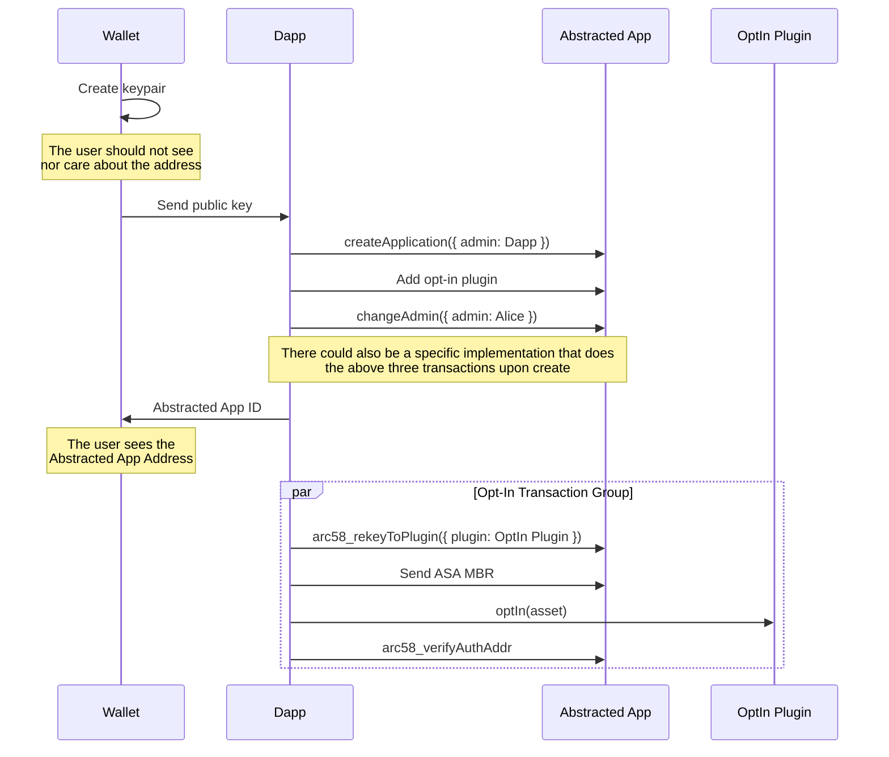
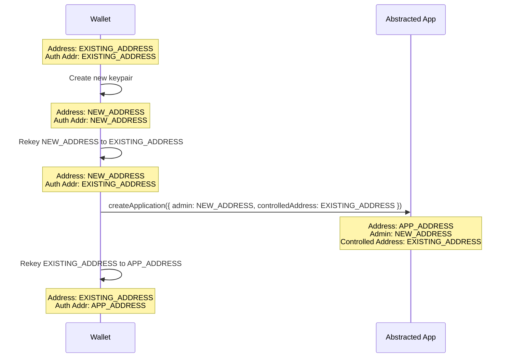

## Abstract

This ARC proposes a standard for using stateful applications and rekey transactions to enable account abstraction on Algorand. The abstracted account is controlled by a single stateful application which serves as the auth address of the abstracted account. Other applications can be used as plugins to provide additional functionality to the abstracted account with fine-grained control over their permissions. This dovetails nicely with the advent of agentic AI, allowing users to bring autonomous agent functionality into their wallet with extreme sandboxing.

## Motivation

Manually signing transactions for every dApp interaction can be rather fatiguing for end-users, resulting in a frustrating UX. In some cases, it makes specific app designs that require many transactions borderline impossible.

Another common point of friction for end-users in the Algorand ecosystem is ASA opt-in transactions. This is a particularly high point of friction for onboarding new accounts since they must be funded and then initiate a transaction. This standard can be used to allow mass creation of non-custodial accounts and trigger opt-ins on their behalf.

## Specification

### Definitions

**External Owned Account (EOA)** - An account that is _not_ controlled by a smart contract.

**Abstracted Account** - An account that has functionality beyond a typical keypair-based account.

**Abstracted Account App** - The stateful application used to control the abstracted account. This app's address is the `auth-addr` of the abstracted account.

**Plugin** - An additional application that adds functionality to the **Abstracted Account App** (and thus the **Abstracted Account**).

**Admin** - An account, separate from the **Abstracted Account**, that controls the **Abstracted Account App**. In particular, this account can initiate rekeys, manage plugins, and transfer admin privileges.

**Escrow** - An account the abstracted account creates and utilizes to silo assets for a given plugin.

**Allowance** - A set of permissions related to a given escrow that permits associated plugins to request funds for use.

**Delegation Type** - Determines who is credited with user interaction when a plugin is used. This affects the `lastUserInteraction` timestamp which can be used for account activity tracking.

**Escrow Factory** - A global singleton contract responsible for creating escrow accounts and providing a registry of which abstracted account created each escrow.

### Temporary State Management

During plugin execution, the abstracted account app **MUST** temporarily store:

- `spendingAddress`: A global state key indicating the account being rekeyed to the plugin being used.

This state **MUST** be cleared before the transaction group completes via `arc58_verifyAuthAddr`.

### [ARC-4](./arc-0004.md) Methods

An Abstracted Account App that adheres to this standard **MUST** implement the following methods:

```json
{
  "methods": [
    {
      "name": "arc58_changeAdmin",
      "desc": "Attempt to change the admin for this app. Some implementations MAY not support this.",
      "args": [
        {
          "type": "address",
          "name": "newAdmin",
          "desc": "The new admin"
        }
      ],
      "returns": {
        "type": "void"
      }
    },
    {
      "name": "arc58_pluginChangeAdmin",
      "desc": "Attempt to change the admin via plugin.",
      "args": [
        {
          "type": "uint64",
          "name": "plugin",
          "desc": "The app calling the plugin"
        },
        {
          "type": "address",
          "name": "allowedCaller",
          "desc": "The address that triggered the plugin"
        },
        {
          "type": "address",
          "name": "newAdmin",
          "desc": "The new admin"
        }
      ],
      "returns": {
        "type": "void"
      }
    },
    {
      "name": "arc58_getAdmin",
      "desc": "Get the admin of this app. This method SHOULD always be used rather than reading directly from state because different implementations may have different ways of determining the admin.",
      "args": [],
      "returns": {
        "type": "address"
      },
      "readonly": true
    },
    {
      "name": "arc58_verifyAuthAddr",
      "desc": "Verify the abstracted account is rekeyed to this app",
      "args": [],
      "returns": {
        "type": "void"
      }
    },
    {
      "name": "arc58_rekeyTo",
      "desc": "Rekey the abstracted account to another address. Primarily useful for rekeying to an EOA.",
      "args": [
        {
          "type": "address",
          "name": "address",
          "desc": "The address to rekey to"
        },
        {
          "type": "bool",
          "name": "flash",
          "desc": "Whether or not this should be a flash rekey. If true, the rekey back to the app address must be done in the same txn group as this call"
        }
      ],
      "returns": {
        "type": "void"
      }
    },
    {
      "name": "arc58_canCall",
      "desc": "Check whether the plugin can be used",
      "args": [
        {
          "type": "uint64",
          "name": "plugin",
          "desc": "The plugin to be rekeyed to"
        },
        {
          "type": "bool",
          "name": "global",
          "desc": "Whether this is callable globally"
        },
        {
          "type": "address",
          "name": "address",
          "desc": "The address that will trigger the plugin"
        },
        {
          "type": "byte[4]",
          "name": "method",
          "desc": "The method being called on the plugin, if applicable"
        }
      ],
      "returns": {
        "type": "bool",
        "desc": "Whether the plugin can be called with these parameters"
      },
      "readonly": true
    },
    {
      "name": "arc58_rekeyToPlugin",
      "desc": "Temporarily rekey to an approved plugin app address",
      "args": [
        {
          "type": "uint64",
          "name": "plugin",
          "desc": "The app to rekey to"
        },
        {
          "type": "bool",
          "name": "global",
          "desc": "Whether the plugin is callable globally"
        },
        {
          "type": "uint64[]",
          "name": "methodOffsets",
          "desc": "The indices of the methods being used in the group. If the plugin has method restrictions, these indices are required to match the methods used on each subsequent call to the plugin within the group"
        },
        {
          "type": "(uint64,uint64)[]",
          "name": "fundsRequest",
          "desc": "If the plugin is using an escrow, this is the list of funds to transfer to the escrow for the plugin to be able to use during execution"
        }
      ],
      "returns": {
        "type": "void"
      }
    },
    {
      "name": "arc58_rekeyToNamedPlugin",
      "desc": "Temporarily rekey to a named plugin app address",
      "args": [
        {
          "type": "string",
          "name": "name",
          "desc": "The name of the plugin to rekey to"
        },
        {
          "type": "bool",
          "name": "global",
          "desc": "Whether the plugin is callable globally"
        },
        {
          "type": "uint64[]",
          "name": "methodOffsets",
          "desc": "The indices of the methods being used in the group. If the plugin has method restrictions, these indices are required to match the methods used on each subsequent call to the plugin within the group"
        },
        {
          "type": "(uint64,uint64)[]",
          "name": "fundsRequest",
          "desc": "If the plugin is using an escrow, this is the list of funds to transfer to the escrow for the plugin to be able to use during execution"
        }
      ],
      "returns": {
        "type": "void"
      }
    },
    {
      "name": "arc58_addPlugin",
      "desc": "Add an app to the list of approved plugins",
      "args": [
        {
          "type": "uint64",
          "name": "app",
          "desc": "The app to add"
        },
        {
          "type": "address",
          "name": "allowedCaller",
          "desc": "The address that's allowed to call the app, or the global zero address for any address"
        },
        {
          "type": "bool",
          "name": "admin",
          "desc": "Whether the plugin has permissions to change the admin account"
        },
        {
          "type": "uint8",
          "name": "delegationType",
          "desc": "The ownership of the delegation for last_interval updates"
        },
        {
          "type": "string",
          "name": "escrow",
          "desc": "The escrow account to use for the plugin, if any. If empty, no escrow will be used. If the named escrow does not exist, it will be created"
        },
        {
          "type": "uint64",
          "name": "lastValid",
          "desc": "The timestamp or round when the permission expires"
        },
        {
          "type": "uint64",
          "name": "cooldown",
          "desc": "The number of seconds or rounds that must pass before the plugin can be called again"
        },
        {
          "type": "(byte[4],uint64)[]",
          "name": "methods",
          "desc": "The methods that are allowed to be called for the plugin by the address"
        },
        {
          "type": "bool",
          "name": "useRounds",
          "desc": "Whether the plugin uses rounds for cooldowns and lastValid, defaults to timestamp"
        }
      ],
      "returns": {
        "type": "void"
      }
    },
    {
      "name": "arc58_removePlugin",
      "desc": "Remove an app from the list of approved plugins",
      "args": [
        {
          "type": "uint64",
          "name": "app",
          "desc": "The app to remove"
        },
        {
          "type": "address",
          "name": "allowedCaller",
          "desc": "The address that's allowed to call the app"
        }
      ],
      "returns": {
        "type": "void"
      }
    },
    {
      "name": "arc58_addNamedPlugin",
      "desc": "Add a named plugin",
      "args": [
        {
          "type": "string",
          "name": "name",
          "desc": "The plugin name"
        },
        {
          "type": "uint64",
          "name": "app",
          "desc": "The app to add"
        },
        {
          "type": "address",
          "name": "allowedCaller",
          "desc": "The address that's allowed to call the app, or the global zero address for any address"
        },
        {
          "type": "bool",
          "name": "admin",
          "desc": "Whether the plugin has permissions to change the admin account"
        },
        {
          "type": "uint8",
          "name": "delegationType",
          "desc": "The ownership of the delegation for last_interval updates"
        },
        {
          "type": "string",
          "name": "escrow",
          "desc": "The escrow account to use for the plugin, if any. If empty, no escrow will be used. If the named escrow does not exist, it will be created"
        },
        {
          "type": "uint64",
          "name": "lastValid",
          "desc": "The timestamp or round when the permission expires"
        },
        {
          "type": "uint64",
          "name": "cooldown",
          "desc": "The number of seconds or rounds that must pass before the plugin can be called again"
        },
        {
          "type": "(byte[4],uint64)[]",
          "name": "methods",
          "desc": "The methods that are allowed to be called for the plugin by the address"
        },
        {
          "type": "bool",
          "name": "useRounds",
          "desc": "Whether the plugin uses rounds for cooldowns and lastValid, defaults to timestamp"
        }
      ],
      "returns": {
        "type": "void"
      }
    },
    {
      "name": "arc58_removeNamedPlugin",
      "desc": "Remove a named plugin",
      "args": [
        {
          "type": "string",
          "name": "name",
          "desc": "The plugin name"
        }
      ],
      "returns": {
        "type": "void"
      }
    },
    {
      "name": "arc58_newEscrow",
      "desc": "Create a new escrow for the controlled address",
      "args": [
        {
          "type": "string",
          "name": "escrow",
          "desc": "The name of the escrow to create"
        }
      ],
      "returns": {
        "type": "void"
      }
    },
    {
      "name": "arc58_reclaim",
      "desc": "Transfer funds from an escrow back to the controlled address",
      "args": [
        {
          "type": "string",
          "name": "escrow",
          "desc": "The escrow to reclaim funds from"
        },
        {
          "type": "(uint64,uint64,bool)[]",
          "name": "reclaims",
          "desc": "The list of reclaims to make from the escrow"
        }
      ],
      "returns": {
        "type": "void"
      }
    },
    {
      "name": "arc58_optinEscrow",
      "desc": "Opt-in an escrow account to assets",
      "args": [
        {
          "type": "string",
          "name": "escrow",
          "desc": "The escrow to opt-in to"
        },
        {
          "type": "uint64[]",
          "name": "assets",
          "desc": "The list of assets to opt-in to"
        }
      ],
      "returns": {
        "type": "void"
      }
    },
    {
      "name": "arc58_pluginOptinEscrow",
      "desc": "Opt-in an escrow account to assets via a plugin / allowed caller",
      "args": [
        {
          "type": "uint64",
          "name": "app",
          "desc": "The app related to the escrow optin"
        },
        {
          "type": "address",
          "name": "allowedCaller",
          "desc": "The address allowed to call the plugin related to the escrow optin"
        },
        {
          "type": "uint64[]",
          "name": "assets",
          "desc": "The list of assets to opt-in to"
        },
        {
          "type": "pay",
          "name": "mbrPayment",
          "desc": "The payment txn that is used to pay for the asset opt-in"
        }
      ],
      "returns": {
        "type": "void"
      }
    },
    {
      "name": "arc58_addAllowances",
      "desc": "Add an allowance for an escrow account",
      "args": [
        {
          "type": "string",
          "name": "escrow",
          "desc": "The escrow to add the allowance for"
        },
        {
          "type": "(uint64,uint8,uint64,uint64,uint64,bool)[]",
          "name": "allowances",
          "desc": "The list of allowances to add"
        }
      ],
      "returns": {
        "type": "void"
      }
    },
    {
      "name": "arc58_removeAllowances",
      "desc": "Remove allowances for an escrow account",
      "args": [
        {
          "type": "string",
          "name": "escrow",
          "desc": "The escrow to remove the allowance for"
        },
        {
          "type": "uint64[]",
          "name": "assets",
          "desc": "The list of assets to remove the allowance for"
        }
      ],
      "returns": {
        "type": "void"
      }
    }
  ]
}
```

### Plugins

Plugins are applications that the Abstracted Account App **MUST** rekey to when `rekeyToPlugin` or `rekeyToNamedPlugin` is called. After a plugin has been rekeyed to, the abstracted account **MUST** be rekeyed back to the abstracted account application. When and how this rekey is done does not matter, but it **MUST** be verified by a call to `verifyAuthAddr` as the last transaction in the group OR the last transaction in the group must be an explicit rekey transaction.

### Plugin Validation Process

When `rekeyToPlugin` is called, the implementation **MUST** validate the entire transaction group to ensure:

1. **Plugin Existence**: The plugin exists and is properly configured
2. **Expiration Check**: The plugin has not expired based on `lastValid` timestamp/round
3. **Cooldown Enforcement**: Sufficient time has passed since the plugin was last used
4. **Method Validation**: If method restrictions exist, each plugin call must use an allowed method
5. **Rekey Verification**: The group must contain a rekey back to the abstracted account
6. **Application Isolation**: During rekey, only calls to the specified plugin application are allowed

### Plugin Permissions

When adding a plugin, the admin can specify an address that is allowed to call `rekeyToPlugin` for that specific plugin. Using the zero address will allow anyone to use the plugin. If `global LatestTimeStamp` (or `global Round` if the `useRounds` argument was set to `true` at plugin install time) has passed the specified end time (or round), the `rekeyToPlugin` call **MUST** fail. If the permitted address is not the zero address and does not match the caller specified at install time, the `rekeyToPlugin` call **MUST** fail.

In addition to expiration times, plugins can have several other security restrictions that give the user further control and security:

- **Cooldowns** - Prevent plugins from being used more frequently than the user intended
- **Method restrictions** - Check the ARC-0004 method selector argument to restrict which methods on a compliant plugin can be utilized, also supporting cooldowns for subsets of a plugin's functionality
- **Escrow system** - Used in conjunction with these permissions to sandbox asset allocations by plugins

### Delegation Types

Plugins can be configured with different delegation types that determine user interaction tracking:

- **Self Delegation (Type 0)**: When used, the plugin caller is credited with user interaction, updating `lastUserInteraction`
- **Other Types**: Implementation-specific delegation types may exist for different interaction attribution models

The delegation type **MUST NOT** be set to "self" (0) when the allowed caller is the zero address (global), as this would create ambiguity about who should be credited with the interaction.

### Escrows & Allowances

Along with the Abstracted Account contract there is an escrow factory contract. This contract is meant to be a global singleton and has two responsibilities:

- Mint escrow contracts for abstracted accounts to use
- Provide a single source of truth for correlating escrows with the Abstracted Account that created them

The child escrow contracts themselves are rekeyed to the Abstracted Account at creation time and their only other functionality is being deleted.

The escrow accounts act as silos for funding plugin activity. They are named and referenceable when a plugin is added to the Abstracted Account. Doing so will restrict all ASA activities to happen through the escrow instead of the Abstracted Account's main `controlled_address`. Allowances allow escrows to be given funds under certain restrictions.

#### Escrow Factory Integration

When a plugin is added with an escrow name:

1. If an escrow with that name already exists, it is reused
2. If no escrow exists, the abstracted account calls the escrow factory's `new(pay)uint64` method
3. The factory creates a new escrow application and returns its ID
4. The escrow is immediately rekeyed to the abstracted account for control
5. The escrow name and application ID are stored for future reference

#### Allowance Structure

An allowance has the following structure:

```typescript
export type AllowanceInfo = {
  /** The type of allowance to use (0=Flat, 1=Window, 2=Drip) */
  type: SpendAllowanceType
  /** The maximum size of the bucket if using drip */
  max: uint64
  /** The amount of the asset the plugin is allowed to access or per window */
  allowed: uint64
  /** The amount spent during the current or last interacted window */
  spent: uint64
  /** The rate the allowance should be expanded */
  interval: uint64
  /** The amount leftover when the bucket was last accessed */
  last: uint64
  /** The timestamp or round the allowance was added */
  start: uint64
  /** Whether to use round number or unix timestamp when evaluating this allowance */
  useRounds: boolean
}
```

#### Allowance Types

There are three allowance strategies, each with different behaviors:

**Flat (Type 0)**
- One-time allowance that depletes as used
- Example: "This escrow can spend 10 ALGO total, after that the allowance must be replaced"
- `allowed` = total spendable amount
- `spent` = amount already used
- Available = `allowed - spent`

**Window (Type 1)**  
- Periodic allowance that resets at regular intervals
- Example: "This escrow can spend 10 ALGO per month"
- `allowed` = amount per window
- `interval` = duration of each window
- `start` = when the first window began
- Resets to full allowance at the start of each new window
- Does not accumulate across windows

**Drip (Type 2)**
- Continuous allowance that refills at a steady rate up to a maximum
- Example: "This escrow can hold up to 10 ALGO, replenishing at 1 ALGO per day"
- `allowed` = refill rate per interval
- `interval` = time between refills  
- `max` = maximum bucket size
- `spent` = current amount in bucket (leftover from previous access)
- Accumulates over time up to the maximum

#### Allowance Validation

When a plugin requests funds through `fundsRequest`, the implementation:

1. Calculates available funds based on allowance type and current time
2. Verifies the request amount does not exceed available funds
3. Updates the allowance state (spent amount, last access time)
4. Transfers the requested funds from controlled address to spending address

Each allowance is stored in a box map with the key being a composite key of the escrow application ID and the asset the allowance pertains to.

When `arc58_addPlugin` or `arc58_addNamedPlugin` are called with an escrow name provided, the Abstracted Account should call the `new(pay)uint64` method on the escrow factory contract if an escrow with the given name does not already exist and store the name and application ID for later use.

#### Named Plugins

The admin can optionally add a named plugin to their abstracted account application. Any name that matches the regex `/^ARC\d+$/` **MUST** implement the interface(s) described in the respective ARC. The ARC number **MUST NOT** have any leading zeros.

### Wallet and Application Support

#### Adding Plugins

An application may ask a user to add a plugin to their Abstracted Account App. The wallet **MUST** show the user the requested permitted caller, end time, and plugin app ID. Wallets **MAY** have a database of known plugins to describe the plugin in a more human-friendly way, but the exact details of this implementation are outside the scope of this ARC.

#### Viewing Plugins

For a given Abstracted Account, a wallet **SHOULD** allow the user to view all of the plugins added to their Abstracted Account App. Wallets also **SHOULD** provide the user a way to manually add and remove plugins from their Abstracted Account App.

#### Supporting EOA Rekeys

If a user connects to an app with an Abstracted Account, the app **SHOULD** allow the user to easily sign transactions with an externally owned account. It is easy for the admin to manually call `rekeyTo` prior to interacting with an app, but this does not guarantee the user will rekey back to the Abstracted Account (thus breaking plugin functionality). As such, to improve user experience, applications **SHOULD** be able to send transaction groups that start with a `rekeyTo` call that rekeys to the admin account with `flash` set to true. Because `flash` is set to true, the last transaction in the group **MUST** be a rekey from the admin address to the Abstracted Account address.

This requires wallets to be able to tell apps that the connected account is an Abstracted Account.

## Rationale

### App vs Logic Sig

There have been similar proposals for reducing end-user friction, such as [ARC-47](./arc-0047.md) which enables safer usage of delegated logic signatures. The major downside of logic signatures is that they are not usable by smart contracts. This severely limits composability and potential use cases.

### Plugins

Rather than constantly updating the approval program of the abstracted account application to add functionality, it is safer and easier to simply add additional apps that enable the desired functionality. This also gives the end-user more control over what various dApps can do with their account at any time.

### Plugin Permissions

A common use case for plugins will be end-users allowing specific apps to perform actions on their account. As such, implementing this in the Abstracted Account App allows for wallets and other ecosystem tools to easily display permissions to end users. The end time is also useful to ensure a user only enables a plugin for the time that it would be useful for them. The concept of plugins is similar to approvals on EVM chains and there have been cases where old approvals became an attack vector.

### Escrow System Design

The escrow system provides several benefits:

1. **Asset Isolation**: Plugins can only access pre-allocated funds, limiting potential damage
2. **Granular Control**: Different assets can have different allowance rules
3. **Flexible Allowances**: Three allowance types cover most use cases from one-time spends to ongoing subscriptions

## Backwards Compatibility

Existing Algorand accounts can transition to an abstracted account by creating a new abstracted account application and setting the address to their current address. This requires them to create a new account to act as the admin.

End-users can use an abstracted account with any dApp provided they rekey the account to an externally owned account.

## Reference Implementation & Test Cases

Reference implementation and tests are available [here](https://github.com/algorandfoundation/ARCs/assets/arc-0058)

### Potential Use Cases

These are potential use cases of this ARC. These are NOT part of the ARC itself and should likely be further developed and discussed in a separate ARC. They solely exist to demonstrate what the usage of this ARC will look like.

#### 0-ALGO Opt-In Onboarding

Using the above reference implementation, 0-ALGO onboarding can be done via the following sequence. It should be noted that a different implementation focused specifically on this use case could be even more efficient.



#### Transition Existing Address

If a user wants to transition an existing keypair-based account to an abstracted account and use the existing secret key for admin actions, they need to perform the following steps using the above reference implementation.



#### Postmortem Authorization

Using this ARC, you could create an abstracted account that changes who the admin is after a certain amount of time has passed without the original admin's interaction. The admin of the account will effectively be controlled by a time-based dead man's switch.

## Security Considerations

By adding a plugin to an abstracted account (without an escrow), that plugin can get complete control of the account. As such, extreme diligence must be taken by the end-user to ensure they are adding safe and/or trusted plugins. The security assumptions for plugins are very similar to delegated logic signatures, with the exception that plugins can always be revoked.

The security assumptions of plugins are also similar to EVM approvals, which are a common source of exploits and scams. Implementations of plugins on Algorand should learn from the lessons of EVM approvals.

### Additional Security Considerations

**Method Restrictions**: When using method restrictions, plugin developers must ensure their applications properly adhere to the `ARC-0004` standard for method routing.

**Temporary State**: The temporary `spendingAddress` state must be properly cleared to prevent state pollution between plugin executions.

## Copyright

Copyright and related rights waived via <a href="https://creativecommons.org/publicdomain/zero/1.0/">CC0</a>.
