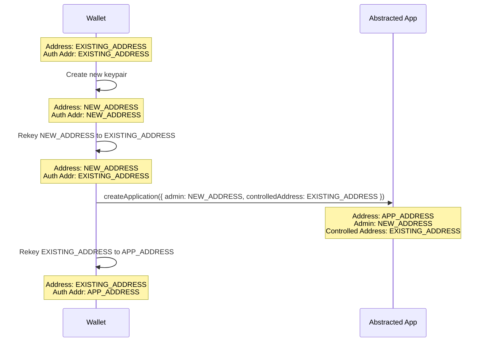

## Abstract
This ARC proposes a standard for using stateful applications and rekey transactions to enable account abstraction on Algorand. The abstracted account is controlled by a single stateful application which is the auth address of the abstracted account. Other applications can be used as plugin to provide additional functionality to the abstracted account.

## Motivation
Manually signing transactions for every dApp interaction can be rather fatiguing for the end-user, which results in a frustrating UX. In some cases, it makes specific app designs that require a lot of transactions borderline impossible without delegation or an escrow account.

Another common point of friction for end-users in the Algorand ecosystem is ASA opt-in transactions. This is a paticularly high point of friction for onboarding new accounts since they must be funded and then initiate a transaction. This standard can be used to allow mass creation of non-custodial accounts and trigger opt-ins on their behalf.

## Specification

### Definitions
**External Owned Account (EOA)** - An account that is _not_ controlled by a smart contract.

**Abstracted Account** - An account that has functionality beyond a typical keypair-based account.

**Abstracted Account App** - The stateful application used to control the abstracted account. This app's address is the `auth-addr` of the abstracted account.

**Plugin** - An additional application that adds functionality to the **Abstracted Account App** (and thus the **Abstracted Account**).

**Admin** - An account, separate from the **Abstracted Account**, that controls the **Abstracted Account App**. In particular, this app can initiate rekeys, add plugins, and transfer admin.


### [ARC-4](./arc-0004.md) Methods

An Abstracted Account App that adheres to this standard **MUST** implement the following methods

```json
  "methods": [
    {
      "name": "arc58_changeAdmin",
      "desc": "Attempt to change the admin for this app. Some implementations MAY not support this.",
      "args": [
        {
          "name": "newAdmin",
          "type": "account",
          "desc": "The new admin"
        }
      ],
      "returns": {
        "type": "void"
      }
    },
    {
      "name": "arc58_getAdmin",
      "desc": "Get the admin of this app. This method SHOULD always be used rather than reading directly from statebecause different implementations may have different ways of determining the admin.",
      "args": [],
      "returns": {
        "type": "address"
      }
    },
    {
      "name": "arc58_verifyAuthAddr",
      "desc": "Verify the abstracted account is rekeyed to this app",
      "args": [],
      "returns": {
        "type": "void"
      }
    },
    {
      "name": "arc58_rekeyTo",
      "desc": "Rekey the abstracted account to another address. Primarily useful for rekeying to an EOA.",
      "args": [
        {
          "name": "addr",
          "type": "address",
          "desc": "The address to rekey to"
        },
        {
          "name": "flash",
          "type": "bool",
          "desc": "Whether or not this should be a flash rekey. If true, the rekey back to the app address must done in the same txn group as this call"
        }
      ],
      "returns": {
        "type": "void"
      }
    },
    {
      "name": "arc58_rekeyToPlugin",
      "desc": "Temporarily rekey to an approved plugin app address",
      "args": [
        {
          "name": "plugin",
          "type": "application",
          "desc": "The app to rekey to"
        }
      ],
      "returns": {
        "type": "void"
      }
    },
    {
      "name": "arc58_rekeyToNamedPlugin",
      "desc": "Temporarily rekey to a named plugin app address",
      "args": [
        {
          "name": "name",
          "type": "string",
          "desc": "The name of the plugin to rekey to"
        }
      ],
      "returns": {
        "type": "void"
      }
    },
    {
      "name": "arc58_addPlugin",
      "desc": "Add an app to the list of approved plugins",
      "args": [
        {
          "name": "app",
          "type": "application",
          "desc": "The app to add"
        },
        {
          "name": "address",
          "type": "address",
          "desc": "The address of that's allowed to call the appor the global zero address for all addresses"
        },
        {
          "name": "end",
          "type": "uint64",
          "desc": "The timestamp when the permission expires"
        }
      ],
      "returns": {
        "type": "void"
      }
    },
    {
      "name": "arc58_removePlugin",
      "desc": "Remove an app from the list of approved plugins",
      "args": [
        {
          "name": "app",
          "type": "application",
          "desc": "The app to remove"
        },
        {
          "name": "address",
          "type": "address"
        }
      ],
      "returns": {
        "type": "void"
      }
    },
    {
      "name": "arc58_addNamedPlugin",
      "desc": "Add a named plugin",
      "args": [
        {
          "name": "name",
          "type": "string",
          "desc": "The plugin name"
        },
        {
          "name": "app",
          "type": "application",
          "desc": "The plugin app"
        },
        {
          "name": "address",
          "type": "address"
        },
        {
          "name": "end",
          "type": "uint64"
        }
      ],
      "returns": {
        "type": "void"
      }
    },
    {
      "name": "arc58_removeNamedPlugin",
      "desc": "Remove a named plugin",
      "args": [
        {
          "name": "name",
          "type": "string",
          "desc": "The plugin name"
        }
      ],
      "returns": {
        "type": "void"
      }
    }
  ]
```

### Plugins

Plugins are applications that the Abstracted Account App **MUST** rekey to when `rekeyToPlugin` or `rekeyToNamedPlugin` is called. After a plugin has been rekeyed to, the abstracted account **MUST** be rekeyed back to the abstracted account application. When and how this rekey is done does not matter, but it **MUST** be verified by a call `verifyAuthAddr` as the last transaction in the group OR the last transaction in the group must be an explicit rekey transaction.

### Plugin Permissions

When adding a plugin, the the admin can specify an end time and a specific address that is allowed to call `rekeyToPlugin` for that specific plugin. Using the zero address will allow anyone to use the plugin. If `global LatestTimeStamp` has past the specified end time, the `rekeyToPlugin` call **MUST** fail. If the permitted address is not the zero address, the `rekeyToPlugin` call **MUST** fail.

#### Named Plugins

The admin can optionally add a named plugin to their abstracted account application. Any name that matches the regex `/^ARC\d+$/` **MUST** implement the interface(s) described in the respective ARC. The ARC number **MUST NOT** have any leading 0s.

### Wallet and Application Support

#### Adding Plugins

An application may ask a user to add a plugin to their Abstracted Account App. The wallet **MUST** show the user the requested permitted caller, end time, and plugin app ID. Wallets **MAY** have a database of known plugins to describe the plugin in a more human-friendly way, but the exact details of this implementation is outside the scope of this ARC.

#### Viewing Plugins

For a given Abstracted Account, a wallet **SHOULD** allow the user to view all of the plugins added to their Abstracted Account App. Wallets also **SHOULD** provide the user a way to manually add and remove plugins from their Abstracted Account App.


#### Supporting EOA Rekeys

If a user connects to an app with an Abstracted Account the app **SHOULD** allow the user to easily sign transactions with an externally owned account. It is easy for the admin to manually call `rekeyTo` prior to interacting with an app, but this does not gurantee the user will rekey back to the Abstracted Account (this breaking plugin functionality). As such, to improve user experience, applications **SHOULD** be able to send transactions groups that start with a `rekeyTo` call that rekeys to the admin admin account with `flash` set to true. Because `flash` is set to true, the last transaction in the group **MUST** be a rekey from the admin address to the Abstracted Account address.

This requires wallets to be able to tell apps that the connected account is an Abstracted Account.

## Rationale

### App vs Logic Sig
There have similar propsoals for reducing end-user friction, such as [ARC-47](./arc-0047.md) which enables safer usage of delegated logic signatures. The major downside of logic signatures is that they are not usable by smart contracts. This severely limits composability and potential use cases.

### Plugins
Rather than constantly updating the approval program of the abstracted account application to add functionality, it is safer and easier to simply add additional apps that enable the desired functionality. This also gives the end-user more control over what various dApps can do with their account at any time.

### Plugin Permisions

A common use case for plugins will be end-users allowing specific apps to perform actions on their account. As such, implementing this in the Abstracted Account App allows for wallets and other ecosystem tools to easy display permissions to end users. The end time is also useful to ensure a user only enables a plugin for the time that it would be useful for them. The concept of plugins is similar to approvals on EVM chains and there have been cases where old approvals became an attack vector.

## Backwards Compatibility
Existing Algorand accounts can transition to an abstracted account by creating a new abstracted account application and setting the address to their current address. This requires them to create a new account to act as the admin.

End-users can use an abstracted account with any dApp provided they rekey the account to an externally owned account.

## Test Cases

TODO: Some functional tests are in this repo https://github.com/joe-p/account_abstraction.git

## Reference Implementation

### Abstracted App

```ts
import { Contract } from '@algorandfoundation/tealscript';

type PluginsKey = { application: Application; address: Address };

export class AbstractedAccount extends Contract {
  /** Target AVM 10 */
  programVersion = 10;

  /** The admin of the abstracted account */
  admin = GlobalStateKey<Address>();

  /**
   * The apps and addresses that are authorized to send itxns from the abstracted account,
   * The key is the appID + address, the value (referred to as `end`)
   * is the timestamp when the permission expires for the address to call the app for your account.
   */
  plugins = BoxMap<PluginsKey, uint64>({ prefix: 'p' });

  /**
   * Plugins that have been given a name for discoverability
   */
  namedPlugins = BoxMap<bytes, PluginsKey>({ prefix: 'n' });

  /** The address of the abstracted account */
  address = GlobalStateKey<Address>();

  /**
   * Ensure that by the end of the group the abstracted account has control of its address
   */
  private verifyRekeyToAbstractedAccount(): void {
    let rekeyedBack = false;

    for (let i = this.txn.groupIndex; i < this.txnGroup.length; i += 1) {
      const txn = this.txnGroup[i];

      // The transaction is an explicit rekey back
      if (txn.sender === this.address.value && txn.rekeyTo === this.getAuthAddr()) {
        rekeyedBack = true;
        break;
      }

      // The transaction is an application call to this app's arc58_verifyAuthAddr method
      if (
        txn.typeEnum === TransactionType.ApplicationCall &&
        txn.applicationID === this.app &&
        txn.numAppArgs === 1 &&
        txn.applicationArgs[0] === method('arc58_verifyAuthAddr()void')
      ) {
        rekeyedBack = true;
        break;
      }
    }

    assert(rekeyedBack);
  }

  /**
   * What the value of this.address.value.authAddr should be when this.address
   * is able to be controlled by this app. It will either be this.app.address or zeroAddress
   */
  private getAuthAddr(): Address {
    return this.address.value === this.app.address ? Address.zeroAddress : this.app.address;
  }

  /**
   * Create an abstracted account application.
   * This is not part of ARC58 and implementation specific.
   *
   * @param address The address of the abstracted account. If zeroAddress, then the address of the contract account will be used
   * @param admin The admin for this app
   */
  createApplication(address: Address, admin: Address): void {
    verifyAppCallTxn(this.txn, {
      sender: { includedIn: [address, admin] },
    });

    assert(admin !== address);

    this.admin.value = admin;
    this.address.value = address === Address.zeroAddress ? this.app.address : address;
  }

  /**
   * Attempt to change the admin for this app. Some implementations MAY not support this.
   *
   * @param newAdmin The new admin
   */
  arc58_changeAdmin(newAdmin: Account): void {
    verifyTxn(this.txn, { sender: this.admin.value });
    this.admin.value = newAdmin;
  }

  /**
   * Get the admin of this app. This method SHOULD always be used rather than reading directly from state
   * because different implementations may have different ways of determining the admin.
   */
  arc58_getAdmin(): Address {
    return this.admin.value;
  }

  /**
   * Verify the abstracted account is rekeyed to this app
   */
  arc58_verifyAuthAddr(): void {
    assert(this.address.value.authAddr === this.getAuthAddr());
  }

  /**
   * Rekey the abstracted account to another address. Primarily useful for rekeying to an EOA.
   *
   * @param addr The address to rekey to
   * @param flash Whether or not this should be a flash rekey. If true, the rekey back to the app address must done in the same txn group as this call
   */
  arc58_rekeyTo(addr: Address, flash: boolean): void {
    verifyAppCallTxn(this.txn, { sender: this.admin.value });

    sendPayment({
      sender: this.address.value,
      receiver: addr,
      rekeyTo: addr,
      note: 'rekeying abstracted account',
    });

    if (flash) this.verifyRekeyToAbstractedAccount();
  }

  /**
   * Temporarily rekey to an approved plugin app address
   *
   * @param plugin The app to rekey to
   */
  arc58_rekeyToPlugin(plugin: Application): void {
    const globalKey: PluginsKey = { application: plugin, address: globals.zeroAddress };

    // If this plugin is not approved globally, then it must be approved for this address
    if (!this.plugins(globalKey).exists || this.plugins(globalKey).value < globals.latestTimestamp) {
      const key: PluginsKey = { application: plugin, address: this.txn.sender };
      assert(this.plugins(key).exists && this.plugins(key).value > globals.latestTimestamp);
    }

    sendPayment({
      sender: this.address.value,
      receiver: this.address.value,
      rekeyTo: plugin.address,
      note: 'rekeying to plugin app',
    });

    this.verifyRekeyToAbstractedAccount();
  }

  /**
   * Temporarily rekey to a named plugin app address
   *
   * @param name The name of the plugin to rekey to
   */
  arc58_rekeyToNamedPlugin(name: string): void {
    this.arc58_rekeyToPlugin(this.namedPlugins(name).value.application);
  }

  /**
   * Add an app to the list of approved plugins
   *
   * @param app The app to add
   * @param address The address of that's allowed to call the app
   * or the global zero address for all addresses
   * @param end The timestamp when the permission expires
   */
  arc58_addPlugin(app: Application, address: Address, end: uint64): void {
    verifyTxn(this.txn, { sender: this.admin.value });
    const key: PluginsKey = { application: app, address: address };
    this.plugins(key).value = end;
  }

  /**
   * Remove an app from the list of approved plugins
   *
   * @param app The app to remove
   */
  arc58_removePlugin(app: Application, address: Address): void {
    verifyTxn(this.txn, { sender: this.admin.value });

    const key: PluginsKey = { application: app, address: address };
    this.plugins(key).delete();
  }

  /**
   * Add a named plugin
   *
   * @param app The plugin app
   * @param name The plugin name
   */
  arc58_addNamedPlugin(name: string, app: Application, address: Address, end: uint64): void {
    verifyTxn(this.txn, { sender: this.admin.value });
    assert(!this.namedPlugins(name).exists);

    const key: PluginsKey = { application: app, address: address };
    this.namedPlugins(name).value = key;
    this.plugins(key).value = end;
  }

  /**
   * Remove a named plugin
   *
   * @param name The plugin name
   */
  arc58_removeNamedPlugin(name: string): void {
    verifyTxn(this.txn, { sender: this.admin.value });

    const app = this.namedPlugins(name).value;
    this.namedPlugins(name).delete();
    this.plugins(app).delete();
  }
}
```
https://github.com/joe-p/account_abstraction.git

TODO: Migrate to ARC repo, but waiting until development has settled.

### Potential Use Cases

These are potential use cases of this ARC. These are NOT part of the ARC itself and should likely be further developed and discussed in a seperate ARC. They soley exist to demonstrate what the usage of this ARC will look like. 

#### 0-ALGO Opt-In Onboarding

Using the above reference implementation, 0-ALGO onboarding can be done via the following sequence. It should be noted that a different implementation focused specifically on this use case could be even more efficient.


#### Transition Existing Address

If a user wants to transition an existing keypair-based account to an abstracted account and use the existing secret key for admin actions, they need to perform the following steps using the above reference implmentation.



#### Postmortem Authorization

Using this ARC, you could created an abstracted account that changes who the admin is after a certain amount of time has passed without the original admin's interaction. The admin of the account will effectively be controlled by a time-based dead man's switch.

## Security Considerations
By adding a plugin to an abstracted account, that plugin can get complete control of the account. As such, extreme diligance must be taken by the end-user to ensure they are adding safe and/or trusted plugins. The security assumptions for plugins are very similar to delegated logic signatures, with the exception that plugins can always be revoked.

The security assumptions of plugins are also similar to EVM approvals, which are a common source of exploits and scams. Implementations of plugins Algorand should learn from the lessons of EVM approvals.

## Copyright
Copyright and related rights waived via <a href="https://creativecommons.org/publicdomain/zero/1.0/">CCO</a>.
