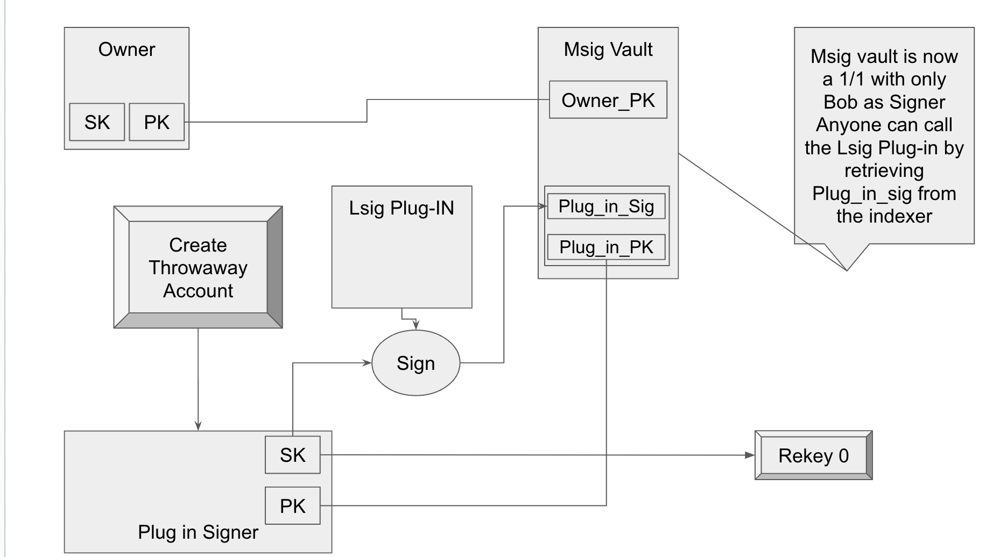

## Abstract

This ARC proposes a method for creating a delegated multisig-account control only by one account and a Logic signature.

## Motivation

The motivation behind this ARC is to extend algorand account feature by enabling third-party "Plug-Ins" using a combinaison of delegated Lsig and Multi Signature accounts which act as vaults. This approach allows anyone to sign the Lsig for the vault, while maintaining security and control through a deterministic wallet and rekeying mechanisms.

## Specification

The key words "**MUST**", "**MUST NOT**", "**REQUIRED**", "**SHALL**", "**SHALL NOT**", "**SHOULD**", "**SHOULD NOT**", "**RECOMMENDED**", "**MAY**", and "**OPTIONAL**" in this document are to be interpreted as described in <a href="https://www.ietf.org/rfc/rfc2119.txt">RFC-2119</a>.

### Components

1. **Lsig Plug-In**: Provided by a third party.
2. **Plug-In Signer**: Created by concatenating the owner address and the Lsig address, then signed with owner secret key to generate the plug-in signer account.
3. **1/3 Msig Account**: Comprises owner address, the Lsig address, and the plug-in signer.

### Steps

We will use the following lsig plug-in for our illustrating purposes:

```python

def opt_in_logic_sig():
    return And(
        Txn.type_enum() == TxnType.AssetTransfer,
        Txn.asset_amount() == Int(0),
        Txn.rekey_to() == Global.zero_address(),
        Txn.fee() == Global.min_txn_fee()
    )
teal_program = compileTeal(opt_in_logic_sig(), Mode.Signature, version=10)
compiled_program = client.compile(teal_program)
program = base64.b64decode(compiled_program["result"])
lsig = transaction.LogicSigAccount(program)

```

1. **Generate Plug-In Signer**:
    - Concatenate owner address and the Lsig address.
    - Sign the concatenated byte string with owner secret key.
    - Use the resulting signature to generate the plug-in signer account.

    ```python
    def generate_32bytes_from_addresses(addr1, addr2, sk):
    combined = addr1 + addr2
    combined_signed = util.sign_bytes(combined.encode(), sk)
    hash_digest = hashlib.sha256(combined_signed.encode()).digest()
    seed = hash_digest[:32]
    sk = SigningKey(seed,encoder=nacl.encoding.RawEncoder)
    vk = sk.verify_key
    a = encoding.encode_address(vk.encode())
    return  base64.b64encode(sk.encode() + vk.encode()).decode(), a

    plug_in_sk, plug_in_addr  = generate_32bytes_from_addresses(bob_addr, lsig.address(), bob_sk)
    ```

2. **Sign Lsig with Plug-In Signer**:
    - Sign the Lsig using the plug-in signer.
    - Publish the public signature on the indexer.

    ```python
        public_key, secret_key = nacl.bindings.crypto_sign_seed_keypair(base64.b64decode(plug_in_sk)[: constants.key_len_bytes])
        message = constants.logic_prefix + program
        raw_signed = nacl.bindings.crypto_sign(message, secret_key)
        crypto_sign_BYTES = nacl.bindings.crypto_sign_BYTES
        signature = nacl.encoding.RawEncoder.encode(raw_signed[:crypto_sign_BYTES])
        plug_in_public_sig = base64.b64encode(signature).decode()
    ```

3. **Create 1/3 Msig Account**:
    - Create a multi-signature account with owner address, the Lsig address, and the plug-in signer.

    ```python
    bob_vault_msig = transaction.Multisig(1,1,[bob_addr, lsig.address(), plug_in_addr])
    ```

    - Add a transaction note to the transaction to help third party to retrieve signer and vault information.

    ```json
        {
            "s": bob_addr,
            "lsigs": lsig.address(),
            "sigA": plug_in_addr,
            "sigS": plug_in_public_sig,
            "vault": bob_vault_msig.address(),
        }
    ```

    - Prefix the note following the [ARC-2](./arc-0002.md) standard. `arc_63:j:`

    ```python
    ptxn = transaction.PaymentTxn(
        bob_addr, sp, bob_vault_msig.address(), int(1e6), note=f"arc_63:j:{note_field}"
    ).sign(bob_sk)
    ```

4. **Opt-In to Msig Vault**:
    - Anyone can opt-in to the Msig vault using the plug-in signer’s public address and the published signature.

    ```python
    optin_txn = AssetTransferTxn(
        sender=bob_vault_msig.address(),
        sp=sp,
        receiver=bob_vault_msig.address(),
        amt=0,
        index=a_id,
    )
    lsig.lsig.msig = bob_vault_msig
    lsig.lsig.msig.subsigs[2].signature = base64.b64decode(plug_in_public_sig) # signature from plug_in_public
    lstx = LogicSigTransaction(optin_txn, lsig)
    ```

5. **Rekey Plug-In Signer**:
    - Rekey the plug-in signer to the zero address to prevent any further usage.

### Rekeying Process

The plug-in signer is rekeyed to the zero address to eliminate the risk of unauthorized transactions. This ensures that the signer cannot be used post-creation, maintaining the integrity of the multi-signature setup.

### Schema



## Rationale

The rationale for this design is to leverage third-party Lsig plug-ins. By rekeying the plug-in signer, we mitigate risks associated with its misuse, while the multi-signature account setup ensures controlled access and flexibility in asset management.

## Backwards Compatibility

This ARC introduces no backward incompatibilities. It builds upon existing Algorand functionalities, ensuring seamless integration with current systems.

## Reference Implementation

An example implementation in Python is provided, demonstrating the creation of a plug-in signer, signing an Lsig, and opting into a multi-signature vault.

[Create_Opt_in_Plug_in](../assets/arc-0063/create_plugin.py)

[Exemple from wallet side](../assets/arc-0063/wallet_view.py)

## Security Considerations

The key security consideration is the rekeying of the plug-in signer to the zero address. This step is crucial to prevent any unauthorized use of the signer post-creation. Additionally, the inherent security of multi-signature accounts provides an added layer of protection.

## Copyright

Copyright and related rights waived via <a href="https://creativecommons.org/publicdomain/zero/1.0/">CCO</a>.
