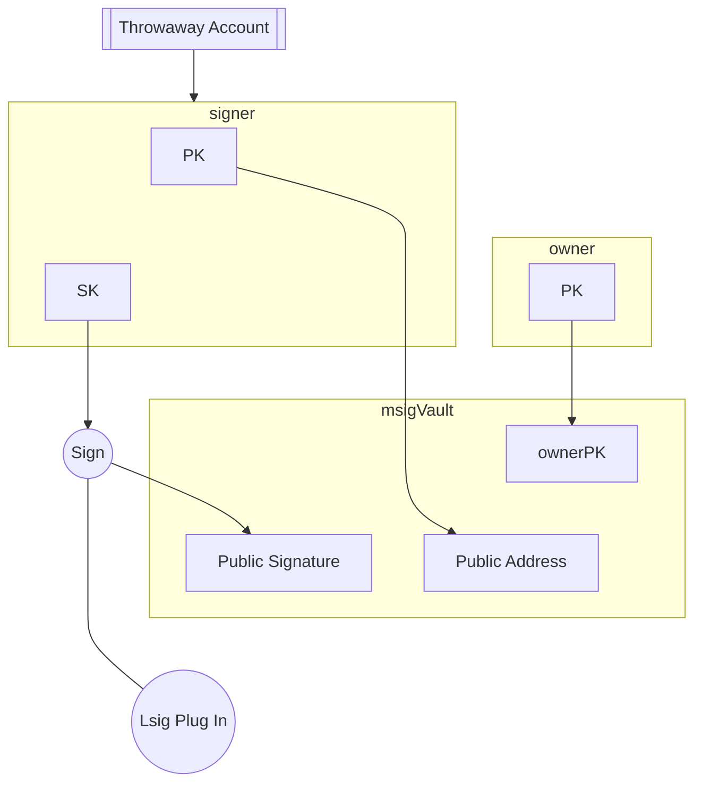

## Abstract

This ARC proposes a method for creating a delegated multisig account controlled by one account and a Logic Signature (Lsig).

## Motivation

The motivation behind this ARC is to extend Algorand account features by enabling third-party "Plug-Ins" using a combination of delegated Lsig and Multi-Signature accounts, which act as vaults. This approach allows anyone to sign the Lsig for the vault, while maintaining security and control through a classic algorand account.

## Specification

The key words "**MUST**", "**MUST NOT**", "**REQUIRED**", "**SHALL**", "**SHALL NOT**", "**SHOULD**", "**SHOULD NOT**", "**RECOMMENDED**", "**MAY**", and "**OPTIONAL**" in this document are to be interpreted as described in <a href = "https://www.ietf.org/rfc/rfc2119.txt">RFC-2119</a>

### Components

1. **Owner Account**: Vault's Owner
1. **Lsig Plug-In**: Provided by a third party.
1. **Plug-In Signer**: Created by generating a new key pair
1. **1/2 Msig Account**: Comprises the owner's address, and the plug-in signer.

### Implementation 1

We will use the following Logic plug-in for illustrative purposes:

**DO NOT USE IN PRODUCTION**

```python
teal_program = """
#pragma version 10
txn TypeEnum
pushint 4
==
txn AssetAmount
pushint 0
==
&&
txn RekeyTo
global ZeroAddress
==
&&
txn Fee
global MinTxnFee
==
&&
return
"""
compiled_program = client.compile(teal_program)
program = base64.b64decode(compiled_program["result"])
lsig = transaction.LogicSigAccount(program)
```

> This give opt-in control over the signer

1. **Generate Plug-In Signer**:
    - Generate a random new account that we will only use once.

    ```python
    plug_in_sk, plug_in_addr  = account.generate_account()
    ```

2. **Sign Lsig with Plug-In Signer**:
    - Sign the Lsig using the plug-in signer.
    - Publish the public signature on the indexer.

    ```python
        public_key, secret_key = nacl.bindings.crypto_sign_seed_keypair(base64.b64decode(plug_in_sk)[: constants.key_len_bytes])
        message = constants.logic_prefix + program
        raw_signed = nacl.bindings.crypto_sign(message, secret_key)
        crypto_sign_BYTES = nacl.bindings.crypto_sign_BYTES
        signature = nacl.encoding.RawEncoder.encode(raw_signed[:crypto_sign_BYTES])
        plug_in_public_sig = base64.b64encode(signature).decode()
    ```

3. **Create 1/2 Msig Account**:
    - Create a multi-signature account with owner address, the Lsig address, and the plug-in signer.

    ```python
    owner_vault_msig = transaction.Multisig(1,1,[owner_addr, plug_in_addr])
    ```

    - Add a transaction note to the transaction to help third party to retrieve signer and vault information.

    ```json
        {
            "pk": plug_in_addr,
            "sk": plug_in_public_sig,
            "lsig": lsig.address(),
        }
    ```

    - Prefix the note following the [ARC-2](./arc-0002.md) standard. `arc63:j`

    ```python
    ptxn = transaction.PaymentTxn(
        owner_addr, sp, owner_vault_msig.address(), int(1e6), note=f"arc_63:j{note_field}"
    ).sign(owner_sk)
    ```

4. **Opt-In to Msig Vault**:
    - Anyone can opt-in to the Msig vault using the plug-in signer’s public address and the published signature.

    ```python
    optin_txn = AssetTransferTxn(
        sender=owner_vault_msig.address(),
        sp=sp,
        receiver=owner_vault_msig.address(),
        amt=0,
        index=a_id,
    )
    lsig.lsig.msig = owner_vault_msig
    lsig.append_to_multisig(plug_in_sk) # signature from plug_in_public
    lstx = LogicSigTransaction(optin_txn, lsig)
    ```

### Implementation 2

We will use the following Lsig plug-in for our illustrative purposes:

**DO NOT USE IN PRODUCTION**

```python
teal_program = f"""
#pragma version 10
txn TypeEnum
int appl
==
txn ApplicationID
int {app_client.app_id}
==
&&
txn RekeyTo
global ZeroAddress
==
&&
txn Fee
global MinTxnFee
==
&&
return
"""
compiled_program = client.compile(teal_program)
program = base64.b64decode(compiled_program["result"])
lsig = transaction.LogicSigAccount(program)
```

> This allow the application with the id `app_client.app_id` to control the signer

To be consistant with the previous example, we will use a similar opt-in process.

```python
class SmartApp(ARC4Contract):
    def __init__(self) -> None:
        self.db = BoxMap(Account, String, key_prefix="")

    @abimethod()
    def opt_in(self, id: UInt64, account: Account) -> None:
        itxn.AssetTransfer(
            asset_amount=0,
            xfer_asset=id,
            sender=account,
            asset_receiver=account,
            fee=1000,
        ).submit()

    @abimethod()
    def set_public_sig(self, account: Account, sig: String) -> bool:
        self.db[account] = sig
        return self.db[account] == sig

    @abimethod(readonly=True)
    def get_public_sig(self, account: Account) -> String:
        return self.db[account]
```

1. **Generate Plug-In Signer**:
    - Generate a random new account that we will only use once.

    ```python
    plug_in_sk, plug_in_addr  = account.generate_account()
    ```

2. **Sign Lsig with Plug-In Signer**:
    - Sign the Lsig using the plug-in signer.

    ```python
        public_key, secret_key = nacl.bindings.crypto_sign_seed_keypair(base64.b64decode(plug_in_sk)[: constants.key_len_bytes])
        message = constants.logic_prefix + program
        raw_signed = nacl.bindings.crypto_sign(message, secret_key)
        crypto_sign_BYTES = nacl.bindings.crypto_sign_BYTES
        signature = nacl.encoding.RawEncoder.encode(raw_signed[:crypto_sign_BYTES])
        plug_in_public_sig = base64.b64encode(signature).decode()
    ```

3. **Create 1/2 Msig Account**:
    - Create a multi-signature account with owner address, the Lsig address, and the plug-in signer.

    ```python
    owner_vault_msig = transaction.Multisig(1,1,[owner_addr, plug_in_addr])
    ```

    - Publish the public signature by using set_public_sig to the app.

    ```python
    response = app_client.set_public_sig(
        account=owner_addr,
        sig=plug_in_public_sig,
        transaction_parameters=algokit_utils.TransactionParameters(
            boxes=[(app_client.app_id, encoding.decode_address(owner_addr))],
            accounts=[owner_addr]
        )
    )
    ```

    - Get the transaction set_public_sig from the app.

    ```python
    response = app_client.get_public_sig(
        account=owner_addr,
        transaction_parameters=algokit_utils.TransactionParameters(
            boxes=[(app_client.app_id, encoding.decode_address(owner_addr))]
        ),
    )
    ```

4. **App in control of Msig Vault**:
    - Anyone can now call the app to opt-in any asset to the Msig vault using the plug-in signer’s public address and the published signature.

    ```python
    composer.opt_in(
        id=a_id,
        account=app_client.app_address,
        transaction_parameters=algokit_utils.TransactionParameters(
            foreign_assets=[a_id], signer=app_client.signer,
            sender=owner_vault_msig.address()
        ),
    )
    opt_in_txn = composer.atc.txn_list[0].txn

    lsig.lsig.msig = owner_vault_msig
    lsig.lsig.msig.subsigs[1].signature = base64.b64decode(plug_in_public_sig)
    lstx = transaction.LogicSigTransaction(opt_in_txn, lsig)
    ```

### Diagram



## Rationale

The rationale for this design is to leverage third-party Lsig plug-ins. By rekeying the plug-in signer, we mitigate risks associated with its misuse, while the multi-signature account setup ensures controlled access and flexibility in asset management.

## Backwards Compatibility

This ARC introduces no backward incompatibilities. It builds upon existing Algorand functionalities, ensuring seamless integration with current systems.

## Reference Implementation

An example implementation in Python is provided, demonstrating the creation of a plug-in signer, signing an Lsig, and opting into a multi-signature vault.

### Only with Lsig

[Create_Opt_in_Plug_in](../assets/arc-0063/create_plugin.py)

### Delegating the Lsig to an App

[Deploy config](../assets/arc-0063/deploy_config.py)
[Contract](../assets/arc-0063/contract.py)

> This need to be run with Algokit

## Security Considerations

Even if the plug-in signer is rekeyed to the zero address, the private key can still sign new lsigs, which is why the private key should not be accessible by anyone after the signature.
This step is crucial to prevent any unauthorized use of the signer post-creation.

If the Multi-signature vault accounts can be rekeyd to any other account (Msig or traditional), it will keep the same public address and will not be delegated anymore.

## Copyright

Copyright and related rights waived via <a href="https://creativecommons.org/publicdomain/zero/1.0/">CCO</a>.
