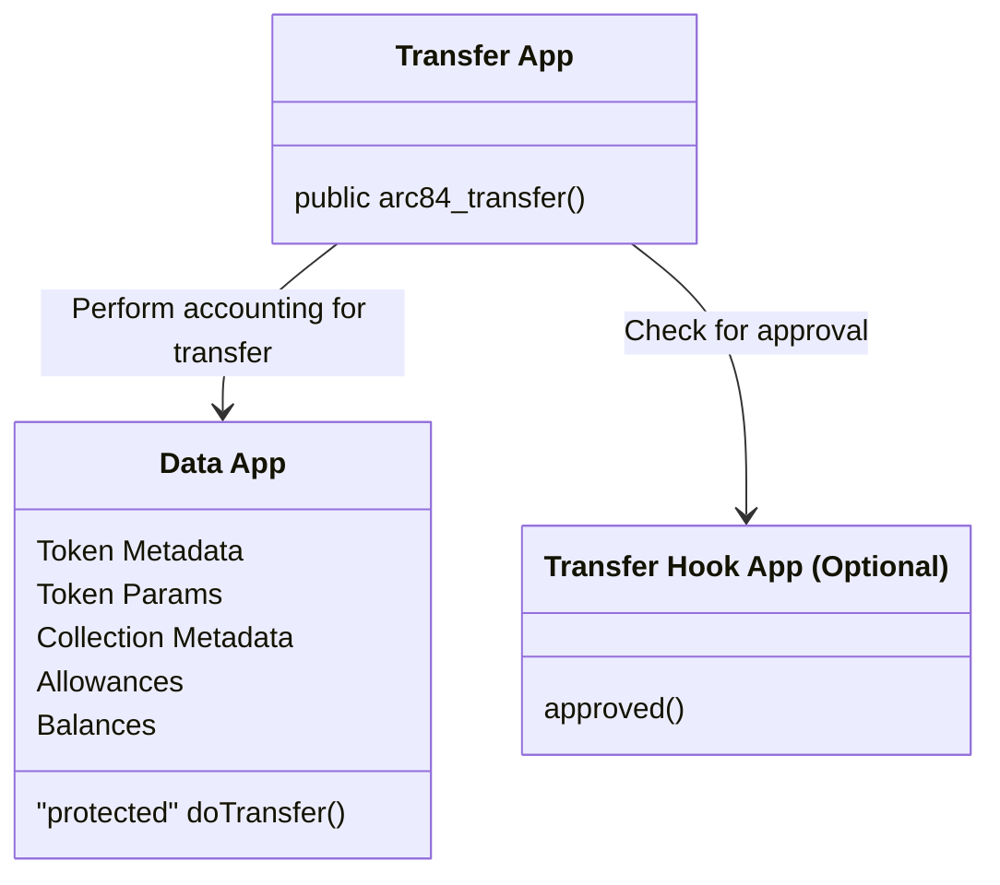
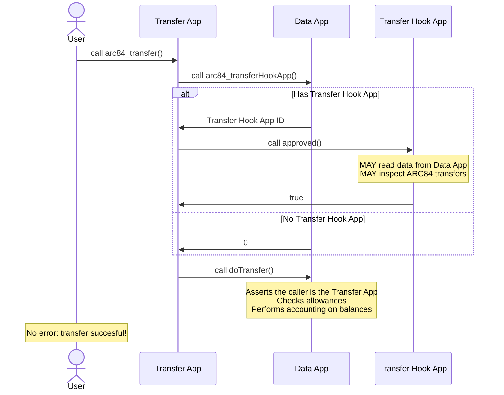

## Abstract
Abstract is a multi-sentence (short paragraph) technical summary. This should be a very terse and human-readable version of the specification section. Someone should be able to read only the abstract to get the gist of what this specification does.

## Motivation

Algorand Standard Assets (ASAs) offer trusted accounting enforced by the protocol and stable endpoints for transferring assets and reading data via APIs. ASAs, however, do not offer flexibility. Programmability is desirable for various asset-related functionalities such as enforced fees, automatic royalties, balance snapshots, and conditional transfers. There are also some additional challenges and limitations with ASAs, including:

* Developer and user friction with ASA opt-ins
* Immutable metadata fields (and hacky workarounds like ARC19)
* Metadata standards (i.e. ARC3) use off-chain mechanisms, which make metadata inaccessible in smart contracts  

As such, there have been various smart-contract-based token standards but they typically have one or more of the following shortcomings:

* Incompatibility with ASAs (i.e using `uint256` instead of `uint64`)
* Inability to trust accounting logic (without pre-approved programs, which then limit programmability)
* Lack of existing API compatibility
* Difficulty with indexing token balances and transactions 

## Architecture

The interfaces for ARC84 **MAY** be split across multiple apps. The singleton implementation proposed uses two apps: The **Data App** and the **Transfer App**. A third optional app in this implementation called the **Transfer Hook App**. Transfers are initiated by calling a method on the **Transfer App**, with all data being stored on the **Data App**, which also does all the accounting. The **Transfer Hook App** **MAY** be used to attach additional logic to transfers and conditionally reject them.

### The Apps

### Successful Transfer Sequence

## Specification
The key words "**MUST**", "**MUST NOT**", "**REQUIRED**", "**SHALL**", "**SHALL NOT**", "**SHOULD**", "**SHOULD NOT**", "**RECOMMENDED**", "**MAY**", and "**OPTIONAL**" in this document are to be interpreted as described in <a href="https://www.ietf.org/rfc/rfc2119.txt">RFC-2119</a>.

The technical specification should describe the syntax and semantics of any new feature. The specification should be detailed enough to allow competing, interoperable implementations for any of the current Algorand platforms (go-algorand, ...).

## Rationale

### Core Philosophy: Separate Representations of Same Asset

### Singleton Data Contract With Transfer Hook: Trusted Accounting Logic

### Separation of Transfer and Data Apps: Data Access In Transfer Hooks

### Multiple Transfers Per Call: Atomicity & Verifiability

### Allowances With Cooldown: Safely Enable Delegation Features

### Collections: On-Chain Guarantees for Valuable Collection Data

### App IDs to Identify Tokens: Ensures no ASA ID collision

### uint64 Accounting: Ensure Compatibility with ASAs

## Backwards Compatibility

### Bridging ASAs

#### Auto Bridging

### ASA API Compatibility

#### Params & Metadata

#### Opt-In & Holding Discoverability

### ASA Transfer Compatibility

## Test Cases
Test cases for an implementation are mandatory for ARCs that are affecting consensus changes.  If the test suite is too large to reasonably be included inline, then consider adding it as one or more files in `../assets/arc-####/`.

## Reference Implementation
An optional section that contains a reference/example implementation that people can use to assist in understanding or implementing this specification.  If the implementation is too large to reasonably be included inline, then consider adding it as one or more files in `../assets/arc-####/`.

## Security Considerations
All ARCs must contain a section that discusses the security implications/considerations relevant to the proposed change. Include information that might be important for security discussions, surfaces risks and can be used throughout the life cycle of the proposal. E.g. include security-relevant design decisions, concerns, important discussions, implementation-specific guidance and pitfalls, an outline of threats and risks and how they are being addressed. ARC submissions missing the "Security Considerations" section will be rejected. An ARC cannot proceed to status "Final" without a Security Considerations discussion deemed sufficient by the reviewers.

## Copyright
Copyright and related rights waived via <a href="https://creativecommons.org/publicdomain/zero/1.0/">CCO</a>.
