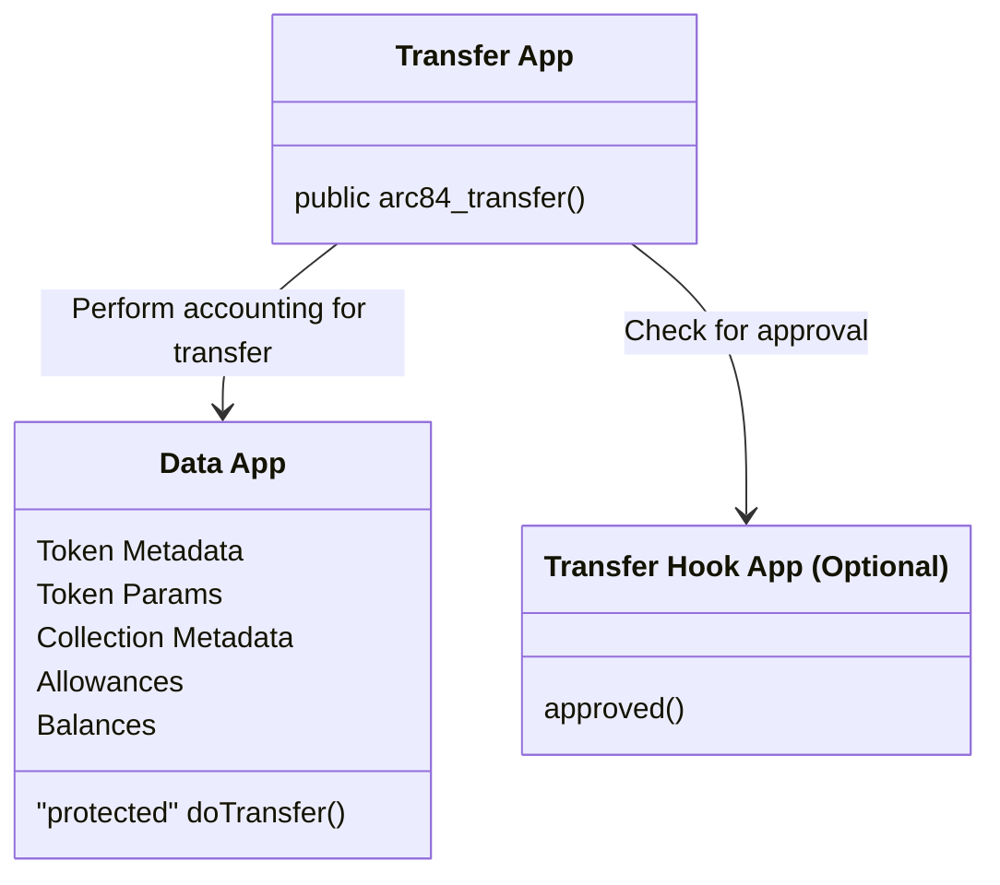
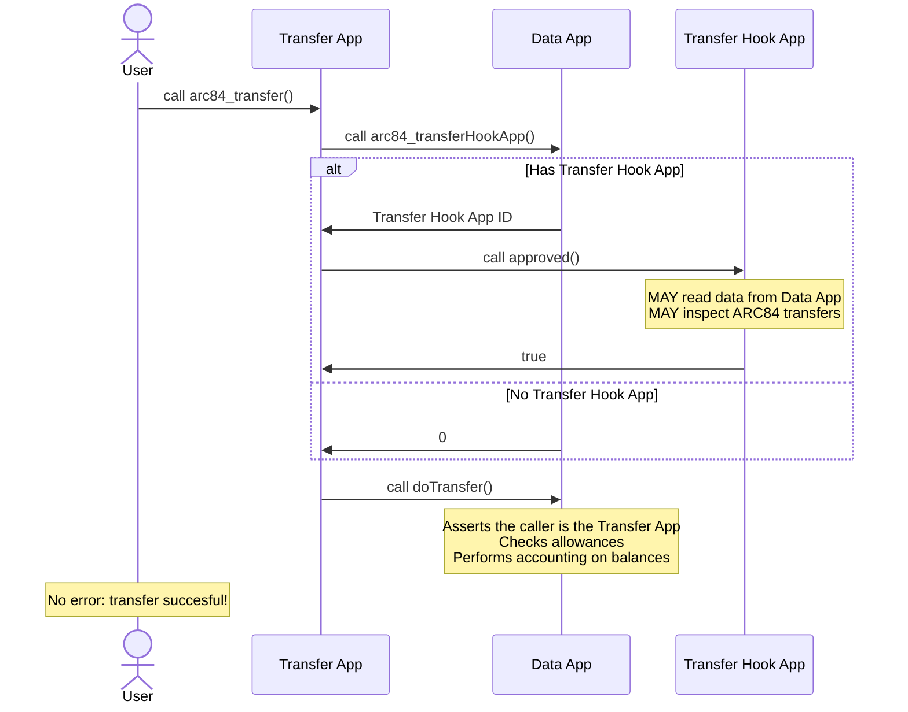

## Abstract
Abstract is a multi-sentence (short paragraph) technical summary. This should be a very terse and human-readable version of the specification section. Someone should be able to read only the abstract to get the gist of what this specification does.

## Motivation

Algorand Standard Assets (ASAs) offer trusted accounting enforced by the protocol and stable endpoints for transferring assets and reading data via APIs. ASAs, however, do not offer flexibility. Programmability is desirable for various asset-related functionalities such as enforced fees, automatic royalties, balance snapshots, and conditional transfers. There are also some additional challenges and limitations with ASAs, including:

* Developer and user friction with ASA opt-ins
* Immutable metadata fields (and hacky workarounds like ARC19)
* Metadata standards (i.e. ARC3) use off-chain mechanisms, which make metadata inaccessible in smart contracts  

As such, there have been various smart-contract-based token standards but they typically have one or more of the following shortcomings:

* Incompatibility with ASAs (i.e using `uint256` instead of `uint64`)
* Inability to trust accounting logic (without pre-approved programs, which then limit programmability)
* Lack of existing API compatibility
* Difficulty with indexing token balances and transactions 

## Architecture

The interfaces for ARC84 **MAY** be split across multiple apps. The singleton implementation proposed in this ARC uses two apps: The **Data App** and the **Transfer App**. A third optional app in this implementation called the **Transfer Hook App**. Transfers are initiated by calling a method on the **Transfer App**, with all data being stored on the **Data App**, which also does all the accounting. The **Transfer Hook App** **MAY** be used to attach additional logic to transfers and conditionally reject them.

### The Apps

### Successful Transfer Sequence

## Specification
The key words "**MUST**", "**MUST NOT**", "**REQUIRED**", "**SHALL**", "**SHALL NOT**", "**SHOULD**", "**SHOULD NOT**", "**RECOMMENDED**", "**MAY**", and "**OPTIONAL**" in this document are to be interpreted as described in <a href="https://www.ietf.org/rfc/rfc2119.txt">RFC-2119</a>.

The technical specification should describe the syntax and semantics of any new feature. The specification should be detailed enough to allow competing, interoperable implementations for any of the current Algorand platforms (go-algorand, ...).

## Rationale

### Core Philosophy: Separate Representations of Same Asset

A core philosophy of ARC84 is that it is acceptable, if not preferable, to have different representations of the same asset for different contexts. In the many conversations regarding asset standards or ASA changes the developer ecosystem has had, we have tried to make a substantial change without breaking anything or having 100% transparent compatibility with ASAs. This goal has seemed to be impossible so far, so ARC84 embraces the fact that there may be different representations of a given asset and attempts to have seamless conversions to ASAs, but not 100% compatibility. This is why ARC84 uses `uint64` over `uint256` and enables compatibility with off-chain clients through parameters and metadata. The parameters of ARC84 tokens also allow them to be easily bridged to ASAs. While ARC84 tokens won't be directly compatible with existing smart contracts, we can provide the mechanisms for frontends to allow users to bridge between ARC84 and ASAs seamlessly.  

For example, a user may want to have an ARC84 representation of USDC that allows for useful features like automatic payments for a subscription service. This user may also want to use USDC in long-standing DeFi protocols and those protocols want to use ASAs due to their accounting guarantees. If they go to a DeFi frontend but only hold ARC84 USDC, they should still be able to swap to the ASA within the same transaction group. Using approvals, this could even be done without any extra transactions for the user. This UX is possible with ARC84, and as shown in the reference implementation, it is fairly low effort for dApp frontends to support this automatic bridging. 

### Singleton Data Contract With Transfer Hook: Trusted Accounting Logic

One of the main goals of ARC84 is to find a balance between trust and flexibility. With other smart contract tokens, you cannot have programmability and trust at the same time without building up a list of approved apps and/or programs (which then limits flexibility). ARC84 allows singleton apps to implement transfer and data logic which only need to verified once by the community. Afterward, they can be trusted indefinitely due to the immutability of the contracts. To still allow programmability within this model, an additional app, the **Transfer Hook App**, can implement additional logic to approve or deny transactions, but it cannot break the accounting rules laid out in the singleton. By default the **Transfer Hook App**, cannot even perform transfers out-of-the-box, but automatic transfers from the transfer hook app are possible via the allowance system. 

### Separation of Transfer and Data Apps: Data Access In Transfer Hooks

In order to accomplish the above point of trusted accounting logic and flexibility, we need to have an external app, the **Transfer Hook App**. This app can approve or deny transfers for a given token and app may also execute additional logic like snapshots or royalty enforcement. In order to do these functions effectively, it must have access to the token's data, which is held in the **Data App**. If the data app implement the transfer method, and thus the call to the transfer hook app directly, reading token data wouldn't be possible because re-entrancy is not allowed in the AVM. Having two apps lets us have one app, the transfer app, be responsible for transfers and calling the transfer hook app, while the data app is solely responsible for the accounting and storing data. This gives us full programmability without any re-entrancy.  

### Multiple Transfers Per Call: Atomicity & Readability

Allowing multiple transfers in one method calls allows for more efficient transfers. A single method call can transfer any number of tokens between any number of accounts (within the resource limitations of the AVM). More importantly, having multiple transfers in a single calls allows for inspection of transfer groups by the **Transfer Hook App** that would otherwise be impossible due to the fact that inner transactions cannot access high-level transaction groups. This enables possibilities such as denying any transfer that doesn't include a royalty payment.

### Allowances With Expiration & Cooldown: Safely Enable Delegation Features

Approvals are a key feature of other smart contract tokens, such as ERC20 and ARC200, but they have serious security implications. For example, a large amount of EVM exploits occur due to users giving protocols token approvals and that same protocol being exploited years later after they no longer us the protocol. This is the driving rationale for having an expiration time for allowances in ARC84. By setting an expiration time, users can be sure a protocol will not have access to their tokens when they are done using the app without having to take any explicit action. Similarly, the cooldown mechanism enables a highly-requested feature, subscriptions, in a secure manner. By being supported directly in ARC84, there is no implementation ambiguity and all apps in the ecosystem can clearly display allowance information to users.

### Collections: On-Chain Guarantees for Valuable Collection Data

### App IDs to Identify Tokens: Ensures no ASA ID collision

Each ARC84 token is identified within its singleton data app via a `uint64` ID (and the combination of data app ID and token ID identify a token for the entire network). The implementation in this ARC uses application IDs to assign token IDs, rather than having a counter that increments each token mint. This is done to ensure that token IDs do not collide with ASA IDs, which enables backwards compatibility features further discussed in the next section

### uint64 Accounting: Ensure Compatibility with ASAs

Smart contract token standards on Algorand have to choose between `uint64` and `uint256` for supply and balance arithmetic. Past ARCs, such as ARC200, have chosen `uint256` to align with EVM standards. This allows for a better bridging experience with non-AVM chains that use `uint256`, but hurts the compatibility with the current ASA-based ecosystem. This ARC prioritizes compatibility with the AVM ecosystem, thus uses `uint64` over `uint256`. Compatibility with non-AVM chains should be tackled as a separate problem.

## Backwards Compatibility

### Bridging ASAs

#### Auto Bridging

### ASA API Compatibility

#### Params & Metadata

#### Opt-In & Holding Discoverability

### ASA Transfer Compatibility

## Test Cases
Test cases for an implementation are mandatory for ARCs that are affecting consensus changes.  If the test suite is too large to reasonably be included inline, then consider adding it as one or more files in `../assets/arc-####/`.

## Reference Implementation
An optional section that contains a reference/example implementation that people can use to assist in understanding or implementing this specification.  If the implementation is too large to reasonably be included inline, then consider adding it as one or more files in `../assets/arc-####/`.

## Security Considerations
All ARCs must contain a section that discusses the security implications/considerations relevant to the proposed change. Include information that might be important for security discussions, surfaces risks and can be used throughout the life cycle of the proposal. E.g. include security-relevant design decisions, concerns, important discussions, implementation-specific guidance and pitfalls, an outline of threats and risks and how they are being addressed. ARC submissions missing the "Security Considerations" section will be rejected. An ARC cannot proceed to status "Final" without a Security Considerations discussion deemed sufficient by the reviewers.

## Copyright
Copyright and related rights waived via <a href="https://creativecommons.org/publicdomain/zero/1.0/">CCO</a>.
