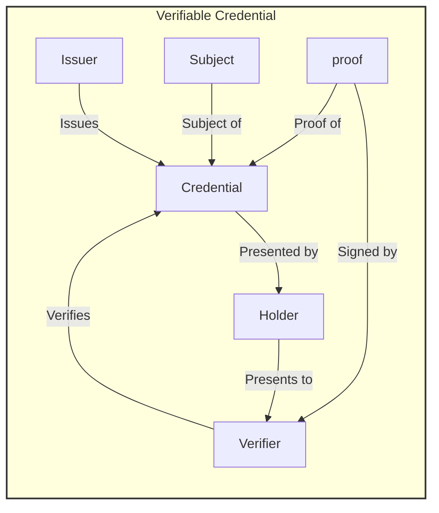
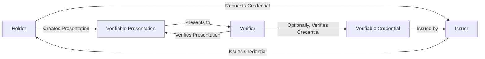
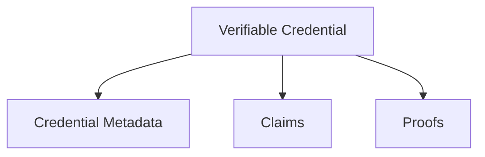
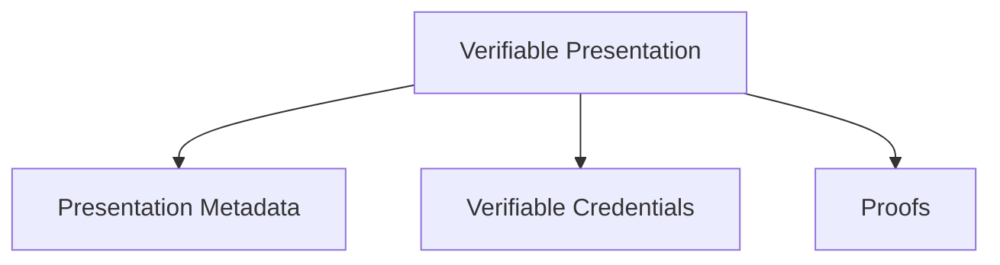

## Abstract

This ARC represents the [W3C Verifiable Credentials Data Model Version 2.0 (17 December 2023)](https://www.w3.org/TR/vc-data-model-2.0/) and [Verifiable Credential Data Integrity 1.0](https://w3c.github.io/vc-data-integrity/)living standards and also [Verifiable Credentials API v0.3](https://w3c-ccg.github.io/vc-api/) draft's, requirements, conventions and recommendations adopted for Algorand and AVM elements, methods as well as related ARCs.

ARC113 introduces the Verifiable Credentials ABI v0.3 in accordance to [Verifiable Credentials API v0.3](https://w3c-ccg.github.io/vc-api/), deliverable through ABI calls with proper arguments according to [ARC4](https://arc.algorand.foundation/ARCs/arc-0004)!

ARC113 can be implemented using/for ARC ASAs as an extension! Including support for:

- [ARC3](https://arc.algorand.foundation/ARCs/arc-0003)
- [ARC19](https://arc.algorand.foundation/ARCs/arc-0019)
- [ARC69](https://arc.algorand.foundation/ARCs/arc-0069)
- [ARC72](https://arc.algorand.foundation/ARCs/arc-0069)
- [ARC200](https://arc.algorand.foundation/ARCs/arc-0069)

ARC113 as well as ARC13, heavily depend and rely on [ARC52](https://arc.algorand.foundation/ARCs/arc-0052) line of work and reference implementation to proceed on both proofs and integrity parts!

This ARC partially complies to [Securing Verifiable Credentials using JOSE and COSE](https://www.w3.org/TR/vc-jose-cose/#securing-json-ld-verifiable-credentials-with-jose) with focus on JOSE only!

ARC 113 by using ARC13 as DID standard and reference implementation, partially follows [did:web Method Specification](https://w3c-ccg.github.io/did-method-web) as well!

ARC113 is in full compliance to:
- [ARC13](https://arc.algorand.foundation/ARCs/arc-0013)
- [ARC110](https://arc.algorand.foundation/ARCs/arc-0110)

The goal to ARC113 is first to adopt VerifiableCredentials standards for already in place transaction history of chain and secondly to set AVM native conventions and methods as extension to original standard so that registering new VCs can be accessed publicly and generated dynamically for each transaction using either an API or an ABI!

Important note: ARC113 tries to follow a micro architecture and plug and play approach in a way that Verifiers in general can offer their services and then depending on the service being available onchain (decentralized) or off chain (web 2.0) then can be included through either main verifiers or service extended (URI based services) verification relations!

NOTE: THIS IS A DRAFT ARC! WORK IN PROGRESS! ALL HELP WELCOME!

### General Format

All authoring guidelines, diagrams, examples, and notes in this specification are non-normative. Everything else in this specification is normative. The key words "MAY," "MUST," "MUST NOT," "OPTIONAL," "RECOMMENDED," "REQUIRED," "SHOULD," and "SHOULD NOT" in this document are to be interpreted as described in [BCP 14 RFC2119](https://www.rfc-editor.org/rfc/rfc2119) and [RFC8174](https://www.rfc-editor.org/rfc/rfc8174) when, and only when, they appear in all capitals, as shown here.

Algorand DID elements used by this ARC follow the URI format in general as outlined in [RFC 3986](https://www.rfc-editor.org/rfc/rfc3986). This ARC aims to be as future-proof as possible; therefore, some generalized architectural elements and conventions (e.g., fragments and paths) may be set forth that may not find immediate use in the current ecosystem tooling.

Elements of the query component may contain characters outside the valid range. These must first be encoded according to UTF-8, and then each octet of the corresponding UTF-8 sequence must be percent-encoded as described in RFC 3986.

A conforming document is a compacted JSON-LD document that complies with all of the relevant "MUST" statements in this specification. Specifically, the relevant normative "MUST" statements in Sections 4. Basic Concepts, 5. Advanced Concepts, and 6. Syntaxes of this document MUST be enforced. A conforming document is either a verifiable credential that MUST be serialized using the application/vc+ld+json media type or a verifiable presentation that MUST be serialized using the application/vp+ld+json media type. A conforming document MUST be secured by at least one securing mechanisms mentioned by this document!

A conforming issuer implementation produces conforming documents, MUST include all required properties in the conforming documents that it produces, and MUST secure the conforming documents it produces using a securing mechanism as described in securing mechanisms mentioned by this document.

A conforming verifier implementation consumes conforming documents, MUST perform verification on a conforming document as described in securing mechanisms in this document, MUST check that each required property satisfies the normative requirements for that property, and MUST produce errors when non-conforming documents are detected.

## Specification

The ARC113 standard aims to seamlessly integrate the W3C Verifiable Credentials (VCs) Data Model, integrity and API for Algorand and AVM elements, leveraging all available tech stack and existing ARCs. This integration ensures that VCs on Algorand maintain usability, extendability and interoperability as well as compliance to DID standards through [ARC13]! This integration and harmony is essential for verifiable digital identity and decentralized credentials, authentication, verification, and their presentations.

### Verifiable Credentials Specification:
- **Holder**: An atomic or composite DID available on AVM ledger. Example holders include individual Algorand accounts like students, employees, and customers or composite ones like oraganizations, groups, universities, NGOs, DAOs, societies, clubs and ...!
- **Issuer** : An atomic or composite DID available on AVM ledger asserting claims about one or more subjects, creating a verifiable credential from these claims, and transmitting the verifiable credential to a holder. Example issuers include corporations, non-profit organizations, trade associations, governments, and individuals.
- **Subject**: An atomic or composite DID available on AVM ledger, about which claims are made. Example subjects include human beings, animals, and things tagged with DIDs. In many cases the holder of a verifiable credential is the subject, but in certain cases it is not. For example, an account DID (the holder) might hold the verifiable credentials of a NFT (the subject), or a TravelX ticket owner (the holder) might hold the verifiable credentials of their ticket (the subject), presentable everywhere from airport to vacation lottery websites.
- **Verifier**: An atomic or composite DID available on AVM ledger receiving one or more verifiable credentials, optionally inside a verifiable presentation, for processing. Example verifiers include universities, governments, and banks.
- **Verifiable data registry**: A role a system might perform by mediating the creation and verification of identifiers, keys, and other relevant data, such as verifiable credential schemas, revocation registries, issuer public keys, and so on, which might be required to use verifiable credentials. Some configurations might require correlatable identifiers for subjects. Example verifiable data registries include trusted databases, decentralized databases, government ID databases, and distributed ledgers. Often there is more than one type of verifiable data registry utilized in an ecosystem.

### VC necessities specification:

- Verifiable credentials represent statements made by an issuer in a tamper-evident and privacy-respecting manner.
- Holders can assemble collections of verifiable credentials from different issuers into a single artifact, a verifiable presentation.
- Issuers can issue verifiable credentials about any subject.
- Acting as issuer, holder, or verifier requires neither registration nor approval by any authority, as the trust involved is bilateral between parties.
- Verifiable presentations allow any verifier to verify the authenticity of verifiable credentials from any issuer.
- Holders can receive verifiable credentials from anyone.
- Holders can interact with any issuer and any verifier through any user agent.
- Holders can share verifiable presentations, which can then be verified without revealing the identity of the verifier to the issuer.
- Holders can store verifiable credentials in any location, without affecting their verifiability and without the issuer knowing anything about where they are stored or when they are accessed.
- Holders can present verifiable presentations to any verifier without affecting authenticity of the claims and without revealing that action to the issuer.
- A verifier can verify verifiable presentations from any holder, containing proofs of claims from any issuer.
- Verification should not depend on direct interactions between issuers and verifiers.
- Verification should not reveal the identity of the verifier to any issuer.
The specification must provide a means for issuers to issue verifiable credentials that support selective disclosure, without requiring all conformant software to support that feature.
- Issuers can issue verifiable credentials that support selective disclosure.
If a single verifiable credential supports selective disclosure, then holders can present proofs of claims without revealing the entire verifiable credential.
- Verifiable presentations can either disclose the attributes of a verifiable credential, or satisfy derived predicates requested by the verifier. Derived predicates are Boolean conditions, such as greater than, less than, equal to, is in set, and so on.
Issuers can issue revocable verifiable credentials.
- The processes of cryptographically protecting and verifying verifiable credentials and verifiable presentations have to be deterministic, bi-directional, and lossless. Any verifiable credential or verifiable presentation has to be transformable to the JSON-LD data model defined in this document via a deterministic process so that its verification can be processed in an interoperable fashion.
- Verifiable credentials and verifiable presentations have to be serializable in one or more machine-readable data formats. The process of serialization and/or de-serialization has to be deterministic, bi-directional, and lossless. Any serialization of a verifiable credential or verifiable presentation needs to be transformable to the generic data model defined in this document in a deterministic process such that the resulting verifiable credential can be processed in an interoperable fashion. The serialized form also needs to be able to be generated from the data model without loss of data or content.
- The data model and serialization must be extendable with minimal coordination.
- Revocation by the issuer should not reveal any identifying information about the subject, the holder, the specific verifiable credential, or the verifier.
- Issuers can disclose the revocation reason.
- Issuers revoking verifiable credentials should distinguish between revocation for cryptographic integrity (for example, the signing key is compromised) versus revocation for a status change (for example, the driver's license is suspended).
- Issuers can provide a service for refreshing a verifiable credential.

Holders of verifiable credentials can generate verifiable presentations and then share these verifiable presentations with verifiers to prove they possess verifiable credentials with certain characteristics.

### Metadata Grammar

The metadata for verifiable credentials on Algorand will adhere to the standards set forth in the W3C Verifiable Credentials Data Model, adapted to fit the unique identifiers and structures of the Algorand blockchain. This includes the use of Algorand-specific terms and properties within the credential's metadata.

### Verifiable Credential lifecycle elements

The main types for Verifiable Credential documents on AVM chains include:

- Verifiable Claims:

Verifiable Credentials include Verifiable claims and after review and verify by verifier then will include the proof used by verifier and therefore can be verified by any third party through cryptography and AVM blockchain.
  

- Verifiable presentations:
  Verifiable Presentations are documents containing VCs to be presented for verification and signing which adds the proof for VCs.

  
- **Credential Subject**: Identifies the entity the credential is about, which can be linked to an Algorand DID.
- **Issuer**: The entity that issues and attests to the verifiable credential, identified by an Algorand DID.
- **Issuance Date**: The date on which the credential was issued.
- **Proof**: Cryptographic proof that verifies the authenticity of the credential, such as digital signatures.

### Verifiable Credential requirements
Required decentralized identifiers and implementations which are used to construct VC main elements are (in compliance to [ARC13](https://arc.algorand.foundation/ARCs/arc-0013)):

- Algorand DID URI: This is the unique identifier for a subject within the Algorand ecosystem. It follows the standard DID format but is specific to Algorand.

- Algorand DID Document: This document contains information associated with the Algorand DID, such as verification methods and service endpoints.

- DID Subject: The entity that the DID represents, which could be a user, an asset, an application, or any identifiable entity on Algorand.

- DID Controller: The entity that has the capability to make changes to the DID document. This could be the DID subject itself or another authorized entity.

- Verifiable Data Registry (Algorand Blockchain): The Algorand blockchain acts as the verifiable data registry where DIDs are recorded and can be looked up. GoPlausible API and ABI are the service interfaces delivering this facility and PLAUSIBLE protocol has expanded to include this role on Algorand blockchain as first Verifiable Data Registry!

- DID Resolver: A system component that takes a DID as input and produces the corresponding DID document as output. GoPlausible API and ABI now include Algorand DID resolver endpoints and also there is a universal ES module (JS) client library [algo-did-resolver](https://www.npmjs.com/package/algo-did-resolver)for dApp integration on client side, available through NPM!

## Rationale

The rationale behind ARC113 is to provide a robust framework for creating, issuing, and verifying digital credentials on the Algorand blockchain. By aligning with the W3C Verifiable Credentials standard, ARC113 ensures interoperability with global digital identity systems, enhancing the utility and trustworthiness of credentials within the Algorand ecosystem.
All protocols and projects on Algorand can use and benefit from VCs on Algorand to make their protocols and dApps more compliant to regulations , e.g GDPR and EU Blockchain regulations!

Especially for adoption by global organizations, this becomes a requirement that ecosystem offers integration, adoption and interoperability with Verifiable Credentials as they are widely in use and are common best practice in Web 2.0 as well! 

## Security Considerations

Security considerations for ARC113 include ensuring the integrity and verifiability of verifiable credentials, secure management of cryptographic keys, and adherence to privacy-preserving principles in credential issuance and verification.

## Appendix

Examples of verifiable credentials and presentations in [JSON-LD] format will be provided, demonstrating the application of ARC113 in real-world scenarios.

## Copyright

This document and its content are released under the Creative Commons Zero (CC0) license, allowing for maximum flexibility and adoption within the Algorand community and beyond.

Copyright and related rights waived via [CCO](https://creativecommons.org/publicdomain/zero/1.0/).
