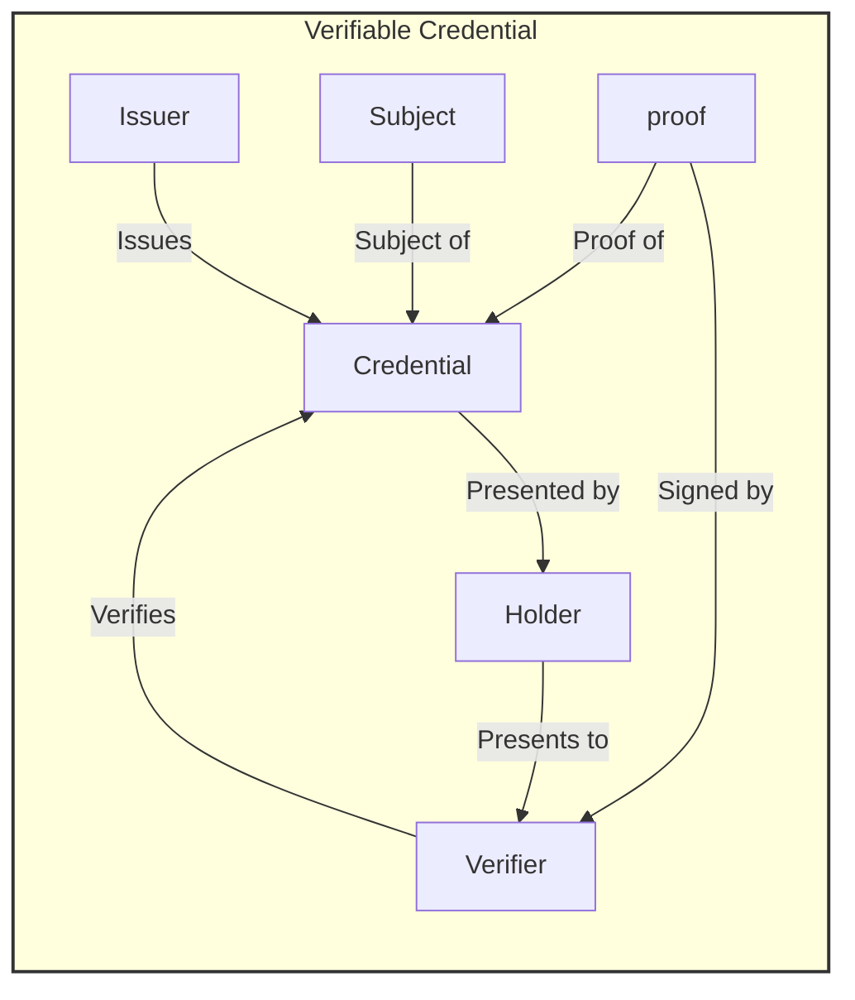
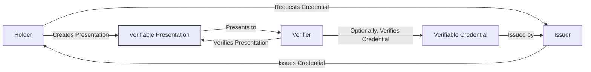
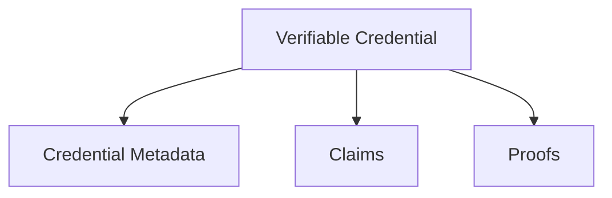
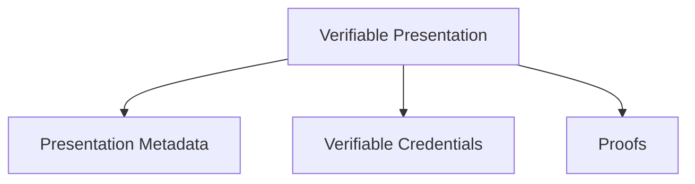

## Abstract

This ARC represents the [W3C Verifiable Credentials Data Model Version 2.0 (17 December 2023)](https://www.w3.org/TR/vc-data-model-2.0/) living standard's requirements and conventions using Algorand blockchain elements, methods as well as other ARCs. It is implemented as an extension to:
- [ARC3](https://arc.algorand.foundation/ARCs/arc-0003)
- [ARC19](https://arc.algorand.foundation/ARCs/arc-0019)
- [ARC69](https://arc.algorand.foundation/ARCs/arc-0069)

And in compliance with:
- [ARC13](https://arc.algorand.foundation/ARCs/arc-0013)
- [ARC110](https://arc.algorand.foundation/ARCs/arc-0110)

The goal to ARC113 is first to make VerifiableCredentials available for already in place transaction history of chain and secondly to set AVM native conventions and methods as extension to original standard so that registering new VCs can be accessed publicly and globally with each and in a decentralized way!

Important note: ARC113 tries to follow a micro architecture and plugnplay approach in a way that Verifiers in general can offer their services and then depending on the service being available onchain (decentralized) or off chain (web 2.0) then can be included through either main verifiers or service extended (URI based services) verifications and assertions!

NOTE: THIS IS DRAFT! WORK IN PROGRESS! ALL HELP WELCOME!

## Specification

The ARC113 standard aims to seamlessly integrate the W3C Verifiable Credentials (VCs) Data Model with the Algorand blockchain, leveraging its unique features and existing ARCs. This integration ensures that VCs on Algorand maintain usability, extendability, and the ability to be used in conjunction with DID documents (ARC13), which are essential for verifiable digital identity and decentralized authentication, verification, and presentations.

### Concept diagram of VCs on Algorand:

### Flow diagram of VCs on Algorand:

### General Format

All authoring guidelines, diagrams, examples, and notes in this specification are non-normative. Everything else in this specification is normative. The key words "MAY," "MUST," "MUST NOT," "OPTIONAL," "RECOMMENDED," "REQUIRED," "SHOULD," and "SHOULD NOT" in this document are to be interpreted as described in [BCP 14 RFC2119](https://www.rfc-editor.org/rfc/rfc2119) and [RFC8174](https://www.rfc-editor.org/rfc/rfc8174) when, and only when, they appear in all capitals, as shown here.

Algorand DID elements used by this ARC follow the URI format in general as outlined in [RFC 3986](https://www.rfc-editor.org/rfc/rfc3986). This ARC aims to be as future-proof as possible; therefore, some generalized architectural elements and conventions (e.g., fragments and paths) may be set forth that may not find immediate use in the current ecosystem tooling.

Elements of the query component may contain characters outside the valid range. These must first be encoded according to UTF-8, and then each octet of the corresponding UTF-8 sequence must be percent-encoded as described in RFC 3986.

### Metadata Grammar

The metadata for verifiable credentials on Algorand will adhere to the standards set forth in the W3C Verifiable Credentials Data Model, adapted to fit the unique identifiers and structures of the Algorand blockchain. This includes the use of Algorand-specific terms and properties within the credential's metadata.

### Main Elements

The main types for Verifiable Credentials on Algorand include:
- Verifiable Credentials:

Verifiable Credentials include Verifiable claims and after review and verify by verifier then will include the proof used by verifier and therefore can be verified by any third party through cryptography and Algorand blockchain.
  

- Verifiable presentations:
  Verifiable Presentations are documents containing VCs to be presented for verification and signing which adds the proof for VCs.

  
- **Credential Subject**: Identifies the entity the credential is about, which can be linked to an Algorand DID.
- **Issuer**: The entity that issues and attests to the verifiable credential, identified by an Algorand DID.
- **Issuance Date**: The date on which the credential was issued.
- **Proof**: Cryptographic proof that verifies the authenticity of the credential, such as digital signatures.

The Algorand elements which are used to construct these main elements are (in compliance to [ARC13](https://arc.algorand.foundation/ARCs/arc-0013)):

- Algorand DID URI: This is the unique identifier for a subject within the Algorand ecosystem. It follows the standard DID format but is specific to Algorand.

- Algorand DID Document: This document contains information associated with the Algorand DID, such as verification methods and service endpoints.

- DID Subject: The entity that the DID represents, which could be a user, an asset, an application, or any identifiable entity on Algorand.

- DID Controller: The entity that has the capability to make changes to the DID document. This could be the DID subject itself or another authorized entity.

- Verifiable Data Registry (Algorand Blockchain): The Algorand blockchain acts as the verifiable data registry where DIDs are recorded and can be looked up. GoPlausible API and ABI are the service interfaces delivering this facility and PLAUSIBLE protocol has expanded to include this role on Algorand blockchain as first Verifiable Data Registry!

- DID Resolver: A system component that takes a DID as input and produces the corresponding DID document as output. GoPlausible API and ABI now include Algorand DID resolver endpoints and also there is a universal ES module (JS) client library [algo-did-resolver](https://www.npmjs.com/package/algo-did-resolver)for dApp integration on client side, available through NPM!

## Rationale

The rationale behind ARC113 is to provide a robust framework for creating, issuing, and verifying digital credentials on the Algorand blockchain. By aligning with the W3C Verifiable Credentials standard, ARC113 ensures interoperability with global digital identity systems, enhancing the utility and trustworthiness of credentials within the Algorand ecosystem.
All protocols and projects on Algorand can use and benefit from VCs on Algorand to make their protocols and dApps more compliant to regulations , e.g GDPR and EU Blockchain regulations!

Especially for adoption by global organizations, this becomes a must that ecosystem offers integration, adoption and interoperability with Verifiable Credentials as they are widely in use and are common best practice in Web 2.0 as well! 

## Security Considerations

Security considerations for ARC113 include ensuring the integrity and confidentiality of verifiable credentials, secure management of cryptographic keys, and adherence to privacy-preserving principles in credential issuance and verification.

## Appendix

Examples of verifiable credentials and presentations in JSON-LD format will be provided, demonstrating the application of ARC113 in real-world scenarios.

## Copyright

This document and its content are released under the Creative Commons Zero (CC0) license, allowing for maximum flexibility and adoption within the Algorand community and beyond.

Copyright and related rights waived via [CCO](https://creativecommons.org/publicdomain/zero/1.0/).
