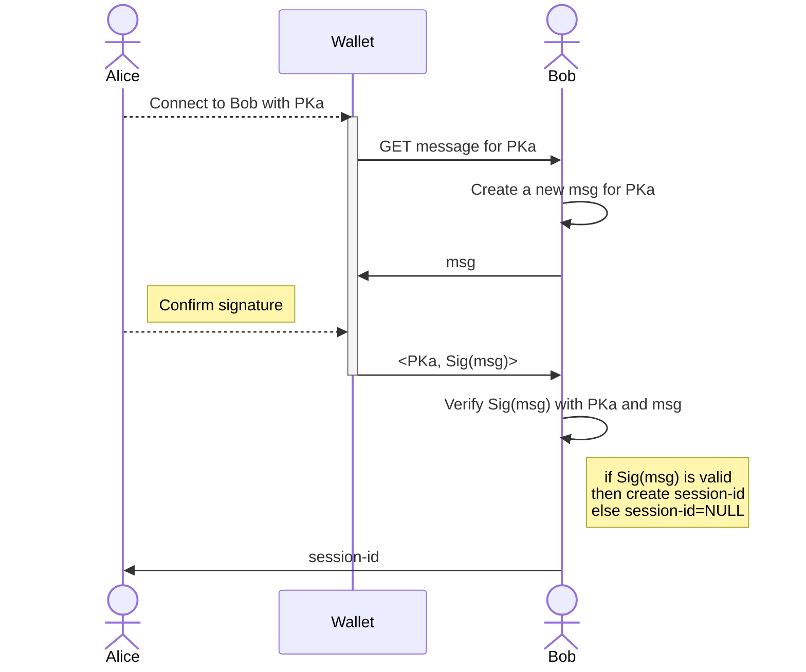

# Algorand Standard for Authentication

> This ARC is intended to be an alternative to PR #41 [Create arc-0014](https://github.com/algorandfoundation/ARCs/pull/41).

## Summary

A standard approach to authenticate users with Algorand accounts.

## Abstract

This document introduces a standard for SSO authentication based on Algorand accounts. It leverages the public-secret key <*PK, SK*> encryption schema to verify the identity of a user that owns and Algorand account. This approach fosters the adoption of novel identity and session management systems for Web3 applications.

## Definitions

- **System**: any frontend/backend application, service provider, or in general an entity not based on blockchain;
- **Session-Id**: HTTP(s) session typically represented with a `cookie` or a `JWT`;
- **Blockchain identity**: a public/secret key pair <*PK, SK*> representing a blockchain account;
- **Algorand account**: a blockchain identity on Algorand identified with the key pair <*PKa, SKa*>;
- **Algorand address**: the public key *PKa* of an Algorand account;
- **User**: an Algorand account holder;
- **Verifier**: a *system* that need to verify the identity of a User;
- **dApp**: a decentralized Algorand application that natively runs on the Algorand blockchain, aka "*smart contract*",
- **Wallet**: an off-chain application that stores the secret keys *SKa*s of Algorand accounts and can display and sign transactions for these accounts;
- **message**: a generic string of bytes;
- **digital signature**: a message signed with the private key of a blockchain identity, and specifically in this ARC with the *SKa*;

## Motivation

Traditional systems enforce SSO login leveraging on authentication of users with *credentials*, i.e. username and password. Once the identity of a user is verified, the system establishes an authenticated session. Sessions allows users to interact with the system without authenticate themselves anytime. Sessions are represented with the so called `session-id` (typically a cookie or a JSON Web Token - JWT).

In a blockchain context, users do not have credentials. Conversely, in the Web3 users are identified through their unique blockchain public addresses (accounts for Algorand). Therefore, traditional authentication mechanisms result impractical. To interact with a dApp, users connect their wallet to the application. Using an authentication layer based on credentials on top of that mechanism might result redundant and inefficient.

In Web3, dApps and traditional systems will be increasingly more interconnected. It is not difficult to imagine users consuming services both from a dApp and a traditional system simultaneously. In that case, a user should be authenticated first through traditional SSOs, and then connecting their blockchain wallet. A better approach should enforce a single SSO procedure.

This ARC provides the standard to authenticate users leveraging on their Algorand accounts, and without relying on credentials verification.

## Specification

The key words "**MUST**", "**MUST NOT**", "**REQUIRED**", "**SHALL**", "**SHALL NOT**", "**SHOULD**", "**SHOULD NOT**", "**RECOMMENDED**", "**MAY**", and "**OPTIONAL**" in this document are to be interpreted as described in [RFC-2119](https://www.ietf.org/rfc/rfc2119.txt).

> Comments like this are non-normative.

Interfaces are defined in TypeScript. All the objects that are defined are valid JSON objects, and all JSON string types are UTF-8 encoded.

This ARC uses interchangeably the terms "*blockchain address*", "*public key*", and "*PK*" to indicate the on-chain address of a blockchain identity, and in particular of an Algorand account.

### Overview

This document describes a standard approach to authenticate Users with their blockchain identity. In particular, in this ARC Users' Algorand address are used as a *unique identifiers*, and the secret key of that address is used to digitally sign a *message* as a proof of identity for a  Verifier. Hence, upon signature verification, the Verifier initializes an authenticated session with the User by issuing a new `session-id`.

To sum up, given an Algorand account <*PKa, SKa*>, this ARC defines the standards for:

- create an ARC-0014 compliant digital signature with *SKa*;
- verify an ARC--014 compliant digital signature with *PKa*.

### Assumptions

The standard proposed in this document works under the following assumptions:

- User and Verifier communicates over secure SSL/TLS encrypted channels;
- The Verifier knows the Users’ *PKa*;
- For each *PKa* the Verifier generates a unique message to be signed;
- The message changes for each authentication request - avoid replay attack;
- Users are the only custodians of the *SKa*;
- The secret keys are stored into a wallet;
- Users won’t use different *PKa* for authentication;
- Users won’t change their public address for authentication;
- Users **MUST** only use ed25519 Algorand keys to sign the messages;
- Multisig and LogicSig are not supported;
- Users **MUST NOT** use rekeyed accounts.

### Authentication Mechanism

The authentication mechanism defined in this ARC works as follows: a User communicates to the Verifier her intention to authenticate with her Algorand account <*PKa, SKa*>.

> Algorand transforms traditional 32-bytes cryptographic keys into more readable and user-friendly objects. A detailed description of such a transformation can be found in the [developer portal](https://developer.algorand.org/docs/get-details/accounts/#keys-and-addresses).

To prove the User's identity, the Verifier will ask the signature of a random message with the secret key *SKa* associated with the User's Algorand account. The User generates the digital signature and sends it back to the Verifier. Finally, the Verifier checks the signature and, if everything is good, creates a new authenticated session.



The diagram above summarizes the mechanism. We consider a User, **Alice**, owner of an Algorand account <*PKa, SKa*> of which the secret key *SKa* is stored into a **wallet**.

> A wallet is any type of Algorand wallet, such as hot wallets like [AlgoSigner](https://www.purestake.com/technology/algosigner/), [MyAlgo Wallet](https://wallet.myalgo.com/) for browser and mobile wallets used through [WalletConnect](https://developer.algorand.org/docs/get-details/walletconnect/), and cold wallets like the [Ledger Nano](https://www.ledger.com).

Alice authenticates herself to a Validator, **Bob**, providing the digital signature `Sig(msg)` of a random message `msg` provided by Bob. The mechanism proceeds as follows:

1. Alice sends an authentication request to Bob via her Algorand wallet using *PKa*;
2. Bob generates a message `msg` for *PKa* and request Alice to sign it;
3. Alice signs `msg` using her wallet, and afterwards sends back the tuple `<PKa, Sig(msg)>` to Bob;
4. Bob verifies the digital signature `Sig(msg)` with the *PKa* and `msg`;
5. If the signature is valid, then Bob generates a new `session-id` for Alice; otherwise returns NULL (authentication rejected);

An ARC-0014 compliant message is called *Authentication Message*. A User **MUST** sign an *Authentication Message* with the *SKa* stored into a wallet.

### Authentication Message

An Authentication Message is a sequence of bytes representing a message. The Verifier asks Users to sign an *Authentication Message* with their secret keys. Such a message **MUST** include the following information:

- `domain name` of the service;
- `description` of the service;
- `Algorand address` (PKa) to be authenticated;
- `nonce` representing a unique/random value generated by the verifier.

The JSON structure for such an object is:

```typescript
interface AuthMessage {
 /** The domain name of the service */
 service: string;
 /** Optional, description of the service */
 desc?: string;
 /** Algorand account to authenticate with*/
 authAcc: string;
 /** Challenge generated server-side */
 nonce: string;
}
```

For example:

```json
{
 "service": "www.servicedomain.com",
 "desc": "Domain offers important services to users",
 "authAcc": "KTGP47G64KCXWJS64W7SGJNKTHE37TYDCI64USXI3XOYE6ZSH4LCI7NIDA",
 "nonce": "1234abcde!%",
}
```

The `nonce` field **MUST** be unique for each authentication and **MUST NOT** be used more than once to avoid replay attacks.

Users sign *Authentication Message*s using the secret keys stored into a wallet.

***Problem***: Most of the Algorand wallets can only sign Algorand `Transaction` objects, and do not offer the possibility to sign arbitrary bytes. To overcome such a limitation, the ARC-0014 distinguishes two authentication objects, namely the **Simple Authentication Message**, and the **Transaction Authentication Message**. The former **SHOULD** be used by any signing mechanisms able to sign random bytes, whereas the latter can be used with almost any Algorand wallet.

#### Simple Authentication Message

The *Simple Authentication Message* is a sequence of bytes representing an ARC-0014 *Authentication Message*. It **SHOULD** be used in contexts that support signatures of random bytes. A *Simple Authentication Message* is an *Authentication Message* prepended with the prefix `ARC-0014-authentication` for domain separation. It **MUST** be represented as the hash SHA-512/256 of such prefix, together with a msgpack encoded *Authentication Message*. For example, given an *Authentication Message* object `aut_message`, its *Simple Authentication Message* representation would be something like: `SHA512_256(“ARC-0014-authentication”+msgpacked_auth_message)`.

#### Transaction Authentication Message

A *Transaction Authentication Message* is an *Authentication Message* represented as an Algorand `Transaction` object. Such a transaction must have the following characteristics:

- it **SHOULD** be an Algorand `Payment Transaction`;
- it **MUST** include a *Simple Authentication Message* into the transaction's `note` field;
- it **MUST** be *invalidated* i.e. not executable on any official Algorand network.

> Malicious users could intercept and execute it causing unexpected consequences. For instance, in case of a **MainNet** transaction, it could be intercepted by a malicious user and executed, burning some Algos from the sender’s account due to the payment of fees.

The fields of a `Payment Transaction` object which represents a *Transaction Authentication Message* **MUST** be initialized as follows

- `amount` = 0;
- `sender/receiver` = *PKa*;
- `firstValid/lastValid` = 0;
- `fee` = 0;
- `genesisId` = “ARC-0014-authentication”;
- `genesisHash` = SHA-512/256 of the string “ARC-0014-authentication”;
- `note` = SHA512_256(“ARC-0014-authentication”+msgpacked_auth_message);

The fields `genesisId` and `genesisHash` specify respectively the id and hash of the genesis block of the network, and they **MUST** be initialized to the ARC-0014 values (not conventional for MainNet/TestNet/BetaNet). The `note` field **MUST** include a *Simple Authentication Message* object. Finally, the `sender` field **SHOULD** be set to the Algorand address of the user. 

> A detailed description of the transitions fields of Algorand Transactions is available in the transaction's reference [documentation](https://developer.algorand.org/docs/get-details/transactions/transactions/).

For example:

```json
{
  "txn": {
    "amt": 0,
    "fee": 0,
    "fv": 0,
    "gen": "ARC-0014-authentication",
    "gh": "esN73ktiC1qzkkit8=",
    "lv": 0,
    "rcv": "EW64GC6F24M7NDSC5R3ES4YUVE3ZXXNMARJHDCCCLIHZU6TBEOC7XRSBG4",
    "snd": "EW64GC6F24M7NDSC5R3ES4YUVE3ZXXNMARJHDCCCLIHZU6TBEOC7XRSBG4",
    "type": "pay",
    "note": "SGVsbG8gV29ybGQerg1er1dfgt=",
  }
}
```

### How to sign an authentication message?

#### Digital Signature of a Simple Authentication Message

A *Simple Authentication Message* can be signed with any open-source cryptographic library (e.g. Python lib PyNaCl) and the secret key of an Algorand account. Algorand account’s secret key *SKa* represents a base64 concatenation of the traditional 32-bytes secret and public keys. To create a digital signature of a *Simple Authentication Message* the Algorand secret key **MUST** be decoded as a standard 32-bytes secret key as follows:

1. base64 decode the Algorand secret key *SKa*;
2. extract the traditional secret key *SK* as the first 32 bytes of the decoded key.

#### Digital Signature of a Transaction Authentication Message

The signature of a *Transaction Authentication Message* is nothing more than a signed transaction object on Algorand. With the SDK method `sign()` and a secret key *SKa*, it is possible to create a `SignedTransaction` object which represents a digital signature. For example, the SDK method  `unsigned_txn.sign(secret_key)` returns a `SignedTransaction` object with the digital signature of `unsigned_transaction` produced with `secret_key`.

Almost any algorand wallet integrates the possibility of signing transactions. For instance, to programmatically sign a transaction with the AlgoSigner wallet, there is an [SDK method](https://github.com/PureStake/algosigner/blob/develop/docs/dApp-integration.md#algosignersigntxntxnobjects) `AlgoSigner.signTxn([TxnObject, …])`. This method returns a base64 encoded object which represents the digital signature of a transaction object.

## How to verify a digital signature generated with Algorand keys?

A digital signature generated with the secret key *SKa* of an Algorand account can be verified with its respective 32-byte public key *PKa*. The Verifier needs to decode the public key *PK* from the Algorand address, and it must know the original *Authentication Message*. For example, assuming the digital signature `Sig(msg)` of the *Authentication Message* `msg`, the Verifier can validate it using the Algorand SDK as follows:

1. decode the Algorand address into a traditional 32-bytes public key *PK*;
2. use an open-source cryptographic library to verify the signature `Sig(msg)` (e.g. Python lib PyNaCl); usually those libraries work with raw bytes and some encoding/decoding magic is needed:
    - the message msg **MUST** be bytes encoded with msgpack. For example, with the Algorand SDK for Python this can achieved with `encoding.msgpack_encode(msg)`;
    - if the message is a *Simple Message Transaction*, then it **MUST** be prefixed with the string `“ARC-0014-authentication”`, otherwise it is a `Transaction` object and **MUST** be prefixed with the string `“TX”`;
    - the digital signature `Sig(msg)` **MUST** be decoded from base64 with the base64 library of the SDK. For example with the Python SDK this can be achieved with `base64.b64decode(Sig(msg))`.

## A Standard for Session Id creation

After authentication, the Verifier **SHOULD** exchange a `session-id` with the User, such as a cookie or a JWT. The way `session-id`s are implemented is an implementation choice. However, to comply with the ARC-0014, it **MUST** include the following information:

- the Algorand address *PKa* of the authenticated user;
- the *Simple Authentication Message*;
- an `expiration` time;
- (**OPTIONAL**) `device-id` if the User authenticates via mobile device.

### JWT implementation example

A JWT should be constructed following the RFC 7519 standard. It is composed of three parts, namely the `header`, `payload`, and `signature`. The `payload` includes general information on the JWT and the signing scheme, the `payload` contains the claims of the token, and the `signature` is derived from the `header` and the `payload`. The JWT is the concatenation of each part followed by a “.”: `JWT = header.payload.signature`

For example, an ARC-0014 compliant JWT might be implemented as follows:

Header:

```json
{
 "alg":"SHA512_256",
 "typ": "JWT"
}
```

Payload:

```json
{
 "algo_addr":"PKa",
 "message":"SHA512_256(‘ARC-0014-authentication’+msgpacked_auth_message)",
 "exp":"<timestamp>",
 "device":"<device_id>"
}
```

Signature:

`SHA512_256(base64(Header) + “.” + base64(Payload), secret)`

Where the `secret` is only known by the Verifier.

## Security Considerations

An attacker **MAY** attempt to cheat with the system by impersonating another User. This is possible if the attacker can intercept the digital signature and use the same signature in a replay-attack. To mitigate this scenario, the Verifier **MUST** generate a new message for each authentication request. In this way, the digital signature results valid for one session and cannot be spent in further authentication requests.

## Copyright

Copyright and related rights waived via [CC0](https://creativecommons.org/publicdomain/zero/1.0/).
